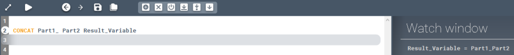
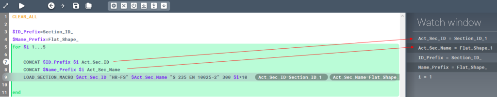

<!-- wp:paragraph -->

Assigns a new value to a variable by combining 2 values.

<!-- /wp:paragraph -->

<!-- wp:heading {"level":3} -->

### Syntax

<!-- /wp:heading -->

<!-- wp:paragraph -->

**CONCAT **

<!-- /wp:paragraph -->

<!-- wp:heading {"level":3} -->

### Command parameters

<!-- /wp:heading -->

<!-- wp:table {"className":"is-style-stripes"} -->

|                                     |                |                        |                   |
| ----------------------------------- | -------------- | ---------------------- | ----------------- |
| **Command parameter**               | **Assignment** | **Value format**       | **Input options** |
| [Part 1](#Part-1)                   | Required       | String, integer, float | Local, variable   |
| [Part 2](#Part-2)                   | Required       | String, integer, float | Local, variable   |
| [Result variable](#Result-variable) | Required       | String                 | Local, variable   |

<!-- /wp:table -->

<!-- wp:heading {"level":4} -->

#### Part 1:

<!-- /wp:heading -->

<!-- wp:paragraph -->

First part of the result value.

<!-- /wp:paragraph -->

<!-- wp:heading {"level":4} -->

#### Part 2:

<!-- /wp:heading -->

<!-- wp:paragraph -->

Second part of the result value.

<!-- /wp:paragraph -->

<!-- wp:heading {"level":4} -->

#### Result variable:

<!-- /wp:heading -->

<!-- wp:paragraph -->

Name of the result variable.

<!-- /wp:paragraph -->

<!-- wp:heading {"level":3} -->

### Description

<!-- /wp:heading -->

<!-- wp:paragraph -->

Concatenates 2 values. In other words, combines the 2 values in into a new value by putting them one after the other. The result value will be assigned to the result variable with the given name.

<!-- /wp:paragraph -->

<!-- wp:heading {"level":3} -->

### Sample code:

<!-- /wp:heading -->

<!-- wp:heading {"level":4} -->

#### Command only:

<!-- /wp:heading -->

<!-- wp:loos-hcb/code-block -->

```
CONCAT Part1_ Part2 Result_Variable
```

<!-- /wp:loos-hcb/code-block -->

<!-- wp:image {"id":23545,"sizeSlug":"large","linkDestination":"media"} -->

[](https://consteelsoftware.com/wp-content/uploads/2021/08/image-47.png)

<!-- /wp:image -->

<!-- wp:heading {"level":4} -->

#### Example:

<!-- /wp:heading -->

<!-- wp:loos-hcb/code-block -->

```
$ID_Prefix=Section_ID_
$Name_Prefix=Flat_Shape_
for $i 1...5

    CONCAT $ID_Prefix $i Act_Sec_ID
    CONCAT $Name_Prefix $i Act_Sec_Name
    LOAD_SECTION_MACRO $Act_Sec_ID "HR-FS" $Act_Sec_Name "S 235 EN 10025-2" 300 $i*10

end
```

<!-- /wp:loos-hcb/code-block -->

<!-- wp:paragraph -->

This example utilizes the CONCAT command to create unique IDs and names for 5 similar macro sections that are loaded in with a for cycle.

<!-- /wp:paragraph -->

<!-- wp:image {"id":23527,"sizeSlug":"large","linkDestination":"media"} -->

[](https://consteelsoftware.com/wp-content/uploads/2021/08/image-44.png)

<!-- /wp:image -->

<!-- wp:paragraph -->

The result of this example in the section list looks like this:

<!-- /wp:paragraph -->

<!-- wp:image {"id":23539,"sizeSlug":"full","linkDestination":"media"} -->

[](./img/wp-content-uploads-2021-08-image-46.png)

<!-- /wp:image -->
