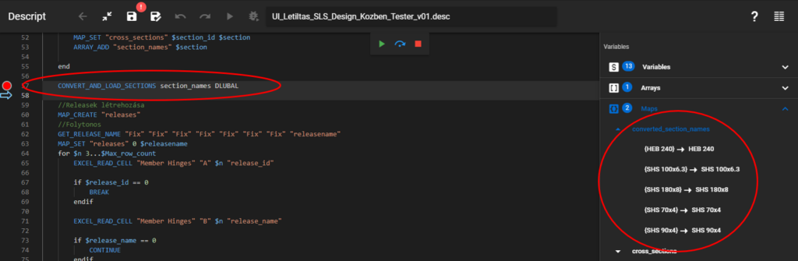

<!-- wp:paragraph -->

Converts and loads sections from section bank.

<!-- /wp:paragraph -->

<!-- wp:heading {"level":3} -->

### Syntax

<!-- /wp:heading -->

<!-- wp:paragraph -->

**CONVERT_AND_LOAD_SECTIONS**

<!-- /wp:paragraph -->

<!-- wp:heading {"level":3} -->

### Command parameters

<!-- /wp:heading -->

<!-- wp:table {"className":"is-style-stripes"} -->

|                                     |                |                                         |                   |
| ----------------------------------- | -------------- | --------------------------------------- | ----------------- |
| **Command parameter**               | **Assignment** | **Value format**                        | **Input options** |
| [Section array](#Section-array)     | Required       | String                                  | Local, variable   |
| [Conversion file](#Conversion-file) | Required       | [Predefined strings](#Available-inputs) | Local, variable   |

<!-- /wp:table -->

<!-- wp:heading {"level":4} -->

#### Section array:

<!-- /wp:heading -->

<!-- wp:paragraph -->

Name of the array of sections to be converted. In the array the name of the sections have to be listed.

<!-- /wp:paragraph -->

<!-- wp:heading {"level":4} -->

#### Conversion file:

<!-- /wp:heading -->

<!-- wp:paragraph -->

There are section and material conversion files in the '... / / Data / Export' folder for all the supported softwares. These files contain section type and material conversions between a particular software and Consteel, thus telling Consteel that which section type in a particular software should be converted to which section type in Consteel.

<!-- /wp:paragraph -->

<!-- wp:image {"id":71005,"sizeSlug":"full","linkDestination":"none"} -->


<!-- /wp:image -->

<!-- wp:paragraph -->

Available inputs:

<!-- /wp:paragraph -->

<!-- wp:list -->

- <!-- wp:list-item -->
- Bocad
- <!-- /wp:list-item -->
-
- <!-- wp:list-item -->
- Dlubal
- <!-- /wp:list-item -->
-
- <!-- wp:list-item -->
- SAP2000
- <!-- /wp:list-item -->
-
- <!-- wp:list-item -->
- Strucad
- <!-- /wp:list-item -->
-
- <!-- wp:list-item -->
- Tekla
- <!-- /wp:list-item -->

<!-- /wp:list -->

<!-- wp:heading {"level":3} -->

### Description

<!-- /wp:heading -->

<!-- wp:paragraph -->

This command is a part of the model import process. It expects a list of section names, and a conversion file name, which points to conversion files that tell which section type and material in the import model is to be converted to which section type and material that exists in Consteel. The command loads the converted sections into Consteel, then stores the converted section names in a Descript map named: "converted_section_names".

<!-- /wp:paragraph -->

<!-- wp:paragraph -->

The command opens a dialogue window, where the section conversions can be reviewed. If a section name coincides with one in the Consteel section library, or there is a predefined conversion for the particular section type in the conversion file, than that section will be selected, if there is not, then the user has to select a section from the drop-down list. If there is no adequate section present in the list, then the user can load one from the section bank with the "..." button, and then select it from the drop-down list.

<!-- /wp:paragraph -->

<!-- wp:image {"id":70734,"sizeSlug":"large","linkDestination":"none"} -->


<!-- /wp:image -->

<!-- wp:heading {"level":3} -->

### Sample code:

<!-- /wp:heading -->

<!-- wp:paragraph -->

SAP2000 model import with only 1 section:

<!-- /wp:paragraph -->

<!-- wp:loos-hcb/code-block -->

```
CONVERT_AND_LOAD_SECTIONS section_names SAP2000
```

<!-- /wp:loos-hcb/code-block -->

<!-- wp:image {"id":72692,"sizeSlug":"large","linkDestination":"none"} -->


<!-- /wp:image -->

<!-- wp:image {"id":72702,"sizeSlug":"large","linkDestination":"none"} -->


<!-- /wp:image -->

<!-- wp:paragraph -->

RFEM (Dlubal) model import with several sections:

<!-- /wp:paragraph -->

<!-- wp:loos-hcb/code-block -->

```
CONVERT_AND_LOAD_SECTIONS section_names DLUBAL
```

<!-- /wp:loos-hcb/code-block -->

<!-- wp:image {"id":74022,"sizeSlug":"large","linkDestination":"none"} -->


<!-- /wp:image -->

<!-- wp:image {"id":74032,"sizeSlug":"large","linkDestination":"none"} -->


<!-- /wp:image -->

<!-- wp:image {"id":74042,"sizeSlug":"large","linkDestination":"none"} -->



<!-- /wp:image -->
