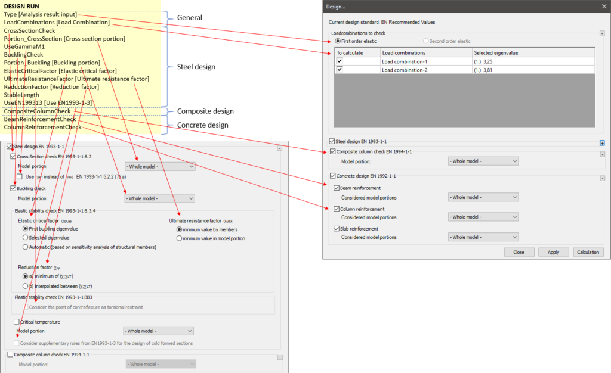

<!-- wp:paragraph -->

Starts a design calculation.

<!-- /wp:paragraph -->

<!-- wp:heading {"level":3} -->

### Syntax

<!-- /wp:heading -->

<!-- wp:paragraph -->

**DESIGN RUN  
**Type  
LoadCombinations  
CrossSectionCheck  
Portion_CrossSection  
UseGammaM1  
BucklingCheck  
Portion_Buckling  
ElasticCriticalFactor  
UltimateResistanceFactor  
ReductionFactor  
StableLength  
UseEN1993_1_3  
CompositeColumnCheck  
BeamReinforcementCheck  
ColumnReinforcementCheck

<!-- /wp:paragraph -->

<!-- wp:heading {"level":3} -->

### Command attributes

<!-- /wp:heading -->

<!-- wp:paragraph -->

Code lines directly after the DESIGN RUN command can set certain attributes of the design. The "Type" and "LoadCombinations" lines are always necessary, while the other ones are optional.

<!-- /wp:paragraph -->

<!-- wp:paragraph -->

Available command attributes:

<!-- /wp:paragraph -->

<!-- wp:table {"className":"is-style-stripes"} -->

|                          |               |                                                               |
| ------------------------ | ------------- | ------------------------------------------------------------- |
| **Command attribute**    | **Inclusion** | **Description**                                               |
| Type                     | Required      | Controls which analysis results to use                        |
| LoadCombinations         | Required      | Controls the considered load combinations                     |
| CrossSectionCheck        | Optional      | Requests cross-section check                                  |
| Portion_CrossSection     | Optional      | Sets portion used for cross-section check                     |
| UseGammaM1               | Optional      | Requests the usage of γM1 instead of γM0                      |
| BucklingCheck            | Optional      | Requests buckling check                                       |
| Portion_Buckling         | Optional      | Sets portion used for buckling check                          |
| ElasticCriticalFactor    | Optional      | Controls the selection of the elastic critical factor         |
| UltimateResistanceFactor | Optional      | Controls the selection of the ultimate resistance factor      |
| ReductionFactor          | Optional      | Controls the selection of the reduction factor                |
| StableLength             | Optional      | Considers torsional restraints at the points of contraflexure |
| UseEN1993_1_3            | Optional      | Controls the usage of supplementary rules from EN 1993-1-3    |
| CompositeColumnCheck     | Optional      | Requests composite column check                               |
| BeamReinforcementCheck   | Optional      | Requests concrete beam reinforcement design                   |
| ColumnReinforcementCheck | Optional      | Requests concrete column reinforcement design                 |

<!-- /wp:table -->

<!-- wp:heading {"level":3} -->

### Command parameters

<!-- /wp:heading -->

<!-- wp:table {"className":"is-style-stripes"} -->

|                                                           |                |                                                           |                   |
| --------------------------------------------------------- | -------------- | --------------------------------------------------------- | ----------------- |
| **Command parameter**                                     | **Assignment** | **Value format**                                          | **Input options** |
| [Analysis result input](#Analysis-result-input)           | Required       | [Predefined strings](#analysis-result-input-types)        | Local, variable   |
| [Load Combination](#Load-combination)                     | Required       | Load combination name or ID(s)                            | Local, variable   |
| [Cross section portion](#Cross-section-portion)           | Optional       | Portion ID                                                | Local, variable   |
| [Buckling portion](#Buckling-portion)                     | Optional       | Portion ID                                                | Local, variable   |
| [Elastic critical factor](#Elastic-critical-factor)       | Optional       | [Predefined strings](#elastic-critical-factor-options)    | Local, variable   |
| [Ultimate resistance factor](#Ultimate-resistance-factor) | Optional       | [Predefined strings](#ultimate-resistance-factor-options) | Local, variable   |
| [Reduction factor](#Reduction-factor)                     | Optional       | [Predefined strings](#reduction-factor-options)           | Local, variable   |
| [Use EN1993-1-3](#Use-EN1993-1-3)                         | Optional       | Boolean (1 or 0)                                          | Local, variable   |

<!-- /wp:table -->

<!-- wp:heading {"level":4} -->

#### Analysis result input:

<!-- /wp:heading -->

<!-- wp:paragraph -->

The design calculation can be based on first order or second order analysis results. This parameter controls which will be used.

<!-- /wp:paragraph -->

<!-- wp:paragraph -->

Available analysis result input types:

<!-- /wp:paragraph -->

<!-- wp:list -->

- FirstOrder
- SecondOrder

<!-- /wp:list -->

<!-- wp:heading {"level":4} -->

#### Load combination:

<!-- /wp:heading -->

<!-- wp:paragraph -->

Load combinations for which the design calculation is requested. The accepted input is either a single load combination ID or an array containing multiple load combination IDs. The name of the load combination is also an accepted input with this syntax: "NAME: "

<!-- /wp:paragraph -->

<!-- wp:heading {"level":4} -->

#### Cross section portion:

<!-- /wp:heading -->

<!-- wp:paragraph -->

Sets the portion used for the cross section check.

<!-- /wp:paragraph -->

<!-- wp:heading {"level":4} -->

#### Buckling portion:

<!-- /wp:heading -->

<!-- wp:paragraph -->

Sets the portion used for the buckling check.

<!-- /wp:paragraph -->

<!-- wp:heading {"level":4} -->

#### Elastic critical factor:

<!-- /wp:heading -->

<!-- wp:paragraph -->

Controls how to select the elastic critical factor.

<!-- /wp:paragraph -->

<!-- wp:paragraph -->

Available elastic critical factor options:

<!-- /wp:paragraph -->

<!-- wp:list -->

- FirstEigenValue (default)
- SelectedEigenValue
- Automatic

<!-- /wp:list -->

<!-- wp:heading {"level":4} -->

#### Ultimate resistance factor:

<!-- /wp:heading -->

<!-- wp:paragraph -->

Controls how to select the ultimate resistance factor.

<!-- /wp:paragraph -->

<!-- wp:paragraph -->

Available ultimate resistance factor options:

<!-- /wp:paragraph -->

<!-- wp:list -->

- ByMember (default)
- InPortion

<!-- /wp:list -->

<!-- wp:heading {"level":4} -->

#### Reduction factor:

<!-- /wp:heading -->

<!-- wp:paragraph -->

Controls how to select the reduction factor.

<!-- /wp:paragraph -->

<!-- wp:paragraph -->

Available reduction factor options:

<!-- /wp:paragraph -->

<!-- wp:list -->

- Minimum (default)
- Interpolated

<!-- /wp:list -->

<!-- wp:heading {"level":4} -->

#### Use EN1993-1-3:

<!-- /wp:heading -->

<!-- wp:paragraph -->

Controls if supplementary rules from EN 1993-1-3 should be used.

<!-- /wp:paragraph -->

<!-- wp:paragraph -->

Available options:

<!-- /wp:paragraph -->

<!-- wp:list -->

- 0 (default)
- 1

<!-- /wp:list -->

<!-- wp:heading {"level":3} -->

### Description

<!-- /wp:heading -->

<!-- wp:paragraph -->

Starts a design calculation.

<!-- /wp:paragraph -->

<!-- wp:paragraph -->

Several options of a design calculation can be controlled by command attributes and parameters. The analogous counterparts of these in the Consteel user interface are the following:

<!-- /wp:paragraph -->

<!-- wp:image {"id":29669,"sizeSlug":"large","linkDestination":"media"} -->

[](https://consteelsoftware.com/wp-content/uploads/2021/12/image-2.png)

<!-- /wp:image -->

<!-- wp:heading {"level":3} -->

### Sample code:

<!-- /wp:heading -->

<!-- wp:heading {"level":4} -->

#### Example 1 (Simplest form):

<!-- /wp:heading -->

<!-- wp:loos-hcb/code-block -->

```
DESIGN RUN
Type FirstOrder
LoadCombinations "NAME: Load Combination-1"
CrossSectionCheck
```

<!-- /wp:loos-hcb/code-block -->

<!-- wp:heading {"level":4} -->

#### Example 2 (With getting load combination IDs):

<!-- /wp:heading -->

<!-- wp:loos-hcb/code-block -->

```
FILTER LoadCombinationIDs
objecttypes Loadcombination

DESIGN RUN
Type FirstOrder
LoadCombinations LoadCombinationIDs
CrossSectionCheck
```

<!-- /wp:loos-hcb/code-block -->

<!-- wp:heading {"level":4} -->

#### Example 3 (Buckling check):

<!-- /wp:heading -->

<!-- wp:loos-hcb/code-block -->

```
DESIGN RUN
Type FirstOrder
LoadCombinations "NAME: Load Combination-1"
CrossSectionCheck
BucklingCheck
```

<!-- /wp:loos-hcb/code-block -->

<!-- wp:heading {"level":4} -->

#### Example 4 (Concrete reinforcement design):

<!-- /wp:heading -->

<!-- wp:loos-hcb/code-block -->

```
DESIGN RUN
Type FirstOrder
LoadCombinations "NAME: Load Combination-1"
BeamReinforcementCheck
ColumnReinforcementCheck
```

<!-- /wp:loos-hcb/code-block -->

<!-- wp:paragraph -->

<!-- /wp:paragraph -->
