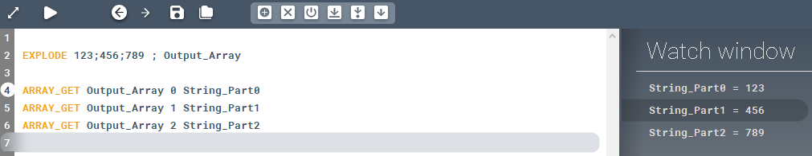

<!-- wp:paragraph -->

Chops up a string with the given separator character and stores the parts in an array.

<!-- /wp:paragraph -->

<!-- wp:heading {"level":3} -->

### Syntax

<!-- /wp:heading -->

<!-- wp:paragraph -->

**EXPLODE** \[String] \[Delimiter]

<!-- /wp:paragraph -->

<!-- wp:heading {"level":3} -->

### Command parameters

<!-- /wp:heading -->

<!-- wp:table {"className":"is-style-stripes"} -->

|                                  |                |                  |                   |
| -------------------------------- | -------------- | ---------------- | ----------------- |
| **Command parameter**            | **Assignment** | **Value format** | **Input options** |
| [String](#String)                | Required       | String           | Local, variable   |
| [Delimiter](#Delimiter)          | Required       | String           | Local, variable   |
| [Output array](#Output-variable) | Required       | String           | Local, variable   |

<!-- /wp:table -->

<!-- wp:heading {"level":4} -->

#### String:

<!-- /wp:heading -->

<!-- wp:paragraph -->

The string that will be chopped up.

<!-- /wp:paragraph -->

<!-- wp:heading {"level":4} -->

#### Delimiter:

<!-- /wp:heading -->

<!-- wp:paragraph -->

The separator character.

<!-- /wp:paragraph -->

<!-- wp:heading {"level":4} -->

#### Output array:

<!-- /wp:heading -->

<!-- wp:paragraph -->

The array that will store the resulting parts.

<!-- /wp:paragraph -->

<!-- wp:heading {"level":3} -->

### Description

<!-- /wp:heading -->

<!-- wp:paragraph -->

Chops up a string with the given separator character and stores the parts in an array. The delimiter will not be included in the outputs.

<!-- /wp:paragraph -->

<!-- wp:heading {"level":3} -->

### Sample code:

<!-- /wp:heading -->

<!-- wp:heading {"level":4} -->

#### Command only:

<!-- /wp:heading -->

<!-- wp:loos-hcb/code-block -->

```
EXPLODE 123;456;789 ; Output_Array
```

<!-- /wp:loos-hcb/code-block -->

<!-- wp:heading {"level":4} -->

#### Command + checking parts:

<!-- /wp:heading -->

<!-- wp:loos-hcb/code-block -->

```
EXPLODE 123;456;789 ; Output_Array

ARRAY_GET Output_Array 0 String_Part0
ARRAY_GET Output_Array 1 String_Part1
ARRAY_GET Output_Array 2 String_Part2
```

<!-- /wp:loos-hcb/code-block -->

<!-- wp:image {"id":23815,"sizeSlug":"full","linkDestination":"none"} -->



<!-- /wp:image -->
