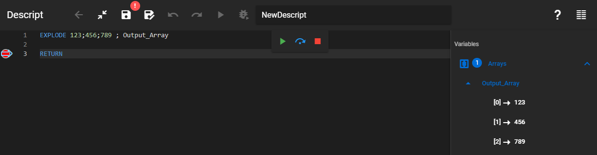

Chops up a string with the given separator character and stores the parts in an array.

### Description

Chops up a string with the given separator character and stores the parts in an array. The delimiter will not be included in the outputs.

### Syntax

**EXPLODE** \[String] \[Delimiter] [Output array]  

### Command parameters

| **Command parameter**            | **Assignment** | **Value format** | **Input options** |
| -------------------------------- | -------------- | ---------------- | ----------------- |
| [String](#string)                | Required       | String           | Local, variable   |
| [Delimiter](#delimiter)          | Required       | String           | Local, variable   |
| [Output array](#output-variable) | Required       | String           | Local, variable   |

#### String:
The string that will be chopped up.

#### Delimiter:
The separator character.

#### Output array:
The array that will store the resulting parts.

### Sample code

```
EXPLODE 123;456;789 ; Output_Array
```

[](./img/Explode_v01.png)
