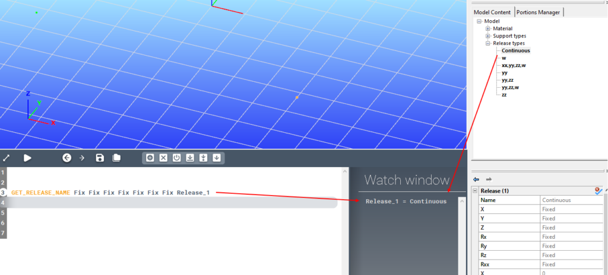
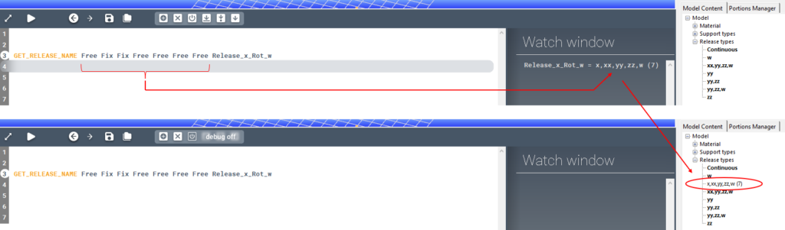

<!-- wp:paragraph -->

Gets the name of a release type.

<!-- /wp:paragraph -->

<!-- wp:heading {"level":3,"editorskit":{"devices":false,"desktop":true,"tablet":true,"mobile":true,"loggedin":true,"loggedout":true,"acf_visibility":"","acf_field":"","acf_condition":"","acf_value":"","migrated":false,"unit_test":false}} -->

### Syntax

<!-- /wp:heading -->

<!-- wp:paragraph -->

**GET_RELEASE_NAME **\[x] \[y] \[z] \[xx] \[yy] \[zz] \[w]

<!-- /wp:paragraph -->

<!-- wp:heading {"level":3,"editorskit":{"devices":false,"desktop":true,"tablet":true,"mobile":true,"loggedin":true,"loggedout":true,"acf_visibility":"","acf_field":"","acf_condition":"","acf_value":"","migrated":false,"unit_test":false}} -->

### Command parameters

<!-- /wp:heading -->

<!-- wp:table {"className":"is-style-stripes"} -->

|                                                   |                |                                                     |                   |
| ------------------------------------------------- | -------------- | --------------------------------------------------- | ----------------- |
| **Command parameter**                             | **Assignment** | **Value format**                                    | **Input options** |
| [x, y, z, xx, yy, zz, w](#x,-y,-z,-xx,-yy,-zz,-w) | Required       | [Predefined strings](#Degree-of-freedom-value-name) | Local, variable   |
| [Variable name](#Variable-name)                   | Required       | String                                              | Local, variable   |

<!-- /wp:table -->

<!-- wp:heading {"level":4,"editorskit":{"devices":false,"desktop":true,"tablet":true,"mobile":true,"loggedin":true,"loggedout":true,"acf_visibility":"","acf_field":"","acf_condition":"","acf_value":"","migrated":false,"unit_test":false}} -->

#### x, y, z, xx, yy, zz, w:

<!-- /wp:heading -->

<!-- wp:paragraph -->

Degrees of freedom of the end release. Every parameter can only have 2 values: "Fix" or "Free".

<!-- /wp:paragraph -->

<!-- wp:paragraph -->

Available degree of freedom values:

<!-- /wp:paragraph -->

<!-- wp:table {"className":"is-style-stripes"} -->

|                                  |           |
| -------------------------------- | --------- |
| **Degree of freedom value name** | **Value** |
| Fixed (Continuous)               | Fix       |
| Free                             | Free      |

<!-- /wp:table -->

<!-- wp:heading {"level":4,"editorskit":{"devices":false,"desktop":true,"tablet":true,"mobile":true,"loggedin":true,"loggedout":true,"acf_visibility":"","acf_field":"","acf_condition":"","acf_value":"","migrated":false,"unit_test":false}} -->

#### Variable name:

<!-- /wp:heading -->

<!-- wp:paragraph -->

Name of the variable that will store the release type name.

<!-- /wp:paragraph -->

<!-- wp:heading {"level":3,"editorskit":{"devices":false,"desktop":true,"tablet":true,"mobile":true,"loggedin":true,"loggedout":true,"acf_visibility":"","acf_field":"","acf_condition":"","acf_value":"","migrated":false,"unit_test":false}} -->

### Description

<!-- /wp:heading -->

<!-- wp:paragraph -->

The GET_RELEASE_NAME command tries to find a release type in Consteel with the specified release parameters. If there is one with the given parameters then its name will be saved in the variable.

<!-- /wp:paragraph -->

<!-- wp:paragraph -->

If there is no such release type, then it will be created, named based on its parameters, and then its name will be saved in the variable.

<!-- /wp:paragraph -->

<!-- wp:heading {"level":3,"editorskit":{"devices":false,"desktop":true,"tablet":true,"mobile":true,"loggedin":true,"loggedout":true,"acf_visibility":"","acf_field":"","acf_condition":"","acf_value":"","migrated":false,"unit_test":false}} -->

### Sample code:

<!-- /wp:heading -->

<!-- wp:heading {"level":4,"editorskit":{"devices":false,"desktop":true,"tablet":true,"mobile":true,"loggedin":true,"loggedout":true,"acf_visibility":"","acf_field":"","acf_condition":"","acf_value":"","migrated":false,"unit_test":false}} -->

#### Example 1 (release type already exists):

<!-- /wp:heading -->

<!-- wp:loos-hcb/code-block -->

```
GET_RELEASE_NAME Fix Fix Fix Fix Fix Fix Fix Release_1
```

<!-- /wp:loos-hcb/code-block -->

<!-- wp:paragraph -->

This example will find the already existing "Continuous" release type, retrieve its name, and save that in the variable.

<!-- /wp:paragraph -->

<!-- wp:image {"id":23568,"sizeSlug":"large","linkDestination":"media"} -->

[](https://consteelsoftware.com/wp-content/uploads/2021/08/image-50.png)

<!-- /wp:image -->

<!-- wp:heading {"level":4,"editorskit":{"devices":false,"desktop":true,"tablet":true,"mobile":true,"loggedin":true,"loggedout":true,"acf_visibility":"","acf_field":"","acf_condition":"","acf_value":"","migrated":false,"unit_test":false}} -->

#### Example 2 (release type does not exist yet):

<!-- /wp:heading -->

<!-- wp:loos-hcb/code-block -->

```
GET_RELEASE_NAME Free Fix Fix Free Free Free Free Release_x_Rot_w
```

<!-- /wp:loos-hcb/code-block -->

<!-- wp:paragraph -->

In this example the specified release type does not exist yet, therefore a new release type will be created in Consteel, and its name saved in the variable.

<!-- /wp:paragraph -->

<!-- wp:image {"id":23586,"sizeSlug":"large","linkDestination":"media"} -->

[](https://consteelsoftware.com/wp-content/uploads/2021/08/image-53.png)

<!-- /wp:image -->

<!-- wp:paragraph -->

<!-- /wp:paragraph -->
