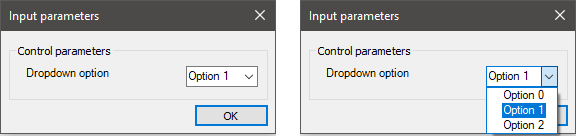
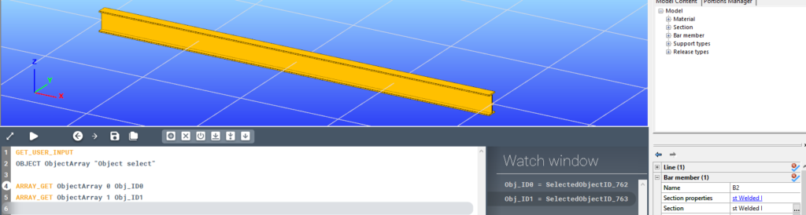
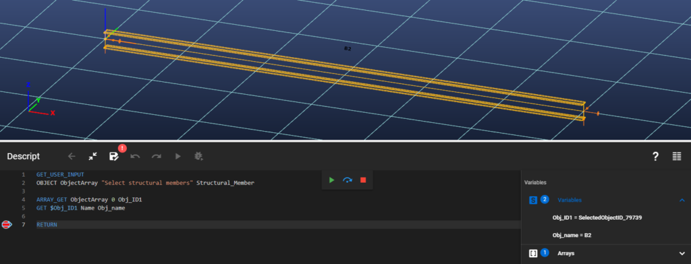
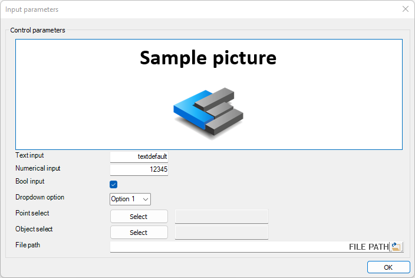

<!-- wp:paragraph -->

Requests input from the user during the script run.

<!-- /wp:paragraph -->

<!-- wp:heading {"level":3} -->

### Syntax

<!-- /wp:heading -->

<!-- wp:paragraph -->

**GET_USER_INPUT**  
TEXT  
NUMBER  
BOOL  
OPTION

ENDOPTION  
POINT  
OBJECT  
FILE_PATH

<!-- /wp:paragraph -->

<!-- wp:heading {"level":3} -->

### Description

<!-- /wp:heading -->

<!-- wp:paragraph -->

With the GET_USER_INPUT command various types of input data can be requested from the user during the script run. Each individual input request is a new line directly after the GET_USER_INPUT line, except for the OPTION input type, which can take up several lines. One GET_USER_INPUT command will generate one dialogue window, with all the input fields listed. An arbitrary number of inputs can be requested within one GET_USER_INPUT command, but it is advised to take into account the available screen space for the dialogue window that will be generated.

<!-- /wp:paragraph -->

<!-- wp:paragraph -->

After the user defined all the requested inputs and clicked on the "OK" button, the given values will be saved into their respective variables, and the script run will continue.

<!-- /wp:paragraph -->

<!-- wp:paragraph -->

Additionally to input inquiries, [images can be inserted](#Picture) into the dialogue window. This is typically useful in case there is some explanation needed for the input request in the form of a drawing or a picture.

<!-- /wp:paragraph -->

<!-- wp:heading {"level":3} -->

### Input types

<!-- /wp:heading -->

<!-- wp:paragraph -->

One or more input types can be requested within one GET_USER_INPUT command in arbitrary order.

<!-- /wp:paragraph -->

<!-- wp:paragraph -->

Available input types:

<!-- /wp:paragraph -->

<!-- wp:table {"className":"is-style-stripes"} -->

|                               |                                                    |
| ----------------------------- | -------------------------------------------------- |
| **Input type**                | **Description**                                    |
| [Text](#Text-input)           | Text input                                         |
| [Number](#Numerical-input)    | Numerical input                                    |
| [Bool](#Boolean-input)        | Boolean input                                      |
| [Option](#Option-input)       | Option choice from dropdown                        |
| [Point](#Point-input)         | x,y,z coordinates of a point selected in the model |
| [Object](#Object-input)       | Object IDs of model objects selected in the model  |
| [File path](#File-path-input) | File path input with file open button              |

<!-- /wp:table -->

<!-- wp:heading {"level":3} -->

### Sample code:

<!-- /wp:heading -->

<!-- wp:loos-hcb/code-block -->

```
GET_USER_INPUT
TEXT TextVariable "Text input" textdefault
NUMBER NumberVariable "Numerical input" 12345
BOOL BoolVariable "Bool input" True
OPTION OptionVariable "Dropdown option" 1
Opt_Value0 "Option 0"
Opt_Value1 "Option 1"
Opt_Value2 "Option 2"
ENDOPTION
POINT PointArray "Point select"
OBJECT ObjectArray "Object select"
FILE_PATH file_path "File path"
```

<!-- /wp:loos-hcb/code-block -->

<!-- wp:paragraph -->

The above code will result in this input dialogue:

<!-- /wp:paragraph -->

<!-- wp:image {"id":74097,"sizeSlug":"full","linkDestination":"none"} -->


<!-- /wp:image -->

<!-- wp:heading {"level":1} -->

# Detailed description of input types

<!-- /wp:heading -->

<!-- wp:heading {"textAlign":"left"} -->

## Text input

<!-- /wp:heading -->

<!-- wp:heading {"level":3} -->

### Syntax

<!-- /wp:heading -->

<!-- wp:paragraph -->

**GET_USER_INPUT**  
TEXT

<!-- /wp:paragraph -->

<!-- wp:heading {"level":3} -->

### Command parameters

<!-- /wp:heading -->

<!-- wp:table {"className":"is-style-stripes"} -->

|                                     |                |                  |                   |
| ----------------------------------- | -------------- | ---------------- | ----------------- |
| **Command parameter**               | **Assignment** | **Value format** | **Input options** |
| [Variable name](#Variable-name-txt) | Required       | String           | Local, variable   |
| [Dialogue text](#Dialogue-text-txt) | Required       | String           | Local, variable   |
| [Default value](#Default-value-txt) | Optional       | String           | Local, variable   |

<!-- /wp:table -->

<!-- wp:heading {"level":4} -->

#### Variable name:

<!-- /wp:heading -->

<!-- wp:paragraph -->

Name of the variable that will contain the requested input.

<!-- /wp:paragraph -->

<!-- wp:heading {"level":4} -->

#### Dialogue text:

<!-- /wp:heading -->

<!-- wp:paragraph -->

Text that will appear on the dialogue window.

<!-- /wp:paragraph -->

<!-- wp:heading {"level":4} -->

#### Default value:

<!-- /wp:heading -->

<!-- wp:paragraph -->

Default value of the requested input variable.

<!-- /wp:paragraph -->

<!-- wp:heading {"level":3} -->

### Sample code:

<!-- /wp:heading -->

<!-- wp:loos-hcb/code-block -->

```
GET_USER_INPUT
TEXT TextVariable "Text input" textdefault
```

<!-- /wp:loos-hcb/code-block -->

<!-- wp:paragraph -->

The above code will result in this input dialogue:

<!-- /wp:paragraph -->

<!-- wp:image {"id":23644,"sizeSlug":"full","linkDestination":"media"} -->

[](./img/wp-content-uploads-2021-08-image-59.png)

<!-- /wp:image -->

<!-- wp:heading {"textAlign":"left"} -->

## Numerical input

<!-- /wp:heading -->

<!-- wp:heading {"level":3} -->

### Syntax

<!-- /wp:heading -->

<!-- wp:paragraph -->

**GET_USER_INPUT**  
NUMBER

<!-- /wp:paragraph -->

<!-- wp:heading {"level":3} -->

### Command parameters

<!-- /wp:heading -->

<!-- wp:table {"className":"is-style-stripes"} -->

|                                     |                |                  |                   |
| ----------------------------------- | -------------- | ---------------- | ----------------- |
| **Command parameter**               | **Assignment** | **Value format** | **Input options** |
| [Variable name](#Variable-name-num) | Required       | String           | Local, variable   |
| [Dialogue text](#Dialogue-text-num) | Required       | String           | Local, variable   |
| [Default value](#Default-value-num) | Optional       | Integer, float   | Local, variable   |

<!-- /wp:table -->

<!-- wp:heading {"level":4} -->

#### Variable name:

<!-- /wp:heading -->

<!-- wp:paragraph -->

Name of the variable that will contain the requested input.

<!-- /wp:paragraph -->

<!-- wp:heading {"level":4} -->

#### Dialogue text:

<!-- /wp:heading -->

<!-- wp:paragraph -->

Text that will appear on the dialogue window.

<!-- /wp:paragraph -->

<!-- wp:heading {"level":4} -->

#### Default value:

<!-- /wp:heading -->

<!-- wp:paragraph -->

Default value of the requested input variable.

<!-- /wp:paragraph -->

<!-- wp:heading {"level":3} -->

### Sample code:

<!-- /wp:heading -->

<!-- wp:loos-hcb/code-block -->

```
GET_USER_INPUT
NUMBER NumberVariable "Numerical input" 12345
```

<!-- /wp:loos-hcb/code-block -->

<!-- wp:paragraph -->

The above code will result in this input dialogue:

<!-- /wp:paragraph -->

<!-- wp:image {"id":23652,"sizeSlug":"full","linkDestination":"media"} -->

[](./img/wp-content-uploads-2021-08-image-60.png)

<!-- /wp:image -->

<!-- wp:heading {"textAlign":"left"} -->

## Boolean input

<!-- /wp:heading -->

<!-- wp:heading {"level":3} -->

### Syntax

<!-- /wp:heading -->

<!-- wp:paragraph -->

**GET_USER_INPUT**  
BOOL

<!-- /wp:paragraph -->

<!-- wp:heading {"level":3} -->

### Command parameters

<!-- /wp:heading -->

<!-- wp:table {"className":"is-style-stripes"} -->

|                                      |                |                                        |                   |
| ------------------------------------ | -------------- | -------------------------------------- | ----------------- |
| **Command parameter**                | **Assignment** | **Value format**                       | **Input options** |
| [Variable name](#Variable-name-bool) | Required       | String                                 | Local, variable   |
| [Dialogue text](#Dialogue-text-bool) | Required       | String                                 | Local, variable   |
| [Default value](#Default-value-bool) | Optional       | [Predefined strings](#Accepted-inputs) | Local, variable   |

<!-- /wp:table -->

<!-- wp:heading {"level":4} -->

#### Variable name:

<!-- /wp:heading -->

<!-- wp:paragraph -->

Name of the variable that will contain the requested input.

<!-- /wp:paragraph -->

<!-- wp:heading {"level":4} -->

#### Dialogue text:

<!-- /wp:heading -->

<!-- wp:paragraph -->

Text that will appear on the dialogue window.

<!-- /wp:paragraph -->

<!-- wp:heading {"level":4} -->

#### Default value:

<!-- /wp:heading -->

<!-- wp:paragraph -->

Default value of the requested input variable.

<!-- /wp:paragraph -->

<!-- wp:paragraph -->

Accepted inputs:

<!-- /wp:paragraph -->

<!-- wp:list -->

- <!-- wp:list-item -->
- Positive: "True" or "1"
- <!-- /wp:list-item -->
-
- <!-- wp:list-item -->
- Negative: "False" or "0"
- <!-- /wp:list-item -->

<!-- /wp:list -->

<!-- wp:heading {"level":3} -->

### Sample code:

<!-- /wp:heading -->

<!-- wp:loos-hcb/code-block -->

```
GET_USER_INPUT
BOOL BoolVariable "Bool input" True
```

<!-- /wp:loos-hcb/code-block -->

<!-- wp:paragraph -->

The above code will result in this input dialogue:

<!-- /wp:paragraph -->

<!-- wp:image {"id":23660,"sizeSlug":"full","linkDestination":"media"} -->

[](./img/wp-content-uploads-2021-08-image-61.png)

<!-- /wp:image -->

<!-- wp:heading {"textAlign":"left"} -->

## Option input

<!-- /wp:heading -->

<!-- wp:paragraph -->

The option input creates a dropdown list on the dialogue, from where the user can choose 1 option.

<!-- /wp:paragraph -->

<!-- wp:paragraph -->

There are 2 ways to set up an option input:

<!-- /wp:paragraph -->

<!-- wp:list -->

- <!-- wp:list-item -->
- Local list in multiple rows closed by "ENDOPTION" line
- <!-- /wp:list-item -->
-
- <!-- wp:list-item -->
- Defined by arrays _(since CS 17)_
- <!-- /wp:list-item -->

<!-- /wp:list -->

<!-- wp:heading -->

## Option input defined by local list:

<!-- /wp:heading -->

<!-- wp:paragraph -->

One option input takes up several rows within the GET_USER_INPUT command. After the line starting with "OPTION" all dropdown options have to be listed in separate rows. After the row of the last dropdown option, the "OPTION" input is closed with an additional "ENDOPTION" line.

<!-- /wp:paragraph -->

<!-- wp:heading {"level":3} -->

### Syntax

<!-- /wp:heading -->

<!-- wp:paragraph -->

**GET_USER_INPUT**  
OPTION

\_etc.  
\_ENDOPTION

<!-- /wp:paragraph -->

<!-- wp:heading {"level":3} -->

### Command parameters

<!-- /wp:heading -->

<!-- wp:table {"className":"is-style-stripes"} -->

|                                                 |                |                  |                   |
| ----------------------------------------------- | -------------- | ---------------- | ----------------- |
| **Command parameter**                           | **Assignment** | **Value format** | **Input options** |
| [Variable name](#Variable-name-opt)             | Required       | String           | Local, variable   |
| [Dialogue text](#Dialogue-text-opt)             | Required       | String           | Local, variable   |
| [Default value](#Default-value-opt)             | Optional       | Integer          | Local, variable   |
| [Option values](#Option-values)                 | Required       | String           | Local, variable   |
| [Option dropdown texts](#Option-dropdown-texts) | Required       | String           | Local, variable   |

<!-- /wp:table -->

<!-- wp:heading {"level":4} -->

#### Variable name:

<!-- /wp:heading -->

<!-- wp:paragraph -->

Name of the variable that will contain the chosen option value.

<!-- /wp:paragraph -->

<!-- wp:heading {"level":4} -->

#### Dialogue text:

<!-- /wp:heading -->

<!-- wp:paragraph -->

Text that will appear on the dialogue window.

<!-- /wp:paragraph -->

<!-- wp:heading {"level":4} -->

#### Default value:

<!-- /wp:heading -->

<!-- wp:paragraph -->

Number of the default input option. The numbering of the options starts with 0.

<!-- /wp:paragraph -->

<!-- wp:heading {"level":4} -->

#### Option values:

<!-- /wp:heading -->

<!-- wp:paragraph -->

The values associated with the individual dropdown options. If a certain option is selected, then its value will be assigned to the resulting variable of the option input.

<!-- /wp:paragraph -->

<!-- wp:heading {"level":4} -->

#### Option dropdown texts:

<!-- /wp:heading -->

<!-- wp:paragraph -->

Text that will appear within the dropdown of the dialogue window.

<!-- /wp:paragraph -->

<!-- wp:heading {"level":3} -->

### Sample code:

<!-- /wp:heading -->

<!-- wp:loos-hcb/code-block -->

```
GET_USER_INPUT
OPTION OptionVariable "Dropdown option" 1
Opt_Value0 "Option 0"
Opt_Value1 "Option 1"
Opt_Value2 "Option 2"
ENDOPTION
```

<!-- /wp:loos-hcb/code-block -->

<!-- wp:paragraph -->

The above code will result in this input dialogue:

<!-- /wp:paragraph -->

<!-- wp:image {"id":24045,"sizeSlug":"full","linkDestination":"media"} -->

[](./img/wp-content-uploads-2021-09-image-5.png)

<!-- /wp:image -->

<!-- wp:heading -->

## Option input defined by arrays:

<!-- /wp:heading -->

<!-- wp:paragraph -->

With this syntax, the value and text for the items in the dropdown list are given by 2 arrays. These arrays must be the same size. This syntax allows to create dropdown lists with a number of items that are not known at the time of coding.

<!-- /wp:paragraph -->

<!-- wp:heading {"level":3} -->

### Syntax

<!-- /wp:heading -->

<!-- wp:paragraph -->

**GET_USER_INPUT**  
OPTION

<!-- /wp:paragraph -->

<!-- wp:heading {"level":3} -->

### Command parameters

<!-- /wp:heading -->

<!-- wp:table {"className":"is-style-stripes"} -->

|                                                                                                              |                |                  |                   |
| ------------------------------------------------------------------------------------------------------------ | -------------- | ---------------- | ----------------- |
| **Command parameter**                                                                                        | **Assignment** | **Value format** | **Input options** |
| [Variable name](#Variable-name-opt)                                                                          | Required       | String           | Local, variable   |
| [Dialogue text](#Dialogue-text-opt)                                                                          | Required       | String           | Local, variable   |
| [Value array](#Value-array)                                                                                  | Required       | String           | Local, variable   |
| [Text array](#Text-array)                                                                                    | Required       | String           | Local, variable   |
| [Default value](https://www.consteelsoftware.com/wp-admin/post.php?post=67960&action=edit#Default-value-opt) | Optional       | Integer          | Local, variable   |

<!-- /wp:table -->

<!-- wp:heading {"level":4} -->

#### Variable name:

<!-- /wp:heading -->

<!-- wp:paragraph -->

Name of the variable that will contain the chosen option value.

<!-- /wp:paragraph -->

<!-- wp:heading {"level":4} -->

#### Dialogue text:

<!-- /wp:heading -->

<!-- wp:paragraph -->

Text that will appear on the dialogue window.

<!-- /wp:paragraph -->

<!-- wp:heading {"level":4} -->

#### Value array:

<!-- /wp:heading -->

<!-- wp:paragraph -->

An array that contains the corresponding values for each item in the dropdown list.

<!-- /wp:paragraph -->

<!-- wp:heading {"level":4} -->

#### Text array:

<!-- /wp:heading -->

<!-- wp:paragraph -->

An array that containst the texts that will be shown in the dropdown UI element for each list item.

<!-- /wp:paragraph -->

<!-- wp:heading {"level":4} -->

#### Default value:

<!-- /wp:heading -->

<!-- wp:paragraph -->

Number of the default input option. The numbering of the options starts with 0.

<!-- /wp:paragraph -->

<!-- wp:heading {"level":3} -->

### Sample code:

<!-- /wp:heading -->

<!-- wp:loos-hcb/code-block -->

```
ARRAY_CREATE Value_array
ARRAY_ADD Value_array Value1
ARRAY_ADD Value_array Value2
ARRAY_ADD Value_array Value3

ARRAY_CREATE Static_Text_array
ARRAY_ADD Static_Text_array "Option 1"
ARRAY_ADD Static_Text_array "Option 2"
ARRAY_ADD Static_Text_array "Option 3"

GET_USER_INPUT
OPTION Output_Var "Dropdown option" Value_array Static_Text_array 1
```

<!-- /wp:loos-hcb/code-block -->

<!-- wp:paragraph -->

The above code will result in this input dialogue:

<!-- /wp:paragraph -->

<!-- wp:image {"id":24045,"sizeSlug":"full","linkDestination":"media"} -->

[](https://consteelsoftware.com/wp-content/uploads/2021/09/image-5.png)

<!-- /wp:image -->

<!-- wp:heading {"textAlign":"left"} -->

## Point input

<!-- /wp:heading -->

<!-- wp:paragraph -->

With the point input a selection of a point can be requested from the user. The coordinates of this point will be stored in an array.

<!-- /wp:paragraph -->

<!-- wp:heading {"level":3} -->

### Syntax

<!-- /wp:heading -->

<!-- wp:paragraph -->

**GET_USER_INPUT**  
POINT

<!-- /wp:paragraph -->

<!-- wp:heading {"level":3} -->

### Command parameters

<!-- /wp:heading -->

<!-- wp:table {"className":"is-style-stripes"} -->

|                                       |                |                  |                   |
| ------------------------------------- | -------------- | ---------------- | ----------------- |
| **Command parameter**                 | **Assignment** | **Value format** | **Input options** |
| [Array name](#Array-name)             | Required       | String           | Local, variable   |
| [Dialogue text](#Dialogue-text-point) | Required       | String           | Local, variable   |

<!-- /wp:table -->

<!-- wp:heading {"level":4} -->

#### Array name:

<!-- /wp:heading -->

<!-- wp:paragraph -->

Name of the array that will contain the coordinates of the selected point.

<!-- /wp:paragraph -->

<!-- wp:heading {"level":4} -->

#### Dialogue text:

<!-- /wp:heading -->

<!-- wp:paragraph -->

Text that will appear on the dialogue window.

<!-- /wp:paragraph -->

<!-- wp:heading {"level":3} -->

### Sample code:

<!-- /wp:heading -->

<!-- wp:heading {"level":4} -->

#### Command only:

<!-- /wp:heading -->

<!-- wp:loos-hcb/code-block -->

```
GET_USER_INPUT
POINT PointArray "Point select"
```

<!-- /wp:loos-hcb/code-block -->

<!-- wp:paragraph -->

The above code will result in this input dialogue:

<!-- /wp:paragraph -->

<!-- wp:image {"id":23712,"sizeSlug":"full","linkDestination":"media"} -->

[](./img/wp-content-uploads-2021-08-image-65.png)

<!-- /wp:image -->

<!-- wp:paragraph -->

The steps of the selection are the following:

<!-- /wp:paragraph -->

<!-- wp:list -->

- <!-- wp:list-item -->
- Click on the select button on the dialogue window
- <!-- /wp:list-item -->
-
- <!-- wp:list-item -->
- Click on the point in the model
- <!-- /wp:list-item -->
-
- <!-- wp:list-item -->
- Click on OK
- <!-- /wp:list-item -->

<!-- /wp:list -->

<!-- wp:heading {"level":4} -->

#### Command + coordinate check:

<!-- /wp:heading -->

<!-- wp:loos-hcb/code-block -->

```
GET_USER_INPUT
POINT PointArray "Point select"

ARRAY_GET PointArray 0 PointX
ARRAY_GET PointArray 1 PointY
ARRAY_GET PointArray 2 PointZ
```

<!-- /wp:loos-hcb/code-block -->

<!-- wp:image {"id":23718,"sizeSlug":"full","linkDestination":"media"} -->

[](./img/wp-content-uploads-2021-08-image-66.png)

<!-- /wp:image -->

<!-- wp:heading {"textAlign":"left"} -->

## Object input

<!-- /wp:heading -->

<!-- wp:heading {"level":3} -->

### Syntax

<!-- /wp:heading -->

<!-- wp:paragraph -->

**GET_USER_INPUT**  
OBJECT

<!-- /wp:paragraph -->

<!-- wp:heading {"level":3} -->

### Command parameters

<!-- /wp:heading -->

<!-- wp:table {"className":"is-style-stripes"} -->

|                                     |                |                                                   |                   |
| ----------------------------------- | -------------- | ------------------------------------------------- | ----------------- |
| **Command parameter**               | **Assignment** | **Value format**                                  | **Input options** |
| [Array name](#Array-name-obj)       | Required       | String                                            | Local, variable   |
| [Dialogue text](#Dialogue-text-obj) | Required       | String                                            | Local, variable   |
| [Object type](#Object-type-obj)     | Optional       | [Predefined strings](#Available-object-types-obj) | Local, variable   |

<!-- /wp:table -->

<!-- wp:heading {"level":4} -->

#### Array name:

<!-- /wp:heading -->

<!-- wp:paragraph -->

Name of the array that will store the IDs of the selected objects.

<!-- /wp:paragraph -->

<!-- wp:heading {"level":4} -->

#### Dialogue text:

<!-- /wp:heading -->

<!-- wp:paragraph -->

Text that will appear on the dialogue window.

<!-- /wp:paragraph -->

<!-- wp:heading {"level":4} -->

#### Object type:

<!-- /wp:heading -->

<!-- wp:paragraph -->

Restricts the selectable object types to 1 type.

<!-- /wp:paragraph -->

<!-- wp:paragraph -->

Available object types:

<!-- /wp:paragraph -->

<!-- wp:table {"className":"is-style-stripes"} -->

|                                 |                           |
| ------------------------------- | ------------------------- |
| **Object type name**            | **Object type**           |
| Geometry tab                    | -                         |
| Point                           | Point                     |
| Line                            | Line                      |
| Arc                             | CircleArc                 |
| Two-dimensional figure          | Polygon                   |
| Dimension line                  | Dimension_Line            |
| Dimension radius and diameter   | Dimension_Radius          |
| Dimension arc                   | Dimension_Arc             |
| Dimension angle                 | Dimension_Angle           |
| Dimension height                | Dimension_Height          |
| Dimension textbox               | Dimension_Textbox         |
| Structural members tab          | -                         |
| Member                          | Structural_Member         |
| Plate                           | Structural_Plate          |
| Diaphragm                       | Structural_Diaphragm      |
| Rigid body                      | Structural_RigidBody      |
| Haunch                          | Haunched_Member           |
| Point support                   | Support_Point             |
| Line support                    | Support_Edge              |
| Surface support                 | Support_Plate             |
| Shear field                     | ShearField                |
| Link                            | Link                      |
| Smart link                      | SmartLink                 |
| Purlin line                     | PurlinLine_Place          |
| Purlin overlap and support zone | PurlinJoint_Place         |
| Rectangular cutout              | Hole_Rec                  |
| Circular cutout                 | Hole_Circ                 |
| Hexagonal cutout                | Hole_Hex                  |
| Perpendicular plate stiffener   | Stiffener_PlatePerp       |
| Parallel plate stiffener        | Stiffener_PlatePar        |
| Perpendicular section stiffener | Stiffener_Section         |
| Placed joint                    | Joint_Place               |
| Loads tab                       | -                         |
| Point load                      | NodeForce                 |
| Line load                       | MemberForce               |
| Line wind load                  | LineWindForce             |
| Surface load                    | PlateForce                |
| Load transfer surface           | LoadTransferSurface       |
| Line temperature load           | MemberThermal             |
| Surface temperature load        | PlateThermal              |
| Prescribed displacement         | PresDisp                  |
| Change in length                | Elongation                |
| Tension force                   | Pretension                |
| Influence line                  | MovingLoadPath            |
| Wind surface                    | WindSurface               |
| Snow surface                    | SnowSurface               |
| Surface wind load               | SurfWindForce             |
| Surface snow load               | SurfSnowForce             |
| Fire load                       | MemberFireEffect          |
| Mass tab                        | -                         |
| Node mass                       | NodeMass                  |
| Finite element tab              | -                         |
| Constraint                      | Structural_Constraint     |
| Stiffener warping support       | Stiffener_Warping_Support |

<!-- /wp:table -->

<!-- wp:heading {"level":3} -->

### Sample code:

<!-- /wp:heading -->

<!-- wp:heading {"level":4} -->

#### Command only:

<!-- /wp:heading -->

<!-- wp:loos-hcb/code-block -->

```
GET_USER_INPUT
OBJECT ObjectArray "Object select"
```

<!-- /wp:loos-hcb/code-block -->

<!-- wp:paragraph -->

The above code will result in this input dialogue:

<!-- /wp:paragraph -->

<!-- wp:image {"id":23731,"sizeSlug":"full","linkDestination":"media"} -->

[](./img/wp-content-uploads-2021-08-image-68.png)

<!-- /wp:image -->

<!-- wp:paragraph -->

The steps of the selection are the following:

<!-- /wp:paragraph -->

<!-- wp:list -->

- <!-- wp:list-item -->
- Click on the select button on the dialogue window
- <!-- /wp:list-item -->
-
- <!-- wp:list-item -->
- Select objects in the model
- <!-- /wp:list-item -->
-
- <!-- wp:list-item -->
- End the selection with a right click  
  The window after this step should look like this:
- <!-- /wp:list-item -->

<!-- /wp:list -->

<!-- wp:image {"linkDestination":"media"} -->

[](./img/wp-content-uploads-2021-08-image-26.png)

<!-- /wp:image -->

<!-- wp:list -->

- <!-- wp:list-item -->
- Click on OK
- <!-- /wp:list-item -->

<!-- /wp:list -->

<!-- wp:heading {"level":4} -->

#### Command + object ID check:

<!-- /wp:heading -->

<!-- wp:loos-hcb/code-block -->

```
GET_USER_INPUT
OBJECT ObjectArray "Object select"

ARRAY_GET ObjectArray 0 Obj_ID0
ARRAY_GET ObjectArray 1 Obj_ID1
```

<!-- /wp:loos-hcb/code-block -->

<!-- wp:image {"id":23796,"sizeSlug":"large","linkDestination":"media"} -->

[](https://consteelsoftware.com/wp-content/uploads/2021/08/image-72.png)

<!-- /wp:image -->

<!-- wp:heading {"level":4} -->

#### Command with optional object type parameter + object ID check:

<!-- /wp:heading -->

<!-- wp:loos-hcb/code-block -->

```
GET_USER_INPUT
OBJECT ObjectArray "Select structural members" Structural_Member

ARRAY_GET ObjectArray 0 Obj_ID1
GET $Obj_ID1 Name Obj_name
```

<!-- /wp:loos-hcb/code-block -->

<!-- wp:image {"id":46564,"sizeSlug":"large","linkDestination":"media"} -->

[](https://consteelsoftware.com/wp-content/uploads/2023/03/image-4.png)

<!-- /wp:image -->

<!-- wp:heading {"textAlign":"left"} -->

## File path input

<!-- /wp:heading -->

<!-- wp:paragraph -->

The file path input is similar to the text input, but with an additional file open button on the right side of the input field. After clicking the file open button, a file explorer window will open, where a file can be selected and opened, which copies the file path into the input field. Alternatively a file path can also be typed or pasted into the input field.

<!-- /wp:paragraph -->

<!-- wp:heading {"level":3} -->

### Syntax

<!-- /wp:heading -->

<!-- wp:paragraph -->

**GET_USER_INPUT**  
FILE_PATH

<!-- /wp:paragraph -->

<!-- wp:heading {"level":3} -->

### Command parameters

<!-- /wp:heading -->

<!-- wp:table {"className":"is-style-stripes"} -->

|                                     |                |                  |                   |
| ----------------------------------- | -------------- | ---------------- | ----------------- |
| **Command parameter**               | **Assignment** | **Value format** | **Input options** |
| [Variable name](#Variable-name-txt) | Required       | String           | Local, variable   |
| [Dialogue text](#Dialogue-text-txt) | Required       | String           | Local, variable   |
| [Default value](#Default-value-txt) | Optional       | String           | Local, variable   |

<!-- /wp:table -->

<!-- wp:heading {"level":4} -->

#### Variable name:

<!-- /wp:heading -->

<!-- wp:paragraph -->

Name of the variable that will contain the requested input.

<!-- /wp:paragraph -->

<!-- wp:heading {"level":4} -->

#### Dialogue text:

<!-- /wp:heading -->

<!-- wp:paragraph -->

Text that will appear on the dialogue window.

<!-- /wp:paragraph -->

<!-- wp:heading {"level":4} -->

#### Default value:

<!-- /wp:heading -->

<!-- wp:paragraph -->

Default value of the requested input variable.

<!-- /wp:paragraph -->

<!-- wp:heading {"level":3} -->

### Sample code:

<!-- /wp:heading -->

<!-- wp:loos-hcb/code-block -->

```
GET_USER_INPUT
FILE_PATH file_path "File path"
```

<!-- /wp:loos-hcb/code-block -->

<!-- wp:paragraph -->

The above code will result in this input dialogue:

<!-- /wp:paragraph -->

<!-- wp:image {"id":74107,"sizeSlug":"full","linkDestination":"none"} -->


<!-- /wp:image -->

<!-- wp:heading {"level":1} -->

# Additional content on dialogue window

<!-- /wp:heading -->

<!-- wp:heading -->

## Picture

<!-- /wp:heading -->

<!-- wp:paragraph -->

Images can be inserted into the dialogue window generated by the GET_USER_INPUT command. This is typically useful in case there is some explanation needed for the input request in the form of a drawing or a picture.

<!-- /wp:paragraph -->

<!-- wp:heading {"level":3} -->

### Syntax

<!-- /wp:heading -->

<!-- wp:paragraph -->

**GET_USER_INPUT**  
IMAGE

<!-- /wp:paragraph -->

<!-- wp:heading {"level":3} -->

### Command parameters

<!-- /wp:heading -->

<!-- wp:table {"className":"is-style-stripes"} -->

|                         |                |                  |                   |
| ----------------------- | -------------- | ---------------- | ----------------- |
| **Command parameter**   | **Assignment** | **Value format** | **Input options** |
| [File path](#File-path) | Required       | String           | Local, variable   |

<!-- /wp:table -->

<!-- wp:heading {"level":4} -->

#### File path:

<!-- /wp:heading -->

<!-- wp:paragraph -->

Path, file name and extension of the image.

<!-- /wp:paragraph -->

<!-- wp:heading {"level":3} -->

### Sample code:

<!-- /wp:heading -->

<!-- wp:heading {"level":4} -->

#### Command only:

<!-- /wp:heading -->

<!-- wp:loos-hcb/code-block -->

```
GET_USER_INPUT
IMAGE c:\Temp\Sample_Picture.png
```

<!-- /wp:loos-hcb/code-block -->

<!-- wp:paragraph -->

The above code will result in this input dialogue:

<!-- /wp:paragraph -->

<!-- wp:image {"id":24065,"sizeSlug":"full","linkDestination":"media"} -->

[](./img/wp-content-uploads-2021-09-image-8.png)

<!-- /wp:image -->

<!-- wp:heading {"level":4} -->

#### Image + all possible input types:

<!-- /wp:heading -->

<!-- wp:loos-hcb/code-block -->

```
GET_USER_INPUT
IMAGE c:\Temp\Sample_Picture_v02_Wide.png
TEXT TextVariable "Text input" textdefault
NUMBER NumberVariable "Numerical input" 12345
BOOL BoolVariable "Bool input" True
OPTION OptionVariable "Dropdown option" 1
Opt_Value0 "Option 0"
Opt_Value1 "Option 1"
Opt_Value2 "Option 2"
ENDOPTION
POINT PointArray "Point select"
OBJECT ObjectArray "Object select"
FILE_PATH file_path "File path"
```

<!-- /wp:loos-hcb/code-block -->

<!-- wp:paragraph -->

The above code will result in this input dialogue:

<!-- /wp:paragraph -->

<!-- wp:image {"id":74117,"sizeSlug":"full","linkDestination":"none"} -->



<!-- /wp:image -->
