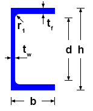
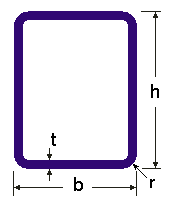

<!-- wp:paragraph -->

Loads a macro section into the section list.

<!-- /wp:paragraph -->

<!-- wp:heading {"level":3,"editorskit":{"devices":false,"desktop":true,"tablet":true,"mobile":true,"loggedin":true,"loggedout":true,"acf_visibility":"","acf_field":"","acf_condition":"","acf_value":"","migrated":false,"unit_test":false}} -->

### Syntax

<!-- /wp:heading -->

<!-- wp:paragraph -->

**LOAD_SECTION_MACRO ** Section parameters...

<!-- /wp:paragraph -->

<!-- wp:heading {"level":3,"editorskit":{"devices":false,"desktop":true,"tablet":true,"mobile":true,"loggedin":true,"loggedout":true,"acf_visibility":"","acf_field":"","acf_condition":"","acf_value":"","migrated":false,"unit_test":false}} -->

### Command parameters

<!-- /wp:heading -->

<!-- wp:table {"className":"is-style-stripes"} -->

|                                           |                |                                         |                   |
| ----------------------------------------- | -------------- | --------------------------------------- | ----------------- |
| **Command parameter**                     | **Assignment** | **Value format**                        | **Input options** |
| [Object ID](#Oject-ID)                    | Required       | String                                  | Local, variable   |
| [Macro type](#Macro-type)                 | Required       | [Predefined strings](#Macro-type-table) | Local, variable   |
| [Section name](#Section-name)             | Required       | String                                  | Local, variable   |
| [Material name](#Material-name)           | Required       | [Predefined strings](#material-names)   | Local, variable   |
| [Section parameters](#Section-parameters) | Required       | Numerical or string                     | Local, variable   |

<!-- /wp:table -->

<!-- wp:heading {"level":4,"editorskit":{"devices":false,"desktop":true,"tablet":true,"mobile":true,"loggedin":true,"loggedout":true,"acf_visibility":"","acf_field":"","acf_condition":"","acf_value":"","migrated":false,"unit_test":false}} -->

#### Object ID:

<!-- /wp:heading -->

<!-- wp:paragraph -->

A string of characters that is used to identify the object that is being created. The string can contain letters, numbers and special characters as well. It can be defined as a variable that contains the string or directly as a string of characters between apostrophes.

<!-- /wp:paragraph -->

<!-- wp:paragraph -->

For example:

<!-- /wp:paragraph -->

<!-- wp:paragraph -->

LOAD_SECTION_MACRO **\$Section_ID** etc.

<!-- /wp:paragraph -->

<!-- wp:paragraph -->

or

<!-- /wp:paragraph -->

<!-- wp:paragraph -->

LOAD_SECTION_MACRO **“Section ID 1”** etc.

<!-- /wp:paragraph -->

<!-- wp:paragraph -->

Object ID-s have to be unique for every object across all object types (eg.: sections, members, plates, loads, etc.).

<!-- /wp:paragraph -->

<!-- wp:heading {"level":4,"editorskit":{"devices":false,"desktop":true,"tablet":true,"mobile":true,"loggedin":true,"loggedout":true,"acf_visibility":"","acf_field":"","acf_condition":"","acf_value":"","migrated":false,"unit_test":false}} -->

#### Macro type:

<!-- /wp:heading -->

<!-- wp:paragraph -->

Type of macro to be used.

<!-- /wp:paragraph -->

<!-- wp:paragraph -->

Available macro types:

<!-- /wp:paragraph -->

<!-- wp:table {"className":"caption-align-left is-style-stripes","captionAlignment":"left"} -->

| **Macro type name**                                                               |     | **Macro type**  |
| --------------------------------------------------------------------------------- | --- | --------------- |
| Welded sections                                                                   |     | WLD-...         |
| [Welded I or H](#Welded-I-or-H)                                                   |     | WLD-IH          |
| [Welded box](#Welded-box)                                                         |     | WLD-BOX         |
| [Welded maltese](#Welded-maltese)                                                 |     | WLD-MALTESE     |
| [Welded half maltese](#Welded-half-maltese)                                       |     | WLD-HALFMALTESE |
| [Welded hat](#Welded-hat)                                                         |     | WLD-HAT         |
| [Welded T](#Welded-T)                                                             |     | WLD-T           |
| [Welded WQ](#Welded-WQ)                                                           |     | WLD-WQ          |
| [Slant flange welded I or H](#Slant-flange-welded-I-or-H)                         |     | WLD-SLANTIH     |
| [Welded C](#Welded-C)                                                             |     | WLD-C           |
| Hot rolled sections                                                               |     | HR-...          |
| [Hot rolled I or H](#Hot-rolled-I-or-H)                                           |     | HR-IH           |
| [Hot rolled L](#Hot-rolled-L)                                                     |     | HR-L            |
| [Hot rolled U](#Hot-rolled-U)                                                     |     | HR-U            |
| [Hot rolled circular hollow section](#Hot-rolled-circular-hollow-section)         |     | HR-CHS          |
| [Hot rolled T](#Hot-rolled-T)                                                     |     | HR-T            |
| [Flat shape](#Flat-shape)                                                         |     | HR-FS           |
| [Hot rolled rectangular hollow section](#Hot-rolled-rectangular-hollow-section)   |     | HR-RHS          |
| [Round bar](#Round-bar)                                                           |     | HR-RB           |
| Cold-formed sections                                                              |     | CF-...          |
| [Cold-formed rectangular hollow section](#Cold-formed-rectangular-hollow-section) |     | CF-RHS          |
| [Cold-formed circular hollow section](#Cold-formed-circular-hollow-section)       |     | CF-CHS          |
| [Cold-formed L](#Cold-formed-L)                                                   |     | CF-L            |
| [Cold-formed C](#Cold-formed-C) (simplified) _(since CS 17)_                      |     | CF-C            |
| [Cold-formed Z](#Cold-formed-Z) (simplified) _(since CS 17)_                      |     | CF-Z            |

<!-- /wp:table -->

<!-- wp:heading {"level":4,"editorskit":{"devices":false,"desktop":true,"tablet":true,"mobile":true,"loggedin":true,"loggedout":true,"acf_visibility":"","acf_field":"","acf_condition":"","acf_value":"","migrated":false,"unit_test":false}} -->

#### Section name:

<!-- /wp:heading -->

<!-- wp:paragraph -->

Name of the section that will appear in the section list in Consteel. String of characters between apostrophes.

<!-- /wp:paragraph -->

<!-- wp:heading {"level":4,"editorskit":{"devices":false,"desktop":true,"tablet":true,"mobile":true,"loggedin":true,"loggedout":true,"acf_visibility":"","acf_field":"","acf_condition":"","acf_value":"","migrated":false,"unit_test":false}} -->

#### Material name:

<!-- /wp:heading -->

<!-- wp:paragraph -->

Name of the material to be used for the section. String of characters between apostrophes. Exact match is necessary with the Consteel material names.

<!-- /wp:paragraph -->

<!-- wp:paragraph -->

For example:

<!-- /wp:paragraph -->

<!-- wp:paragraph -->

LOAD_SECTION_MACRO ** "S 235 EN 10025-2"** \[parameter1] \[parameter2] etc.

<!-- /wp:paragraph -->

<!-- wp:paragraph -->

The material names can be viewed in Consteel at the highlighted area of the material dialogue name dropdown.

<!-- /wp:paragraph -->

<!-- wp:image {"id":23074,"sizeSlug":"full","linkDestination":"media"} -->

[](./img/wp-content-uploads-2021-08-image-3.png)

<!-- /wp:image -->

<!-- wp:heading {"level":4,"editorskit":{"devices":false,"desktop":true,"tablet":true,"mobile":true,"loggedin":true,"loggedout":true,"acf_visibility":"","acf_field":"","acf_condition":"","acf_value":"","migrated":false,"unit_test":false}} -->

#### Section parameters:

<!-- /wp:heading -->

<!-- wp:paragraph -->

Section parameters like height, breadth, thickness, etc.. The quantity and meaning of the parameters depend on the macro type.

<!-- /wp:paragraph -->

<!-- wp:heading {"level":3,"editorskit":{"devices":false,"desktop":true,"tablet":true,"mobile":true,"loggedin":true,"loggedout":true,"acf_visibility":"","acf_field":"","acf_condition":"","acf_value":"","migrated":false,"unit_test":false}} -->

### Description

<!-- /wp:heading -->

<!-- wp:paragraph -->

Sections have to be loaded into the current model file to be able to be used in the model. Initially in a new model file the section list is empty. There are several ways to load in, or create a section: library section, macro section, user drawn section. In this case the macro section option is used. The command is analogous with the highlighted "Macro section..." button at the section administration dialogue in Consteel.

<!-- /wp:paragraph -->

<!-- wp:image {"id":23100,"sizeSlug":"full","linkDestination":"media"} -->

[](./img/wp-content-uploads-2021-08-image-7.png)

<!-- /wp:image -->

<!-- wp:heading {"level":1,"editorskit":{"devices":false,"desktop":true,"tablet":true,"mobile":true,"loggedin":true,"loggedout":true,"acf_visibility":"","acf_field":"","acf_condition":"","acf_value":"","migrated":false,"unit_test":false}} -->

# Detailed description of macro types

<!-- /wp:heading -->

<!-- wp:heading {"textAlign":"left","editorskit":{"devices":false,"desktop":true,"tablet":true,"mobile":true,"loggedin":true,"loggedout":true,"acf_visibility":"","acf_field":"","acf_condition":"","acf_value":"","migrated":false,"unit_test":false}} -->

## Welded sections

<!-- /wp:heading -->

<!-- wp:heading {"level":3,"editorskit":{"devices":false,"desktop":true,"tablet":true,"mobile":true,"loggedin":true,"loggedout":true,"acf_visibility":"","acf_field":"","acf_condition":"","acf_value":"","migrated":false,"unit_test":false}} -->

### Welded I or H

<!-- /wp:heading -->

<!-- wp:heading {"level":4,"editorskit":{"devices":false,"desktop":true,"tablet":true,"mobile":true,"loggedin":true,"loggedout":true,"acf_visibility":"","acf_field":"","acf_condition":"","acf_value":"","migrated":false,"unit_test":false}} -->

#### Macro type:

<!-- /wp:heading -->

<!-- wp:paragraph -->

WLD-IH

<!-- /wp:paragraph -->

<!-- wp:heading {"level":4,"editorskit":{"devices":false,"desktop":true,"tablet":true,"mobile":true,"loggedin":true,"loggedout":true,"acf_visibility":"","acf_field":"","acf_condition":"","acf_value":"","migrated":false,"unit_test":false}} -->

#### Parameters:

<!-- /wp:heading -->

<!-- wp:image {"align":"center","id":23082,"sizeSlug":"full","linkDestination":"media","editorskit":{"devices":false,"desktop":true,"tablet":true,"mobile":true,"loggedin":true,"loggedout":true,"acf_visibility":"","acf_field":"","acf_condition":"","acf_value":"","migrated":false,"unit_test":false}} -->

[](./img/wp-content-uploads-2021-08-image-4.png)

<!-- /wp:image -->

<!-- wp:table {"className":"is-style-stripes"} -->

| Notation | Definition             |
| -------- | ---------------------- |
| b1       | Upper flange width     |
| tf1      | Upper flange thickness |
| h        | Section height         |
| tw       | Web thickness          |
| b2       | Lower flange width     |
| tf2      | Lower flange thickness |

<!-- /wp:table -->

<!-- wp:paragraph -->

Parameter notations substituted into the command syntax:

<!-- /wp:paragraph -->

<!-- wp:paragraph -->

LOAD_SECTION_MACRO

<!-- /wp:paragraph -->

<!-- wp:heading {"level":4,"editorskit":{"devices":false,"desktop":true,"tablet":true,"mobile":true,"loggedin":true,"loggedout":true,"acf_visibility":"","acf_field":"","acf_condition":"","acf_value":"","migrated":false,"unit_test":false}} -->

#### Sample code:

<!-- /wp:heading -->

<!-- wp:loos-hcb/code-block -->

```
LOAD_SECTION_MACRO Sec_ID1 WLD-IH "WLD-IH (Descript)" "S 235 EN 10025-2" 100 10 200 6 100 10
```

<!-- /wp:loos-hcb/code-block -->

<!-- wp:heading {"level":3,"editorskit":{"devices":false,"desktop":true,"tablet":true,"mobile":true,"loggedin":true,"loggedout":true,"acf_visibility":"","acf_field":"","acf_condition":"","acf_value":"","migrated":false,"unit_test":false}} -->

### Welded box

<!-- /wp:heading -->

<!-- wp:heading {"level":4,"editorskit":{"devices":false,"desktop":true,"tablet":true,"mobile":true,"loggedin":true,"loggedout":true,"acf_visibility":"","acf_field":"","acf_condition":"","acf_value":"","migrated":false,"unit_test":false}} -->

#### Macro type:

<!-- /wp:heading -->

<!-- wp:paragraph -->

WLD-BOX

<!-- /wp:paragraph -->

<!-- wp:heading {"level":4,"editorskit":{"devices":false,"desktop":true,"tablet":true,"mobile":true,"loggedin":true,"loggedout":true,"acf_visibility":"","acf_field":"","acf_condition":"","acf_value":"","migrated":false,"unit_test":false}} -->

#### Parameters:

<!-- /wp:heading -->

<!-- wp:image {"align":"center","id":23088,"sizeSlug":"full","linkDestination":"media","editorskit":{"devices":false,"desktop":true,"tablet":true,"mobile":true,"loggedin":true,"loggedout":true,"acf_visibility":"","acf_field":"","acf_condition":"","acf_value":"","migrated":false,"unit_test":false}} -->

[](./img/wp-content-uploads-2021-08-image-5.png)

<!-- /wp:image -->

<!-- wp:table {"className":"is-style-stripes"} -->

| Notation | Definition                      |
| -------- | ------------------------------- |
| h        | Section height                  |
| b        | Section width                   |
| bw       | Web plate width                 |
| tf1      | Upper flange thickness          |
| tf2      | Lower flange thickness          |
| tw1      | Web thickness on the left side  |
| tw2      | Web thickness on the right side |

<!-- /wp:table -->

<!-- wp:paragraph -->

Parameter notations substituted into the command syntax:

<!-- /wp:paragraph -->

<!-- wp:paragraph -->

LOAD_SECTION_MACRO

<!-- /wp:paragraph -->

<!-- wp:heading {"level":4,"editorskit":{"devices":false,"desktop":true,"tablet":true,"mobile":true,"loggedin":true,"loggedout":true,"acf_visibility":"","acf_field":"","acf_condition":"","acf_value":"","migrated":false,"unit_test":false}} -->

#### Sample code:

<!-- /wp:heading -->

<!-- wp:loos-hcb/code-block -->

```
LOAD_SECTION_MACRO Sec_ID1 WLD-BOX "WLD-BOX (Descript)" "S 235 EN 10025-2" 300 400 200 12 12 10 10
```

<!-- /wp:loos-hcb/code-block -->

<!-- wp:heading {"level":3,"editorskit":{"devices":false,"desktop":true,"tablet":true,"mobile":true,"loggedin":true,"loggedout":true,"acf_visibility":"","acf_field":"","acf_condition":"","acf_value":"","migrated":false,"unit_test":false}} -->

### Welded maltese

<!-- /wp:heading -->

<!-- wp:heading {"level":4,"editorskit":{"devices":false,"desktop":true,"tablet":true,"mobile":true,"loggedin":true,"loggedout":true,"acf_visibility":"","acf_field":"","acf_condition":"","acf_value":"","migrated":false,"unit_test":false}} -->

#### Macro type:

<!-- /wp:heading -->

<!-- wp:paragraph -->

WLD-MALTESE

<!-- /wp:paragraph -->

<!-- wp:heading {"level":4,"editorskit":{"devices":false,"desktop":true,"tablet":true,"mobile":true,"loggedin":true,"loggedout":true,"acf_visibility":"","acf_field":"","acf_condition":"","acf_value":"","migrated":false,"unit_test":false}} -->

#### Parameters:

<!-- /wp:heading -->

<!-- wp:image {"align":"center","id":23094,"sizeSlug":"full","linkDestination":"media","editorskit":{"devices":false,"desktop":true,"tablet":true,"mobile":true,"loggedin":true,"loggedout":true,"acf_visibility":"","acf_field":"","acf_condition":"","acf_value":"","migrated":false,"unit_test":false}} -->

[](./img/wp-content-uploads-2021-08-image-6.png)

<!-- /wp:image -->

<!-- wp:table {"className":"is-style-stripes"} -->

| Notation | Definition          |
| -------- | ------------------- |
| h1       | Section height      |
| tw1      | Web thickness       |
| b1       | Section width       |
| tf1      | Flange thickness    |
| h2       | Section height      |
| tw2      | Web plate thickness |
| b2       | Section width       |
| tf2      | Flange thickness    |

<!-- /wp:table -->

<!-- wp:paragraph -->

Parameter notations substituted into the command syntax:

<!-- /wp:paragraph -->

<!-- wp:paragraph -->

LOAD_SECTION_MACRO

<!-- /wp:paragraph -->

<!-- wp:heading {"level":4,"editorskit":{"devices":false,"desktop":true,"tablet":true,"mobile":true,"loggedin":true,"loggedout":true,"acf_visibility":"","acf_field":"","acf_condition":"","acf_value":"","migrated":false,"unit_test":false}} -->

#### Sample code:

<!-- /wp:heading -->

<!-- wp:loos-hcb/code-block -->

```
LOAD_SECTION_MACRO Sec_ID1 WLD-MALTESE "WLD-MALTESE (Descript)" "S 235 EN 10025-2" 400 10 200 20 300 8 150 16
```

<!-- /wp:loos-hcb/code-block -->

<!-- wp:heading {"level":3,"editorskit":{"devices":false,"desktop":true,"tablet":true,"mobile":true,"loggedin":true,"loggedout":true,"acf_visibility":"","acf_field":"","acf_condition":"","acf_value":"","migrated":false,"unit_test":false}} -->

### Welded half maltese

<!-- /wp:heading -->

<!-- wp:heading {"level":4,"editorskit":{"devices":false,"desktop":true,"tablet":true,"mobile":true,"loggedin":true,"loggedout":true,"acf_visibility":"","acf_field":"","acf_condition":"","acf_value":"","migrated":false,"unit_test":false}} -->

#### Macro type:

<!-- /wp:heading -->

<!-- wp:paragraph -->

WLD-HALFMALTESE

<!-- /wp:paragraph -->

<!-- wp:heading {"level":4,"editorskit":{"devices":false,"desktop":true,"tablet":true,"mobile":true,"loggedin":true,"loggedout":true,"acf_visibility":"","acf_field":"","acf_condition":"","acf_value":"","migrated":false,"unit_test":false}} -->

#### Parameters:

<!-- /wp:heading -->

<!-- wp:image {"align":"center","id":23106,"sizeSlug":"full","linkDestination":"media","editorskit":{"devices":false,"desktop":true,"tablet":true,"mobile":true,"loggedin":true,"loggedout":true,"acf_visibility":"","acf_field":"","acf_condition":"","acf_value":"","migrated":false,"unit_test":false}} -->

[](./img/wp-content-uploads-2021-08-image-8.png)

<!-- /wp:image -->

<!-- wp:table {"className":"is-style-stripes"} -->

| Notation | Definition          |
| -------- | ------------------- |
| h1       | Section height      |
| tw1      | Web thickness       |
| b1       | Section width       |
| tf1      | Flange thickness    |
| h2       | Section height      |
| tw2      | Web plate thickness |
| b2       | Section width       |
| tf2      | Flange thickness    |

<!-- /wp:table -->

<!-- wp:paragraph -->

Parameter notations substituted into the command syntax:

<!-- /wp:paragraph -->

<!-- wp:paragraph -->

LOAD_SECTION_MACRO

<!-- /wp:paragraph -->

<!-- wp:heading {"level":4,"editorskit":{"devices":false,"desktop":true,"tablet":true,"mobile":true,"loggedin":true,"loggedout":true,"acf_visibility":"","acf_field":"","acf_condition":"","acf_value":"","migrated":false,"unit_test":false}} -->

#### Sample code:

<!-- /wp:heading -->

<!-- wp:loos-hcb/code-block -->

```
LOAD_SECTION_MACRO Sec_ID1 WLD-HALFMALTESE "WLD-HALFMALTESE (Descript)" "S 235 EN 10025-2" 400 10 200 20 150 8 150 16
```

<!-- /wp:loos-hcb/code-block -->

<!-- wp:heading {"level":3,"editorskit":{"devices":false,"desktop":true,"tablet":true,"mobile":true,"loggedin":true,"loggedout":true,"acf_visibility":"","acf_field":"","acf_condition":"","acf_value":"","migrated":false,"unit_test":false}} -->

### Welded hat

<!-- /wp:heading -->

<!-- wp:heading {"level":4,"editorskit":{"devices":false,"desktop":true,"tablet":true,"mobile":true,"loggedin":true,"loggedout":true,"acf_visibility":"","acf_field":"","acf_condition":"","acf_value":"","migrated":false,"unit_test":false}} -->

#### Macro type:

<!-- /wp:heading -->

<!-- wp:paragraph -->

WLD-HAT

<!-- /wp:paragraph -->

<!-- wp:heading {"level":4,"editorskit":{"devices":false,"desktop":true,"tablet":true,"mobile":true,"loggedin":true,"loggedout":true,"acf_visibility":"","acf_field":"","acf_condition":"","acf_value":"","migrated":false,"unit_test":false}} -->

#### Parameters:

<!-- /wp:heading -->

<!-- wp:image {"align":"center","id":23112,"sizeSlug":"full","linkDestination":"media","editorskit":{"devices":false,"desktop":true,"tablet":true,"mobile":true,"loggedin":true,"loggedout":true,"acf_visibility":"","acf_field":"","acf_condition":"","acf_value":"","migrated":false,"unit_test":false}} -->

[](./img/wp-content-uploads-2021-08-image-9.png)

<!-- /wp:image -->

<!-- wp:table {"className":"is-style-stripes"} -->

| Notation | Definition              |
| -------- | ----------------------- |
| h        | Section height          |
| b        | Section width at flange |
| bw       | Distance between webs   |
| tf       | Flange thickness        |
| tw       | Width of webs           |

<!-- /wp:table -->

<!-- wp:paragraph -->

Parameter notations substituted into the command syntax:

<!-- /wp:paragraph -->

<!-- wp:paragraph -->

LOAD_SECTION_MACRO

<!-- /wp:paragraph -->

<!-- wp:heading {"level":4,"editorskit":{"devices":false,"desktop":true,"tablet":true,"mobile":true,"loggedin":true,"loggedout":true,"acf_visibility":"","acf_field":"","acf_condition":"","acf_value":"","migrated":false,"unit_test":false}} -->

#### Sample code:

<!-- /wp:heading -->

<!-- wp:loos-hcb/code-block -->

```
LOAD_SECTION_MACRO Sec_ID1 WLD-HAT "WLD-HAT (Descript)" "S 235 EN 10025-2" 400 500 300 30 15
```

<!-- /wp:loos-hcb/code-block -->

<!-- wp:heading {"level":3,"editorskit":{"devices":false,"desktop":true,"tablet":true,"mobile":true,"loggedin":true,"loggedout":true,"acf_visibility":"","acf_field":"","acf_condition":"","acf_value":"","migrated":false,"unit_test":false}} -->

### Welded T

<!-- /wp:heading -->

<!-- wp:heading {"level":4,"editorskit":{"devices":false,"desktop":true,"tablet":true,"mobile":true,"loggedin":true,"loggedout":true,"acf_visibility":"","acf_field":"","acf_condition":"","acf_value":"","migrated":false,"unit_test":false}} -->

#### Macro type:

<!-- /wp:heading -->

<!-- wp:paragraph -->

WLD-T

<!-- /wp:paragraph -->

<!-- wp:heading {"level":4,"editorskit":{"devices":false,"desktop":true,"tablet":true,"mobile":true,"loggedin":true,"loggedout":true,"acf_visibility":"","acf_field":"","acf_condition":"","acf_value":"","migrated":false,"unit_test":false}} -->

#### Parameters:

<!-- /wp:heading -->

<!-- wp:image {"align":"center","id":23118,"sizeSlug":"full","linkDestination":"media","editorskit":{"devices":false,"desktop":true,"tablet":true,"mobile":true,"loggedin":true,"loggedout":true,"acf_visibility":"","acf_field":"","acf_condition":"","acf_value":"","migrated":false,"unit_test":false}} -->

[](./img/wp-content-uploads-2021-08-image-10.png)

<!-- /wp:image -->

<!-- wp:table {"className":"is-style-stripes"} -->

| Notation | Definition             |
| -------- | ---------------------- |
| b        | Upper flange width     |
| tf       | Upper flange thickness |
| h        | Section height         |
| tw       | Web thickness          |

<!-- /wp:table -->

<!-- wp:paragraph -->

Parameter notations substituted into the command syntax:

<!-- /wp:paragraph -->

<!-- wp:paragraph -->

LOAD_SECTION_MACRO

<!-- /wp:paragraph -->

<!-- wp:heading {"level":4,"editorskit":{"devices":false,"desktop":true,"tablet":true,"mobile":true,"loggedin":true,"loggedout":true,"acf_visibility":"","acf_field":"","acf_condition":"","acf_value":"","migrated":false,"unit_test":false}} -->

#### Sample code:

<!-- /wp:heading -->

<!-- wp:loos-hcb/code-block -->

```
LOAD_SECTION_MACRO Sec_ID1 WLD-T "WLD-T (Descript)" "S 235 EN 10025-2" 100 10 200 6
```

<!-- /wp:loos-hcb/code-block -->

<!-- wp:heading {"level":3,"editorskit":{"devices":false,"desktop":true,"tablet":true,"mobile":true,"loggedin":true,"loggedout":true,"acf_visibility":"","acf_field":"","acf_condition":"","acf_value":"","migrated":false,"unit_test":false}} -->

### Welded WQ

<!-- /wp:heading -->

<!-- wp:heading {"level":4,"editorskit":{"devices":false,"desktop":true,"tablet":true,"mobile":true,"loggedin":true,"loggedout":true,"acf_visibility":"","acf_field":"","acf_condition":"","acf_value":"","migrated":false,"unit_test":false}} -->

#### Macro type:

<!-- /wp:heading -->

<!-- wp:paragraph -->

WLD-WQ

<!-- /wp:paragraph -->

<!-- wp:heading {"level":4,"editorskit":{"devices":false,"desktop":true,"tablet":true,"mobile":true,"loggedin":true,"loggedout":true,"acf_visibility":"","acf_field":"","acf_condition":"","acf_value":"","migrated":false,"unit_test":false}} -->

#### Parameters:

<!-- /wp:heading -->

<!-- wp:image {"align":"center","id":23124,"sizeSlug":"full","linkDestination":"media","editorskit":{"devices":false,"desktop":true,"tablet":true,"mobile":true,"loggedin":true,"loggedout":true,"acf_visibility":"","acf_field":"","acf_condition":"","acf_value":"","migrated":false,"unit_test":false}} -->

[](./img/wp-content-uploads-2021-08-image-11.png)

<!-- /wp:image -->

<!-- wp:table {"className":"is-style-stripes"} -->

| Notation | Definition                  |
| -------- | --------------------------- |
| h        | Section height              |
| b        | Lower flange width          |
| bw       | Distance between web plates |
| tf1      | Upper flange thickness      |
| tf2      | Lower flange thickness      |
| tw       | Web thickness               |
| c        | Lower flange cantilever     |

<!-- /wp:table -->

<!-- wp:paragraph -->

Parameter notations substituted into the command syntax:

<!-- /wp:paragraph -->

<!-- wp:paragraph -->

LOAD_SECTION_MACRO

<!-- /wp:paragraph -->

<!-- wp:heading {"level":4,"editorskit":{"devices":false,"desktop":true,"tablet":true,"mobile":true,"loggedin":true,"loggedout":true,"acf_visibility":"","acf_field":"","acf_condition":"","acf_value":"","migrated":false,"unit_test":false}} -->

#### Sample code:

<!-- /wp:heading -->

<!-- wp:loos-hcb/code-block -->

```
LOAD_SECTION_MACRO Sec_ID1 WLD-WQ "WLD-WQ (Descript)" "S 235 EN 10025-2" 300 300 180 15 20 10 25
```

<!-- /wp:loos-hcb/code-block -->

<!-- wp:heading {"level":3,"editorskit":{"devices":false,"desktop":true,"tablet":true,"mobile":true,"loggedin":true,"loggedout":true,"acf_visibility":"","acf_field":"","acf_condition":"","acf_value":"","migrated":false,"unit_test":false}} -->

### Slant flange welded I or H

<!-- /wp:heading -->

<!-- wp:heading {"level":4,"editorskit":{"devices":false,"desktop":true,"tablet":true,"mobile":true,"loggedin":true,"loggedout":true,"acf_visibility":"","acf_field":"","acf_condition":"","acf_value":"","migrated":false,"unit_test":false}} -->

#### Macro type:

<!-- /wp:heading -->

<!-- wp:paragraph -->

WLD-SLANTIH

<!-- /wp:paragraph -->

<!-- wp:heading {"level":4,"editorskit":{"devices":false,"desktop":true,"tablet":true,"mobile":true,"loggedin":true,"loggedout":true,"acf_visibility":"","acf_field":"","acf_condition":"","acf_value":"","migrated":false,"unit_test":false}} -->

#### Parameters:

<!-- /wp:heading -->

<!-- wp:image {"align":"center","id":23130,"sizeSlug":"full","linkDestination":"media","editorskit":{"devices":false,"desktop":true,"tablet":true,"mobile":true,"loggedin":true,"loggedout":true,"acf_visibility":"","acf_field":"","acf_condition":"","acf_value":"","migrated":false,"unit_test":false}} -->

[](./img/wp-content-uploads-2021-08-image-12.png)

<!-- /wp:image -->

<!-- wp:table {"className":"is-style-stripes"} -->

| Notation | Definition              |
| -------- | ----------------------- |
| b1       | Upper flange width      |
| tf1      | Upper flange thickness  |
| h        | Section height          |
| tw       | Web thickness           |
| b2       | Lower flange width      |
| tf2      | Lower flange thickness  |
| Alpha    | Pitch of upper flange   |
| b12      | Upper flange cantilever |

<!-- /wp:table -->

<!-- wp:paragraph -->

Parameter notations substituted into the command syntax:

<!-- /wp:paragraph -->

<!-- wp:paragraph -->

LOAD_SECTION_MACRO

<!-- /wp:paragraph -->

<!-- wp:heading {"level":4,"editorskit":{"devices":false,"desktop":true,"tablet":true,"mobile":true,"loggedin":true,"loggedout":true,"acf_visibility":"","acf_field":"","acf_condition":"","acf_value":"","migrated":false,"unit_test":false}} -->

#### Sample code:

<!-- /wp:heading -->

<!-- wp:loos-hcb/code-block -->

```
LOAD_SECTION_MACRO Sec_ID1 WLD-SLANTIH "WLD-SLANTIH (Descript)" "S 235 EN 10025-2" 414 30 397 15 296 30 73 144
```

<!-- /wp:loos-hcb/code-block -->

<!-- wp:heading {"level":3,"editorskit":{"devices":false,"desktop":true,"tablet":true,"mobile":true,"loggedin":true,"loggedout":true,"acf_visibility":"","acf_field":"","acf_condition":"","acf_value":"","migrated":false,"unit_test":false}} -->

### Welded C

<!-- /wp:heading -->

<!-- wp:heading {"level":4,"editorskit":{"devices":false,"desktop":true,"tablet":true,"mobile":true,"loggedin":true,"loggedout":true,"acf_visibility":"","acf_field":"","acf_condition":"","acf_value":"","migrated":false,"unit_test":false}} -->

#### Macro type:

<!-- /wp:heading -->

<!-- wp:paragraph -->

WLD-C

<!-- /wp:paragraph -->

<!-- wp:heading {"level":4,"editorskit":{"devices":false,"desktop":true,"tablet":true,"mobile":true,"loggedin":true,"loggedout":true,"acf_visibility":"","acf_field":"","acf_condition":"","acf_value":"","migrated":false,"unit_test":false}} -->

#### Parameters:

<!-- /wp:heading -->

<!-- wp:image {"align":"center","id":23136,"sizeSlug":"full","linkDestination":"media","editorskit":{"devices":false,"desktop":true,"tablet":true,"mobile":true,"loggedin":true,"loggedout":true,"acf_visibility":"","acf_field":"","acf_condition":"","acf_value":"","migrated":false,"unit_test":false}} -->

[](./img/wp-content-uploads-2021-08-image-13.png)

<!-- /wp:image -->

<!-- wp:table {"className":"is-style-stripes"} -->

| Notation | Definition             |
| -------- | ---------------------- |
| h        | Section height         |
| t3       | Web thickness          |
| b1       | Upper plate width      |
| t1       | Upper flange thickness |
| b2       | Lower flange width     |
| t2       | Lower flange thickness |

<!-- /wp:table -->

<!-- wp:paragraph -->

Parameter notations substituted into the command syntax:

<!-- /wp:paragraph -->

<!-- wp:paragraph -->

LOAD_SECTION_MACRO

<!-- /wp:paragraph -->

<!-- wp:heading {"level":4,"editorskit":{"devices":false,"desktop":true,"tablet":true,"mobile":true,"loggedin":true,"loggedout":true,"acf_visibility":"","acf_field":"","acf_condition":"","acf_value":"","migrated":false,"unit_test":false}} -->

#### Sample code:

<!-- /wp:heading -->

<!-- wp:loos-hcb/code-block -->

```
LOAD_SECTION_MACRO Sec_ID1 WLD-C "WLD-C (Descript)" "S 235 EN 10025-2" 200 6 60 10 100 12
```

<!-- /wp:loos-hcb/code-block -->

<!-- wp:separator {"opacity":"css","editorskit":{"devices":false,"desktop":true,"tablet":true,"mobile":true,"loggedin":true,"loggedout":true,"acf_visibility":"","acf_field":"","acf_condition":"","acf_value":"","migrated":false,"unit_test":false}} -->

---

<!-- /wp:separator -->

<!-- wp:heading {"editorskit":{"devices":false,"desktop":true,"tablet":true,"mobile":true,"loggedin":true,"loggedout":true,"acf_visibility":"","acf_field":"","acf_condition":"","acf_value":"","migrated":false,"unit_test":false}} -->

## Hot rolled sections

<!-- /wp:heading -->

<!-- wp:heading {"level":3,"editorskit":{"devices":false,"desktop":true,"tablet":true,"mobile":true,"loggedin":true,"loggedout":true,"acf_visibility":"","acf_field":"","acf_condition":"","acf_value":"","migrated":false,"unit_test":false}} -->

### Hot rolled I or H

<!-- /wp:heading -->

<!-- wp:heading {"level":4,"editorskit":{"devices":false,"desktop":true,"tablet":true,"mobile":true,"loggedin":true,"loggedout":true,"acf_visibility":"","acf_field":"","acf_condition":"","acf_value":"","migrated":false,"unit_test":false}} -->

#### Macro type:

<!-- /wp:heading -->

<!-- wp:paragraph -->

HR-IH

<!-- /wp:paragraph -->

<!-- wp:heading {"level":4,"editorskit":{"devices":false,"desktop":true,"tablet":true,"mobile":true,"loggedin":true,"loggedout":true,"acf_visibility":"","acf_field":"","acf_condition":"","acf_value":"","migrated":false,"unit_test":false}} -->

#### Parameters:

<!-- /wp:heading -->

<!-- wp:image {"align":"center","id":23232,"sizeSlug":"full","linkDestination":"none","editorskit":{"devices":false,"desktop":true,"tablet":true,"mobile":true,"loggedin":true,"loggedout":true,"acf_visibility":"","acf_field":"","acf_condition":"","acf_value":"","migrated":false,"unit_test":false}} -->


<!-- /wp:image -->

<!-- wp:table {"className":"is-style-stripes"} -->

| Notation | Definition             |
| -------- | ---------------------- |
| h        | Height                 |
| b        | Flange width           |
| tw       | Web thickness          |
| tf       | Flange thickness       |
| r        | Corner rounding radius |

<!-- /wp:table -->

<!-- wp:paragraph -->

Parameter notations substituted into the command syntax:

<!-- /wp:paragraph -->

<!-- wp:paragraph -->

LOAD_SECTION_MACRO

<!-- /wp:paragraph -->

<!-- wp:heading {"level":4,"editorskit":{"devices":false,"desktop":true,"tablet":true,"mobile":true,"loggedin":true,"loggedout":true,"acf_visibility":"","acf_field":"","acf_condition":"","acf_value":"","migrated":false,"unit_test":false}} -->

#### Sample code:

<!-- /wp:heading -->

<!-- wp:loos-hcb/code-block -->

```
LOAD_SECTION_MACRO Sec_ID1 HR-IH "HR-IH (Descript)" "S 235 EN 10025-2" 200 100 6 10 15
```

<!-- /wp:loos-hcb/code-block -->

<!-- wp:heading {"level":3,"editorskit":{"devices":false,"desktop":true,"tablet":true,"mobile":true,"loggedin":true,"loggedout":true,"acf_visibility":"","acf_field":"","acf_condition":"","acf_value":"","migrated":false,"unit_test":false}} -->

### Hot rolled L

<!-- /wp:heading -->

<!-- wp:heading {"level":4,"editorskit":{"devices":false,"desktop":true,"tablet":true,"mobile":true,"loggedin":true,"loggedout":true,"acf_visibility":"","acf_field":"","acf_condition":"","acf_value":"","migrated":false,"unit_test":false}} -->

#### Macro type:

<!-- /wp:heading -->

<!-- wp:paragraph -->

HR-L

<!-- /wp:paragraph -->

<!-- wp:heading {"level":4,"editorskit":{"devices":false,"desktop":true,"tablet":true,"mobile":true,"loggedin":true,"loggedout":true,"acf_visibility":"","acf_field":"","acf_condition":"","acf_value":"","migrated":false,"unit_test":false}} -->

#### Parameters:

<!-- /wp:heading -->

<!-- wp:image {"align":"center","id":23239,"sizeSlug":"full","linkDestination":"none","editorskit":{"devices":false,"desktop":true,"tablet":true,"mobile":true,"loggedin":true,"loggedout":true,"acf_visibility":"","acf_field":"","acf_condition":"","acf_value":"","migrated":false,"unit_test":false}} -->


<!-- /wp:image -->

<!-- wp:table {"className":"is-style-stripes"} -->

| Notation | Definition                   |
| -------- | ---------------------------- |
| h        | Height                       |
| b        | Flange width                 |
| tw       | Web thickness                |
| tf       | Flange thickness             |
| r1       | Inner corner rounding radius |
| r2       | Inner edge rounding radius   |

<!-- /wp:table -->

<!-- wp:paragraph -->

Parameter notations substituted into the command syntax:

<!-- /wp:paragraph -->

<!-- wp:paragraph -->

LOAD_SECTION_MACRO

<!-- /wp:paragraph -->

<!-- wp:heading {"level":4,"editorskit":{"devices":false,"desktop":true,"tablet":true,"mobile":true,"loggedin":true,"loggedout":true,"acf_visibility":"","acf_field":"","acf_condition":"","acf_value":"","migrated":false,"unit_test":false}} -->

#### Sample code:

<!-- /wp:heading -->

<!-- wp:loos-hcb/code-block -->

```
LOAD_SECTION_MACRO Sec_ID1 HR-L "HR-L (Descript)" "S 235 EN 10025-2" 100 100 10 10 12 6
```

<!-- /wp:loos-hcb/code-block -->

<!-- wp:heading {"level":3,"editorskit":{"devices":false,"desktop":true,"tablet":true,"mobile":true,"loggedin":true,"loggedout":true,"acf_visibility":"","acf_field":"","acf_condition":"","acf_value":"","migrated":false,"unit_test":false}} -->

### Hot rolled U

<!-- /wp:heading -->

<!-- wp:heading {"level":4,"editorskit":{"devices":false,"desktop":true,"tablet":true,"mobile":true,"loggedin":true,"loggedout":true,"acf_visibility":"","acf_field":"","acf_condition":"","acf_value":"","migrated":false,"unit_test":false}} -->

#### Macro type:

<!-- /wp:heading -->

<!-- wp:paragraph -->

HR-U

<!-- /wp:paragraph -->

<!-- wp:heading {"level":4,"editorskit":{"devices":false,"desktop":true,"tablet":true,"mobile":true,"loggedin":true,"loggedout":true,"acf_visibility":"","acf_field":"","acf_condition":"","acf_value":"","migrated":false,"unit_test":false}} -->

#### Parameters:

<!-- /wp:heading -->

<!-- wp:image {"align":"center","id":23245,"sizeSlug":"full","linkDestination":"none","editorskit":{"devices":false,"desktop":true,"tablet":true,"mobile":true,"loggedin":true,"loggedout":true,"acf_visibility":"","acf_field":"","acf_condition":"","acf_value":"","migrated":false,"unit_test":false}} -->



<!-- /wp:image -->

<!-- wp:table {"className":"is-style-stripes"} -->

| Notation | Definition                   |
| -------- | ---------------------------- |
| h        | Height                       |
| b        | Flange width                 |
| tw       | Web thickness                |
| tf       | Flange thickness             |
| r1       | Inner corner rounding radius |

<!-- /wp:table -->

<!-- wp:paragraph -->

Parameter notations substituted into the command syntax:

<!-- /wp:paragraph -->

<!-- wp:paragraph -->

LOAD_SECTION_MACRO

<!-- /wp:paragraph -->

<!-- wp:heading {"level":4,"editorskit":{"devices":false,"desktop":true,"tablet":true,"mobile":true,"loggedin":true,"loggedout":true,"acf_visibility":"","acf_field":"","acf_condition":"","acf_value":"","migrated":false,"unit_test":false}} -->

#### Sample code:

<!-- /wp:heading -->

<!-- wp:loos-hcb/code-block -->

```
LOAD_SECTION_MACRO Sec_ID1 HR-U "HR-U (Descript)" "S 235 EN 10025-2" 200 80 6 11 13
```

<!-- /wp:loos-hcb/code-block -->

<!-- wp:heading {"level":3,"editorskit":{"devices":false,"desktop":true,"tablet":true,"mobile":true,"loggedin":true,"loggedout":true,"acf_visibility":"","acf_field":"","acf_condition":"","acf_value":"","migrated":false,"unit_test":false}} -->

### Hot rolled circular hollow section

<!-- /wp:heading -->

<!-- wp:heading {"level":4,"editorskit":{"devices":false,"desktop":true,"tablet":true,"mobile":true,"loggedin":true,"loggedout":true,"acf_visibility":"","acf_field":"","acf_condition":"","acf_value":"","migrated":false,"unit_test":false}} -->

#### Macro type:

<!-- /wp:heading -->

<!-- wp:paragraph -->

HR-CHS

<!-- /wp:paragraph -->

<!-- wp:heading {"level":4,"editorskit":{"devices":false,"desktop":true,"tablet":true,"mobile":true,"loggedin":true,"loggedout":true,"acf_visibility":"","acf_field":"","acf_condition":"","acf_value":"","migrated":false,"unit_test":false}} -->

#### Parameters:

<!-- /wp:heading -->

<!-- wp:image {"align":"center","id":23252,"sizeSlug":"full","linkDestination":"none","editorskit":{"devices":false,"desktop":true,"tablet":true,"mobile":true,"loggedin":true,"loggedout":true,"acf_visibility":"","acf_field":"","acf_condition":"","acf_value":"","migrated":false,"unit_test":false}} -->


<!-- /wp:image -->

<!-- wp:table {"className":"is-style-stripes"} -->

| Notation | Definition      |
| -------- | --------------- |
| d        | Outer diameter  |
| t        | Plate thickness |

<!-- /wp:table -->

<!-- wp:paragraph -->

Parameter notations substituted into the command syntax:

<!-- /wp:paragraph -->

<!-- wp:paragraph -->

LOAD_SECTION_MACRO

<!-- /wp:paragraph -->

<!-- wp:heading {"level":4,"editorskit":{"devices":false,"desktop":true,"tablet":true,"mobile":true,"loggedin":true,"loggedout":true,"acf_visibility":"","acf_field":"","acf_condition":"","acf_value":"","migrated":false,"unit_test":false}} -->

#### Sample code:

<!-- /wp:heading -->

<!-- wp:loos-hcb/code-block -->

```
LOAD_SECTION_MACRO Sec_ID1 HR-CHS "HR-CHS (Descript)" "S 235 EN 10025-2" 300 18
```

<!-- /wp:loos-hcb/code-block -->

<!-- wp:heading {"level":3,"editorskit":{"devices":false,"desktop":true,"tablet":true,"mobile":true,"loggedin":true,"loggedout":true,"acf_visibility":"","acf_field":"","acf_condition":"","acf_value":"","migrated":false,"unit_test":false}} -->

### Hot rolled T

<!-- /wp:heading -->

<!-- wp:heading {"level":4,"editorskit":{"devices":false,"desktop":true,"tablet":true,"mobile":true,"loggedin":true,"loggedout":true,"acf_visibility":"","acf_field":"","acf_condition":"","acf_value":"","migrated":false,"unit_test":false}} -->

#### Macro type:

<!-- /wp:heading -->

<!-- wp:paragraph -->

HR-T

<!-- /wp:paragraph -->

<!-- wp:heading {"level":4,"editorskit":{"devices":false,"desktop":true,"tablet":true,"mobile":true,"loggedin":true,"loggedout":true,"acf_visibility":"","acf_field":"","acf_condition":"","acf_value":"","migrated":false,"unit_test":false}} -->

#### Parameters:

<!-- /wp:heading -->

<!-- wp:image {"align":"center","id":23259,"sizeSlug":"full","linkDestination":"none","editorskit":{"devices":false,"desktop":true,"tablet":true,"mobile":true,"loggedin":true,"loggedout":true,"acf_visibility":"","acf_field":"","acf_condition":"","acf_value":"","migrated":false,"unit_test":false}} -->


<!-- /wp:image -->

<!-- wp:table {"className":"is-style-stripes"} -->

| Notation | Definition             |
| -------- | ---------------------- |
| h        | Height                 |
| b        | Flange width           |
| tf       | Flange thickness       |
| tw       | Web thickness          |
| r        | Corner rounding radius |

<!-- /wp:table -->

<!-- wp:paragraph -->

Parameter notations substituted into the command syntax:

<!-- /wp:paragraph -->

<!-- wp:paragraph -->

LOAD_SECTION_MACRO

<!-- /wp:paragraph -->

<!-- wp:heading {"level":4,"editorskit":{"devices":false,"desktop":true,"tablet":true,"mobile":true,"loggedin":true,"loggedout":true,"acf_visibility":"","acf_field":"","acf_condition":"","acf_value":"","migrated":false,"unit_test":false}} -->

#### Sample code:

<!-- /wp:heading -->

<!-- wp:loos-hcb/code-block -->

```
LOAD_SECTION_MACRO Sec_ID1 HR-T "HR-T (Descript)" "S 235 EN 10025-2" 200 100 10 6 12
```

<!-- /wp:loos-hcb/code-block -->

<!-- wp:heading {"level":3,"editorskit":{"devices":false,"desktop":true,"tablet":true,"mobile":true,"loggedin":true,"loggedout":true,"acf_visibility":"","acf_field":"","acf_condition":"","acf_value":"","migrated":false,"unit_test":false}} -->

### Flat shape

<!-- /wp:heading -->

<!-- wp:heading {"level":4,"editorskit":{"devices":false,"desktop":true,"tablet":true,"mobile":true,"loggedin":true,"loggedout":true,"acf_visibility":"","acf_field":"","acf_condition":"","acf_value":"","migrated":false,"unit_test":false}} -->

#### Macro type:

<!-- /wp:heading -->

<!-- wp:paragraph -->

HR-FS

<!-- /wp:paragraph -->

<!-- wp:heading {"level":4,"editorskit":{"devices":false,"desktop":true,"tablet":true,"mobile":true,"loggedin":true,"loggedout":true,"acf_visibility":"","acf_field":"","acf_condition":"","acf_value":"","migrated":false,"unit_test":false}} -->

#### Parameters:

<!-- /wp:heading -->

<!-- wp:image {"align":"center","id":23142,"sizeSlug":"full","linkDestination":"media","editorskit":{"devices":false,"desktop":true,"tablet":true,"mobile":true,"loggedin":true,"loggedout":true,"acf_visibility":"","acf_field":"","acf_condition":"","acf_value":"","migrated":false,"unit_test":false}} -->

[](./img/wp-content-uploads-2021-08-image-14.png)

<!-- /wp:image -->

<!-- wp:table {"className":"is-style-stripes"} -->

| Notation | Definition      |
| -------- | --------------- |
| h        | Section height  |
| t        | Plate thickness |

<!-- /wp:table -->

<!-- wp:paragraph -->

Parameter notations substituted into the command syntax:

<!-- /wp:paragraph -->

<!-- wp:paragraph -->

LOAD_SECTION_MACRO

<!-- /wp:paragraph -->

<!-- wp:heading {"level":4,"editorskit":{"devices":false,"desktop":true,"tablet":true,"mobile":true,"loggedin":true,"loggedout":true,"acf_visibility":"","acf_field":"","acf_condition":"","acf_value":"","migrated":false,"unit_test":false}} -->

#### Sample code:

<!-- /wp:heading -->

<!-- wp:loos-hcb/code-block -->

```
LOAD_SECTION_MACRO Sec_ID1 HR-FS "HR-FS (Descript)" "S 235 EN 10025-2" 300 25
```

<!-- /wp:loos-hcb/code-block -->

<!-- wp:heading {"level":3,"editorskit":{"devices":false,"desktop":true,"tablet":true,"mobile":true,"loggedin":true,"loggedout":true,"acf_visibility":"","acf_field":"","acf_condition":"","acf_value":"","migrated":false,"unit_test":false}} -->

### Hot rolled rectangular hollow section

<!-- /wp:heading -->

<!-- wp:heading {"level":4,"editorskit":{"devices":false,"desktop":true,"tablet":true,"mobile":true,"loggedin":true,"loggedout":true,"acf_visibility":"","acf_field":"","acf_condition":"","acf_value":"","migrated":false,"unit_test":false}} -->

#### Macro type:

<!-- /wp:heading -->

<!-- wp:paragraph -->

HR-RHS

<!-- /wp:paragraph -->

<!-- wp:heading {"level":4,"editorskit":{"devices":false,"desktop":true,"tablet":true,"mobile":true,"loggedin":true,"loggedout":true,"acf_visibility":"","acf_field":"","acf_condition":"","acf_value":"","migrated":false,"unit_test":false}} -->

#### Parameters:

<!-- /wp:heading -->

<!-- wp:image {"align":"center","id":23266,"sizeSlug":"full","linkDestination":"none","editorskit":{"devices":false,"desktop":true,"tablet":true,"mobile":true,"loggedin":true,"loggedout":true,"acf_visibility":"","acf_field":"","acf_condition":"","acf_value":"","migrated":false,"unit_test":false}} -->


<!-- /wp:image -->

<!-- wp:table {"className":"is-style-stripes"} -->

| Notation | Definition             |
| -------- | ---------------------- |
| h        | Height                 |
| b        | Flange width           |
| t        | Plate thickness        |
| r        | Corner rounding radius |

<!-- /wp:table -->

<!-- wp:paragraph -->

Parameter notations substituted into the command syntax:

<!-- /wp:paragraph -->

<!-- wp:paragraph -->

LOAD_SECTION_MACRO

<!-- /wp:paragraph -->

<!-- wp:heading {"level":4,"editorskit":{"devices":false,"desktop":true,"tablet":true,"mobile":true,"loggedin":true,"loggedout":true,"acf_visibility":"","acf_field":"","acf_condition":"","acf_value":"","migrated":false,"unit_test":false}} -->

#### Sample code:

<!-- /wp:heading -->

<!-- wp:loos-hcb/code-block -->

```
LOAD_SECTION_MACRO Sec_ID1 HR-RHS "HR-RHS (Descript)" "S 235 EN 10025-2" 100 80 8 20
```

<!-- /wp:loos-hcb/code-block -->

<!-- wp:heading {"level":3,"editorskit":{"devices":false,"desktop":true,"tablet":true,"mobile":true,"loggedin":true,"loggedout":true,"acf_visibility":"","acf_field":"","acf_condition":"","acf_value":"","migrated":false,"unit_test":false}} -->

### Round bar

<!-- /wp:heading -->

<!-- wp:heading {"level":4,"editorskit":{"devices":false,"desktop":true,"tablet":true,"mobile":true,"loggedin":true,"loggedout":true,"acf_visibility":"","acf_field":"","acf_condition":"","acf_value":"","migrated":false,"unit_test":false}} -->

#### Macro type:

<!-- /wp:heading -->

<!-- wp:paragraph -->

HR-RB

<!-- /wp:paragraph -->

<!-- wp:heading {"level":4,"editorskit":{"devices":false,"desktop":true,"tablet":true,"mobile":true,"loggedin":true,"loggedout":true,"acf_visibility":"","acf_field":"","acf_condition":"","acf_value":"","migrated":false,"unit_test":false}} -->

#### Parameters:

<!-- /wp:heading -->

<!-- wp:image {"align":"center","id":23148,"sizeSlug":"full","linkDestination":"media","editorskit":{"devices":false,"desktop":true,"tablet":true,"mobile":true,"loggedin":true,"loggedout":true,"acf_visibility":"","acf_field":"","acf_condition":"","acf_value":"","migrated":false,"unit_test":false}} -->

[](./img/wp-content-uploads-2021-08-image-15.png)

<!-- /wp:image -->

<!-- wp:table {"className":"is-style-stripes"} -->

|              |                |
| ------------ | -------------- |
| **Notation** | **Definition** |
| d            | Diameter       |

<!-- /wp:table -->

<!-- wp:paragraph -->

Parameter notations substituted into the command syntax:

<!-- /wp:paragraph -->

<!-- wp:paragraph -->

LOAD_SECTION_MACRO

<!-- /wp:paragraph -->

<!-- wp:heading {"level":4,"editorskit":{"devices":false,"desktop":true,"tablet":true,"mobile":true,"loggedin":true,"loggedout":true,"acf_visibility":"","acf_field":"","acf_condition":"","acf_value":"","migrated":false,"unit_test":false}} -->

#### Sample code:

<!-- /wp:heading -->

<!-- wp:loos-hcb/code-block -->

```
LOAD_SECTION_MACRO Sec_ID1 HR-RB "HR-RB (Descript)" "S 235 EN 10025-2" 20
```

<!-- /wp:loos-hcb/code-block -->

<!-- wp:separator {"opacity":"css","editorskit":{"devices":false,"desktop":true,"tablet":true,"mobile":true,"loggedin":true,"loggedout":true,"acf_visibility":"","acf_field":"","acf_condition":"","acf_value":"","migrated":false,"unit_test":false}} -->

---

<!-- /wp:separator -->

<!-- wp:heading {"textAlign":"left","editorskit":{"devices":false,"desktop":true,"tablet":true,"mobile":true,"loggedin":true,"loggedout":true,"acf_visibility":"","acf_field":"","acf_condition":"","acf_value":"","migrated":false,"unit_test":false}} -->

## Cold-formed sections

<!-- /wp:heading -->

<!-- wp:heading {"level":3,"editorskit":{"devices":false,"desktop":true,"tablet":true,"mobile":true,"loggedin":true,"loggedout":true,"acf_visibility":"","acf_field":"","acf_condition":"","acf_value":"","migrated":false,"unit_test":false}} -->

### Cold-formed rectangular hollow section

<!-- /wp:heading -->

<!-- wp:heading {"level":4,"editorskit":{"devices":false,"desktop":true,"tablet":true,"mobile":true,"loggedin":true,"loggedout":true,"acf_visibility":"","acf_field":"","acf_condition":"","acf_value":"","migrated":false,"unit_test":false}} -->

#### Macro type:

<!-- /wp:heading -->

<!-- wp:paragraph -->

CF-RHS

<!-- /wp:paragraph -->

<!-- wp:heading {"level":4,"editorskit":{"devices":false,"desktop":true,"tablet":true,"mobile":true,"loggedin":true,"loggedout":true,"acf_visibility":"","acf_field":"","acf_condition":"","acf_value":"","migrated":false,"unit_test":false}} -->

#### Parameters:

<!-- /wp:heading -->

<!-- wp:image {"align":"center","id":23280,"sizeSlug":"full","linkDestination":"none","editorskit":{"devices":false,"desktop":true,"tablet":true,"mobile":true,"loggedin":true,"loggedout":true,"acf_visibility":"","acf_field":"","acf_condition":"","acf_value":"","migrated":false,"unit_test":false}} -->



<!-- /wp:image -->

<!-- wp:table {"className":"is-style-stripes"} -->

| Notation | Definition             |
| -------- | ---------------------- |
| h        | Height                 |
| b        | Flange width           |
| t        | Plate thickness        |
| r        | Corner rounding radius |

<!-- /wp:table -->

<!-- wp:paragraph -->

Parameter notations substituted into the command syntax:

<!-- /wp:paragraph -->

<!-- wp:paragraph -->

LOAD_SECTION_MACRO

<!-- /wp:paragraph -->

<!-- wp:heading {"level":4,"editorskit":{"devices":false,"desktop":true,"tablet":true,"mobile":true,"loggedin":true,"loggedout":true,"acf_visibility":"","acf_field":"","acf_condition":"","acf_value":"","migrated":false,"unit_test":false}} -->

#### Sample code:

<!-- /wp:heading -->

<!-- wp:loos-hcb/code-block -->

```
LOAD_SECTION_MACRO Sec_ID1 CF-RHS "CF-RHS (Descript)" "S 235 EN 10025-2" 100 80 5 15
```

<!-- /wp:loos-hcb/code-block -->

<!-- wp:heading {"level":3,"editorskit":{"devices":false,"desktop":true,"tablet":true,"mobile":true,"loggedin":true,"loggedout":true,"acf_visibility":"","acf_field":"","acf_condition":"","acf_value":"","migrated":false,"unit_test":false}} -->

### Cold-formed circular hollow section

<!-- /wp:heading -->

<!-- wp:heading {"level":4,"editorskit":{"devices":false,"desktop":true,"tablet":true,"mobile":true,"loggedin":true,"loggedout":true,"acf_visibility":"","acf_field":"","acf_condition":"","acf_value":"","migrated":false,"unit_test":false}} -->

#### Macro type:

<!-- /wp:heading -->

<!-- wp:paragraph -->

CF-CHS

<!-- /wp:paragraph -->

<!-- wp:heading {"level":4,"editorskit":{"devices":false,"desktop":true,"tablet":true,"mobile":true,"loggedin":true,"loggedout":true,"acf_visibility":"","acf_field":"","acf_condition":"","acf_value":"","migrated":false,"unit_test":false}} -->

#### Parameters:

<!-- /wp:heading -->

<!-- wp:image {"align":"center","editorskit":{"devices":false,"desktop":true,"tablet":true,"mobile":true,"loggedin":true,"loggedout":true,"acf_visibility":"","acf_field":"","acf_condition":"","acf_value":"","migrated":false,"unit_test":false}} -->


<!-- /wp:image -->

<!-- wp:table {"className":"is-style-stripes"} -->

| Notation | Definition      |
| -------- | --------------- |
| d        | Outer diameter  |
| t        | Plate thickness |

<!-- /wp:table -->

<!-- wp:paragraph -->

Parameter notations substituted into the command syntax:

<!-- /wp:paragraph -->

<!-- wp:paragraph -->

LOAD_SECTION_MACRO

<!-- /wp:paragraph -->

<!-- wp:heading {"level":4,"editorskit":{"devices":false,"desktop":true,"tablet":true,"mobile":true,"loggedin":true,"loggedout":true,"acf_visibility":"","acf_field":"","acf_condition":"","acf_value":"","migrated":false,"unit_test":false}} -->

#### Sample code:

<!-- /wp:heading -->

<!-- wp:loos-hcb/code-block -->

```
LOAD_SECTION_MACRO Sec_ID1 CF-CHS "CF-CHS (Descript)" "S 235 EN 10025-2" 300 18
```

<!-- /wp:loos-hcb/code-block -->

<!-- wp:heading {"level":3,"editorskit":{"devices":false,"desktop":true,"tablet":true,"mobile":true,"loggedin":true,"loggedout":true,"acf_visibility":"","acf_field":"","acf_condition":"","acf_value":"","migrated":false,"unit_test":false}} -->

### Cold-formed L

<!-- /wp:heading -->

<!-- wp:heading {"level":4,"editorskit":{"devices":false,"desktop":true,"tablet":true,"mobile":true,"loggedin":true,"loggedout":true,"acf_visibility":"","acf_field":"","acf_condition":"","acf_value":"","migrated":false,"unit_test":false}} -->

#### Macro type:

<!-- /wp:heading -->

<!-- wp:paragraph -->

CF-L

<!-- /wp:paragraph -->

<!-- wp:heading {"level":4,"editorskit":{"devices":false,"desktop":true,"tablet":true,"mobile":true,"loggedin":true,"loggedout":true,"acf_visibility":"","acf_field":"","acf_condition":"","acf_value":"","migrated":false,"unit_test":false}} -->

#### Parameters:

<!-- /wp:heading -->

<!-- wp:image {"align":"center","id":23154,"sizeSlug":"full","linkDestination":"media","editorskit":{"devices":false,"desktop":true,"tablet":true,"mobile":true,"loggedin":true,"loggedout":true,"acf_visibility":"","acf_field":"","acf_condition":"","acf_value":"","migrated":false,"unit_test":false}} -->

[](./img/wp-content-uploads-2021-08-image-16.png)

<!-- /wp:image -->

<!-- wp:table {"className":"is-style-stripes"} -->

|              |                 |
| ------------ | --------------- |
| **Notation** | **Definition**  |
| h            | Section height  |
| b            | Section width   |
| t            | Plate thickness |
| r            | Radius          |

<!-- /wp:table -->

<!-- wp:paragraph -->

Parameter notations substituted into the command syntax:

<!-- /wp:paragraph -->

<!-- wp:paragraph -->

LOAD_SECTION_MACRO

<!-- /wp:paragraph -->

<!-- wp:heading {"level":4,"editorskit":{"devices":false,"desktop":true,"tablet":true,"mobile":true,"loggedin":true,"loggedout":true,"acf_visibility":"","acf_field":"","acf_condition":"","acf_value":"","migrated":false,"unit_test":false}} -->

#### Sample code:

<!-- /wp:heading -->

<!-- wp:loos-hcb/code-block -->

```
LOAD_SECTION_MACRO Sec_ID1 CF-L "CF-L (Descript)" "S 235 EN 10025-2" 400 300 20 30
```

<!-- /wp:loos-hcb/code-block -->

<!-- wp:heading {"level":3,"editorskit":{"devices":false,"desktop":true,"tablet":true,"mobile":true,"loggedin":true,"loggedout":true,"acf_visibility":"","acf_field":"","acf_condition":"","acf_value":"","migrated":false,"unit_test":false}} -->

### Cold-formed C _(since CS 17)_

<!-- /wp:heading -->

<!-- wp:paragraph -->

A simplified version for loading cold-formed C sections is available within the LOAD_SECTION_MACRO command. This simplified version has limited options for stiffener definition. The cold-formed C section can only be defined with single folded edge stiffeners witin the LOAD_SECTION_MACRO command. For more detailed stiffener options use the [LOAD_SECTION_MACRO_STIFFENED ](https://www.consteelsoftware.com/manual/descript-cspi/load_section_macro_stiffened/)command.

<!-- /wp:paragraph -->

<!-- wp:heading {"level":4,"editorskit":{"devices":false,"desktop":true,"tablet":true,"mobile":true,"loggedin":true,"loggedout":true,"acf_visibility":"","acf_field":"","acf_condition":"","acf_value":"","migrated":false,"unit_test":false}} -->

#### Macro type:

<!-- /wp:heading -->

<!-- wp:paragraph -->

CF-C

<!-- /wp:paragraph -->

<!-- wp:heading {"level":4,"editorskit":{"devices":false,"desktop":true,"tablet":true,"mobile":true,"loggedin":true,"loggedout":true,"acf_visibility":"","acf_field":"","acf_condition":"","acf_value":"","migrated":false,"unit_test":false}} -->

#### Parameters:

<!-- /wp:heading -->

<!-- wp:image {"align":"center","id":68027,"sizeSlug":"full","linkDestination":"media","editorskit":{"devices":false,"desktop":true,"tablet":true,"mobile":true,"loggedin":true,"loggedout":true,"acf_visibility":"","acf_field":"","acf_condition":"","acf_value":"","migrated":false,"unit_test":false}} -->

[](./img/wp-content-uploads-2023-08-image-17.png)

<!-- /wp:image -->

<!-- wp:table {"className":"is-style-stripes"} -->

| Notation            | Definition                               |
| ------------------- | ---------------------------------------- |
| h                   | Section height \[mm]                     |
| b1                  | Upper flange width \[mm]                 |
| b2                  | Lower flange width \[mm]                 |
| t                   | Thickness \[mm]                          |
| R                   | Rounding radius \[mm]                    |
| c1                  | Top edge stiffener length \[mm]          |
| alpha1              | Top edge stiffener folding angle \[°]    |
| c2                  | Bottom edge stiffener length \[mm]       |
| alpha2              | Bottom edge stiffener folding angle \[°] |
| Forming method      | Forming method (optional parameter)      |
| Thickness tolerance | Thickness tolerance (optional parameter) |

<!-- /wp:table -->

<!-- wp:paragraph -->

Parameter notations substituted into the command syntax:

<!-- /wp:paragraph -->

<!-- wp:paragraph -->

LOAD_SECTION_MACRO

<!-- /wp:paragraph -->

<!-- wp:heading {"level":4,"editorskit":{"devices":false,"desktop":true,"tablet":true,"mobile":true,"loggedin":true,"loggedout":true,"acf_visibility":"","acf_field":"","acf_condition":"","acf_value":"","migrated":false,"unit_test":false}} -->

#### Forming method:

<!-- /wp:heading -->

<!-- wp:paragraph -->

Valid inputs:

<!-- /wp:paragraph -->

<!-- wp:list -->

- <!-- wp:list-item -->
- Cold rolled (default)
- <!-- /wp:list-item -->
-
- <!-- wp:list-item -->
- Press broken
- <!-- /wp:list-item -->
-
- <!-- wp:list-item -->
- Other cold formed
- <!-- /wp:list-item -->

<!-- /wp:list -->

<!-- wp:heading {"level":4,"editorskit":{"devices":false,"desktop":true,"tablet":true,"mobile":true,"loggedin":true,"loggedout":true,"acf_visibility":"","acf_field":"","acf_condition":"","acf_value":"","migrated":false,"unit_test":false}} -->

#### Thickness tolerance:

<!-- /wp:heading -->

<!-- wp:paragraph -->

Valid inputs:

<!-- /wp:paragraph -->

<!-- wp:list -->

- <!-- wp:list-item -->
- Normal (default)
- <!-- /wp:list-item -->
-
- <!-- wp:list-item -->
- Special
- <!-- /wp:list-item -->

<!-- /wp:list -->

<!-- wp:heading {"level":4,"editorskit":{"devices":false,"desktop":true,"tablet":true,"mobile":true,"loggedin":true,"loggedout":true,"acf_visibility":"","acf_field":"","acf_condition":"","acf_value":"","migrated":false,"unit_test":false}} -->

#### Sample code:

<!-- /wp:heading -->

<!-- wp:paragraph -->

Minimal parameters:

<!-- /wp:paragraph -->

<!-- wp:loos-hcb/code-block -->

```
LOAD_SECTION_MACRO  Sec_ID1  CF-C "CF C (Descript)" "S350GD+Z EN10346" 150 90 100 2 4 20 120 30 90
```

<!-- /wp:loos-hcb/code-block -->

<!-- wp:paragraph -->

All parameters:

<!-- /wp:paragraph -->

<!-- wp:loos-hcb/code-block -->

```
LOAD_SECTION_MACRO  Sec_ID1  CF-C "CF C (Descript)" "S350GD+Z EN10346" 150 90 100 2 4 20 120 30 90 "Cold rolled" Normal
```

<!-- /wp:loos-hcb/code-block -->

<!-- wp:heading {"level":3,"editorskit":{"devices":false,"desktop":true,"tablet":true,"mobile":true,"loggedin":true,"loggedout":true,"acf_visibility":"","acf_field":"","acf_condition":"","acf_value":"","migrated":false,"unit_test":false}} -->

### Cold-formed Z _(since CS 17)_

<!-- /wp:heading -->

<!-- wp:paragraph -->

A simplified version for loading cold-formed Z sections is available within the LOAD_SECTION_MACRO command. This simplified version has limited options for stiffener definition. The cold-formed Z section can only be defined with single folded edge stiffeners witin the LOAD_SECTION_MACRO command. For more detailed stiffener options use the [LOAD_SECTION_MACRO_STIFFENED ](https://www.consteelsoftware.com/manual/descript-cspi/load_section_macro_stiffened/)command.

<!-- /wp:paragraph -->

<!-- wp:heading {"level":4,"editorskit":{"devices":false,"desktop":true,"tablet":true,"mobile":true,"loggedin":true,"loggedout":true,"acf_visibility":"","acf_field":"","acf_condition":"","acf_value":"","migrated":false,"unit_test":false}} -->

#### Macro type:

<!-- /wp:heading -->

<!-- wp:paragraph -->

CF-Z

<!-- /wp:paragraph -->

<!-- wp:heading {"level":4,"editorskit":{"devices":false,"desktop":true,"tablet":true,"mobile":true,"loggedin":true,"loggedout":true,"acf_visibility":"","acf_field":"","acf_condition":"","acf_value":"","migrated":false,"unit_test":false}} -->

#### Parameters:

<!-- /wp:heading -->

<!-- wp:image {"align":"center","id":68130,"sizeSlug":"full","linkDestination":"media","editorskit":{"devices":false,"desktop":true,"tablet":true,"mobile":true,"loggedin":true,"loggedout":true,"acf_visibility":"","acf_field":"","acf_condition":"","acf_value":"","migrated":false,"unit_test":false}} -->

[](./img/wp-content-uploads-2023-08-image-27.png)

<!-- /wp:image -->

<!-- wp:table {"className":"is-style-stripes"} -->

| Notation            | Definition                               |
| ------------------- | ---------------------------------------- |
| h                   | Section height \[mm]                     |
| b1                  | Upper flange width \[mm]                 |
| b2                  | Lower flange width \[mm]                 |
| t                   | Thickness \[mm]                          |
| R                   | Rounding radius \[mm]                    |
| c1                  | Top edge stiffener length \[mm]          |
| alpha1              | Top edge stiffener folding angle \[°]    |
| c2                  | Bottom edge stiffener length \[mm]       |
| alpha2              | Bottom edge stiffener folding angle \[°] |
| Forming method      | Forming method (optional parameter)      |
| Thickness tolerance | Thickness tolerance (optional parameter) |

<!-- /wp:table -->

<!-- wp:paragraph -->

Parameter notations substituted into the command syntax:

<!-- /wp:paragraph -->

<!-- wp:paragraph -->

LOAD_SECTION_MACRO

<!-- /wp:paragraph -->

<!-- wp:heading {"level":4,"editorskit":{"devices":false,"desktop":true,"tablet":true,"mobile":true,"loggedin":true,"loggedout":true,"acf_visibility":"","acf_field":"","acf_condition":"","acf_value":"","migrated":false,"unit_test":false}} -->

#### Forming method:

<!-- /wp:heading -->

<!-- wp:paragraph -->

Valid inputs:

<!-- /wp:paragraph -->

<!-- wp:list -->

- <!-- wp:list-item -->
- Cold rolled (default)
- <!-- /wp:list-item -->
-
- <!-- wp:list-item -->
- Press broken
- <!-- /wp:list-item -->
-
- <!-- wp:list-item -->
- Other cold formed
- <!-- /wp:list-item -->

<!-- /wp:list -->

<!-- wp:heading {"level":4,"editorskit":{"devices":false,"desktop":true,"tablet":true,"mobile":true,"loggedin":true,"loggedout":true,"acf_visibility":"","acf_field":"","acf_condition":"","acf_value":"","migrated":false,"unit_test":false}} -->

#### Thickness tolerance:

<!-- /wp:heading -->

<!-- wp:paragraph -->

Valid inputs:

<!-- /wp:paragraph -->

<!-- wp:list -->

- <!-- wp:list-item -->
- Normal (default)
- <!-- /wp:list-item -->
-
- <!-- wp:list-item -->
- Special
- <!-- /wp:list-item -->

<!-- /wp:list -->

<!-- wp:heading {"level":4,"editorskit":{"devices":false,"desktop":true,"tablet":true,"mobile":true,"loggedin":true,"loggedout":true,"acf_visibility":"","acf_field":"","acf_condition":"","acf_value":"","migrated":false,"unit_test":false}} -->

#### Sample code:

<!-- /wp:heading -->

<!-- wp:paragraph -->

Minimal parameters:

<!-- /wp:paragraph -->

<!-- wp:loos-hcb/code-block -->

```
LOAD_SECTION_MACRO  Sec_ID1  CF-Z "CF Z (Descript)" "S350GD+Z EN10346" 150 90 100 2 4 20 120 30 90
```

<!-- /wp:loos-hcb/code-block -->

<!-- wp:paragraph -->

All parameters:

<!-- /wp:paragraph -->

<!-- wp:loos-hcb/code-block -->

```
LOAD_SECTION_MACRO  Sec_ID1  CF-Z "CF Z (Descript)" "S350GD+Z EN10346" 150 90 100 2 4 20 120 30 90 "Cold rolled" Normal
```

<!-- /wp:loos-hcb/code-block -->
