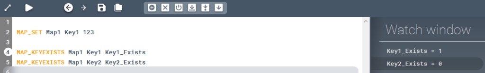

<!-- wp:paragraph -->

Checks whether a key exists in a map or not.

<!-- /wp:paragraph -->

<!-- wp:heading {"level":3} -->

### Syntax

<!-- /wp:heading -->

<!-- wp:paragraph -->

**MAP_KEYEXISTS**

<!-- /wp:paragraph -->

<!-- wp:heading {"level":3} -->

### Command parameters

<!-- /wp:heading -->

<!-- wp:table {"className":"is-style-stripes"} -->

|                                     |                |                  |                   |
| ----------------------------------- | -------------- | ---------------- | ----------------- |
| **Command parameter**               | **Assignment** | **Value format** | **Input options** |
| [Map name](#Map-name)               | Required       | String           | Local, variable   |
| [Key](#Key)                         | Required       | String           | Local, variable   |
| [Output variable](#Output-variable) | Required       | String           | Local, variable   |

<!-- /wp:table -->

<!-- wp:heading {"level":4} -->

#### Map name:

<!-- /wp:heading -->

<!-- wp:paragraph -->

Name of the map.

<!-- /wp:paragraph -->

<!-- wp:heading {"level":4} -->

#### Key:

<!-- /wp:heading -->

<!-- wp:paragraph -->

The string acting as the key.

<!-- /wp:paragraph -->

<!-- wp:heading {"level":4} -->

#### Output variable:

<!-- /wp:heading -->

<!-- wp:paragraph -->

Name of the variable that will contain the output. Output values: "1" or "0".

<!-- /wp:paragraph -->

<!-- wp:heading {"level":3} -->

### Description

<!-- /wp:heading -->

<!-- wp:paragraph -->

Checks whether a key exists in a map or not. If the the specified key exists in the given map, then the output is "1" otherwise its "0".

<!-- /wp:paragraph -->

<!-- wp:heading {"level":3} -->

### Sample code:

<!-- /wp:heading -->

<!-- wp:heading {"level":4} -->

#### Command only:

<!-- /wp:heading -->

<!-- wp:loos-hcb/code-block -->

```
MAP_KEYEXISTS Map1 Key1 Key1_Exists
```

<!-- /wp:loos-hcb/code-block -->

<!-- wp:heading {"level":4} -->

#### Command + key creation + checking:

<!-- /wp:heading -->

<!-- wp:loos-hcb/code-block -->

```
MAP_SET Map1 Key1 123

MAP_KEYEXISTS Map1 Key1 Key1_Exists
MAP_KEYEXISTS Map1 Key2 Key2_Exists
```

<!-- /wp:loos-hcb/code-block -->

<!-- wp:image {"id":23858,"sizeSlug":"large","linkDestination":"none"} -->



<!-- /wp:image -->
