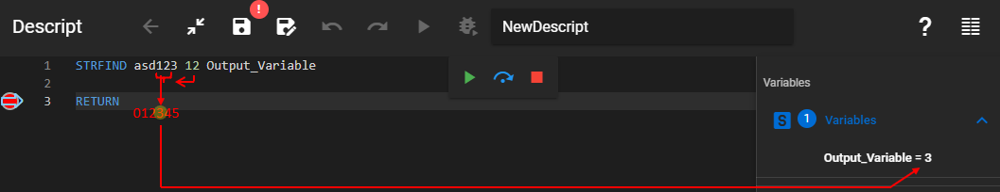

Finds a string within another string.

### Description

Finds a string within another string. If the _String to find_ exists within the _String to search_, then the character number of the first find (starting from 0) will be stored in the output variable. If the _String to find_ does not exists within the _String to search_ then the output value will be "-1".

### Syntax

**STRFIND** [String to search] [String to find] [Output variable]

### Command parameters

| **Command parameter**                 | **Assignment** | **Value format** | **Input options** |
| ------------------------------------- | -------------- | ---------------- | ----------------- |
| [String to search](#string-to-search) | Required       | String           | Local, variable   |
| [String to find](#string-to-find)     | Required       | String           | Local, variable   |
| [Output variable](#output-variable)   | Required       | String           | Local, variable   |

#### String to search:
The string that will be searched.

#### String to find:
The string that will be searched for within the first string.

#### Output variable:
The variable that will store the output.

### Sample code
```
STRFIND asd123 12 Output_Variable
```

[](./img/Strfind_v01.png)
