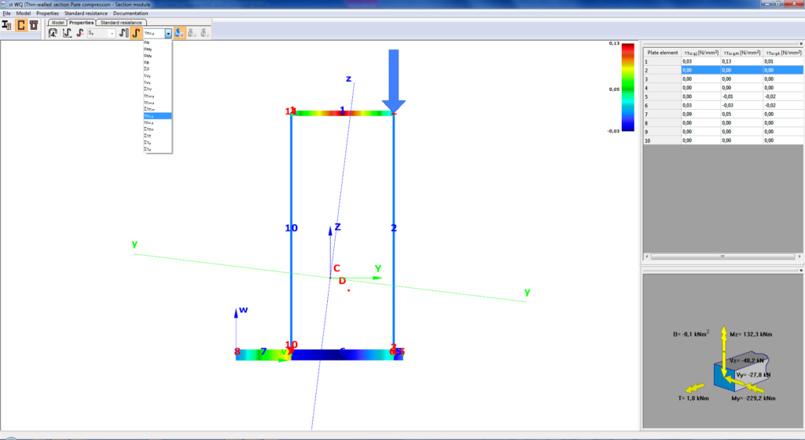

# Szelvénymodellezés

<!-- wp:heading {"level":3} -->

### EPS (Vékonyfalú szelvény) modell

<!-- /wp:heading -->

<!-- wp:image {"align":"center","id":37462,"sizeSlug":"full","linkDestination":"media"} -->

<!-- /wp:image -->

<!-- wp:paragraph {"align":"justify"} -->

A _**Vékonyfalú Szelvénymodell** (Elastic Plate Segment - **EPS**)_ egy vékony lemezszegmensekből előállított egyszerűsítése a szokásos acél szelvényeknek (hegesztett, hengerelt és hidegen hajlított). A modell számításokhoz nagyon egyszerűen és gyorsan használható, illetve vékonyfalú szelvények esetén pontos eredményt ad, a vele párhuzamosan futtatható és használható GSS szelvénymodellel összehasonlítva. A modell által adott általános, csavarási és nyírási tulajdonságok, illetve feszültségek megegyeznek, és ezeken túlmenően megadja a számított statikai nyomatékokat és az EuroCode szerinti szelvényosztályt. Az EPS modell rendkívül alkalmas az összes szabványos tervezési képlet megoldására. 4. keresztmetszeti osztály esetén, pedig a hatékony keresztmetszet automatikusan előállítható az igénybevételek alapján, illetve a szabványos vizsgálatok elvégezhetők az előállított hatékony keresztmetszettel. A Consteel, a hidegen alakított vékonyfalú szelvények esetében, a hatékony keresztmetszet számításánál a torzulásos horpadás (distortional buckling) hatását is automatikusan figyelembe veszi.

<!-- /wp:paragraph -->

<!-- wp:columns {"verticalAlignment":"center","align":"wide"} -->

<!-- wp:column {"verticalAlignment":"center"} -->

<!-- wp:image {"align":"center","id":8471,"width":195,"height":372,"sizeSlug":"large","linkDestination":"media"} -->

<!-- /wp:image -->

<!-- /wp:column -->

<!-- wp:column {"verticalAlignment":"center"} -->

<!-- wp:image {"align":"center","id":8477,"sizeSlug":"large","linkDestination":"media"} -->

<!-- /wp:image -->

<!-- /wp:column -->

<!-- wp:column {"verticalAlignment":"center"} -->

<!-- wp:image {"align":"center","id":8483,"sizeSlug":"large","linkDestination":"media"} -->

<!-- /wp:image -->

<!-- /wp:column -->

<!-- /wp:columns -->

<!-- wp:image {"id":37478,"width":1024,"height":561,"sizeSlug":"large","linkDestination":"media","className":"is-style-editorskit-rounded"} -->

<!-- /wp:image -->

<!-- wp:spacer -->

<!-- /wp:spacer -->

<!-- wp:heading {"level":3} -->

### GSS (Általános szelvény) Modell

<!-- /wp:heading -->

<!-- wp:image {"id":37470,"sizeSlug":"full","linkDestination":"media"} -->

<!-- /wp:image -->

<!-- wp:columns -->

<!-- wp:column {"width":"66.66%"} -->

<!-- wp:paragraph {"align":"justify"} -->

Az _**Általános Szelvénymodell** (General Solid Section_ - _**GSS**)_ tetszőleges szelvények a lehető legpontosabb modellezésére szolgál. A modell a szelvényt háromszögekre bontja és a keresztmetszeti jellemzőket végeselemes módszerrel határozza meg. A szelvény akárhány különböző anyagból összeállítható. A végeselem generálás során a háromszögekre bontás anyagonként elkülönülve történik, a végeselemek mérete pedig az anyagok rugalmas tulajdonságai alapján kerülnek meghatározásra. A szokásos tulajdonságok (keresztmetszeti terület, inercianyomatékok stb.) mellett, a GSS modell pontosan számítja a nyírási és csavarási tulajdonságokat, mint St. Venant, illetve gátolt csavarási inerciát, a nyírási területe stb. Az itt kiszámolt tulajdonságok kerülnek felhasználásra a globális analízisek során. A rugalmas normál, csavarási és nyírási feszültségek ugyancsak számíthatók és megtekinthetők színskálás ábrázolással.

<!-- /wp:paragraph -->

<!-- /wp:column -->

<!-- wp:column {"width":"33.33%"} -->

<!-- wp:image {"id":8502,"sizeSlug":"large","linkDestination":"media"} -->

<!-- /wp:image -->

<!-- /wp:column -->

<!-- /wp:columns -->
