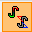

<!-- wp:heading {"level":3} -->

### Geometriai számítások

<!-- /wp:heading -->

<!-- wp:paragraph {"align":"justify"} -->

A keresztmetszet modul 3 fajta koordinátarendszert használ: főtengelyi rendszer (y,z), szerkesztői rendszer (v,w) és a keresztmetszet súlypontjába (C) eltolt szerkesztői rendszer (Y,Z). A keresztmetszet nyírási középpontja a D pont.

<!-- /wp:paragraph -->

<!-- wp:paragraph -->

A szelvénytulajdonságok ezekben a koordinátarendszerekben nézhetők meg.

<!-- /wp:paragraph -->

<!-- wp:spacer -->

<!-- /wp:spacer -->

<!-- wp:heading {"level":3} -->

### Terhek

<!-- /wp:heading -->

<!-- wp:paragraph {"align":"justify"} -->

Ha a keresztmetszet modul közvetlenül a modellből kerül megnyitásra, akkor az összes teherkombináció és a hozzá tartozó keresztmetszeti igénybevétel is automatikusan betöltődik. A mértékadó teherkombináció automatikusan kiválasztásra kerül, de bármely másik teherkombináció kiválasztható a név után található jelölőnégyzettel. További teherkombinációk hozzáadására is van lehetőség az **Új teherkombináció hozzáadása** ikonra  kattintva.

<!-- /wp:paragraph -->

<!-- wp:image {"id":6623,"sizeSlug":"large","linkDestination":"media"} -->

<!-- /wp:image -->

<!-- wp:spacer {"height":"50px","editorskit":{"devices":false,"desktop":true,"tablet":true,"mobile":true,"loggedin":true,"loggedout":true,"acf_visibility":"","acf_field":"","acf_condition":"","acf_value":"","migrated":false,"unit_test":false},"editorskit_typography":{"name":"","family":"","weight":""},"extUtilities":[]} -->

<!-- /wp:spacer -->

<!-- wp:paragraph -->

A **csSection **modul modellből közvetlenül az **Analízis **vagy a **Globális vizsgálatok** fülről érhető el, ha le lett futtatva első vagy másodrendű analízis vagy szabványos vizsgálat. **csSection **modul két féle képen nyitható meg.

<!-- /wp:paragraph -->

<!-- wp:columns -->

<!-- wp:column -->

<!-- wp:paragraph {"align":"justify"} -->

Egyik lehetséges mód, a vizsgálandó szelvényre jobb egér gombbal történő kattintással megjelenő menüből a **Szelvény vizsgálat** opció kiválasztása.

<!-- /wp:paragraph -->

<!-- wp:image {"align":"center","id":37520,"width":252,"height":202,"sizeSlug":"full","linkDestination":"media","className":"is-style-editorskit-rounded"} -->

<!-- /wp:image -->

<!-- /wp:column -->

<!-- wp:column -->

<!-- wp:paragraph {"align":"justify"} -->

A másik mód, az eredmény táblázatban a vizsgálandó elem sorára jobb egér gombbal történő kattintással megjelenő menüből a **Szelvény vizsgálat** opció kiválasztása.

<!-- /wp:paragraph -->

<!-- wp:image {"align":"center","id":37512,"sizeSlug":"full","linkDestination":"media","className":"is-style-editorskit-rounded"} -->

<!-- /wp:image -->

<!-- /wp:column -->

<!-- /wp:columns -->

<!-- wp:spacer -->

<!-- /wp:spacer -->

<!-- wp:heading {"level":3} -->

### Feszültségek

<!-- /wp:heading -->

<!-- wp:paragraph {"align":"justify"} -->

A Tulajdonságok fül Feszültségek . ikonjára kattintva jeleníthetők meg a szelvényben keletkező feszültségek. A feszültségek megtekinthetők EPS és GSS modell esetén is. A feszültségek kétféleképpen ábrázolhatók:

<!-- /wp:paragraph -->

<!-- wp:list -->

-  színezett ábra
-  3D diagram (_csak a 15-ös verziótól_)

<!-- /wp:list -->

<!-- wp:columns -->

<!-- wp:column -->

<!-- wp:image {"id":22552,"sizeSlug":"large","linkDestination":"none"} -->

_Színezett ábra_

<!-- /wp:image -->

<!-- /wp:column -->

<!-- wp:column -->

<!-- wp:image {"id":22558,"sizeSlug":"large","linkDestination":"none"} -->

_3D diagram_

<!-- /wp:image -->

<!-- /wp:column -->

<!-- /wp:columns -->

<!-- wp:paragraph {"align":"justify"} -->

A csSection az alábbi feszültségeket számítja:

<!-- /wp:paragraph -->

<!-- wp:table {"hasFixedLayout":true,"align":"center","className":"is-style-stripes"} -->

| Feszültség jele | Feszültség neve                                          |
| --------------- | -------------------------------------------------------- |
| σN              | Húzási / nyomási normálfeszültség                        |
| σMy             | Nagytengely körüli hajlítási normálfeszültség            |
| σMz             | Kistengely körüli hajlítási normálfeszültség             |
| σB              | Öblösödési normálfeszültség                              |
| Σσ              | Eredő normálfeszültség                                   |
| τVy             | Y irányú nyírásból származó nyírófeszültség              |
| τVz             | Z irányú nyírásból származó nyírófeszültség              |
| ΣτV             | Nyírásból származó eredő nyírófeszültség                 |
| τTsv.y          | St. Venant csavarásból származó Y irányú nyírófeszültség |
| τTsv.z          | St. Venant csavarásból származó Z irányú nyírófeszültség |
| Σ τTsv          | St. Venant csavarásból származó eredő nyírófeszültség    |
| τTω.y           | Öblösödési csavarásból származó Y irányú nyírófeszültség |
| τTω.z           | Öblösödési csavarásból származó Z irányú nyírófeszültség |
| Σ τTω           | Öblösödési csavarásból származó eredő nyírófeszültség    |
| Σ τT            | Eredő csavarási nyírófeszültség                          |
| Σ τy            | Eredő Y irányú csavarási nyírófeszültség                 |
| Σ τz            | Eredő Z irányú csavarási nyírófeszültség                 |
|                 |                                                          |

<!-- /wp:table -->

<!-- wp:spacer -->

<!-- /wp:spacer -->

<!-- wp:heading {"level":3} -->

### Hatékony keresztmetszet

<!-- /wp:heading -->

<!-- wp:paragraph {"align":"justify"} -->

EPS szelvénymodell használata és a ikon bekapcsolása mellett, a 4. osztályú szelvények esetén a hatékony keresztmetszet kerül figyelembevételre.

<!-- /wp:paragraph -->

<!-- wp:image {"align":"center","id":6710,"width":233,"height":233,"sizeSlug":"large","linkDestination":"media"} -->

<!-- /wp:image -->

<!-- wp:spacer -->

<!-- /wp:spacer -->

<!-- wp:heading {"level":3} -->

### Szabványos teherbírás vizsgálat

<!-- /wp:heading -->

<!-- wp:image {"align":"center","id":37504,"width":278,"height":49,"sizeSlug":"full","linkDestination":"media","className":"is-style-editorskit-rounded"} -->

<!-- /wp:image -->

<!-- wp:paragraph {"align":"justify"} -->

A megadott terhelési esetekre a keresztmetszeti modul meghatározza a szükséges és az elvégezhető vizsgálatokat, illetve elvégzi az összes szabványos tervezési vizsgálatokat és kiválasztja a mértékadó esetet.

<!-- /wp:paragraph -->

<!-- wp:heading {"level":4} -->

#### Acél keresztmetszet

<!-- /wp:heading -->

<!-- wp:paragraph {"align":"justify"} -->

Az _EPS_ keresztmetszeti modellen elvégezhető acélszerkezeti tervezési eljárások lefedik szinte a teljes EuroCode 3-as kötetét (teljes EN 1993-1-1, részlet EN 1993-1-5), beleértve az általános rugalmas szilárdsági ellenállás, tiszta igénybevételi ellenállás, képlékeny és konzervatív interakciós ellenállás, nyírási gerinchorpadási ellenállás számítását.

<!-- /wp:paragraph -->

<!-- wp:paragraph -->

Az alábbi tervezési eljárások kerülnek kiszámításra:

<!-- /wp:paragraph -->

<!-- wp:image {"align":"center","id":37532,"sizeSlug":"large","linkDestination":"media","className":"is-style-editorskit-rounded"} -->

<!-- /wp:image -->

<!-- wp:spacer -->

<!-- /wp:spacer -->

<!-- wp:heading {"level":4} -->

#### Öszvér és vasbeton keresztmetszet

<!-- /wp:heading -->

<!-- wp:paragraph {"align":"justify"} -->

Vasalási opcióval nem rendelkező vasbeton keresztmetszet esetén a **csSection **modul csak a teherbírási felületet tudja előállítani. A teherbírási vonal megtekinthető a három koordináta tengely mentén és tetszőleges metszet is készíthető.

<!-- /wp:paragraph -->

<!-- wp:image {"align":"center","id":37496,"width":748,"height":377,"sizeSlug":"full","linkDestination":"media","className":"is-style-editorskit-rounded"} -->

<!-- /wp:image -->

<!-- wp:paragraph -->

Öszvér keresztmetszet esetén, az alábbi tervezési eljárások alapján történik az ellenőrzés:

<!-- /wp:paragraph -->

<!-- wp:image {"align":"center","id":37544,"width":448,"height":373,"sizeSlug":"full","linkDestination":"media","className":"is-style-editorskit-rounded"} -->

<!-- /wp:image -->

<!-- wp:heading {"level":4} -->

#### Eredmények

<!-- /wp:heading -->

<!-- wp:paragraph {"align":"justify"} -->

A tervezési eredmények összefoglalója a jobb oldalon található. A mértékadó eset, vizsgálat és teherkombináció neve kijelzésre kerül.

<!-- /wp:paragraph -->

<!-- wp:image {"align":"center","id":37488,"sizeSlug":"full","linkDestination":"media","className":"is-style-editorskit-rounded"} -->

<!-- /wp:image -->

<!-- wp:spacer -->

<!-- /wp:spacer -->
