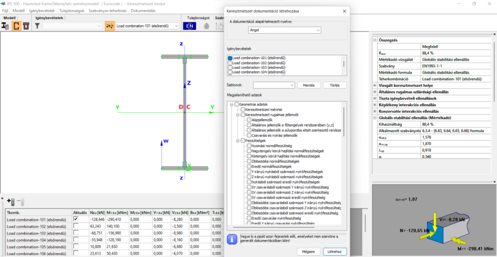

# Dokumentáció

<!-- wp:paragraph {"align":"justify"} -->

Az ellenőrzött keresztmetszetek egyedileg dokumentálhatók. A dokumentáció részletei kiterjedhetnek a szelvény paraméterekre, valamint a geometriai, mechanikai és tervezési eredményekre. Az egyes szelvénydokumentációk a szerkezet fő dokumentációjához csatolhatók.

<!-- /wp:paragraph -->

<!-- wp:paragraph {"align":"justify"} -->

A dokumentáció előállítása a **Dokumentálás** menüparanccsal indítható. A dokumentáció előállításának módja megegyezik a globális szerkezet dokumentálásának módjával (ld. a **_[13. fejezetben](../../category/13_0_documentation-2)_**).

<!-- /wp:paragraph -->

<!-- wp:image {"align":"center","id":37572,"width":768,"height":398,"sizeSlug":"large","linkDestination":"media","className":"is-style-editorskit-rounded"} -->

<!-- /wp:image -->
