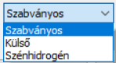
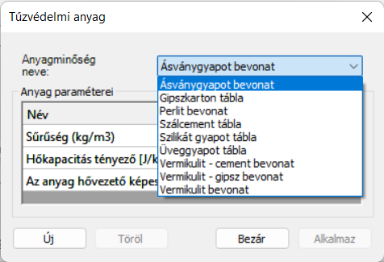
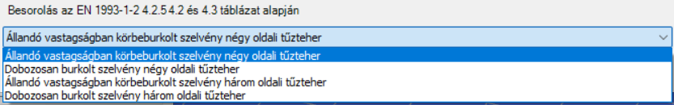

# Tűzhatás és tűzvédelem megadása

<!-- wp:image {"align":"center","id":37644,"width":837,"height":48,"sizeSlug":"full","linkDestination":"media","className":"is-style-editorskit-rounded"} -->

<!-- /wp:image -->

<!-- wp:paragraph {"align":"justify"} -->

A tűzhatás és tűzvédelem megadása a **Terhek **fülön lévő T**űzhatás és tűzvédelem megadása** () ikon segítségével történik, amely az alábbi párbeszédablakot nyitja meg:

<!-- /wp:paragraph -->

<!-- wp:image {"align":"center","id":37652,"width":320,"height":457,"sizeSlug":"full","linkDestination":"media","className":"is-style-editorskit-rounded"} -->

<!-- /wp:image -->

<!-- wp:image {"align":"right","id":37636,"width":111,"height":61,"sizeSlug":"full","linkDestination":"none","className":"is-style-editorskit-rounded"} -->

<!-- /wp:image -->

<!-- wp:paragraph {"align":"justify"} -->

Első lépésként be kell állítani a használt névleges tűzgörbét. Három Eurocode által javasolt tűzgörbe került beépítésre: Szabványos, Külső és Szénhidrogén.

<!-- /wp:paragraph -->

<!-- wp:paragraph -->

Második lépésként meg kell adni az elvárt tűzállósági időt, amelye 15 perc és 200 perc között változhat.

<!-- /wp:paragraph -->

<!-- wp:image {"align":"right","id":37660,"width":643,"height":321,"sizeSlug":"full","linkDestination":"media","className":"is-style-editorskit-rounded"} -->

<!-- /wp:image -->

<!-- wp:paragraph {"align":"justify"} -->

Harmadik lépésként a _Tűzvédelem_ mező mellett található hárompontos  gombra kattintva, különböző tűzvédelem felvételére van lehetőség. A megjelenő dialógon, ha még nincs létrehozva tűzvédelem típus, először az **Új** gombra kattintva lehet egy új védelmet definiálni. Legfelül lehet nevet adni az új definíciónak.

<!-- /wp:paragraph -->

<!-- wp:spacer {"height":"10px"} -->

<!-- /wp:spacer -->

<!-- wp:paragraph {"align":"justify"} -->

Ezután ki kell választani a védelem típusát, amely lehet _védetlen_ vagy _védett_. Védett típus választása esetén a védelem lehet _passzív_ vagy _reaktív_.

<!-- /wp:paragraph -->

<!-- wp:image {"align":"right","id":37676,"width":238,"height":163,"sizeSlug":"full","linkDestination":"none","className":"is-style-editorskit-rounded"} -->

<!-- /wp:image -->

<!-- wp:list -->

- **Passzív védelem**: ebben az esetben meg kell adni a tűzvédő anyag típusát és a szigetelés vastagságát. A típushoz van több előre definiált anyag, illetve a legördülő menü melletti  ikonnal új anyagot is definiálhatunk.

<!-- /wp:list -->

<!-- wp:list -->

- **Reaktív védelem**: ezt kell választani, ha az adott szerkezet(rész) tűzvédelmét tűzvédő festékbevonat fogja biztosítani, és a festék kiválasztásához a kritikus hőmérséklet kiszámítására van szükség.

<!-- /wp:list -->

<!-- wp:image {"align":"left","id":21420,"width":68,"height":72,"sizeSlug":"large","linkDestination":"none"} -->

<!-- /wp:image -->

<!-- wp:paragraph -->

**Figyelem!** Kritikus hőmérséklet számítást csak olyan elemekre lehet kérni, amelyek reaktív védelemmel vannak ellátva!

<!-- /wp:paragraph -->

<!-- wp:spacer {"height":"16px","editorskit":{"devices":false,"desktop":true,"tablet":true,"mobile":true,"loggedin":true,"loggedout":true,"acf_visibility":"","acf_field":"","acf_condition":"","acf_value":"","migrated":false,"unit_test":false},"editorskit_typography":{"name":"","family":"","weight":""},"extUtilities":[]} -->

<!-- /wp:spacer -->

<!-- wp:paragraph {"align":"justify"} -->

Végezetül a párbeszédablak legalsó legördülő mezőjében, bármilyen védett vagy nem védett típushoz meg kell adni a szerkezeti elem EN 1993-1-2 - 4.2.5. / 4.2 és 4.3 táblázat szerinti keresztmetszet besorolását.

<!-- /wp:paragraph -->

<!-- wp:image {"id":37668,"width":625,"height":98,"sizeSlug":"full","linkDestination":"none","className":"is-style-editorskit-rounded"} -->

<!-- /wp:image -->

<!-- wp:paragraph {"align":"justify"} -->

Az **Alkalmaz** gombra kattintva a tűzvédelmi beállítások elmentésre kerülnek. A **Törlés** gombbal törölhető a kiválasztott tűzvédelem. Az **Új** gomb segítségével több egyéb védelem is létrehozható.

<!-- /wp:paragraph -->

<!-- wp:paragraph {"align":"justify"} -->

A tűzhatás intenzitása a keresztmetszet mentén változhat a Ψ1 es Ψ2 szorzótényezők módosításával. Változó intenzitás esetén az EN 1993-1-2 4.2.3.3 (7)-(8) szabvány szerinti tervezési paraméterek is megadhatók.

<!-- /wp:paragraph -->

<!-- wp:paragraph {"align":"justify"} -->

A tűzhatás egyszerű kattintással elhelyezhető a tűzhatásra tervezni kívánt szerkezeti elemeken. Az elhelyezés történhet több rúdra is egyszerre. Ebben az esetben az elemeket előbb ki kell jelölni, és csak a kijelölés után kell megnyitni a **Tűzhatás és tűzvédelem megadása** ablakot.

<!-- /wp:paragraph -->
