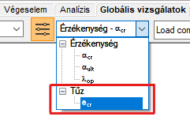
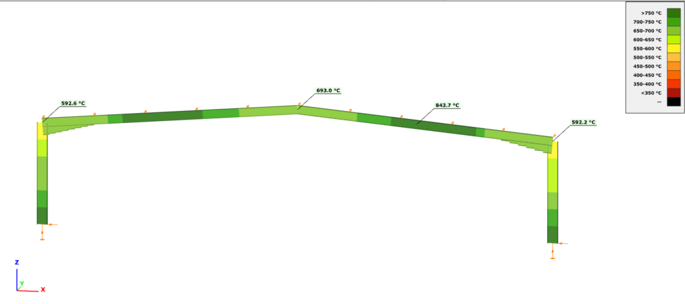

<!-- wp:heading {"level":3} -->

### Tervezés emelt hőmérsékleti anyagjellemzők mellett

<!-- /wp:heading -->

<!-- wp:paragraph {"align":"justify"} -->

Emelt hőmérsékleti analízis esetén a Consteel az EuroCode 3 szabvány vonatkozó formulái szerint ellenőrzi a tűzzel terhelt szerkezeti elemek keresztmetszeteit.

<!-- /wp:paragraph -->

<!-- wp:paragraph -->

\***\*Keresztmetszet osztályozása (EN 1993-1-2 4.2.2)\*\***

<!-- /wp:paragraph -->

<!-- wp:paragraph {"align":"justify"} -->

A keresztmetszetek osztályba sorolása a normál tervezési eljárásoknál alkalmazott szabványrész (EN 1993-1-1) szerint történik, azzal a különbséggel csökkentett ε kerül figyelembevételre.

<!-- /wp:paragraph -->

<!-- wp:paragraph {"editorskit":{"indent":40,"devices":false,"desktop":true,"tablet":true,"mobile":true,"loggedin":true,"loggedout":true,"acf_visibility":"","acf_field":"","acf_condition":"","acf_value":"","migrated":false,"unit_test":false}} -->

$\\varepsilon = 0,85 \\left \[\\dfrac {235} {f_y} \\right ] ^{0,5}$

<!-- /wp:paragraph -->

<!-- wp:paragraph -->

\***\*Húzás (EN 1993-1-2 4.2.3.1)\*\***

<!-- /wp:paragraph -->

<!-- wp:paragraph {"editorskit":{"indent":20,"devices":false,"desktop":true,"tablet":true,"mobile":true,"loggedin":true,"loggedout":true,"acf_visibility":"","acf_field":"","acf_condition":"","acf_value":"","migrated":false,"unit_test":false}} -->

Állandó hőmérséklet ((1))

<!-- /wp:paragraph -->

<!-- wp:paragraph {"editorskit":{"indent":40,"devices":false,"desktop":true,"tablet":true,"mobile":true,"loggedin":true,"loggedout":true,"acf_visibility":"","acf_field":"","acf_condition":"","acf_value":"","migrated":false,"unit_test":false}} -->

$N\_{t,fi,\\Theta,Rd} = k\_{y,\\Theta}\\cdot \\left \[\\dfrac {\\gamma\_{M,0}} {\\gamma\_{M,fi}} \\right ]\\cdot N\_{pl,Rd}\\qquad \\qquad$ (1-4. osztály)

Ahol

<!-- /wp:paragraph -->

<!-- wp:paragraph {"editorskit":{"indent":40,"devices":false,"desktop":true,"tablet":true,"mobile":true,"loggedin":true,"loggedout":true,"acf_visibility":"","acf_field":"","acf_condition":"","acf_value":"","migrated":false,"unit_test":false}} -->

$k\_{y,\\Theta}\\qquad \\qquad$ értékeit a 3.1 táblázat tartalmazza  
$N\_{pl,Rd}\\qquad \\qquad$ tűzhatás nélküli esetben

<!-- /wp:paragraph -->

<!-- wp:paragraph {"editorskit":{"indent":20,"devices":false,"desktop":true,"tablet":true,"mobile":true,"loggedin":true,"loggedout":true,"acf_visibility":"","acf_field":"","acf_condition":"","acf_value":"","migrated":false,"unit_test":false}} -->

Változó hőmérséklet ((2))

<!-- /wp:paragraph -->

<!-- wp:paragraph {"editorskit":{"indent":40,"devices":false,"desktop":true,"tablet":true,"mobile":true,"loggedin":true,"loggedout":true,"acf_visibility":"","acf_field":"","acf_condition":"","acf_value":"","migrated":false,"unit_test":false}} -->

$N\_{t,fi,t,Rd} = A\_{non,t}\\cdot \\dfrac {f_y} {\\gamma\_{M,fi}}\\qquad \\qquad$ (1-4. osztály)

<!-- /wp:paragraph -->

<!-- wp:paragraph -->

\***\*Nyomás (1-3. osztály: EN 1993-1-2 4.2.3.2, 4. osztály: + E.2 melléklet)\*\***

<!-- /wp:paragraph -->

<!-- wp:paragraph {"editorskit":{"indent":20,"devices":false,"desktop":true,"tablet":true,"mobile":true,"loggedin":true,"loggedout":true,"acf_visibility":"","acf_field":"","acf_condition":"","acf_value":"","migrated":false,"unit_test":false}} -->

Állandó hőmérséklet ((1))

<!-- /wp:paragraph -->

<!-- wp:paragraph {"editorskit":{"indent":40,"devices":false,"desktop":true,"tablet":true,"mobile":true,"loggedin":true,"loggedout":true,"acf_visibility":"","acf_field":"","acf_condition":"","acf_value":"","migrated":false,"unit_test":false}} -->

$N\_{c,fi,t,Rd} = A\\cdot \\dfrac {k\_{y,\\Theta}\\cdot f_y} {\\gamma\_{M,fi}}\\qquad \\qquad$ (1-3. osztály)

$N\_{c,fi,t,Rd} = A\_{eff}\\cdot \\dfrac {k\_{p0,2,\\Theta}\\cdot f_y} {\\gamma\_{M,fi}}\\qquad \\qquad$ (4. osztály)

Ahol  
$k\_{p0,2,\\Theta}\\qquad \\qquad$ értékeit a 3.1 táblázat tartalmazza

<!-- /wp:paragraph -->

<!-- wp:paragraph {"editorskit":{"indent":20,"devices":false,"desktop":true,"tablet":true,"mobile":true,"loggedin":true,"loggedout":true,"acf_visibility":"","acf_field":"","acf_condition":"","acf_value":"","migrated":false,"unit_test":false}} -->

Változó hőmérséklet ((6))

<!-- /wp:paragraph -->

<!-- wp:paragraph {"editorskit":{"indent":40,"devices":false,"desktop":true,"tablet":true,"mobile":true,"loggedin":true,"loggedout":true,"acf_visibility":"","acf_field":"","acf_condition":"","acf_value":"","migrated":false,"unit_test":false}} -->

Konzervatív módszer, (1) eset, ahol $\\Theta_a = \\Theta\_{a,max}$

<!-- /wp:paragraph -->

<!-- wp:paragraph -->

\***\*Hajlítás (EN 1993-1-2 1-2. osztály: 4.2.3.3; 3. osztály: 4.2.3.4; 4. osztály: + E.2 melléklet)\*\***

<!-- /wp:paragraph -->

<!-- wp:paragraph {"editorskit":{"indent":20,"devices":false,"desktop":true,"tablet":true,"mobile":true,"loggedin":true,"loggedout":true,"acf_visibility":"","acf_field":"","acf_condition":"","acf_value":"","migrated":false,"unit_test":false}} -->

Állandó hőmérséklet ((1))

<!-- /wp:paragraph -->

<!-- wp:paragraph {"editorskit":{"indent":40,"devices":false,"desktop":true,"tablet":true,"mobile":true,"loggedin":true,"loggedout":true,"acf_visibility":"","acf_field":"","acf_condition":"","acf_value":"","migrated":false,"unit_test":false}} -->

$M\_{fi,\\Theta ,Rd} = k\_{y,\\Theta}\\cdot \\dfrac {\\gamma\_{M,0}} {\\gamma\_{M,fi}}\\cdot M\_{Rd}\\qquad $

Ahol  
$M\_{Rd}=M\_{pl.Rd}\\qquad $ , nyírás esetén: $M\_{Rd}=M\_{V.Rd}\\qquad \\qquad $ (1-2. osztály)  
$M\_{Rd}=M\_{el.Rd}\\qquad $ , nyírás esetén: $M\_{Rd}=M\_{V.Rd}\\qquad \\qquad $ (3. osztály)  
$M\_{Rd}=M\_{eff.Rd}\\qquad \\qquad \\qquad \\qquad \\qquad \\qquad \\qquad \\qquad $ (4. osztály)  
$k\_{y,\\Theta}\\qquad \\qquad \\qquad \\qquad $ értékeit a 3.1 táblázat tartalmazza

<!-- /wp:paragraph -->

<!-- wp:paragraph {"editorskit":{"indent":20,"devices":false,"desktop":true,"tablet":true,"mobile":true,"loggedin":true,"loggedout":true,"acf_visibility":"","acf_field":"","acf_condition":"","acf_value":"","migrated":false,"unit_test":false}} -->

Változó hőmérséklet ((2))

<!-- /wp:paragraph -->

<!-- wp:paragraph {"editorskit":{"indent":40,"devices":false,"desktop":true,"tablet":true,"mobile":true,"loggedin":true,"loggedout":true,"acf_visibility":"","acf_field":"","acf_condition":"","acf_value":"","migrated":false,"unit_test":false}} -->

$M\_{fi,t,Rd} = W\_{pl,non,t}\\cdot \\dfrac {f_y} {\\gamma\_{M,fi}}\\qquad \\qquad \\qquad \\qquad $ (1-2. osztály)  
$M\_{fi,t,Rd} = k\_{y,\\Theta ,max}\\cdot \\dfrac {\\gamma\_{M,0}} {\\gamma\_{M,fi}}\\cdot \\dfrac {1} {\\kappa_1\\cdot \\kappa_2}\\qquad \\qquad \\qquad $ (3. osztály)  
$M\_{fi,t,Rd} = k\_{p0,2,\\Theta ,max}\\cdot \\dfrac {\\gamma\_{M,0}} {\\gamma\_{M,fi}}\\cdot \\dfrac {1} {\\kappa_1\\cdot \\kappa_2}\\cdot M\_{eff,Rd}\\qquad \\qquad $ (4. osztály)

<!-- /wp:paragraph -->

<!-- wp:paragraph -->

\***\*Nyírás (EN 1993-1-2 1-2. osztály: 4.2.3.3(6); 3. osztály: 4.2.3.4(4); 4. osztály: + E.2 melléklet)\*\***

<!-- /wp:paragraph -->

<!-- wp:paragraph {"editorskit":{"indent":20,"devices":false,"desktop":true,"tablet":true,"mobile":true,"loggedin":true,"loggedout":true,"acf_visibility":"","acf_field":"","acf_condition":"","acf_value":"","migrated":false,"unit_test":false}} -->

Állandó hőmérséklet

<!-- /wp:paragraph -->

<!-- wp:paragraph {"editorskit":{"indent":40,"devices":false,"desktop":true,"tablet":true,"mobile":true,"loggedin":true,"loggedout":true,"acf_visibility":"","acf_field":"","acf_condition":"","acf_value":"","migrated":false,"unit_test":false}} -->

$V\_{fi,t,Rd} = k\_{y,\\Theta ,web}\\cdot \\dfrac {\\gamma\_{M,0}} {\\gamma\_{M,fi}}\\cdot V\_{Rd}\\qquad \\qquad $ (1-4. osztályokra)

<!-- /wp:paragraph -->

<!-- wp:paragraph {"editorskit":{"indent":20,"devices":false,"desktop":true,"tablet":true,"mobile":true,"loggedin":true,"loggedout":true,"acf_visibility":"","acf_field":"","acf_condition":"","acf_value":"","migrated":false,"unit_test":false}} -->

Változó hőmérséklet

<!-- /wp:paragraph -->

<!-- wp:paragraph {"editorskit":{"indent":40,"devices":false,"desktop":true,"tablet":true,"mobile":true,"loggedin":true,"loggedout":true,"acf_visibility":"","acf_field":"","acf_condition":"","acf_value":"","migrated":false,"unit_test":false}} -->

$k\_{y,\\Theta ,web}\\qquad \\qquad $ az öv legmelegebb pontja

<!-- /wp:paragraph -->

<!-- wp:paragraph -->

\***\*Összetett belső erők esetén a _Consteel_ a konzervatív interakciós képletet használja, és a nyírást figyelmen kívül hagyja:\*\***

<!-- /wp:paragraph -->

<!-- wp:paragraph {"editorskit":{"indent":40,"devices":false,"desktop":true,"tablet":true,"mobile":true,"loggedin":true,"loggedout":true,"acf_visibility":"","acf_field":"","acf_condition":"","acf_value":"","migrated":false,"unit_test":false}} -->

$\\dfrac {N\_{fi,Ed}} {N\_{fi,\\Theta ,Ed}}+\\dfrac {M\_{y,fi,Ed}} {M\_{y,fi,\\Theta ,Ed}}+\\dfrac {M\_{z,fi,Ed}} {M\_{z,fi,\\Theta ,Ed}}\\leq 1\\qquad \\qquad $

<!-- /wp:paragraph -->

<!-- wp:paragraph -->

\***\*Globális stabilitási ellenállás:\*\***

<!-- /wp:paragraph -->

<!-- wp:paragraph {"align":"justify"} -->

A stabilitási ellenállás számításra a Consteel az EuroCode általános módszerét (EN 1993-1-1 6.3.4) használja, megfelelően az általános tervezési szituációhoz, de természetesen a megfelelő, tűz tervezési szituációban használandó kihajlási görbék felhasználásával.

<!-- /wp:paragraph -->

<!-- wp:paragraph {"editorskit":{"indent":40,"devices":false,"desktop":true,"tablet":true,"mobile":true,"loggedin":true,"loggedout":true,"acf_visibility":"","acf_field":"","acf_condition":"","acf_value":"","migrated":false,"unit_test":false}} -->

Nyomás

<!-- /wp:paragraph -->

<!-- wp:paragraph {"editorskit":{"indent":40,"devices":false,"desktop":true,"tablet":true,"mobile":true,"loggedin":true,"loggedout":true,"acf_visibility":"","acf_field":"","acf_condition":"","acf_value":"","migrated":false,"unit_test":false}} -->

$\\chi \_{fi}=\\dfrac {1}{\\varphi\_{\\Theta}+\\sqrt{\\varphi\_{\\Theta}^2-\\bar{\\lambda}\_{\\Theta}^2}}$

<!-- /wp:paragraph -->

<!-- wp:paragraph {"editorskit":{"indent":40,"devices":false,"desktop":true,"tablet":true,"mobile":true,"loggedin":true,"loggedout":true,"acf_visibility":"","acf_field":"","acf_condition":"","acf_value":"","migrated":false,"unit_test":false}} -->

Hajlítás

<!-- /wp:paragraph -->

<!-- wp:paragraph {"editorskit":{"indent":40,"devices":false,"desktop":true,"tablet":true,"mobile":true,"loggedin":true,"loggedout":true,"acf_visibility":"","acf_field":"","acf_condition":"","acf_value":"","migrated":false,"unit_test":false}} -->

$\\chi \_{LT,fi}=\\dfrac {1}{\\phi\_{LT,\\Theta ,com}+\\sqrt{\\phi\_{LT,\\Theta ,com}^2-\\bar{\\lambda}\_{LT,\\Theta ,com}^2}}$

<!-- /wp:paragraph -->

<!-- wp:heading {"level":3} -->

### Kritikus hőmérséklet

<!-- /wp:heading -->

<!-- wp:paragraph {"align":"justify"} -->

A kritikus hőmérséklet számítását a tervezés beállításai ablakban lehet aktiválni, amennyiben teljesülnek az alábbi feltételek:

<!-- /wp:paragraph -->

<!-- wp:list {"type":"a"} -->

- van legalább egy, reaktív tűzvédelemmel ellátott elem a modellben
- van legalább egy, szobahőmérsékleti anyagjellemzőkre beállított tűzterhelési eset
- van legalább egy, tűzterhelési esetet tartalmazó teherkombináció kiválasztva a globális vizsgálathoz

<!-- /wp:list -->

<!-- wp:image {"align":"center","id":37690,"sizeSlug":"full","linkDestination":"media","className":"is-style-editorskit-rounded"} -->

<!-- /wp:image -->

<!-- wp:image {"align":"right","id":37706,"width":181,"height":111,"sizeSlug":"full","linkDestination":"none","className":"is-style-editorskit-rounded"} -->

<!-- /wp:image -->

<!-- wp:paragraph {"align":"justify"} -->

A számítás eredményeit a tervezési paraméterek legördülő menüben lehet lekérdezni. Az eredmények színezett grafikus ábrán jelennek meg. Egy adott szelvényen jobb egérkattintásra innen is megnyitható a szelvény modul, ahol a kritikus hőmérséklet számításának részletei megtalálhatók. Az összegzés első sorában szerepel, hogy a szelvényt kell-e tűzvédő festéssel védeni vagy sem, a kritikus hőmérséklet mezőben pedig megtalálható a vonatkozó szabványrészlet, az alkalmazott tűzgörbe, a szelvény védelem nélküli tűzállósági ideje és tűzhatásra elért hőmérséklete, valamint a megkívánt tűzállósági idő

<!-- /wp:paragraph -->

<!-- wp:image {"align":"center","id":9408,"width":822,"height":365,"sizeSlug":"large","linkDestination":"media"} -->

<!-- /wp:image -->

<!-- wp:image {"align":"center","id":37698,"width":613,"height":504,"sizeSlug":"full","linkDestination":"media","className":"is-style-editorskit-rounded"} -->

<!-- /wp:image -->

<!-- wp:paragraph -->

<!-- /wp:paragraph -->
