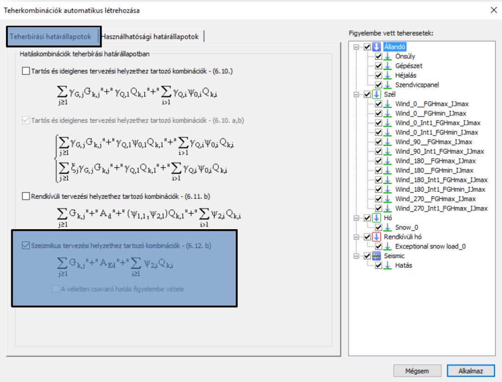
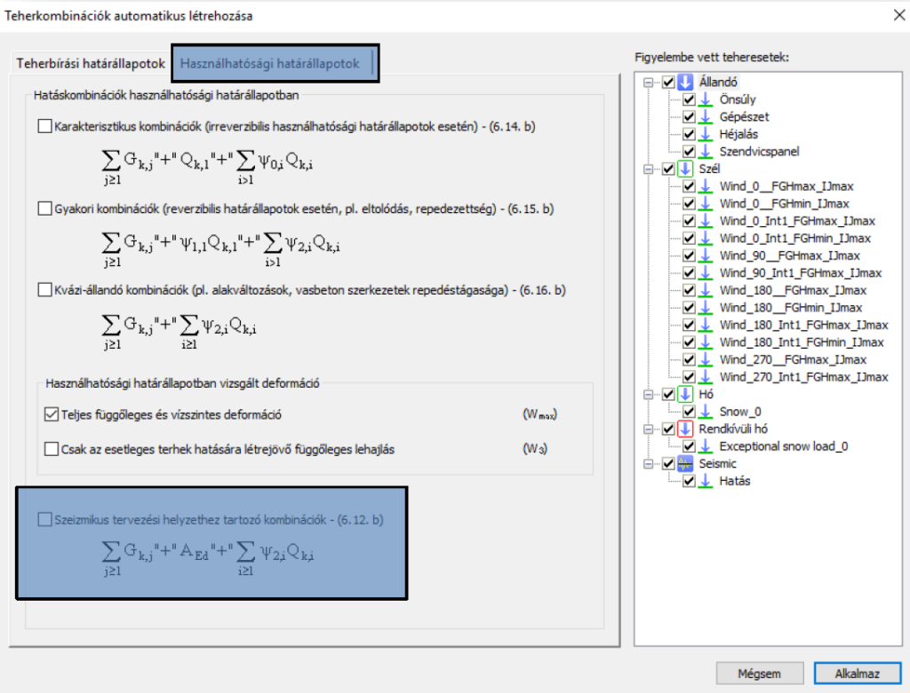

# Szeizmikus tehercsoportok és teherkombinációk
---
<!-- wp:heading {"level":3} -->

### Szeizmikus tehercsoportok és teheresetek

<!-- /wp:heading -->

<!-- wp:paragraph {"align":"justify"} -->

Visszalépve a **Teheresetek és tehercsoportok** dialógra, megadható a földrengés tehercsoport és tehereset. Az ablakon kiválasztva a **Szeizmikus** tehercsoportot, automatikusan betöltődik teheresetként az előzőleg létrehozott szeizmikus hatás.

<!-- /wp:paragraph -->

<!-- wp:image {"align":"center","id":37794,"width":443,"height":489,"sizeSlug":"full","linkDestination":"media","className":"is-style-editorskit-rounded"} -->

<!-- /wp:image -->

<!-- wp:paragraph -->

Abban az esetben, ha a számítási eljárás során a **Kiválasztott modális alakok lineáris összegzését** választjuk, megjelenik a **Teheresetek és tehercsoportok** dialógon egy új parancs, mely a **Modális hatások lineáris kombinációja** (#1) nevet kapta. A parancsra kattintva megnyílik a táblázat, mely tartalmazza az egyes kiszámolt rezgésalakokhoz tartozó irányonkénti tömegrészesedést. A kombinációs faktorok manuális megadásával megadhatjuk, hogy egy adott rezgésalak adott irányába mekkora tömegrészesedést veszünk figyelembe a számított tömegrészesedésből.  
Itt fontos megjegyezni azt, hogy alapértelmezett állapotban mind a 3 irányhoz tartozó kombinációs faktor oszlopaihoz tartozó cellák üresen állnak. Abban az esetben, ha a cellákat üresen hagyjuk, tehát nem adjuk meg manuálisan, hogy a számított tömegrészesdésekből mennyit veszünk figyelembe a számítás során, akkor a szoftver a **Domináns modális alak** eljárás alapján számítja a földrengés hatást.

<!-- /wp:paragraph -->

<!-- wp:columns -->

<!-- wp:column -->

<!-- wp:image {"align":"center","id":37786,"sizeSlug":"full","linkDestination":"media","className":"is-style-editorskit-rounded"} -->

<!-- /wp:image -->

<!-- /wp:column -->

<!-- wp:column -->

<!-- wp:image {"align":"center","id":37778,"sizeSlug":"full","linkDestination":"media","className":"is-style-editorskit-rounded"} -->

<!-- /wp:image -->

<!-- /wp:column -->

<!-- /wp:columns -->

<!-- wp:heading {"level":3} -->

### Szeizmikus tervezési helyzethez tartozó kombinációk

<!-- /wp:heading -->

<!-- wp:paragraph {"align":"justify"} -->

A **Teherkombinációk automatikus létrehozása** dialógon kiválasztva a szeizmikus tervezési helyzethez tartozó kombinációkat, a szoftver automatikusan létrehozza a földrengés hatás figyelembevételével a teherbírási és használhatósági határállapotokhoz tartozó teherkombinációkat.

<!-- /wp:paragraph -->

<!-- wp:columns -->

<!-- wp:column -->

<!-- wp:image {"align":"center","id":37770,"sizeSlug":"large","linkDestination":"media","className":"is-style-editorskit-rounded"} -->

<!-- /wp:image -->

<!-- /wp:column -->

<!-- wp:column -->

<!-- wp:image {"align":"center","id":37762,"sizeSlug":"large","linkDestination":"media","className":"is-style-editorskit-rounded"} -->

<!-- /wp:image -->

<!-- /wp:column -->

<!-- /wp:columns -->

<!-- wp:paragraph -->

<!-- /wp:paragraph -->
