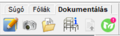
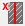
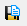
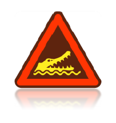
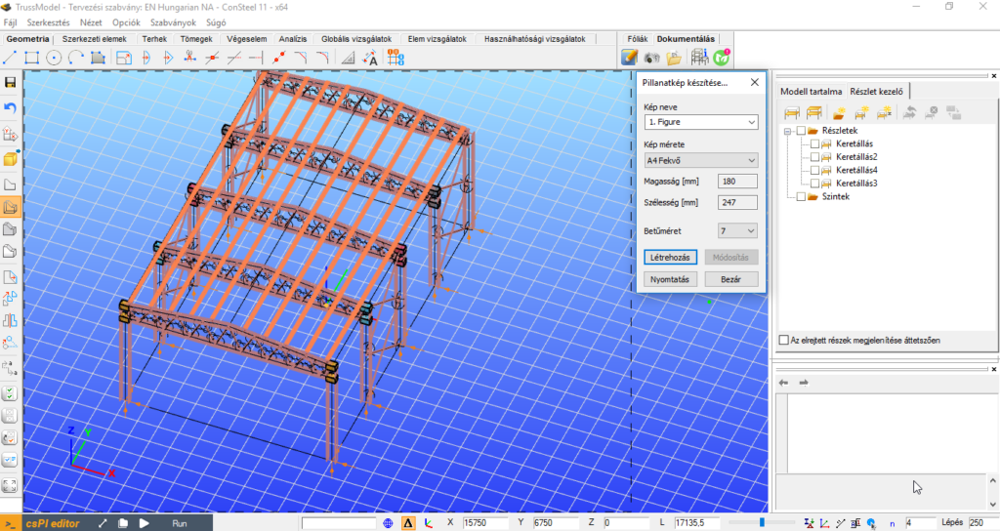
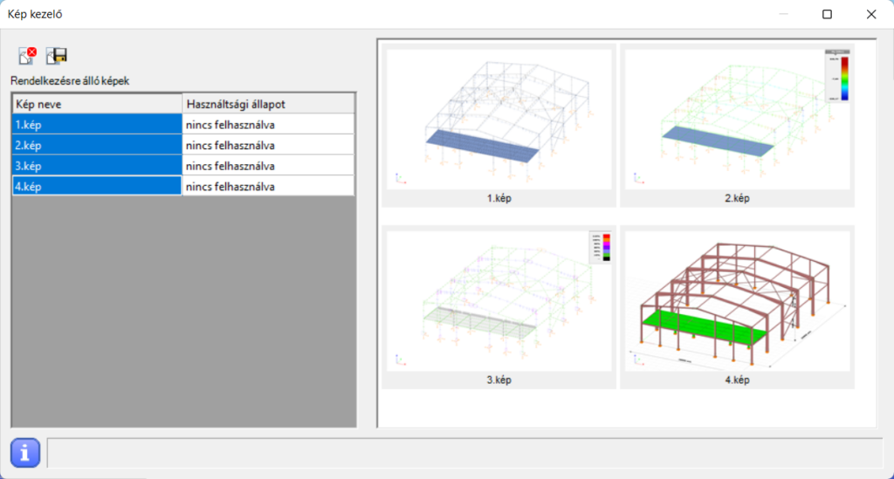
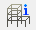
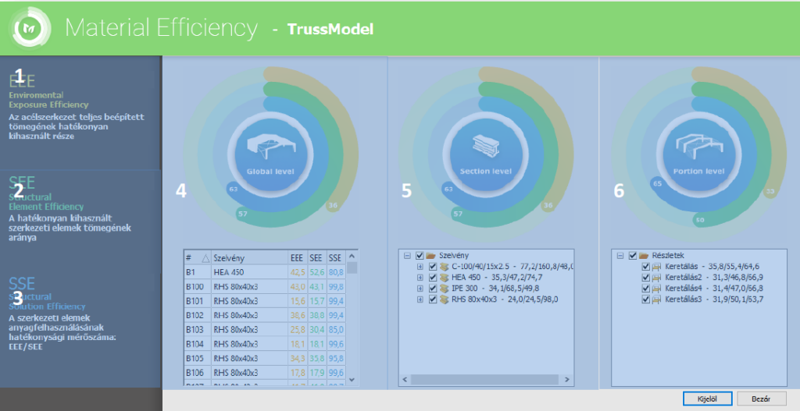
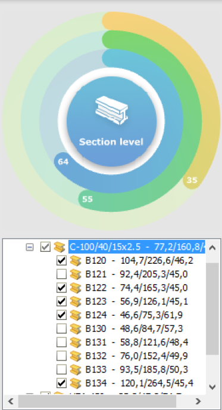
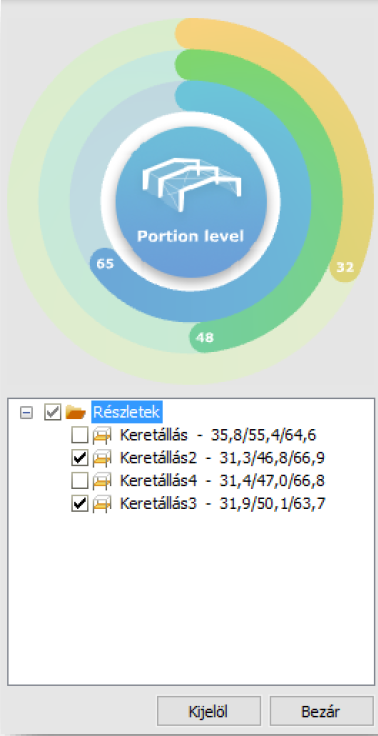

# Dokumentálás fül

<!-- wp:paragraph {"align":"center"} -->

**Consteel 17**

<!-- /wp:paragraph -->

<!-- wp:image {"align":"center","id":72015,"width":"170px","height":"auto","sizeSlug":"full","linkDestination":"none"} -->

<!-- /wp:image -->

<!-- wp:paragraph {"align":"center"} -->

**Consteel 16**

<!-- /wp:paragraph -->

<!-- wp:paragraph -->

<!-- /wp:paragraph -->

<!-- wp:image {"align":"center","id":37946,"width":167,"height":50,"sizeSlug":"full","linkDestination":"media","className":"is-style-editorskit-rounded"} -->

<!-- /wp:image -->

<!-- wp:heading {"level":3} -->

### Dokumentáció létrehozása

<!-- /wp:heading -->

<!-- wp:image {"align":"right","id":37938,"width":333,"height":249,"sizeSlug":"full","linkDestination":"media","className":"is-style-editorskit-rounded"} -->

<!-- /wp:image -->

<!-- wp:paragraph {"align":"justify"} -->

A dokumentáció készítés összes ikonja a **Dokumentálás** fülön található. Az első parancsikonnal  hozható létre új dokumentáció. A dokumentációvarázsló végigvezeti a felhasználót a dokumentációkészítés folyamatán. Az első ablakban meg kell adni a dokumentáció nevét. Ez a név a dokumentáció minden oldalán megjelenik. A többi mező tartalma, mint a projekt neve, tervező neve, készítés dátuma csak a dokumentáció előlapján jelenik meg. Itt adható meg a dokumentálás nyelve is, ami a későbbiekben bármikor megváltoztatható.

<!-- /wp:paragraph -->

<!-- wp:paragraph -->

A dokumentáció fejlécében és láblécében található képek testre szabhatók, ezáltal saját céglogó is elhelyezhető. Ehhez a fejlécben és láblécben található képeket kell kicserélni a saját logóra. Ezek a fájlok a _Consteel_ telepítési mappájában találhatók; alapesetben az alábbi helyen: C:\\Program Files\\Consteelversion\\Pic. A fejléc “Header_pic.png”, illetve a lábléc “Footer_pic.png” képeket lehet lecserélni a saját logóra. Ügyelni kell, hogy az új képek formátuma **.png** legyen!

<!-- /wp:paragraph -->

<!-- wp:image {"align":"right","id":37922,"width":337,"height":563,"sizeSlug":"full","linkDestination":"media","className":"is-style-editorskit-rounded"} -->

<!-- /wp:image -->

<!-- wp:image {"align":"right","id":37930,"width":198,"height":148,"sizeSlug":"full","linkDestination":"media","className":"is-style-editorskit-rounded"} -->

<!-- /wp:image -->

<!-- wp:paragraph -->

A második lépés a dokumentálandó analízis típusának kiválasztása. Bármely lefuttatott analízistípus eredményei dokumentálhatók.

<!-- /wp:paragraph -->

<!-- wp:paragraph {"align":"justify"} -->

A harmadik lépés a dokumentációs fejezetek hozzáadása vagy eltávolítása.

<!-- /wp:paragraph -->

<!-- wp:paragraph {"align":"justify"} -->

Tervezési határállapot dokumentálásához kihasználtsági határérték adható meg a dialóg alján. Ezáltal csak azon szerkezeti elemek kerülnek bele a dokumentumba, amelyek kihasználtsága legalább a megadott kihasználtsági értéket eléri. Külön-külön adható meg kihasználtsági érték az összefoglaló és a részletes dokumentációkhoz.

<!-- /wp:paragraph -->

<!-- wp:paragraph {"align":"justify"} -->

A dokumentáció készítőben létrehozhatók dokumentáció sablonok is a **Mentés** gomb segítségével. Sablonként elmenthetők a legtöbbet használt dokumentációs struktúrák, amelyeknek köszönhetően a jövőben egy kattintással hozhatjuk létre ugyanazokat a dokumentációkat.

<!-- /wp:paragraph -->

<!-- wp:paragraph {"align":"justify"} -->

A **Létrehozás** gombra kattintva a program elkészíti a dokumentációt.

<!-- /wp:paragraph -->

<!-- wp:spacer -->

<!-- /wp:spacer -->

<!-- wp:heading {"level":4,"className":""} -->

#### Dokumentáció modul

<!-- /wp:heading -->

<!-- wp:image {"align":"right","id":37914,"width":313,"height":295,"sizeSlug":"full","linkDestination":"media","className":"is-style-editorskit-rounded"} -->

<!-- /wp:image -->

<!-- wp:paragraph {"align":"justify"} -->

Az elkészült dokumentáció egy új ablakban nyílik meg. Az ablak jobb felső részében láthatók a fejezetek. A fejezetek a drag-and-drop funkcióval felfelé vagy lefelé mozgathatók. A harmadik ikonra (#2) kattintva lehetőség van tartalmak törlésére is a dokumentumból.

<!-- /wp:paragraph -->

<!-- wp:paragraph {"align":"justify"} -->

A negyedik ikon (#3) segítségével tetszőleges szöveget lehet beilleszteni a dokumentum bármely pontjára. Lehetőség van címsorok beszúrására is az ötödik ikonra (#4) kattintva, a hatodik ikonnal (#5) pedig oldaltörések is beilleszthetők bárhová a dokumentumban. Az utolsó három ikonnal a következő műveleteket lehet elvégezni: címsor átnevezése, címsor szintjének növelése vagy csökkentése.

<!-- /wp:paragraph -->

<!-- wp:paragraph {"align":"justify"} -->

Az utolsó kettő ikon annak megfelelően változik, hogy címsor, vagy táblázat, vagy szöveget tartalmazó paragrafus került-e kiválasztásra. Táblázatot tartalmazó paragrafus választása esetén, a megjelenő ikon  segítségével oszlopok törölhetők ki a táblázatból. Szöveget tartalmazó paragrafus választása esetén, pedig a megjelenő két ikon segítségével a szöveg tartalma és igazítása adható meg.

<!-- /wp:paragraph -->

<!-- wp:columns -->

<!-- wp:column -->

<!-- wp:paragraph -->

Az első két ikonnal (#1) a lap megjelenítése állítható be. A dokumentáció lapja igazítható a szélessége vagy a magassága  szerint.

<!-- /wp:paragraph -->

<!-- /wp:column -->

<!-- wp:column -->

<!-- wp:image {"align":"center","id":37906,"width":263,"height":313,"sizeSlug":"full","linkDestination":"media","className":"is-style-editorskit-rounded"} -->

<!-- /wp:image -->

<!-- /wp:column -->

<!-- /wp:columns -->

<!-- wp:columns -->

<!-- wp:column -->

<!-- wp:paragraph {"align":"justify"} -->

A **Képek** fülre kattintva megjelennek a képkezelő ikonok. Segítségükkel a korábban készített [_pillanatképek_ ](/manual/dokumentacio/dokumentalas-ful/#Creating-snapshots)bármelyike beilleszthető a dokumentumba, vagy törölhető onnan. A kép a kiválasztott paragrafus után kerül elhelyezésre.

<!-- /wp:paragraph -->

<!-- /wp:column -->

<!-- wp:column -->

<!-- wp:image {"align":"center","id":37898,"sizeSlug":"full","linkDestination":"media","className":"is-style-editorskit-rounded"} -->

<!-- /wp:image -->

<!-- /wp:column -->

<!-- /wp:columns -->

<!-- wp:paragraph -->

A harmadik fül a **Táblázatok** fül. A _Consteel_ programban számos táblázattípus menthető a dokumentumba való beillesztés céljából. Az analízis és a tervezés folyamán az eredménytáblázatok mellet megjelenő  ikon segítségével a táblázatok elmenthetők a dokumentáláshoz. Minden dokumentálás céljából előzetesen elmentett táblázat beszúrható a dokumentációba, vagy törölhető a modell adatbázisából. A táblázat a kiválasztott paragrafus után kerül elhelyezésre.

<!-- /wp:paragraph -->

<!-- wp:paragraph -->

Az utolsó fül a **Mellékletek** fül. Ha van már létrehozott csomóponti vagy keresztmetszeti dokumentáció a modellben, akkor ezek a dokumentációk mellékletként beszúrhatók a statikai dokumentáció végére. Melléklet szintén törölhető a modell adatbázisából.

<!-- /wp:paragraph -->

<!-- wp:image {"align":"left","id":21420,"width":76,"height":81,"sizeSlug":"full","linkDestination":"none"} -->

<!-- /wp:image -->

<!-- wp:paragraph -->

A modellben történt változtatások esetén, a dokumentációkat újra kell generálni. Ha pillanatképeket is tartalmazott a dokumentáció, akkor változás esetén ezeket a képeket is újra el kell készíteni, és az új dokumentációba ismét be kell illeszteni.

<!-- /wp:paragraph -->

<!-- wp:spacer {"height":"25px"} -->

<!-- /wp:spacer -->

<!-- wp:heading {"level":3} -->

### Pillanatkép készítése

<!-- /wp:heading -->

<!-- wp:image {"align":"right","id":37890,"width":128,"height":221,"sizeSlug":"full","linkDestination":"media","className":"is-style-editorskit-rounded"} -->

<!-- /wp:image -->

<!-- wp:paragraph -->

A **Dokumentálás** fül második ikonja  segítségével a modellről pillanatképek rögzíthetők. Ezeket a képeket egyszerűen hozzáadhatjuk a dokumentáció megfelelő részéhez (lásd a **_[Dokumentáció modul](/manual/dokumentacio/dokumentalas-ful/#Documentation-module)_** c. fejezetben). A Nyomtatás segítségével az aktuális képernyőnézet kinyomtatható.

<!-- /wp:paragraph -->

<!-- wp:paragraph -->

A pillanatkép méretének beállítása után, egy szaggatott vonalú négyszög mutatja a modell fényképezendő részét. Mozgatással és forgatással hozzáilleszthetjük a modellt a négyszöghöz.

<!-- /wp:paragraph -->

<!-- wp:paragraph -->

A **Nyomtatás** gomb segítségével a modell aktuális nézete közvetlenül ebből a párbeszédablakból is kinyomtatható.

<!-- /wp:paragraph -->

<!-- wp:image {"align":"center","id":37882,"width":768,"height":408,"sizeSlug":"large","linkDestination":"media","className":"is-style-editorskit-rounded"} -->

<!-- /wp:image -->

<!-- wp:heading {"level":3} -->

### Ábrák kezelése

<!-- /wp:heading -->

<!-- wp:columns -->

<!-- wp:column -->

<!-- wp:paragraph {"align":"justify"} -->

A harmadik ikon  az ábrák kezelését teszi lehetővé. A készített felvételeket fájlba exportálhatjuk, vagy törölhetjük a modellből a modellméret csökkentése érdekében (kivéve, ha a képet már tartalmazza a dokumentáció). Együttes kijelöléssel lehetséges több kép együttes fájlba mentése és törlése. A kép nevére való dupla kattintással módosítható a kép neve.

<!-- /wp:paragraph -->

<!-- /wp:column -->

<!-- wp:column -->

<!-- wp:image {"align":"center","id":37874,"sizeSlug":"large","linkDestination":"media","className":"is-style-editorskit-rounded"} -->

<!-- /wp:image -->

<!-- /wp:column -->

<!-- /wp:columns -->

<!-- wp:heading {"level":3} -->

### **Import Log**

<!-- /wp:heading -->

<!-- wp:paragraph -->

**Consteel 17** verziótól kezdve az **Import log**bevezetésre került. Ez tartalmazza az összes importált objektumot azok attribútumaival, és kiemeli, ha néhány jellemzőt alapértelmezettnek állítottak be, vagy ha bármilyen probléma merült fel az importálás során.

<!-- /wp:paragraph -->

<!-- wp:heading {"level":3} -->

### Modell információs adatlap

<!-- /wp:heading -->

<!-- wp:columns -->

<!-- wp:column -->

<!-- wp:paragraph {"align":"justify"} -->

A Dokumentáció fül negyedik ikonjának  segítségével a modell információk tekinthetők meg és exportálhatók ki fájlba. A modell információk ablak a legfontosabb információkat tartalmazza, úgymint a rudak és támaszok számát, szerkezet súlyát stb. A tömeg, felület és a hossz megtekinthető szelvénytípusonként is. A modell információk megtekinthetők akár részmodellre is.

<!-- /wp:paragraph -->

<!-- /wp:column -->

<!-- wp:column -->

<!-- wp:image {"align":"center","id":37866,"width":491,"height":476,"sizeSlug":"full","linkDestination":"media","className":"is-style-editorskit-rounded"} -->

<!-- /wp:image -->

<!-- /wp:column -->

<!-- /wp:columns -->

<!-- wp:heading {"level":3} -->

### Anyaghatékonyság

<!-- /wp:heading -->

<!-- wp:paragraph -->

A Dokumentáció fülön található ötödik parancsikon  segítségével lekérhetjük a modellünk anyagfelhasználásával kapcsolatos információkat. A megjelenő párbeszédablakban átlátható, könnyen értelmezhető és szemléletes grafikonok segítségével kerül megjelenítésre az anyagfelhasználás hatékonysága. A funkció csak globális vizsgálat (méretezés) futtatása után képes megjeleníteni az információkat.

<!-- /wp:paragraph -->

<!-- wp:image {"id":38048,"width":"768px","height":"395px","sizeSlug":"large","linkDestination":"media","className":"is-style-editorskit-rounded"} -->

<!-- /wp:image -->

<!-- wp:image {"align":"right","id":38047,"width":187,"height":344,"sizeSlug":"full","linkDestination":"none","className":"is-style-editorskit-rounded"} -->

<!-- /wp:image -->

<!-- wp:paragraph -->

\#1 - **_Enviromental Exposure Efficiency_**: A szerkezet teljes beépített tömegének hatékonyan kihasznált részét megadó mérőszám (továbbiakban EEE). Az épület egyszerűsített “ökológiai lábnyoma”, a végeselem szintű kihasználtságok kiértékelése alapján:

<!-- /wp:paragraph -->

<!-- wp:paragraph -->

$EEE=\frac{\sum{\left( v.e.szakasz kihasználtság*v.e.szakasz tömeg \right)}}{\sum{\left( v.e.szakasz tömeg \right)}}$

<!-- /wp:paragraph -->

<!-- wp:paragraph -->

\#2 - **_Structural Element Efficiency_**: Hatékonyan kihasznált szerkezeti elemek tömegének arányát megadó mérőszám (továbbiakban SEE). Anyagfelhasználások hatékonysága a rúdelem szintű kihasználtságok kiértékelése alapján.

<!-- /wp:paragraph -->

<!-- wp:paragraph -->

$SEE=\frac{\sum{\left( rúd max kihasználtság*rúd tömeg \right)}}{\sum{\left( rúd tömeg \right)}}$

<!-- /wp:paragraph -->

<!-- wp:paragraph -->

\#3 - **_Structural Solution Efficiency_**: A szerkezeti elemek anyagfelhasználásának hatékonysági mérőszáma, melyet az előzőekben definiált 2 érték hányadosaként kapunk (továbbiakban SSE). A szerkezet hatékonysága anyagfelhasználás és környezettudatos tervezés szempontjából.

<!-- /wp:paragraph -->

<!-- wp:paragraph -->

$SSE=\frac{EEE}{SEE}$

<!-- /wp:paragraph -->

<!-- wp:paragraph -->

\#4 - A teljes globális szerkezeti szintre vonatkoztatott mérőszámok grafikonon való ábrázolása, mely az egyes szerkezeti elemekre (rúdelemekre) meghatározott mérőszámok átlagából kerül meghatározásra a teljes modellre.

<!-- /wp:paragraph -->

<!-- wp:image {"align":"right","id":38046,"width":189,"height":368,"sizeSlug":"full","linkDestination":"none","className":"is-style-editorskit-rounded"} -->

<!-- /wp:image -->

<!-- wp:paragraph -->

\#5 - Szelvény csoport szintre vonatkoztatott mérőszámok grafikonon való ábrázolása. Lehetőségünk van a jelölőnégyzetek ki és bekapcsolásával megadni, mely rúdelem(ek) szerepeljenek a grafikonon. A megjelölt rúdelemekre számított mérőszámok átlagából határozza meg a program a grafikonon látható diagram értékeket.

<!-- /wp:paragraph -->

<!-- wp:paragraph -->

\#6 - Részletmodell szintre vonatkoztatott mérőszámok grafikonon való ábrázolása. Lehetőségünk van a jelölőnégyzetek ki és bekapcsolásával megadni, mely részletmodell(ek) szerepeljenek a grafikonon. Az egyes részletmodellekre meghatározott mérőszámok átlaga alapján határozza meg a szoftver a grafikonon látható diagram értékeket.

<!-- /wp:paragraph -->

<!-- wp:paragraph -->

A táblázatban vagy a fa struktúrában valamely elem(ek) kijelölése után a **Kijelöl** gombra kattintva, az elemek a modellben is kiválasztásra kerülnek.

<!-- /wp:paragraph -->

<!-- wp:paragraph -->

A párbeszédablak bezárása a **Bezár** gombbal lehetséges.

<!-- /wp:paragraph -->
