# Csomópont létrehozása
<!-- wp:spacer -->

<!-- /wp:spacer -->

<!-- wp:heading {"level":3} -->

### Önálló csomópont létrehozása

<!-- /wp:heading -->

<!-- wp:paragraph -->

Csomópontok a modelltől függetlenül, önállóan is létrehozhatók, a **Szerkezeti elemek** fülön található **Csomópont szerkesztő** ikonra kattintva.

<!-- /wp:paragraph -->

<!-- wp:image {"align":"center","id":38445,"width":768,"height":59,"sizeSlug":"large","linkDestination":"media","className":"is-style-editorskit-rounded"} -->

[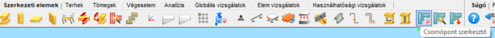](https://consteelsoftware.com/wp-content/uploads/2022/06/tab_csomop-1.png)

<!-- /wp:image -->

<!-- wp:paragraph -->

Szerkezeti csomópont a Csomópont szerkesztő funkcióval történő létrehozása esetén a csomópont típusát, geometriáját és terheit a _Consteel_ modelltől függetlenül, kézzel kell megadni. A _Consteel_ egyik előnye, hogy képes több kapcsolatot is kezelni egyetlen csomóponton belül. Ezáltal a csomópontok széles skálán személyre szabhatók, és optimalizálhatók. A következőkben egy oszlop-gerenda csomóponton keresztül mutatjuk be a csomóponti _csJoint_ modul használatát.

<!-- /wp:paragraph -->

<!-- wp:list -->

- **Első lépés – Csomópont azonosítása**

<!-- /wp:list -->

<!-- wp:image {"align":"right","id":38428,"width":334,"height":265,"sizeSlug":"full","linkDestination":"media","className":"is-style-editorskit-rounded"} -->

<!-- /wp:image -->

<!-- wp:paragraph -->

Új csomópont a csomópont kezelő bal felső sarkában található **Létrehozás**() gombbal hozható létre. A csomópont azonosítása során megadható a csomópont neve, valamint egy rövid megjegyzés is fűzhető hozzá. Végül, a harmadik, legördülő mezőben megadhatók korábban elmentett **[alapértelmezett beállítások](#alapértelmezett-csomóponti-beállítások)** is. Az adatok megadása után a **Tovább>** gombbal lehet továbblépni.

<!-- /wp:paragraph -->

<!-- wp:spacer {"height":"1px"} -->

<!-- /wp:spacer -->

<!-- wp:list -->

- **Második lépés – Csomópont típusának kiválasztása**

<!-- /wp:list -->

<!-- wp:paragraph -->

Második lépésként ki kell választani a csomópont típusát. A _csJoint_ modul a csomópontok széles skáláját tudja kezelni, ami lefedi szinte a teljes Eurocode 1993-1-8 szabványt (az elérhető csomópontok listáját lásd a **_[Csomópont típusok](./14_1_joint-types.md)_** fejezetben). A megfelelő típus kiválasztása után a **Tovább>** gombbal lehet továbblépni.

<!-- /wp:paragraph -->

<!-- wp:image {"align":"center","id":38420,"width":671,"height":335,"sizeSlug":"full","linkDestination":"media","className":"is-style-editorskit-rounded"} -->

<!-- /wp:image -->

<!-- wp:spacer {"height":"1px"} -->

<!-- /wp:spacer -->

<!-- wp:list -->

- **Harmadik lépés – Kapcsolatok beállítása**

<!-- /wp:list -->

<!-- wp:image {"align":"right","id":38412,"width":386,"height":332,"sizeSlug":"full","linkDestination":"media","className":"is-style-editorskit-rounded"} -->

<!-- /wp:image -->

<!-- wp:paragraph -->

Az _Oszlop-gerenda csomópont_ dialógon lehet kiválasztani a csomópontba bekötő szerkezeti elemek végein lévő kapcsolatok típusait. Jelen példánkban, kapcsolat beköthet az oszlop mindkét övére (#1) és a gerinc mindkét oldalára (#2) is. Alul, a legördülő mezőben meg kell adni az oszlop keresztmetszetét is (#3). Új keresztmetszetet a három pontos  gombra kattintva lehet betölteni.

<!-- /wp:paragraph -->

<!-- wp:spacer {"height":"10px"} -->

<!-- /wp:spacer -->

<!-- wp:image {"align":"right","id":38404,"width":647,"height":327,"sizeSlug":"full","linkDestination":"media","className":"is-style-editorskit-rounded"} -->

<!-- /wp:image -->

<!-- wp:paragraph -->

Az oszlop valamelyik oldalára kattintva definiálható a bekötő kapcsolat típusa. A definiálás során kiválasztható a kapcsolat típusa (#1) és a bekötő szerkezeti elem keresztmetszete is (#2). Új keresztmetszeti típus a három pontos  gombra kattintva tölthető be.

<!-- /wp:paragraph -->

<!-- wp:spacer {"height":"10px"} -->

<!-- /wp:spacer -->

<!-- wp:image {"align":"right","id":38396,"width":421,"height":364,"sizeSlug":"full","linkDestination":"media","className":"is-style-editorskit-rounded"} -->

<!-- /wp:image -->

<!-- wp:paragraph -->

Miután a bekötő szerkezeti elemek kapcsolatai beállításra kerültek a csomópont a **Létrehozás** gombra kattintva létrehozható a kiválasztott **[alapértelmezett csomóponti beállításoknak](#alapértelmezett-csomóponti-beállítások)** megfelelően. A létrehozás után megjelenik a csJoint modul fő képernyője. Ezen a képernyőn végezhetők el a kapcsolatok módosításai, optimalizálásai (ld. lentebb).

<!-- /wp:paragraph -->

<!-- wp:image {"align":"center","id":38388,"width":761,"height":503,"sizeSlug":"full","linkDestination":"media","className":"is-style-editorskit-rounded"} -->

<!-- /wp:image -->

<!-- wp:paragraph -->

A csomópontok módosítását lásd a [**_Csomópontok módosítása_**](#csomópont-módosítása) fejezetben.

<!-- /wp:paragraph -->

<!-- wp:spacer -->

<!-- /wp:spacer -->

<!-- wp:heading {"level":3} -->

### Csomópont létrehozása a modell alapján

<!-- /wp:heading -->

<!-- wp:paragraph -->

_Consteel_ modell alapján gyorsan és egyszerűen hozható létre csomópont a felismertetés funkció segítségével. Ehhez első lépésként a **Csomópont felismerése** opciót kell kiválasztani, majd a szerkezeten kijelölni a felismertetni kívánt csomópontot.

<!-- /wp:paragraph -->

<!-- wp:image {"align":"center","id":38380,"width":238,"height":88,"sizeSlug":"full","linkDestination":"media","className":"is-style-editorskit-rounded"} -->

<!-- /wp:image -->

<!-- wp:paragraph -->

A kapcsolódó elemeket a program automatikusan felismeri és felkínálja a lehetséges csomópont típusokat. A felismerés után lehetőség van eltávolítani rudakat a létrehozandó kapcsolatból a rudak nevei előtt lévő jelölőnégyzetek kikapcsolásával.

<!-- /wp:paragraph -->

<!-- wp:image {"align":"center","id":38372,"width":691,"height":452,"sizeSlug":"full","linkDestination":"media","className":"is-style-editorskit-rounded"} -->

<!-- /wp:image -->

<!-- wp:spacer -->

<!-- /wp:spacer -->

<!-- wp:heading {"level":3} -->

### Csomópont elhelyezése Consteel modellen

<!-- /wp:heading -->

<!-- wp:paragraph -->

A csomópont létrehozása után ajánlott a létrehozott csomópontot elhelyezni a _Consteel_ modellen, hiszen így a szerkezeti analízis eredményei alapján a csomóponti terhek automatikusan importálásra kerülnek a csJoint modulba. Az elhelyezés kétféle módon történhet:

<!-- /wp:paragraph -->

<!-- wp:image {"align":"right","id":38467,"width":239,"height":74,"sizeSlug":"full","linkDestination":"none","className":"is-style-editorskit-rounded"} -->

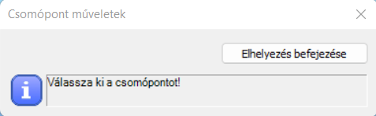

<!-- /wp:image -->

<!-- wp:paragraph -->

A leggyorsabban közvetlenül a **Csomópont részletezése** dialóg bal alsó sarkában található **Elhelyez...** gomb segítségével történhet. A gombra kattintva megjelenik a 3D modell, ahol a csomópont bal egérkattintásokkal elhelyezhető azon pontokra, ahol a geometria megegyezik a csomópontban definiált geometriával. Az elhelyezésből az **Elhelyezés befejezése** gombra kattintva léphetünk ki. Ezután a terhek automatikusan importálódnak a modellből, amennyiben az analízis eredményei rendelkezésre állnak.

<!-- /wp:paragraph -->

<!-- wp:image {"align":"right","id":38475,"width":225,"height":62,"sizeSlug":"full","linkDestination":"none","className":"is-style-editorskit-rounded"} -->

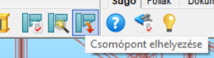

<!-- /wp:image -->

<!-- wp:paragraph -->

A második lehetőség a **Szerkezeti elemek** fülön található **Csomópont elhelyezése** funkció használata, mely akkor lehet hasznos, ha több, előzőleg már létrehozott csomópont elhelyezésére van szükség.

<!-- /wp:paragraph -->

<!-- wp:image {"align":"center","id":38364,"width":507,"height":334,"sizeSlug":"full","linkDestination":"media","className":"is-style-editorskit-rounded"} -->

<!-- /wp:image -->

<!-- wp:media-text {"mediaId":9849,"mediaType":"image","mediaWidth":15} -->

<!-- wp:paragraph {"placeholder":"Content…"} -->

**Fontos** azzal tisztában lenni, hogy csJoint modulban végzett módosítások (keresztmetszet vagy anyagminőség változtatás) nem befolyásolja a 3D szerkezeti modellt. Ezek csak csJoint számítás eredményeire vannak hatással. A felhasználónak kell a modellt a csJoint-ban végzett módosításokkal szinkronban tartania: ha megváltoztatunk valami a kapcsolatban, a 3d modellt is meg kell változtatni annak megfelelően. Ezután a számítást újra kell futtatni, és a kapcsolatot újra ellenőrizni kell.

<!-- /wp:paragraph -->

<!-- /wp:media-text -->

<!-- wp:spacer -->

<!-- /wp:spacer -->

<!-- wp:heading {"level":3} -->

### Csomópontok módosítása

<!-- /wp:heading -->

<!-- wp:paragraph -->

Akár modell alapján (_Consteel_), vagy modell nélkül (_csJoint_) lett létrehozva egy csomópont, a paraméterek módosítása mindkét esetben megegyezik. A csomóponti részletek egy új ablakban jelennek meg, ahol számos beállítási lehetőség található. A következő oldalak egy oszlop-gerenda kapcsolat példáján keresztül mutatják be a csomópontok módosítási lehetőségeit.

<!-- /wp:paragraph -->

<!-- wp:paragraph -->

Csomópont módosításához először ki kell választani a módosítandó csomópontot a **Szerkezeti elemek** fül **Csomópont szerkesztő**  ikonjára kattintva megjelenő **Csomópontok** dialógon. A dialóg baloldali fastruktúrájában láthatók a létrehozott csomópontok. A fában kiválasztott csomópont megnyitható a Módosítás 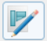 gombra kattintva, vagy a csomópont nevére, illetve a csomópont 3D grafikájára történő dupla kattintással.

<!-- /wp:paragraph -->

<!-- wp:image {"align":"center","id":38356,"width":512,"height":349,"sizeSlug":"large","linkDestination":"media","className":"is-style-editorskit-rounded"} -->

[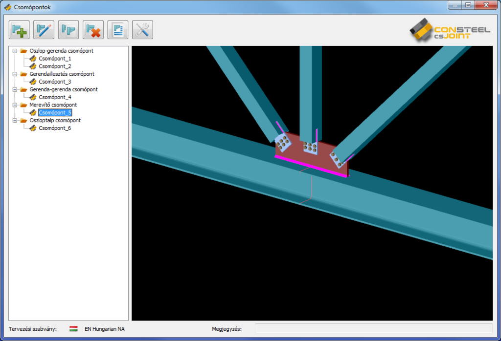](https://consteelsoftware.com/wp-content/uploads/2022/06/scr_csomop_modosit.png)

<!-- /wp:image -->

<!-- wp:heading {"level":4} -->

#### Csomópont részletezése dialóg

<!-- /wp:heading -->

<!-- wp:paragraph -->

A csomópont létrehozása vagy egy meglévő szerkesztésre történő megnyitása után megjelenő **Csomópont részletezése** dialóg négy fő részből áll.

<!-- /wp:paragraph -->

<!-- wp:image {"align":"right","id":38348,"width":512,"height":379,"sizeSlug":"large","linkDestination":"media","className":"is-style-editorskit-rounded"} -->

[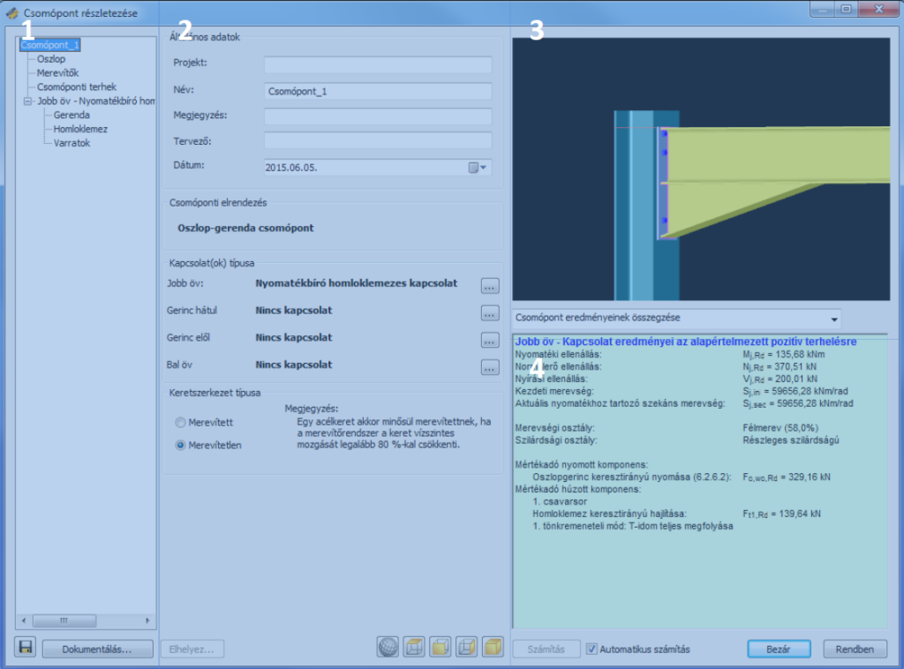](https://consteelsoftware.com/wp-content/uploads/2022/06/dial_csomop_reszletezes.png)

<!-- /wp:image -->

<!-- wp:list -->

- (#1) Az első rész a csomópont fa struktúráját mutatja. A csomópont összes komponense megtalálható itt, illetve kijelölés után módosíthatóvá válik.
- (#2) A második rész a kijelölt komponenshez kapcsolódó információkat és paramétereket mutatja, melyek módosítása itt végezhető el. Az általános adatoknál megadható projektnév, csomópont név és tervező neve, illetve a beállított dátum a csomópont dokumentációjának fedőlapján is megjelenik (lásd 13.6 fejezet)
- (#3) A harmadik rész a grafikus felület, ahol a csomópont 3D grafikája látható, ami forgatható és nagyítható, illetve a dialóg alján alapértelmezett nézetek  is találhatók.

<!-- /wp:list -->

<!-- wp:list -->

- (#4) A negyedik rész a csomóponti számítások eredményeit mutatja. A számítások minden, a csomóponton történt módosítás után automatikusan lefutnak, ha az _Automatikus számítás_ jelölőnégyzet a dialóg alján ki van választva. Ha nincsen, akkor a **Számítás** gombra kattintva futtatható le a csomópont számítása. A legördülő menüben kiválasztható az eredménymegjelenítés módja:

  - Csomópont eredményeinek összegzése

  - Kiválasztott kapcsolat eredményeinek összegzése

  - Kiválasztott kapcsolat részletes eredményei (kiválasztott terhelési esetben)

<!-- /wp:list -->

<!-- wp:paragraph -->

(Az utóbbi két esethez a bal oldali fastruktúrából ki kell választani egy kapcsolatot komponenst.)

<!-- /wp:paragraph -->

<!-- wp:paragraph -->

Csomóponti dokumentáció a dialóg bal alsó sarkában található **Dokumentálás…** gombra kattintva hozható létre.

<!-- /wp:paragraph -->

<!-- wp:heading {"level":4} -->

#### Csomópont módosítása

<!-- /wp:heading -->

<!-- wp:paragraph -->

**Oszlop**

<!-- /wp:paragraph -->

<!-- wp:image {"align":"right","id":38340,"width":512,"height":379,"sizeSlug":"large","linkDestination":"media","className":"is-style-editorskit-rounded"} -->

[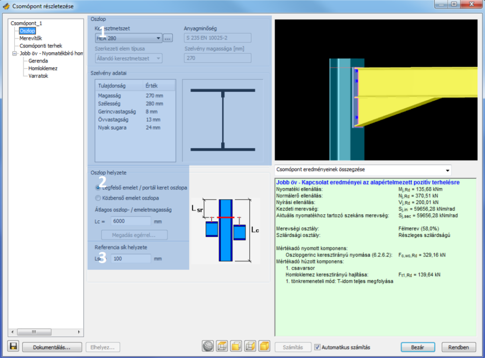](https://consteelsoftware.com/wp-content/uploads/2022/06/dial_csomop_reszletezes_oszlop.png)

<!-- /wp:image -->

<!-- wp:paragraph -->

A csomóponti fa _Oszlop_ elemének kiválasztása után, az oszlopra vonatkozó tulajdonságok módosíthatók.

<!-- /wp:paragraph -->

<!-- wp:paragraph -->

Az _Oszlop_ (#1) mezőben látható a keresztmetszet és az anyagminőség. A legördülő menü segítségével változtatható meg az oszlop keresztmetszete. A három pontos gombra kattintva tölthető be új keresztmetszet. Az anyagminőség a keresztmetszethez tartozik, ezért csak új keresztmetszet betöltésével módosítható.

<!-- /wp:paragraph -->

<!-- wp:paragraph -->

Az _Oszlop helyzete_ (#2) mezőben adható meg, hogy a csomópont az oszlop végén (felső emeleti / portál keret), vagy egy közbenső pozícióban helyezkedik-e el.

<!-- /wp:paragraph -->

<!-- wp:paragraph -->

A _Referencia sík_ helyzete (#3) mezőben adható meg a referencia sík oszlop végétől mért távolsága. A geometriai méretek (például merevítők helyzete) általában ettől a síktól vannak megadva. A referencia sík pozíciójának kihatása van a merevség számítására is. A csomópont grafikáján a referencia sík egy piros vonalként jelenik meg az oszlopon.

<!-- /wp:paragraph -->

<!-- wp:spacer {"height":"10px"} -->

<!-- /wp:spacer -->

<!-- wp:paragraph -->

**Merevítők**

<!-- /wp:paragraph -->

<!-- wp:image {"align":"right","id":38332,"width":512,"height":380,"sizeSlug":"large","linkDestination":"media","className":"is-style-editorskit-rounded"} -->

[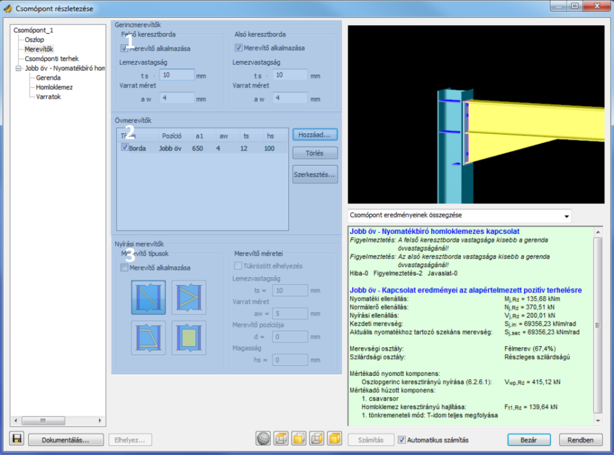](https://consteelsoftware.com/wp-content/uploads/2022/06/dial_csomop_reszletezes_merevito.png)

<!-- /wp:image -->

<!-- wp:paragraph -->

A csomóponti fa _Merevítők_ elemének kiválasztása után, lehetőség van különböző merevítők alkalmazására.

<!-- /wp:paragraph -->

<!-- wp:paragraph -->

A _Gerincmerevítők_ (#1) mezőben keresztbordák elhelyezésére van lehetőség, a megfelelő jelölőnégyzet kiválasztásával. Megadható az alkalmazandó lemezvastagság, illetve a varrat méret. Ha a gerendavégen kiékelés található, akkor az _Alsó keresztborda_ egyszerűen hozzáigazítható a kiékelés aljához a _Gerenda_ elem kiválasztása után a **Kiékelés megadása** 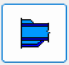 dialógon.

<!-- /wp:paragraph -->

<!-- wp:paragraph -->

Az _Övmerevítők_ (#2) mezőben tetszőleges helyzetű és geometriájú övmerevítők helyezhetők el. A **Hozzáad…** gomb segítségével adható hozzá új övmerevítő. A megjelenő dialógon kiválasztható a merevítő típusa (keresztborda vagy övhizlaló), merevítő helyzete (jobb vagy bal öv), megadható az alkalmazandó varrat mérete és a merevítő geometriai paraméterei. A merevítő pozíciója megadható több referenciaponttól is, ami a legördülő menüből választható ki. Létrehozott merevítők a táblázatban tekinthetők meg. A _Típus_ oszlopban található jelölőnégyzet segítségével bármelyik létrehozott borda kikapcsolható. A táblázatban kiválasztott borda a **Törlés** gombbal törölhető, illetve a **Szerkesztés…** gombbal módosítható.

<!-- /wp:paragraph -->

<!-- wp:paragraph -->

A _Nyírási merevítők_ (#3) mezőben nyírási merevítő helyezhető el az oszlopban. Négy különböző nyírási merevítő választható. A kiválasztott merevítőnek megfelelően megadhatók különböző geometriai paraméterek. Ha szükséges a _Tükrözött elhelyezés_ jelölőnégyzet kiválasztásával a merevítő megtükrözhető.

<!-- /wp:paragraph -->

<!-- wp:spacer {"height":"10px"} -->

<!-- /wp:spacer -->

<!-- wp:paragraph -->

#### **Csomóponti terhek**

<!-- /wp:paragraph -->

<!-- wp:image {"align":"right","id":38324,"width":512,"height":338,"sizeSlug":"large","linkDestination":"media","className":"is-style-editorskit-rounded"} -->

[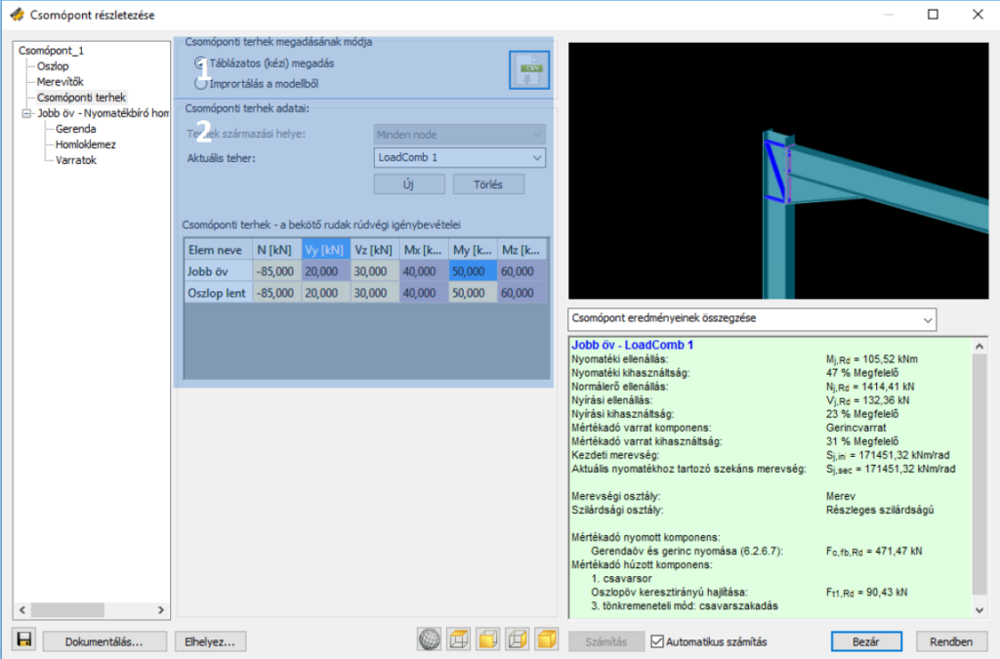](https://consteelsoftware.com/wp-content/uploads/2022/06/dial_csomop_reszletezes_terhek.png)

<!-- /wp:image -->

<!-- wp:paragraph -->

A csomóponti fa _Csomóponti terhek_ elemének kiválasztása után megadhatók a csomópontban ható erők.

<!-- /wp:paragraph -->

<!-- wp:paragraph -->

A _Csomóponti terhek megadásának módja_ (#1) című mezőben választható ki, hogy a terheket kézzel, vagy a modellből importálva visszük-e be a csomópontba. Importálás csak abban az esetben lehetséges, ha a csomópont legalább egy helyen _**[el van helyezve](#csomóponti-terhek)**_ a 3D modellben, és az analízis eredményei rendelkezésre állnak.

<!-- /wp:paragraph -->

<!-- wp:paragraph -->

Kézi megadás esetén a  ikonra kattintva táblázatból is be lehet vinni terheket. Az ikonra kattintás után az alábbi dialóg jelenik meg:

<!-- /wp:paragraph -->

<!-- wp:image {"align":"center","id":38316,"width":294,"height":171,"sizeSlug":"full","linkDestination":"none","className":"is-style-editorskit-rounded"} -->

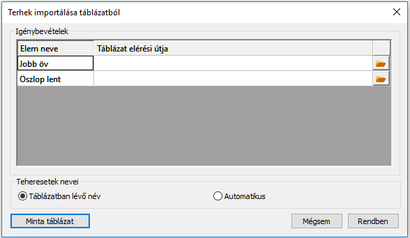

<!-- /wp:image -->

<!-- wp:paragraph -->

Itt a **Minta táblázat** gombra kattintva megjelenik egy minta adatsor, amely segítséget ad a táblázatunk adatokkal való feltöltéséhez. A dialóg alsó részén tudjuk dönteni, hogy az aktuális teheresetek milyen nevet kapjanak. Lehetőségünk van a táblázatban lévő név használatára, vagy automatikus generálást is alkalmazhatunk A megnyitás ikonra  kattintva tudjuk kiválasztani a terheket tartalmazó fájlt. A **Rendben** gombra kattintva a táblázatunkban lévő értékek fognak szerepelni a (#2) mezőben.

<!-- /wp:paragraph -->

<!-- wp:paragraph -->

A _Csomóponti terhek adatai_ (#2) mezőben adhatók meg a különböző erő komponensek teheresetenként kézi megadás esetén, illetve felismertetett csomópontok esetén itt tekinthetők meg az importált terhek is.

<!-- /wp:paragraph -->

<!-- wp:spacer {"height":"10px"} -->

<!-- /wp:spacer -->

<!-- wp:paragraph -->

**Gerenda**

<!-- /wp:paragraph -->

<!-- wp:image {"align":"right","id":38308,"width":512,"height":379,"sizeSlug":"large","linkDestination":"media","className":"is-style-editorskit-rounded"} -->

[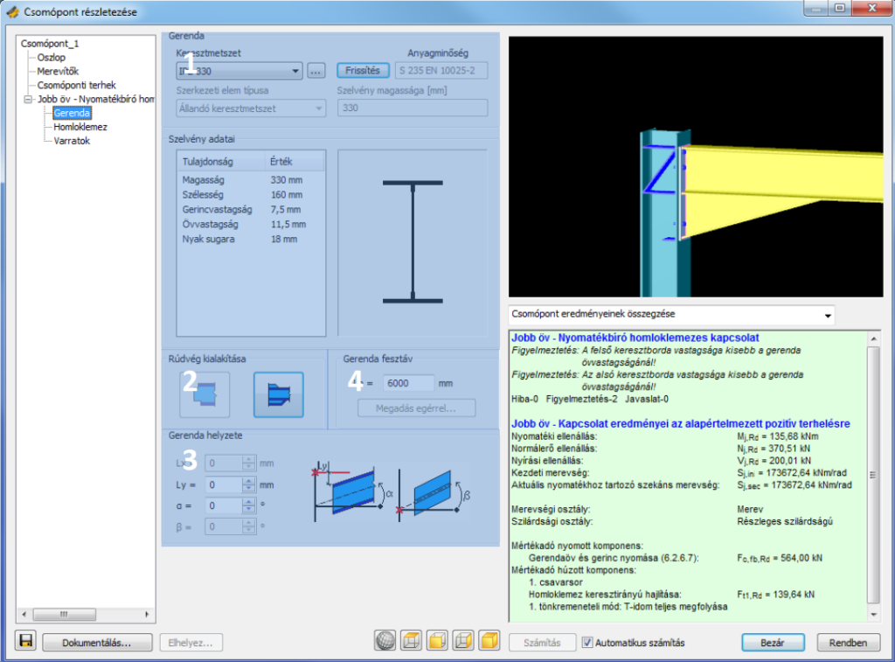](https://consteelsoftware.com/wp-content/uploads/2022/06/dial_csomop_reszletezes_gerenda.png)

<!-- /wp:image -->

<!-- wp:paragraph -->

A csomóponti fa _Gerenda_ elemének kiválasztása után, a gerendára vonatkozó tulajdonságok módosíthatók.

<!-- /wp:paragraph -->

<!-- wp:paragraph -->

A _Gerenda_ (#1) mezőben tekinthető meg a használt gerenda keresztmetszet és anyagminőség. A legördülő menü segítségével változtatható meg a gerenda keresztmetszete. A három pontos gombra kattintva tölthető be új keresztmetszet. Az anyagminőség a keresztmetszethez tartozik, ezért csak új keresztmetszet betöltésével módosítható.

<!-- /wp:paragraph -->

<!-- wp:paragraph -->

A _Rúdvég kialakítása_ (#2) mezőben a gerendavég kialakítás adható meg, mely lehet gerenda övkivágás vagy kiékelés. Kiékelés felvehető a gerenda alsó és felső övére is.

<!-- /wp:paragraph -->

<!-- wp:paragraph -->

A _Gerenda helyzete_ (#3) mezőben adható meg a gerenda felső síkjának referencia síktól mért távolsága, illetve a gerenda hajlásszöge.

<!-- /wp:paragraph -->

<!-- wp:paragraph -->

A _Gerenda fesztáv_ (#4) mezőben a gerenda fesztávja adható meg. Erre az értékre a merevségszámításhoz van szükség. Felismertetett csomópont esetén az érték a _Consteel_ szerkezeti modell alapján kitöltődik.

<!-- /wp:paragraph -->

<!-- wp:spacer {"height":"10px"} -->

<!-- /wp:spacer -->

<!-- wp:paragraph -->

**Homloklemez**

<!-- /wp:paragraph -->

<!-- wp:image {"align":"right","id":38300,"width":512,"height":380,"sizeSlug":"large","linkDestination":"media","className":"is-style-editorskit-rounded"} -->

[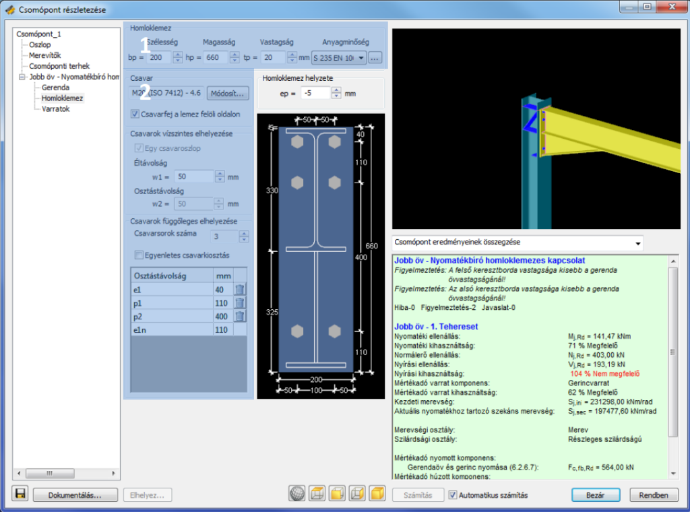](https://consteelsoftware.com/wp-content/uploads/2022/06/dial_csomop_reszletezes_homloklemez.png)

<!-- /wp:image -->

<!-- wp:paragraph -->

A csomóponti fa _Homloklemez_ elemének kiválasztása után, a homloklemezre és a csavarokra vonatkozó tulajdonságok módosíthatók.

<!-- /wp:paragraph -->

<!-- wp:paragraph -->

A _Homloklemez_ (#1) mezőben adhatók meg a homloklemez geometriai paraméterei és anyagminősége.

<!-- /wp:paragraph -->

<!-- wp:paragraph -->

A _Csavar_ (#2) mezőben adhatók meg a csavarok anyagminősége, átmérője és geometriai paraméterei. A **Módosítás…** gombra kattintva módosítható a használandó csavar átmérője és anyagminősége. A dialóg középső részén látható csavarkép összes paramétere módosítható: felvehető, illetve törölhető (kuka ikon) új csavarsor; módosíthatók az éltávolságok, illetve a csavarok közti távolságok.

<!-- /wp:paragraph -->

<!-- wp:spacer {"height":"10px"} -->

<!-- /wp:spacer -->

<!-- wp:paragraph -->

**Varratok**

<!-- /wp:paragraph -->

<!-- wp:image {"align":"right","id":38292,"width":512,"height":379,"sizeSlug":"large","linkDestination":"media","className":"is-style-editorskit-rounded"} -->

[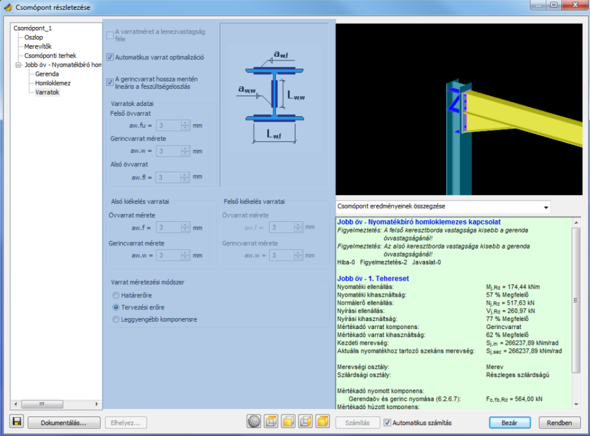](https://consteelsoftware.com/wp-content/uploads/2022/06/dial_csomop_reszletezes_varratok.png)

<!-- /wp:image -->

<!-- wp:paragraph -->

A csomóponti fa _Varratok_ elemének kiválasztása után, a különböző varratok méretei, illetve a méretezés módszere adható meg.

<!-- /wp:paragraph -->

<!-- wp:paragraph -->

Az _Automatikus varrat optimalizáció_ funkció választása esetén a szükséges varratméretek automatikusan meghatározásra kerülnek.

<!-- /wp:paragraph -->

<!-- wp:paragraph -->

_A gerincvarrat hossza mentén lineáris feszültségeloszlás_ funkció használata esetén, a hagyományos varratméretezési eljárás (övvarratok viselik a hajlítást, a gerincvarratok viselik a nyíróerőt), helyett a gerinc varrat is viseli a hajlítást, ezáltal sokkal kedvezőbb varratméretek adódnak.

<!-- /wp:paragraph -->

<!-- wp:spacer {"height":"10px"} -->

<!-- /wp:spacer -->

<!-- wp:paragraph -->

Minden csomóponton történt változtatás automatikusan megjelenik a számítási eredményekben az Enter billentyű lenyomása, vagy más módosítható mezőbe való kattintással, illetve - ha az _Automatikus számítás_ funkció ki van kapcsolva, akkor- a **Számítás** gombra kattintás után.

<!-- /wp:paragraph -->

<!-- wp:paragraph -->

A számítási eredmények megjelenítési módjai a legördülő menüből választhatók ki. Az alábbi megjelenítések közül lehet választani: csomópont eredményeinek összegzése; kiválasztott kapcsolatok eredményeinek összegzése; kiválasztott kapcsolat részletes eredményei. Az utolsó kettő megjelenítési esetén ki kell választani egy kapcsolatot a fastruktúrában.

<!-- /wp:paragraph -->

<!-- wp:image {"align":"center","id":38284,"width":328,"height":227,"sizeSlug":"full","linkDestination":"media","className":"is-style-editorskit-rounded"} -->

<!-- /wp:image -->

<!-- wp:paragraph -->

A csomópont számítási eredményei az ablak zöld hátterű részén tekinthetők meg. Részletes eredménynézet esetén az összes számítási eredmény megtekinthető a kiválasztott, vagy a mértékadó tehereset szerint.

<!-- /wp:paragraph -->

<!-- wp:heading {"level":4} -->

#### Alapértelmezett csomóponti beállítások

<!-- /wp:heading -->

<!-- wp:paragraph -->

Alapértelmezett csomóponti beállítások, mint varratméret, csavarátmérő stb. megváltoztathatók és elmenthetők.

<!-- /wp:paragraph -->

<!-- wp:paragraph -->

_Alapértelmezett csomóponti beállítás_ a **Csomópontok** dialóg **Alapértelmezett csomóponti beállítás** () ikonra kattintva módosítható vagy hozható létre. Az alapértelmezett csomóponti beállítások fájl (UserConfig.xml) a Dokumentumok\\Consteel mappába kerül elmentésre.

<!-- /wp:paragraph -->

<!-- wp:image {"align":"center","id":38276,"width":495,"height":488,"sizeSlug":"full","linkDestination":"media","className":"is-style-editorskit-rounded"} -->

<!-- /wp:image -->
