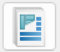

# Eredmények és dokumentáció
<!-- wp:image {"align":"right","id":38268,"width":324,"height":267,"sizeSlug":"full","linkDestination":"media","className":"is-style-editorskit-rounded"} -->

<!-- /wp:image -->

<!-- wp:paragraph -->

A számítás eredményei összefoglaló vagy részletezett formában jeleníthetők meg.

<!-- /wp:paragraph -->

<!-- wp:paragraph -->

Az összefoglaló számítási nézet a fő teherbírási értékeket, a merevséget, kihasználtságot és a mértékadó nyomott, illetve húzott komponenst mutatja. A mértékadó komponens megmutatja, hogy melyik a leggyengébb kapcsolati komponens, azaz mely kapcsolati részt érdemes erősíteni, ahhoz, hogy változzon a kapcsolat teherbírása.

<!-- /wp:paragraph -->

<!-- wp:paragraph -->

A részletes számítási nézet valamennyi számítási részletet mutatja, amelyek segítségével könnyen megtalálhatók a kapcsolatok gyenge pontjai és megerősítendő részei. A csomópontok számítása az összes csomópont elhelyezésből származó erőre vagy létrehozott teheresetre elvégzésre kerül, és a mértékadó hely és kombináció automatikusan megjelölésre kerül.

<!-- /wp:paragraph -->

<!-- wp:paragraph -->

A _csJoint_ dokumentációs moduljával könnyen, és egyszerűen generálható a csomópontokról átfogó statikai dokumentáció. A dokumentáció generálása a modul elindítása és a dokumentálni kívánt eredmények kiválasztása után automatikusan történik. A dokumentációba az eredményeken túl részletes és méretezett geometriai ábrák is bekerülnek, ezzel is átláthatóbbá és kezelhetőbbé téve a dokumentációt.

<!-- /wp:paragraph -->

<!-- wp:image {"align":"center","id":38683,"width":485,"height":620,"sizeSlug":"full","linkDestination":"media","className":"is-style-editorskit-rounded"} -->

<!-- /wp:image -->

<!-- wp:image {"align":"right","id":38260,"width":285,"height":554,"sizeSlug":"full","linkDestination":"media","className":"is-style-editorskit-rounded"} -->

<!-- /wp:image -->

<!-- wp:paragraph -->

Csomóponti dokumentáció két fél képen állítható elő:

<!-- /wp:paragraph -->

<!-- wp:list {"ordered":true,"type":"A"} -->

1. A **Csomópontok** dialógon a **Dokumentálás**  ikon segítségével. A dokumentálás megkezdése előtt, a dokumentálni kívánt csomópontot ki kell választani a fastruktúrából.
2. Szerkesztésre megnyitott csomópont esetén, közvetlenül a **Csomópont részletezése** dialóg alján található **Dokumentálás…** gomb megnyomásával

<!-- /wp:list -->

<!-- wp:paragraph -->

A dokumentálás elindítása után a _Csomópont dokumentáció létrehozása_ dialóg jelenik meg, ahol megadható a dokumentálás nyelve (#1), a dokumentálandó teheresetek (#2), az eredmények részletezettsége (összefoglaló vagy részletes) (#3), illetve a kiválasztható, hogy a csomópont mely kapcsolatai, illetve, hogy azok milyen tartalommal kerüljenek dokumentálásra (#4).>)

<!-- /wp:paragraph -->

<!-- wp:paragraph -->

A dokumentáció módosításának módja megegyezik a teljes szerkezet dokumentálásának módjával. További információért ld. a [_**13. Dokumentálás**_](/hu/manual/dokumentacio/) c. fejezetet!

<!-- /wp:paragraph -->
