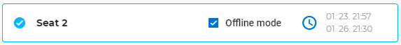

# A szoftver telepítése és futtatása

<!-- wp:consteel/content-block -->

<!-- /wp:consteel/content-block -->

<!-- wp:paragraph -->

**Hardver követelmények**

<!-- /wp:paragraph -->

<!-- wp:paragraph -->

A Consteel program futtatásához az alábbi szoftver és hardver követelmények teljesítése szükséges. Ezek hiányában a program nem, vagy nem az elvárt gyorsasággal futtatható.

<!-- /wp:paragraph -->

<!-- wp:paragraph -->

**Minimális konfiguráció:**

<!-- /wp:paragraph -->

<!-- wp:columns {"align":"wide"} -->

<!-- wp:column {"verticalAlignment":"top","width":"20%"} -->

<!-- wp:list -->

- Processzor
- Memória
- HDD
- Videó-kártya
- Operációs rendszer

<!-- /wp:list -->

<!-- /wp:column -->

<!-- wp:column {"width":"66.66%"} -->

<!-- wp:paragraph -->

Intel Core i5 vagy ennek megfelelő  
4 GB  
300 MB  
512 MB nem alaplapra integrált  
64-bit MS Windows 10

<!-- /wp:paragraph -->

<!-- /wp:column -->

<!-- /wp:columns -->

<!-- wp:paragraph -->

**Ajánlott konfiguráció:**

<!-- /wp:paragraph -->

<!-- wp:columns -->

<!-- wp:column {"width":"20%"} -->

<!-- wp:list -->

- Processzor
- Memória
- Videó-kártya
- Operációs rendszer

<!-- /wp:list -->

<!-- /wp:column -->

<!-- wp:column {"width":"66.66%"} -->

<!-- wp:paragraph -->

Intel Core i7 vagy ennek megfelelő  
32 GB  
2 GB nem alaplapra integrált  
64-bit Windows 10

<!-- /wp:paragraph -->

<!-- /wp:column -->

<!-- /wp:columns -->

<!-- wp:paragraph -->

**Telepítés**

<!-- /wp:paragraph -->

<!-- wp:paragraph -->

A telepítéshez rendszergazdai jogosultság szükséges. Rendszergazdai jogok nélkül a hardverkulcs és a program működéséhez elengedhetetlen .dll fájlok nem telepíthetőek.

<!-- /wp:paragraph -->

<!-- wp:paragraph -->

**A telepítő fájl letöltése**

<!-- /wp:paragraph -->

<!-- wp:paragraph -->

A Consteel szoftver telepítő csomagja elérhető a Consteel honlap _Letöltések_ (_Downloads_) menüpontjából ([https://Consteelsoftware.com/hu/letoltesek/](https://consteelsoftware.com/hu/letoltesek/)) regisztrált felhasználók számára.

<!-- /wp:paragraph -->

<!-- wp:paragraph -->

**A regisztráció menete**

<!-- /wp:paragraph -->

<!-- wp:image {"align":"center","id":30803,"sizeSlug":"large","linkDestination":"none"} -->

<!-- /wp:image -->

<!-- wp:columns {"align":"wide"} -->

<!-- wp:column {"verticalAlignment":"top","width":"65%"} -->

<!-- wp:paragraph -->

Új felhasználói fiók létrehozásához a weboldal jobb felső sarkában található **Belépés **gombra, majd a megjelenő ablak alján a **Regisztrálj **feliratra kell kattintani.  
A **_Fiók létrehozása_** ablakban meg kell adni a felhasználó e-mail címét, nevét és egy választott jelszót. Fontos, hogy valós email címet adjunk meg, mert ezután egy automatikusan kiküldött email üzenetben meg kell erősíteni az e-mail címünket. Az ablak alján lehetőség van feliratkozni a Consteel szakmai hírlevelére, valamint el kell fogadni a felhasználási és adatvédelmi feltételeket, végül a **Regisztrálok **gombra kattintva lehet a regisztrációt befejezni. Ezután egy újabb ablak jelenik meg, mely arról tájékoztat, hogy a rendszer a regisztrációs visszaigazoló emailt elküldte a megadott email címre, és az abban található link segítségével kell a regisztrációt befejezni. Ha hosszabb idő eltelte után sem érkezik meg a visszaigazoló email, érdemes ellenőrizni a levélszemét és promóciós mappákat is levelező rendszerünkben. Ha ott sem található meg az email, akkor az előbbi tájékoztató ablakban kérhető a **megerősítő email újbóli kiküldése**. (Ha már bezártuk a regisztrációs ablakot, akkor újból a belépésre kattintva adjuk meg ismét az email címünket és választott jelszavunkat, hogy megjelenjen az üzenet újbóli kiküldése parancs.) A regisztráció megerősítése után már be lehet lépni a felhasználói fiókba.

<!-- /wp:paragraph -->

<!-- /wp:column -->

<!-- wp:column {"verticalAlignment":"bottom","width":"30%"} -->

<!-- wp:image {"align":"left","id":30830,"sizeSlug":"full","linkDestination":"media"} -->

<!-- /wp:image -->

<!-- wp:paragraph -->

<!-- /wp:paragraph -->

<!-- /wp:column -->

<!-- /wp:columns -->

<!-- wp:paragraph -->

**A Consteel telepítése**

<!-- /wp:paragraph -->

<!-- wp:paragraph -->

A telepítéshez el kell indítani a letöltött Consteel telepítő fájlt, és követni kell a telepítő instrukcióit. Első lépésként ki kell választani a telepítő nyelvét. A kiválasztott nyelvet fogja használni a Consteel az első indítás során is, amely szükség esetén megváltoztatható. A telepítő a megadott mappába (alapesetben a C:\\Program Files\\Consteel xx mappába, ahol xx=verzió száma) másolja a szükséges fájlokat, a választott beállításoknak megfelelően elhelyezi a program ikonját az asztalra és a „START” menüben. A telepítés utolsó fázisa a hardverkulcs szoftverének installálása. Ez a folyamat nem kerül kijelzésre, és hosszabb ideig is eltarthat.

<!-- /wp:paragraph -->

<!-- wp:paragraph -->

**Hálózatos működés**

<!-- /wp:paragraph -->

<!-- wp:columns -->

<!-- wp:column {"width":"50%"} -->

<!-- wp:paragraph -->

Hálózatos licensz vásárlása esetén a program használatához szükséges hardverkulcsot a belső hálózat bármelyik, szabad USB csatlakozóval rendelkező számítógépéhez lehet csatlakoztatni, amelyen előzetesen telepítésre került a hardverkulcs kezelő szoftver (driver). Ez a driver is a Consteel telepítő csomag része, mely alapértelmezés szerint a programmal együtt települ a számítógépre (ld. előző pont), de lehetőség van annak önálló telepítésére is, ha a hardverkulcsot egy központi szervergépre szeretnénk csatlakoztatni. Ehhez el kell indítani a Consteel telepítőcsomagját a fentebb leírtak szerint, majd az **Összetevők kiválasztása** ablakban elegendő csak a _Hardverkulcs illesztőprogram_ pontot kiválasztani, a többit üresen hagyni, és a Tovább gombra kattintva befejezni a telepítést.

<!-- /wp:paragraph -->

<!-- /wp:column -->

<!-- wp:column {"width":"50%","editorskit":{"devices":false,"desktop":true,"tablet":true,"mobile":true,"loggedin":true,"loggedout":true,"acf_visibility":"","acf_field":"","acf_condition":"","acf_value":"","migrated":false,"unit_test":false}} -->

<!-- wp:image {"align":"left","id":30886,"sizeSlug":"full","linkDestination":"media"} -->

<!-- /wp:image -->

<!-- /wp:column -->

<!-- /wp:columns -->

<!-- wp:paragraph -->

A Consteel 15 Update 6 verzió kiadásával a hardverkulcs illesztőprogramot eltávolítottuk a telepítőcsomagból. A továbbiakban az illesztőprogram a honlapunkról a Letöltések menüből érhető el. Letöltés után a szokásos módon kell telepíteni a drivert.

<!-- /wp:paragraph -->

<!-- wp:image {"align":"center","id":38178,"sizeSlug":"full","linkDestination":"none"} -->

<!-- /wp:image -->

<!-- wp:paragraph -->

**A program indítása**

<!-- /wp:paragraph -->

<!-- wp:paragraph -->

A Consteel 14 és 15 verziók eltérő módon indíthatók, ezért a következőkben megadjuk a leírást mindkét verzióra külön-külön. Ha a 14-es verzió indítása érdekel, [kattints ide](#cs14start).

<!-- /wp:paragraph -->

<!-- wp:paragraph -->

**Consteel 15** **indítása**

<!-- /wp:paragraph -->

<!-- wp:paragraph -->

A program első indításakor ki kell választani a szoftvervédelem típusát a felhasználói szerződésnek megfelelően. **Amennyiben rendelkezel hardverkulccsal, akkor válaszd az USB dongle opciót**! Csak akkor válaszd az Online licenszt, ha már átváltottál az új online védelemre, valamint a hardverkulcsot is visszaküldted a forgalmazónak.

<!-- /wp:paragraph -->

<!-- wp:paragraph -->

Ezt a beállítást el lehet menteni alapértelmezett beállításként. **Ezt csak akkor tedd meg, ha biztos vagy a választásban!** (Ha véletlenül elmentetted az online licenszt alapértelmezettként, de nem rendelkezel vele, akkor jelenleg csak a Consteel újratelepítésével tudsz visszatérni a hardverkulcs használatára.)

<!-- /wp:paragraph -->

<!-- wp:paragraph -->

Diákok, tanárok és próba verziót használók csak online licenszt igényelhetnek. Próba licensz igénylésének menete [itt olvasható](https://consteelsoftware.com/hu/how-licensing-works/#trialuserhun), oktatási verzióval kapcsolatban pedig [ebben a leírásban tájékozódhatsz](https://consteelsoftware.com/hu/diak-es-oktatas/).

<!-- /wp:paragraph -->

<!-- wp:columns -->

<!-- wp:column -->

<!-- wp:image {"align":"right","id":30914,"sizeSlug":"medium","linkDestination":"media"} -->

Hardware key dongle

<!-- /wp:image -->

<!-- /wp:column -->

<!-- wp:column -->

<!-- wp:image {"align":"left","id":30921,"sizeSlug":"medium","linkDestination":"media"} -->

Online license

<!-- /wp:image -->

<!-- wp:paragraph -->

<!-- /wp:paragraph -->

<!-- /wp:column -->

<!-- /wp:columns -->

<!-- wp:paragraph -->

**Indítás hardverkulcsos védelemmel**

<!-- /wp:paragraph -->

<!-- wp:paragraph -->

A program indítása előtt a hardverkulcsot (USB dongle) be kell dugni a számítógép egy üres USB portjába, vagy hálózati kulcs esetén a kulcsnak elérhetőnek kell lennie a helyi hálózaton lévő valamelyik számítógépen. A megfelelő hardverkulcs felismerés után a Consteel elindul. A továbbiakat ld. a _[Projekt Központ fejezetben](#cs15projectcenter)_!

<!-- /wp:paragraph -->

<!-- wp:paragraph -->

Ha az indítás után a Consteel nem találja a számítógéphez (vagy a hálózaton keresztül) csatlakoztatott megfelelő hardverkulcsot, megjelenik az online licensz bejelentkezési ablaka, amely lehetővé teszi a program indítását a Consteel felhasználói fiókhoz rendelt online licenc használatával (amennyiben elérhető).

<!-- /wp:paragraph -->

<!-- wp:paragraph -->

**Indítás online védelemmel**

<!-- /wp:paragraph -->

<!-- wp:paragraph -->

A Consteel online védelemmel való használatához be kell jelentkezned online fiókoddal. Ha személyes előfizetéssel (**Personal plan**) rendelkezel, a szabad hely kiválasztása után azonnal indítható a Consteelt. Csapat előfizetésben (**Team plan**) minden _**szoftver helyhez**_ (_**seat**_) alapértelmezés szerint két szoftver **_hozzáférés_** (_**access**_) tartozik, de igény esetén további hozzáférés is kérhető felár ellenében. Csapat előfizetés használatakor ezért különböző szoftver helyek közül választhatsz, attól függően, hogy a licensz tulajdonosa hány helyhez adott hozzáférést. Előfizetési csomagokkal és tagsági szintekkel kapcsolatos fogalmak magyarázata az **_[Ajánlatok és csomagok](https://consteelsoftware.com/hu/termekek/ajanlatok-csomagok/#ccm)_** oldalon olvashatók. Hozzáférések adminisztrációjával kapcsolatos további információkért [kattints ide](#endusermanagement_hu).

<!-- /wp:paragraph -->

<!-- wp:paragraph -->

Pro vagy Premium tagság esetén a választott szoftver helyet offline használatra is ki lehet venni. Ehhez a kiválasztás sorában el kell helyezni a pipát a jelölőnégyzetben, majd a megjelenő óra ikonra kattintva az offline használat hosszát kell megadni. (Ezt később, a program futása során is meg lehet tenni a [főmenü Licence menüpontja segítségével.](http://x))

<!-- /wp:paragraph -->

<!-- wp:image {"align":"center","id":30938,"sizeSlug":"full","linkDestination":"none"} -->

<!-- /wp:image -->

<!-- wp:paragraph -->

A megfelelő szoftverhely kiválasztása után a _**[Projekt Központ](#cs15projectcenter)**_ ablaka jelenik meg.

<!-- /wp:paragraph -->

<!-- wp:paragraph -->

Ha a Consteel nem talált elérhető szoftver helyet, a megjelenő link segítségével megnyithatjuk a weboldalon a felhasználói fiókunkat, ahol ellenőrizhető a licensz állapota. Megkérhetjük a licensz birtokosát, hogy adjon hozzáférést a licenszhez, vagy saját hozzáférést kell rendelnünk.

<!-- /wp:paragraph -->

<!-- wp:paragraph -->

[Fordulj hozzánk](https://consteelsoftware.com/hu/kapcsolat/), ha további segítségre van szükséged!

<!-- /wp:paragraph -->

<!-- wp:image {"align":"center","id":28185,"width":464,"height":381,"sizeSlug":"full","linkDestination":"media"} -->

Seat selection

<!-- /wp:image -->

<!-- wp:paragraph -->

**Csomag és felhasználó menedzsment**

<!-- /wp:paragraph -->

<!-- wp:paragraph -->

A felhasználói fiók _Előfizetés \_menüpontjából elérhető \_Csomag és felhasználó menedzsment_ eszköz segítségével a licensz tulajdonosa bármely szoftver hozzáférést (access) hozzárendelhet bármely, a licenszen belül elérhető szoftver helyhez (seat).

<!-- /wp:paragraph -->

<!-- wp:paragraph -->

A _Csomag és felhasználó menedzsment_ eszköz képernyője az alábbi három nagy részből tevődik össze:

<!-- /wp:paragraph -->

<!-- wp:paragraph -->

**(1)** "The Subscription plan details" tartalmazza a licensszel kapcsolatos összes információt: licensz típusa, szoftver-hozzáférések (access) és szoftver-helyek (seat) száma, elérhető tagsági szintek, cég adatok. A szoftver licensz a szoftver-hozzáférések és szoftver-helyek segítségével biztosítja a program használatát. Csapat előfizetés esetén a következő két szakaszban lehet a hozzáféréseket kiosztani a felhasználók között.

<!-- /wp:paragraph -->

<!-- wp:paragraph -->

**(2)** A 'User management' szakaszban lehet felhasználókat rendelni az egyes szoftver-hozzáférésekhez. Minden szoftver-hozzáférés egy adott [Consteel Felhasználó Közösségi](https://consteelsoftware.com/hu/termekek/ajanlatok-csomagok/#ccm) tagsági szinthez kötődik. Az elérhető online szolgáltatások körét a tagsági szint határozza meg.

<!-- /wp:paragraph -->

<!-- wp:paragraph -->

Szabad szoftver-hozzáférés felhasználóhoz rendeléséhez a "Felhasználó hozzáadása" kártyát kell választani. A megjelenő mezőben meg kell adni a felhasználó Consteel honlapon már előzetesen regisztrált e-mail címét, majd a Hozzáadás gomb megnyomásával véglegesíteni azt.

<!-- /wp:paragraph -->

<!-- wp:image {"align":"center","id":31005,"sizeSlug":"full","linkDestination":"none"} -->

<!-- /wp:image -->

<!-- wp:paragraph -->

Már hozzárendelt felhasználó kártyáján a 3 pont ikonra kattintva át lehet helyezni a felhasználót egy másik szoftver-hozzáférésbe vagy el is lehet őt távolítani az adott hozzáférésből. Egy felhasználót egyidőben csak egy hozzáféréshez lehet hozzárendelni.

<!-- /wp:paragraph -->

<!-- wp:paragraph -->

**(3) **Ahhoz, hogy a felhasználó használni tudja a szoftvert, a következő szakaszban a szoftver-hozzáférést kapott felhasználókat még hozzá kell rendelni egy vagy több szoftver-helyhez (Seat) is. Az elérhető szoftver-helyek (seat) listáján valamely hely kártyájára kattintva megjelennek az adott helyhez rendelt szoftver-hozzáférések. Új felhasználót a legördülő menüből lehet kiválasztani, majd a "Hozzáférés adása" gombra kattintva rendelhető hozzá az adott szoftver-helyhez. Felhasználókat eltávolítani a sor végén található "x" gombbal lehet. Egy felhasználót egyszerre több szoftver-helyhez is hozzá lehet rendelni.

<!-- /wp:paragraph -->

<!-- wp:image {"align":"center","id":30966,"sizeSlug":"large","linkDestination":"media"} -->

Előfizetés és felhasználó menedzsment

<!-- /wp:image -->

<!-- wp:paragraph -->

**Projekt Központ**

<!-- /wp:paragraph -->

<!-- wp:paragraph -->

A Projekt Központ egyesíti magában a modell- és a felhasználói fiókkezelés összes funkcióját. A szoftvervédelem megadása után ezzel az ablakkal indul a program, melynek bal oldali főmenüjében 4 nézet érhető el.

<!-- /wp:paragraph -->

<!-- wp:paragraph {"fontSize":"medium"} -->

**Home**

<!-- /wp:paragraph -->

<!-- wp:paragraph -->

A bal oldali menüsávban lehetőség nyílik a Kezdőlapon kívül oktatási anyagokat felfedezni vagy modellfájlokat megnyitni számítógépről vagy a felhőből **(1)**. A Home nézetben lehetőség van (**2**) **új modell** létrehozására, (**4**) **korábbi modellek** megnyitására, valamint (**5**)** hírek** és friss információk megjelenítésére. A **(3)** **Licence **gombbal a használt licensz információi jeleníthetők meg, a jobb felső sarokban pedig a **felhasználói fiók**ba történő belépés lehetséges és itt érhető el az offline használatra váltás is. A bal alsó sarokban a szoftver támogatási rendszerünk érhető el közvetlenül **(6)**. Ha van elérhető frissítés a programhoz vagy a hozzáférés hamarosan lejár, az is a Projekt Központ ablak felső sorában jelenik meg.

<!-- /wp:paragraph -->

<!-- wp:image {"align":"center","id":45014,"width":742,"height":438,"sizeSlug":"large","linkDestination":"media"} -->

Projekt Központ nyitó képernyője

<!-- /wp:image -->

<!-- wp:paragraph -->

A **(3)** Licence gomb megnyomásával egy új ablak jelenik meg, ahol megtalálhatók a licensz információi, aktiválhatjuk az offline használatot, illetve megváltoztathatjuk az indítási alapértelmezett beállításokat.

<!-- /wp:paragraph -->

<!-- wp:image {"align":"center","id":45021,"width":681,"height":404,"sizeSlug":"large","linkDestination":"media"} -->

Licensz beállítás

<!-- /wp:image -->

<!-- wp:paragraph {"fontSize":"medium"} -->

**Learn**

<!-- /wp:paragraph -->

<!-- wp:paragraph -->

A második menüpontból az online [_**Tudásbázis **_](https://consteelsoftware.com/hu/knowledgebase/)különböző cikkei és példa modelljei érhetők el.

<!-- /wp:paragraph -->

<!-- wp:image {"align":"center","id":28198,"width":730,"height":394,"sizeSlug":"large","linkDestination":"media"} -->

Tudásbázis

<!-- /wp:image -->

<!-- wp:paragraph {"fontSize":"medium"} -->

**Megnyitás számítógépről**

<!-- /wp:paragraph -->

<!-- wp:paragraph -->

A számítógépen tárolt modellek megnyitása a főmenü negyedik, "_Open from Computer_" parancsával lehetséges.

<!-- /wp:paragraph -->

<!-- wp:paragraph {"fontSize":"medium"} -->

**Felhőtárhely**

<!-- /wp:paragraph -->

<!-- wp:paragraph -->

A főmenü harmadik pontjával ("_**Open from Cloud**_") megnyíló nézetben a felhőtárhelyen tárolt modelljeinket, valamint a más által velünk megosztott modelleket érhetjük el.

<!-- /wp:paragraph -->

<!-- wp:paragraph -->

A saját modellek a felhőtárhelyen is hierarchikus mappastruktúrában tárolhatók, ez látható a képernyő bal szélén ("My models") **(1)** .

<!-- /wp:paragraph -->

<!-- wp:paragraph -->

A jobb felső menüben **(2)** található parancsokkal balról jobbra haladva új mappát hozhatunk létre, áthelyezhetjük, megoszthatjuk vagy törölhetjük a modellt. Kereshetünk a tárhelyen, rendezhetjük a listát különböző tulajdonságok szerint, válthatunk a lista vagy a kártya nézet között, végül be-, vagy kikapcsolhatjuk a modell és mappa információs panelt.

<!-- /wp:paragraph -->

<!-- wp:paragraph -->

A kiválasztott modell vagy mappa részletes tulajdonság panelje **(3) **a képernyő jobb szélén jelenik meg, ha be van kapcsolva.

<!-- /wp:paragraph -->

<!-- wp:paragraph -->

A modellek megnyitása és megosztása a havi adatforgalmi korlát elérésig lehetséges, ennek alakulását a bal alsó sarokban **(4)** követhetjük nyomon. A felhasználható havi adatmennyiséget a [_tagsági szint_](https://consteelsoftware.com/hu/termekek/ajanlatok-csomagok/#ccm) határozza meg, mely minden hónap elején megújul.

<!-- /wp:paragraph -->

<!-- wp:image {"align":"center","id":28219,"width":768,"height":402,"sizeSlug":"large","linkDestination":"media"} -->

A felhőtárhelyet a Steelspace platform biztosítja

<!-- /wp:image -->

<!-- wp:paragraph -->

A felhőtárhelyről megnyitott modellek minden esetben letöltésre kerülnek az alábbi mappába: C:\\Users\\\{username\}\\AppData\\Local\\ConSteel\\CloudModels, és a munka során folyamatosan szinkronizált kapcsolatban maradnak a felhőben tárolt változattal.

<!-- /wp:paragraph -->

<!-- wp:paragraph -->

**Consteel 14** **indítása**

<!-- /wp:paragraph -->

<!-- wp:paragraph -->

A Consteel indítása megvásárolt példány esetében hagyományos hardverkulcsos védelemmel, vagy online védelemmel történhet. Online védelemre történő áttéréshez vedd fel velünk a [kapcsolatot](https://consteelsoftware.com/hu/kapcsolat/)! Diák, oktatói vagy kipróbálási verzió esetében kizárólag az online védelem érhető el. Ezt ingyenesen lehet igényelni a regisztrált felhasználói fiókon keresztül. Próba licensz igénylésének menete [itt olvasható](https://consteelsoftware.com/hu/how-licensing-works/#trialuserhun), oktatási verzióval kapcsolatban pedig [ebben a leírásban tájékozódhatsz](https://consteelsoftware.com/hu/diak-es-oktatas/).

<!-- /wp:paragraph -->

<!-- wp:columns -->

<!-- wp:column {"width":"90%"} -->

<!-- wp:paragraph -->

A program indítása előtt a hardverkulcsot (USB dongle) be kell dugni a számítógép egy üres USB portjába, vagy hálózati kulcs esetén a kulcsnak elérhetőnek kell lennie a helyi hálózaton lévő valamelyik számítógépen. A megfelelő hardverkulcs felismerés után a Consteel elindul.

<!-- /wp:paragraph -->

<!-- wp:paragraph -->

Ha az indítás során a Consteel nem találja a számítógéphez (vagy a hálózaton keresztül) csatlakoztatott megfelelő hardverkulcsot, megjelenik az online licensz bejelentkezési ablaka, amely lehetővé teszi a program indítását a Consteel felhasználói fiókhoz rendelt online licenc használatával (amennyiben elérhető).

<!-- /wp:paragraph -->

<!-- wp:paragraph -->

Ha nincs hozzáférésed az online védelemhez a "Belépés online fiókba" gombbal megnyithatod a felhasználói fiókodat a Consteel honlapon, ahol igényelhetsz új hozzáférést (kereskedelmi vagy ingyenes változatok).

<!-- /wp:paragraph -->

<!-- /wp:column -->

<!-- wp:column {"width":"50%","editorskit":{"devices":false,"desktop":true,"tablet":true,"mobile":true,"loggedin":true,"loggedout":true,"acf_visibility":"","acf_field":"","acf_condition":"","acf_value":"","migrated":false,"unit_test":false}} -->

<!-- wp:image {"align":"left","id":30844,"sizeSlug":"full","linkDestination":"media"} -->

<!-- /wp:image -->

<!-- /wp:column -->

<!-- /wp:columns -->

<!-- wp:paragraph -->

A védelem ellenőrzése után az alábbi kezdőképernyő jelenik meg, amelynek segítségével könnyen és gyorsan nyithatunk és készíthetünk modelleket. Az alsó táblázat tartalmazza az utoljára megnyitott modelleket, amelyek közvetlenül innen is megnyithatóak. A táblázatban a modellek az utolsó módosítási dátumuk szerint vannak sorba rendezve, de sorrendbe rendezhetjük modell név vagy elérési út alapján is.

<!-- /wp:paragraph -->

<!-- wp:image {"align":"center","id":30851,"sizeSlug":"full","linkDestination":"media"} -->

<!-- /wp:image -->

<!-- wp:paragraph -->

Az első gomb (#1) segítségével hozhatunk létre új modellt, a második gombbal (#2) pedig meglévő modellek nyithatóak meg.

<!-- /wp:paragraph -->
