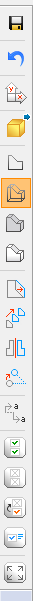
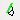
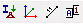
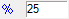

# A Főképernyő

<!-- wp:paragraph -->

A főképernyő hét fő részből áll:

<!-- /wp:paragraph -->

<!-- wp:image {"align":"center","id":6857,"width":"1024px","height":"555px","sizeSlug":"large","linkDestination":"media","className":"is-style-default"} -->

- A legnagyobb méretű rész, a [grafikus ablak](#Grafikus-ablak) (#1), ami a 3 dimenziós modell elkészítésére, megjelenítésére szolgál.

- A felső [főmenü ](#fomenu)tartalmazza az alapvető parancsokat (#2)

- A tervezés menetének megfelelő sorrendben elhelyezett [füleken ](#fulek)találhatóak az egyes lépések során használatos funkciók. (#3)

- A [bal oldali sáv](#oldalsav) (#3) tartalmazza a modellezés során legtöbbször használt funkciókat: pl.: raszter-, koordináta-rendszer-, és nézetváltoztatás, objektumok kijelölése, mozgatása/másolása.

- A [Descript ](#Descript-szerkesztő)felugró panel a parametrikus programozásra szolgál (#5)

- A képernyő alján található [állapotsávon ](#allapotsor)(#6) érhetőek el a modellezést segítő beállítási lehetőségek és a különböző objektumok, adatok láthatóságát szabályozó kapcsolók.

- A [jobb oldali paneleken](#oldalpanel) (#7) fent az objektum ablak biztosítja a modell gyors áttekintését, és a részmodellek kezelési funkcióit is. Alatta található, a kiválasztott objektumok paramétereit tartalmazó ablak, amely a paraméterek áttekintését és gyors módosítását teszi lehetővé.

### Grafikus ablak

A 3D modell megjelenítése történik a grafikus ablakban. A megjelenítési módok széleskörűen változtathatók. A grafikus ablak a globális koordináta-rendszer (_GKR_) tengelyeinek bal alsó sarokban történő kijelzésével, a mozgatható, forgatható és átméretezhető raszter hálóval a rajzolást és a modellezést nagyban segíti. A [_globális koordináta-rendszer (GKR)_](/hu/manual/geometria-rajzolasa/koordinata-rendszerek/) helyzete és tengelyirányai nem változtathatóak. A _[felhasználói koordináta-rendszer (FKR)](https://consteelsoftware.com/hu/manual/geometria-rajzolasa/koordinata-rendszerek/#felhasznaloi-koordinatarendszer-lokalis-koordinata-rendszer)_ középpontja mindig a raszter háló középpontjában helyezkedik el, illetve a raszter háló síkja az _FKR_ „XY” síkjával esik egybe. Szerkesztés ás modellezés során az alábbi mozgatási és gyors nézet beállítások, használhatóak:

- A képernyőablak mozgatása\: a középső egérgomb lenyomva tartása mellett az egér mozgatásával, vagy a billentyűzet nyíl billentyűinek használatával

* Nézet forgatása: az Alt billentyű és bal egérgomb nyomva tartása mellett az egérmozgatásával. A forgatás középpontja mindig az adott nézet középpontjával egyezik meg

- Nagyítás, kicsinyítés: középső egérgomb (görgő) forgatásával vagy a + és - gombokkal, illetve az Alt billentyű és a jobb egérgomb egyidejű lenyomásával és mozgatásával

* Ablakos nagyítás: Shift+Alt billentyűk lenyomása mellett, a bal egérgombbal történő ablakos kijelöléssel

- Nézetváltás 5 gyorsbillentyű parancsa:

  - Ctrl+1: Felülnézet
  
  - Ctrl+2: Elölnézet
 
  - Ctrl+3: Oldalnézet
 
  - Ctrl+4: Axonometria
  
  - Ctrl+5: Aktuális raszter síkra merőleges nézet
  
  - Ctrl+0: Teljes nézet

### A menü

A _Consteel_ menüi tartalmazzák az összes parancsot. A legtöbb funkció a füleken és az oldalsávokon elhelyezett ikonokkal érhetőek el. A menüsoron 6 fontos funkciócsoport található: _[Fájl ](#File-menu)_műveletek, néhány _[Szerkesztési ](#Edit-menu)_opció (visszavonás-ismétlés), _[Nézet ](#View-menu)_beállítások és diagnosztika, _[Op](http://xxx)[c](#Options-menu)[iók ](http://xxx)_a beállításhoz (mentés, programfrissítés, program nyelv és modell diagnosztika), _[Szabványok ](#Standards-menu)_a tervezési paraméterek áttekintése és új paraméterek létrehozása, és a _[Súgó](#sugo-menu)_. A Consteel 14 és Consteel 15 bizonyos menüi eltérnek egymástól. A menüpont után zárójelben van jelezve, melyik verzióra érvényes.

#### Fájl menü

Consteel 14

Consteel 15

_Project Center_ (CS15)

A _[Project Center](https://consteelsoftware.com/hu/manual/altalanos-ismertetes/a-szoftver-telepitese-es-futtatasa/#cs15projectcenter)_-t lehet innen megnyitni.

<!-- /wp:paragraph -->

<!-- wp:paragraph -->

_Új modell_...

<!-- /wp:paragraph -->

<!-- wp:paragraph {"editorskit":{"indent":60,"devices":false,"desktop":true,"tablet":true,"mobile":true,"loggedin":true,"loggedout":true,"acf_visibility":"","acf_field":"","acf_condition":"","acf_value":"","migrated":false,"unit_test":false}} -->

Új modell létrehozása egy új Consteel példány elindításával. (Minden modell külön Consteel példányban fut.)

<!-- /wp:paragraph -->

<!-- wp:image {"align":"right","id":31108,"sizeSlug":"full","linkDestination":"media"} -->

<!-- /wp:image -->

<!-- wp:paragraph -->

Modell attribútum

<!-- /wp:paragraph -->

<!-- wp:paragraph {"editorskit":{"indent":60,"devices":false,"desktop":true,"tablet":true,"mobile":true,"loggedin":true,"loggedout":true,"acf_visibility":"","acf_field":"","acf_condition":"","acf_value":"","migrated":false,"unit_test":false}} -->

A modell rövid leírása és a tervezési szabvány adható meg, illetve változtatható meg. A modell ezen adatai munka során bármikor módosíthatók.

<!-- /wp:paragraph -->

<!-- wp:paragraph -->

_Legutóbbi modellek_ (CS15)

<!-- /wp:paragraph -->

<!-- wp:paragraph {"editorskit":{"indent":60,"devices":false,"desktop":true,"tablet":true,"mobile":true,"loggedin":true,"loggedout":true,"acf_visibility":"","acf_field":"","acf_condition":"","acf_value":"","migrated":false,"unit_test":false}} -->

Megnyitja a _[Project Center](https://consteelsoftware.com/hu/manual/altalanos-ismertetes/a-szoftver-telepitese-es-futtatasa/#cs15projectcenter)_ legutóbbi modellek nézetét.

<!-- /wp:paragraph -->

<!-- wp:paragraph -->

_Megnyitás (CS14) és Megnyitás a számítógépről (CS15)_

<!-- /wp:paragraph -->

<!-- wp:paragraph {"editorskit":{"indent":60,"devices":false,"desktop":true,"tablet":true,"mobile":true,"loggedin":true,"loggedout":true,"acf_visibility":"","acf_field":"","acf_condition":"","acf_value":"","migrated":false,"unit_test":false}} -->

A normál Windows file megnyitási dialóg jelenik meg.

<!-- /wp:paragraph -->

<!-- wp:paragraph -->

_Megnyitás a felhőből _(Beta) (CS15)

<!-- /wp:paragraph -->

<!-- wp:paragraph {"editorskit":{"indent":60,"devices":false,"desktop":true,"tablet":true,"mobile":true,"loggedin":true,"loggedout":true,"acf_visibility":"","acf_field":"","acf_condition":"","acf_value":"","migrated":false,"unit_test":false}} -->

Megnyitja a felhő tárhelyet. A felhő szolgáltatásokat a Steelspace platform biztosítja. További információ: _[Felhőszolgáltatások](https://consteelsoftware.com/hu/manual/altalanos-ismertetes/a-szoftver-telepitese-es-futtatasa/#cs15cloudopen)_

<!-- /wp:paragraph -->

<!-- wp:image {"align":"right","id":27768,"width":"219px","height":"171px","sizeSlug":"full","linkDestination":"media"} -->

<!-- /wp:image -->

<!-- wp:paragraph -->

_Mentés_

<!-- /wp:paragraph -->

<!-- wp:paragraph {"editorskit":{"indent":60,"devices":false,"desktop":true,"tablet":true,"mobile":true,"loggedin":true,"loggedout":true,"acf_visibility":"","acf_field":"","acf_condition":"","acf_value":"","migrated":false,"unit_test":false}} -->

Elmenti a modellt a korábban megadott helyre. A Consteel 15 esetében, az első mentés előtt egy felugró ablakban választani kell lokális és felhő mentés között.

<!-- /wp:paragraph -->

<!-- wp:paragraph -->

M*entés másként...*

<!-- /wp:paragraph -->

<!-- wp:paragraph {"editorskit":{"indent":60,"devices":false,"desktop":true,"tablet":true,"mobile":true,"loggedin":true,"loggedout":true,"acf_visibility":"","acf_field":"","acf_condition":"","acf_value":"","migrated":false,"unit_test":false}} -->

Elmenti a modellt új néven, új helyre.

<!-- /wp:paragraph -->

<!-- wp:paragraph {"editorskit":{"indent":60,"devices":false,"desktop":true,"tablet":true,"mobile":true,"loggedin":true,"loggedout":true,"acf_visibility":"","acf_field":"","acf_condition":"","acf_value":"","migrated":false,"unit_test":false}} -->

Saves the model in another storage space. A Consteel 15 esetében, a mentés előtt egy felugró ablakban választani kell lokális és felhő mentés között.

<!-- /wp:paragraph -->

<!-- wp:paragraph {"editorskit":{"indent":60,"devices":false,"desktop":true,"tablet":true,"mobile":true,"loggedin":true,"loggedout":true,"acf_visibility":"","acf_field":"","acf_condition":"","acf_value":"","migrated":false,"unit_test":false}} -->

Lokális mentést választva a szokásos Windows '_Fájl mentése_' párbeszédablak jelenik meg..

<!-- /wp:paragraph -->

<!-- wp:paragraph {"editorskit":{"indent":60,"devices":false,"desktop":true,"tablet":true,"mobile":true,"loggedin":true,"loggedout":true,"acf_visibility":"","acf_field":"","acf_condition":"","acf_value":"","migrated":false,"unit_test":false}} -->

Felhő mentést (Beta) választva a Steelspace által szolgáltatott felhőtárhely modell könyvtára jelenik meg, ahová el lehet menteni a modellt. További információ: [Cloud save](https://consteelsoftware.com/hu/manual/fajlkezeles/felhotarhely-szolgaltatasok/#cs15cloudsave)

<!-- /wp:paragraph -->

<!-- wp:paragraph -->

_Megosztás (Beta)(CS15)_

<!-- /wp:paragraph -->

<!-- wp:paragraph {"editorskit":{"indent":60,"devices":false,"desktop":true,"tablet":true,"mobile":true,"loggedin":true,"loggedout":true,"acf_visibility":"","acf_field":"","acf_condition":"","acf_value":"","migrated":false,"unit_test":false}} -->

A felhőbe mentett modellek megoszthatók más Consteel-felhasználókkal, akik rendelkeznek online fiókkal. A megosztással kapcsolatos további részletek itt találhatók: _[modell megosztás](https://consteelsoftware.com/hu/manual/fajlkezeles/felhotarhely-szolgaltatasok/#cs15sharing)_.

<!-- /wp:paragraph -->

<!-- wp:paragraph -->

_Import_

<!-- /wp:paragraph -->

<!-- wp:image {"align":"left","id":31121,"sizeSlug":"medium","linkDestination":"media"} -->

<!-- /wp:image -->

<!-- wp:paragraph {"editorskit":{"indent":60,"devices":false,"desktop":true,"tablet":true,"mobile":true,"loggedin":true,"loggedout":true,"acf_visibility":"","acf_field":"","acf_condition":"","acf_value":"","migrated":false,"unit_test":false}} -->

Az Import menü számos modell importálási lehetőséget tartalmaz, a legegyszerűbb DXF formátumú drótváz importálásától, a széles körben használt IFC-n keresztül egészen a teljes, terhelést is magában foglaló Dlubal és SAP2000 modellek importálásáig. További infó: _[Fájlkezelés](/manual/fajlkezeles/)_.

<!-- /wp:paragraph -->

<!-- wp:spacer {"height":"1px"} -->

<!-- /wp:spacer -->

<!-- wp:paragraph -->

_Export_

<!-- /wp:paragraph -->

<!-- wp:image {"align":"left","id":27751,"width":"295px","height":"218px","sizeSlug":"full","linkDestination":"media"} -->

<!-- /wp:image -->

<!-- wp:paragraph {"editorskit":{"indent":60,"devices":false,"desktop":true,"tablet":true,"mobile":true,"loggedin":true,"loggedout":true,"acf_visibility":"","acf_field":"","acf_condition":"","acf_value":"","migrated":false,"unit_test":false}} -->

A funkciók segítségével, a kiválasztott modellrész kiexportálható _TEKLA Structures_ programba vagy IFC formátumban, illetve számított födém vasmennyiség esetén, a színezett eredménymegjelenítés kiexportálható DXF formátumba. További infó: _[Fájlkezelés](/manual/fajlkezeles/)_.

<!-- /wp:paragraph -->

<!-- wp:spacer {"height":"1px"} -->

<!-- /wp:spacer -->

<!-- wp:paragraph -->

_Update_

<!-- /wp:paragraph -->

<!-- wp:paragraph {"editorskit":{"indent":60,"devices":false,"desktop":true,"tablet":true,"mobile":true,"loggedin":true,"loggedout":true,"acf_visibility":"","acf_field":"","acf_condition":"","acf_value":"","migrated":false,"unit_test":false}} -->

Csatlakoztatott Tekla modell esetén (korábbi Tekla export vagy import után), a Consteel modell változásainak megfelelően frissíthető a Tekla modell ezzel a paranccsal. További információ: _[Tekla model update](/manual/fajlkezeles/tekla-structures-modellek-importalasa-exportalasa-es-frissitese/#tekla-update)_.

<!-- /wp:paragraph -->

<!-- wp:heading {"level":4} -->

#### Edit menü

<!-- /wp:heading -->

<!-- wp:image {"align":"left","id":31080,"sizeSlug":"full","linkDestination":"none"} -->

<!-- /wp:image -->

<!-- wp:paragraph -->

Szokásos Windows szolgáltatások, amelyek nem igényelnek különösebb magyarázatot. A Kivágás, Másolás és Beillesztés parancsok csak a táblázatokban használhatók.

<!-- /wp:paragraph -->

<!-- wp:spacer {"height":"1px"} -->

<!-- /wp:spacer -->

<!-- wp:heading {"level":4} -->

#### Nézet menü

<!-- /wp:heading -->

<!-- wp:paragraph -->

Consteel 17

<!-- /wp:paragraph -->

<!-- wp:image {"id":71855,"width":"226px","height":"auto","sizeSlug":"full","linkDestination":"none"} -->

<!-- /wp:image -->

<!-- wp:paragraph -->

A többi ablak mellett a Modell tartalma ablak is külön be- és kikapcsolható a Részletmodellek ablaktól függetlenül.

<!-- /wp:paragraph -->

<!-- wp:paragraph -->

Consteel 16

<!-- /wp:paragraph -->

<!-- wp:image {"align":"left","id":31073,"sizeSlug":"full","linkDestination":"none"} -->

<!-- /wp:image -->

<!-- wp:paragraph -->

A nézet funkciók segítségével megjeleníthető vagy kikapcsolható az Objektumfa és az Objektumok tulajdonsága ablakok (Oldalpanel), valamint a Státusz sor, a Diagnosztika ablak, az Analízis visszajelzések, illetve a Descript felülete.

<!-- /wp:paragraph -->

<!-- wp:paragraph -->

Az Objektum méretei… funkcióval az alábbi objektumok megjelenítési méretei állíthatóak be:

<!-- /wp:paragraph -->

<!-- wp:image {"align":"center","id":31150,"sizeSlug":"full","linkDestination":"none"} -->

<!-- /wp:image -->

<!-- wp:heading {"level":4} -->

#### Opciók menü

<!-- /wp:heading -->

<!-- wp:paragraph -->

Az Opciók menüben a következő beállítási lehetőségek találhatóak:

<!-- /wp:paragraph -->

<!-- wp:paragraph -->

Consteel 17

<!-- /wp:paragraph -->

<!-- wp:image {"id":71885,"width":"404px","height":"auto","sizeSlug":"full","linkDestination":"none"} -->

<!-- /wp:image -->

<!-- wp:paragraph -->

Consteel 16

<!-- /wp:paragraph -->

<!-- wp:paragraph -->

_Mentés_, _Frissítés_, _Nyelv, Háttérszín, Stílusok, Diagnosztika_ és _Idea StatiCa átmenet_.

<!-- /wp:paragraph -->

<!-- wp:paragraph -->

Consteel 15

<!-- /wp:paragraph -->

<!-- wp:paragraph -->

_Mentés_, _Frissítés_, _Nyelv_, _Stílusok_, _Diagnosztika_ és _Idea StatiCa átmenet_.

<!-- /wp:paragraph -->

<!-- wp:paragraph -->

_Mentés_

<!-- /wp:paragraph -->

<!-- wp:image {"align":"left","id":31094,"width":"322px","height":"221px","sizeSlug":"full","linkDestination":"media"} -->

Opciók menü - Mentés

<!-- /wp:image -->

<!-- wp:paragraph -->

Ha az Automatikus mentés funkció be van kapcsolva, a program a megadott időközönként automatikus mentéseket készít. Ha a Biztonsági másolat funkció be van kapcsolva, akkor a _Consteel_ biztonsági másolatot hoz létre a modellről, _de csak az első manuális mentést követően_! A biztonsági mentési fájl tartalma azonos a mentéskori modellfájl tartalmával, a fájl kiterjesztése azonban a .bak kiterjesztéssel bővül, melynek eltávolításával a biztonsági mentési fájl a \_Consteel-\_ba betölthető.

<!-- /wp:paragraph -->

<!-- wp:paragraph {"editorskit":{"indent":60,"devices":false,"desktop":true,"tablet":true,"mobile":true,"loggedin":true,"loggedout":true,"acf_visibility":"","acf_field":"","acf_condition":"","acf_value":"","migrated":false,"unit_test":false}} -->

Korábbi modellek konvertálása az aktuális verzióba (csak a 14-es verziótól)

<!-- /wp:paragraph -->

<!-- wp:paragraph {"editorskit":{"indent":60,"devices":false,"desktop":true,"tablet":true,"mobile":true,"loggedin":true,"loggedout":true,"acf_visibility":"","acf_field":"","acf_condition":"","acf_value":"","migrated":false,"unit_test":false}} -->

Ha a biztonsági másolat funkció aktív, valamely korábbi verzióban készült modell aktuális Consteel verzióban történő első elmentésekor automatikusan készül egy biztonsági másolat az eredeti verzió formátumában. Ennek a másolatnak a fájlneve az alábbi séma alapján jön létre: \_modell_fájl_név – Consteel XX.bak (\_ahol XX = az adott verzió száma).

<!-- /wp:paragraph -->

<!-- wp:paragraph -->

_Részletmodellek kijelölésének megtartása (csak a 17-es verziótól)_

<!-- /wp:paragraph -->

<!-- wp:image {"id":71865,"width":"191px","height":"auto","sizeSlug":"full","linkDestination":"none"} -->

<!-- /wp:image -->

<!-- wp:paragraph -->

A részletmodellek kijelölésének megtartása funkció segítségével a felhasználó megőrizheti ugyanazt a részletmodell kiválasztást, amikor, ha bezárja és újra megnyitja a modellt, feltéve, hogy azt korábban elmentette. Ellenben a modell újbóli megnyitásakor teljes nézet jelenik meg.

<!-- /wp:paragraph -->

<!-- wp:paragraph -->

_Frissítés_

<!-- /wp:paragraph -->

<!-- wp:image {"align":"left","id":31087,"sizeSlug":"medium","linkDestination":"media"} -->

Opciók menü - Frissítés

<!-- /wp:image -->

<!-- wp:paragraph {"editorskit":{"indent":60,"devices":false,"desktop":true,"tablet":true,"mobile":true,"loggedin":true,"loggedout":true,"acf_visibility":"","acf_field":"","acf_condition":"","acf_value":"","migrated":false,"unit_test":false}} -->

A frissítése funkció minden indításkor ellenőrzi az interneten, hogy elérhető-e újabb verzió. Ez a funkció itt kikapcsolható. Az ellenőrzés manuálisan is elvégezhető a Frissítés keresése most ( ) ikonra kattintva..

<!-- /wp:paragraph -->

<!-- wp:paragraph {"editorskit":{"indent":60,"devices":false,"desktop":true,"tablet":true,"mobile":true,"loggedin":true,"loggedout":true,"acf_visibility":"","acf_field":"","acf_condition":"","acf_value":"","migrated":false,"unit_test":false}} -->

Felhasználói élmény fokozása

<!-- /wp:paragraph -->

<!-- wp:paragraph {"align":"justify","editorskit":{"indent":40,"devices":false,"desktop":true,"tablet":true,"mobile":true,"loggedin":true,"loggedout":true,"acf_visibility":"","acf_field":"","acf_condition":"","acf_value":"","migrated":false,"unit_test":false}} -->

Azért, hogy termékeink minél jobban megfeleljenek a felhasználóink elvárásainak, a szoftverjeink a használat során anonim információkat gyűjtenek és küldenek arról, hogy felhasználóink miként használják a Consteel és csJoint programokat. A Consteel Solutions Zrt. ezeket az adatokat a termékek továbbfejlesztése, illetve problémamegoldás céljából használja.

<!-- /wp:paragraph -->

<!-- wp:paragraph {"editorskit":{"indent":60,"devices":false,"desktop":true,"tablet":true,"mobile":true,"loggedin":true,"loggedout":true,"acf_visibility":"","acf_field":"","acf_condition":"","acf_value":"","migrated":false,"unit_test":false}} -->

A termékeink az alábbi információkat gyűjtik és küldik el: verzióinformáció, használt funkciók, használati időtartam, földrajzi hely. A küldött információk semmilyen személyes adatot nem tartalmaznak (például név, cím, telefon), a felhasználók azonosítására a Consteel Solutions Zrt. nem használja. Kereskedelmi Consteel és csJoint verziók esetén az információk gyűjtése kikapcsolható az Opciók/Frissítés menüpontban. Kipróbálási és diák verziók esetén az információküldés nem kapcsolható ki.

_Nyelv_

Opciók menü - Nyelv

Itt állítható be a felhasználói felület nyelve, ami a következő nyelvek közül választható: magyar, angol, német, spanyol, olasz, görög, portugál, orosz, kínai, török, lengyel, szlovák, szlovén, román, bolgár, szerb és horvát.

A felhasználói felület nyelvének változtatása a program újraindítását követően érvényesül.

_Háttérszín_ (Consteel 16-tól)

Opciók menü - Háttérszín

A modell képernyő háttérszíne állítható itt be.

_Stílusok_

Opciók menü - Stílusok

A különböző objektumok színeit lehet megadni.

_Diagnosztika_

Opciók menü - Diagnosztika

Analízis indítása előtt, a program ellenőrzi az esetleges modellezési hibákat. Két jelzési szint létezik, amivel a program figyelmeztetheti a felhasználót az esetleges modellezési hibákról:

- Hiba: ha két rúd vagy objektum végpontjainak távolsága 0 és a beállított érték közé esik, a program hibaüzenetet küld, a diagnosztika ablakban piros jelzéssel felsorolja ezeket az elemeket és nem hatja végre a kért analízist.

- Figyelmeztetés: ha két rúd vagy objektum végpontjainak távolsága a hiba beállításnál megadott érték és a figyelmeztetés beállításnál megadott érték közé esik, a program figyelmeztető üzenetet küld és a diagnosztika ablakban sárga jelzéssel felsorolja ezeket az elemeket.

További infót ld. még: _[Modellvizsgálat ](/hu/manual/szerkezetek-analizise/modell-ellenorzes-diagnosztika/)_és _[Diagnosztika ablak](#Diagnostic-window)_

_Teherszétosztás_

Consteel 17-től ez a funkció a Modell beállítások kategóriához tartozik, együtt a Diagnosztikával.

Az Automatikus teherszétosztás kikapcsolható a modellezés sebességének növelése érdekében.

Általában a szoftver automatikusan elosztja a felületi terheket a teher átadó felület segítségével, és az elosztás azonnal megtörténik bármilyen változás után, amely azt indokolja.

Nagy modellek esetén, amelyek több teher átadó felülettel rendelkeznek, ez lassíthatja a modellezési folyamatot. Az automatikus teherszétosztás kikapcsolása a modellezés idejére felgyorsíthatja a folyamatot.

Fontos megjegyezni, hogy amikor ez a funkció ki van kapcsolva, a vonalmenti megoszló teher már nem érvényesek egy új TÁF vagy a felületi teher változásakor. Ennek eredményeként a modellt ebben az állapotban nem lehet analízisnek alávetni. Egy diagnosztika figyelmeztetés jelenik meg. A terhek frissítéséhez, jelölje be a jelölőnégyzetet, vagy kattintson a Diagnosztika figyelmeztetés alatt megjelenő Frissítés gombra.

_IDEA StatiCa átmenet_

Opciók menü - IDEA StatiCa átmenet

A Consteel és az IDEA Statica programok közötti kapcsolat létrehozására itt kell megadni az IDEA telepítési mappáját. A mappa kiválasztásához a beviteli mező végén található mappa  ikonra kell kattintani.

#### Szabványok menü

A menü segítségével egyszerűen és gyorsan áttekinthetjük a program által kezelt szabványok paramétereit, illetve létrehozhatunk saját tervezési paramétereket. A használt tervezési szabvány a _[Fájl menüben](#File-menu)_ állítható be, a _[Modell attribútumok](#Modell-attribútum)_ segítségével.

A szabványfa első sora az alkalmazott tervezési szabványt mutatja, ami a modellbe kerül eltárolásra.

Egyéni szabványbeállítás létrehozása:

- a létrehozás az ablak alján található Új gomb megnyomásával indítható el

 az egyéni szabvány, egy már meglévő szabvány módosításával jön létre, ezért ki kell választani egy már meglévő szabványt

  
  - 
 

- a név mezőbe meg kell adni az új szabvány nevét, majd a zöld pipára kattintva létrejön az új szabvány

* ezután az új szabvány paraméterei megadhatók

Az egyéni szabványbeállítást a program az alábbi fájlba menti: _\\Dokumentumok\\Consteel\\UserStandard.xml_: C:\\Users\\%USERNAME%_\\Dokumentumok\\ConSteel\\ver\\UserStandard.xml_ (ahol a "ver" az aktuális Consteel verziószámát jelöli)

#### Súgó menü

Consteel 17

A menü két kategóriára van osztva, amit a hosszanti sáv választ el, ahogy a képen látható. Az első részre vonatkozó információk megtalálhatók lent, a Consteel16-nál.

A már létező funkciókon kívül az Első lépések gomb segítségével könnyen elérhető a szoftver YouTube oldala. A Gyorsbillentyűk lenyomásával megjelenik egy lista az összes fontos parancsról és azok megfelelő billentyűparancsairól.

A második kategóriához a Support kérdés beküldése gombra kattintva lehet eljutni. Az online ablak megnyílik, és két lehetőség jelenik meg. A problémától függően a felhasználók választhatnak a Consteel támogatás vagy a Steelspace támogatás között.

A Consteel támogatás központban további lehetőségek válnak elérhetővé:

• Támogatási kérés: A legáltalánosabb lehetőség, amikor műszaki támogatásra van szükség.

• Engedélyezési, védelem és frissítési problémák.

• Funkciókérés: Új funkciók vagy meglévők javításának javaslatához.

A Steelspace támogatás a következő célokra szolgál:

• Kaphat segítséget konkrét problémák esetén.

• Hiba bejelentés, amikor problémák merülnek fel a Steelspace használata során.

• Funkciókérés, új funkciók vagy meglévők fejlesztéséhez.

• Kérjen nagyobb sávszélességet.

Consteel 16

(15-ös verziótól érhető el) A menüt két szekcióra osztottuk, az első tartalmazza az elérhetőségeket az “[Consteel kézikönyvhöz](https://consteelsoftware.com/manual/)” és a “[Descript kézikönyvhöz](https://consteelsoftware.com/hu/manual/descript-cspi/)“, valamint az “[Oktatói anyagok](https://consteelsoftware.com/knowledgebase/?search=&filters=366,367,399,392,375,372)” almenüpont segítségével egy előszűrt tudásbázis anyagokat tartalmazó oldal érhető el. Ilyenkor nincs szükség külön bejelentkezésre a honlapunkon, mert a Consteel-t online védelemmel használó felhasználóinkat automatikusan felismeri az oldal.

A második szekció a támogatással kapcsolatos kéréseknek lett kialakítva. A “[Support kérdés beküldése](https://consteel.atlassian.net/servicedesk/customer/portal/1/group/1)” parancs megnyitja a támogató rendszerünk bejelentő oldalát, ahol segítséget lehet kérni a Consteel-el kapcsolatos kérdésekhez. Ha esetleg a licenceléssel adódna gond, akkor a “[Licenceléssel kapcsolatos problémák” ](https://consteel.atlassian.net/servicedesk/customer/portal/1/group/22)parancsra kell kattintani.Számunkra fontos a felhasználók véleménye, így ha valamilyen javaslat vagy kérés merülne fel, elég a “[Felhasználói kérés beküldése](https://consteel.atlassian.net/servicedesk/customer/portal/1/group/23/create/60)” parancsra kattintani és megosztani velünk az igényeket/visszajelzéseket.

### Fülek

A fülek tartalmazzák a modellezés, analízis és tervezés szisztematikusan összegyűjtött funkcióit, végigvezetve a mérnököt a tervezés lépésein. Az elérhető parancsok Consteel verziónként eltérőek lehetnek. Itt mindig az aktuális legújabb verziónak megfelelően mutatjuk be a parancsokat.

A képernyőn megjelenik az ikon neve, ha az egér mutatója az ikon fölött áll.

#### Geometria fül

A szerkesztéshez szükséges rajzolási, módosítási, méretezési és mérési funkciókat tartalmazza. A funkciók részletes bemutatását ld. a _[Geometria rajzolása ](/manual/geometria-rajzolasa/)_c. fejezetben!

#### Szerkezeti elemek fül

A keresztmetszetek kiválasztásával, definiálásával, szerkezeti oszlopok, gerendák, födémek, falak, illetve a támaszok és a kapcsolatok létrehozásához szükséges funkciók találhatóak a fülön. A fenti funkciók mellett, ezen a fülön kaptak helyet további modellezési funkciók is, úgymint a diafragma és merevtest szerkesztő funkciók, keretsarok varázsló, nyírási mező, szelemensor, kivágás és borda, illetve a rúdelemeket lemezelemekké konvertáló funkció is. Az utolsó három parancs a kapcsolatok létrehozására és elhelyezésére szolgál. A funkciók részletes bemutatását ld. a _[Szerkezet modellezése ](/manual/szerkezetmodellezes/)_c. fejezetben!

#### Terhek fül

Különböző teher típusok, illetve teheresetek, tehercsoportok és teherkombinációk létrehozását lehetővé tevő funkciók találhatóak a fülön. Az automatikus meteorológiai teher generálás, daru és vonatteher, és a tűzteher, illetve tűzvédelem funkciói is itt kaptak helyet. A funkciók részletes bemutatását ld. a _[Terhek ](/manual/terhek/)_c. fejezetben!

#### Tömegek fül

Tömegesetek, tömegkombinációk létrehozását lehetővé tévő funkciók találhatóak ezen a fülön. Emellett itt kapott helyet a koncentrált tömeg elhelyezése, földrengés hatás és válaszspektrum felvétele funkció is. A funkciók részletes bemutatását ld. a _[Tömegek ](/manual/tomegek)_c. fejezetben!

#### Végeselem fül

A végeselem generálás létrehozásához és módosításához szükséges funkciókat tartalmazza a fül, illetve az itt található modell ellenőrzés funkció segítségével kiszűrhetőek az esetleges modellezési hibák.

#### Analízis fül

A különböző szerkezeti analízis típusok beállítása és végrehajtása végezhető el. A számítás eredményei megtekinthetőek és feliratozhatóak számos megjelenítési mód alapján. A funkciók részletes bemutatását ld. a _[Szerkezetek analízise ](/manual/szerkezetek-analizise/)_c. fejezetben!

#### Globális vizsgálatok fül

Consteel 17

A Consteel 17-től kezdve a használhatósági határállapotok vizsgálata, valamint a teherbírási határállapotok vizsgálata is be van építve a Globális vizsgálatok fülbe.

Mindkét ellenőrzést külön-külön el lehet végezni, azok megfelelő nyilainak (a kék és a zöld) lenyomásával, illetve együttesen  ikonra kattintva. További részletes információkért látogasson el a [_Standard design_](https://kesz-my.sharepoint.com/manual/standard-design/)\_ \_(Szabványos tervezés) fejezetbe.

A Globális vizsgálatok fül tartalmazza a stabilitás és keresztmetszeti vizsgálat eredményeit, öszvér oszlop ellenőrzéséből kapott eredményeket, illetve vasbeton elemek esetén végeselemes tartományokra vonatkoztatott szükséges vasmennyiség értékét. A funkciók részletes bemutatását ld. a _[Szabványos tervezés ](/manual/szabvanyos-tervezes/)_c. fejezetben!

#### Elem vizsgálatok fül

Az elkülönített elemtervezéshez kapcsolódó (kihajlás, kifordulás és interaktív stabilitás), illetve öszvérgerenda méretezésével kapcsolatos funkciók találhatóak a fülön. A funkciók részletes bemutatását ld. a _[Elem vizsgálatok ](/manual/szabvanyos-tervezes/acelszerkezet-tervezes/#Elem-vizsgálatok)_c. fejezetben!

#### Használhatósági vizsgálatok fül

A használhatósági határállapotok ellenőrzéséhez kapcsolódó funkciók találhatóak a fülön. A funkciók részletes bemutatását ld. a _[Használhatósági vizsgálatok ](/manual/szabvanyos-tervezes/hasznalhatosagi-vizsgalatok/)_c. fejezetben!

#### Fóliák fül

Fóliák kezeléséhez és beállításához tartozó funkciók találhatóak a fülön. További infó a _[Fóliák](/manual/geometria-rajzolasa/foliak/)_ c. fejezetben.

#### Dokumentálás fül

Consteel 17

Consteel 16

A Dokumentálás fül funkciói segítségével hozható létre a részletes statikai dokumentáció, illetve itt található a modell információ is. A használhatósági határállapotok ellenőrzéséhez kapcsolódó funkciók találhatóak a fülön. A funkciók részletes bemutatását ld. a _[Dokumentálás ](/manual/dokumentalas/)_c. fejezetben!

#### Súgó fül

Consteel 17

A kérdőjel ikonra kattintva ugyanazt a Súgó oldalt érheti el, mint amit a [Súgó menüben](#sugo-menu) leírva található.

Consteel 16

A nélkülözhetetlen támogatással kapcsolatos parancsok a “Súgó” fül alatt találhatóak, úgy mint a “[Support kérdés beküldése](https://consteel.atlassian.net/servicedesk/customer/portal/1/group/1)”, a “[Licenceléssel kapcsolatos problémák” ](https://consteel.atlassian.net/servicedesk/customer/portal/1/group/22)vagy a “[Felhasználói kérés beküldése](https://consteel.atlassian.net/servicedesk/customer/portal/1/group/23/create/60)”, hogy a segítségkérés még könnyebben elérhető legyen a grafikus felületről.

### Oldalsáv

Consteel 17

Consteel 17-től kezdve a Mozgatás és Másolás funkciók most már két különböző gombbal vannak elkülönítve.

Consteel 16

Az oldalsáv a modellezés során leggyakrabban használt funkciókat tartalmazza.

Modell mentése

Visszavonás/Ismétlés

Koordináta-rendszer és a raszter háló beállítása

Modell nézetek: Felül-, Elöl-, Oldal-, Izometrikus-, Raszterre merőleges nézet

Egyvonalas megjelenítés

Drótváz modell megjelenítés

Takart vonalas megjelenítés

Test nézet megjelenítés

Pont, és él mozgatása

Mozgatás/Másolás

Tükrözés

Forgatás

Metszősík elhelyezése (csak héjmodelleknél)

Összes objektum kijelölése

Összes kijelölés megszüntetése

Kijelölés megfordítása

Tulajdonságok szerinti kijelölés

Befoglaló nézet (Ctrl+0)

### Descript szerkesztő(14-es vagy korábbi verziókban 'csPI')

A képernyő bal alsó sarkában található a Descript szerkesztő panelje, melyet a  ikonnal nyithatunk meg. A Descript a ConSteel programozási felülete, amellyel parametrikus modellek építhetők. A Consteel szinte összes szerkezeti objektuma létrehozható, és ezen objektumok összes paramétere meghatározható/módosítható a Descript segítségével. Részletes leírását ld. a _[Descript - a Consteel programozása](/manual/descript-cspi/)_ c. fejezetben!

### Állapotsor

Az állapotsor első mezője egy állapot csík, amely az aktuális folyamatok futásának állapotát jelzi.

Az állapotsor következő 3 ikonja ( ) a modellezés, rajzolás során megadott koordinátaértékek térbeli irányának meghatározását teszik lehetővé. A koordináta értékek manuális megadása a megfelelő billentyű megnyomásával történik (“X, Y, Z, L” billentyűk a derékszögű koordináta-rendszer és hossz megadása esetén, “a, b, L” pedig polár koordináta-rendszer esetén). A következő beállítások döntik el a megadott koordináták értelmezését:

Koordináták megadása  globális (GCS), vagy  felhasználói (UCS) koordináta-rendszerben lehetséges,  abszolút (a koordináta-rendszer origójától értelmezve), vagy  relatív (az aktuális beillesztési ponttól) értelemben. ( a beillesztési pontot  sárga pötty jelöli a grafikus térben, módosítani az Insert billentyűvel lehet). Végül a harmadik ikonnal válthatunk  derékszögű, vagy  poláris bevitel között.

Hasonlóan a poláris bevitelhez, a derékszögű rendszerben is lehetséges egy pont meghatározása irány és távolság megadásával. Az első pont megadása után, például egy új gerenda rajzolásánál, a következő pont megadásához a kurzort a kívánt irányba mozgatva és az 'L' billentyűt lenyomva, a kurzor az "L" mezőbe ugrik, ahol manuálisan meg lehet adni a kívánt hosszt. Az ENTER lenyomására a gerenda létrejön az adott irányban és a beírt hosszal.

A csúszka () mozgatásával az objektumok megjelenítési méretei változtathatóak. Jobb egérgombbal történő rákkattintás esetén az egyes objektum típusok külön-külön is módosíthatók. A következő ( ) ikonok a különböző objektumok láthatóságát szabályozzák. Ezen ikonok egérrel történő megközelítése esetén megjelennek a láthatóság ki-/bekapcsolásának ikoncsoportjai.

Mindegyik csoport bal szélén található a beállítás érvényességét meghatározó ikon, mely lehet globális (érvényes az összes fülön), vagy  lokális (csak az aktuális fülön érvényes). A módosítás az összes láthatósági ikoncsoportra vonatkozik. Ez a hatókör változtatás megváltoztatja a fülekre korábban alkalmazott globális és a fülre alkalmazott lokális beállításokat is.

Objektumok méretezése

A csúszkára jobb kattintással megnyílik az objektum méretezési ablak. Ebben az ablakban az egyes modellobjektumok méretét lehet módosítani.

Az ablakot a Nézet menüből is megnyithatja. További információkért látogasson el a Nézet menübe.

#### Grafikus szimbólumok láthatósága 

-  Vonalak láthatósága. A Geometria fül vonal, kör és körív funkcióival rajzolt elemeket érinti.

-  Szerkezeti elemek láthatósága. A Szerkezeti elemek fül oszlop vagy gerenda szerkesztés funkciójával létrehozott elemekre vonatkozik. Kikapcsolt állapotban a szerkezeti elemek középvonalai láthatók maradnak, ha a vonalak () láthatósága be van kacsolva

-  Csuklók láthatósága (vég folytonosság)

-  Síkidomok láthatósága. Kikapcsolt állapotban a síkidomok határoló vonalai láthatók maradnak, ha a vonalak () láthatósága be van kapcsolva

-  A 3D felületi elemek (lemez és fal) láthatósága. Kikapcsolt állapotban a 3D felület határoló vonalai és síkidom komponense láthatóak maradnak, ha a vonalak () és síkidomok () láthatósága be van kapcsolva

-  Támaszok láthatósága

-  Kapcsolati elemek láthatósága  
   Okos kapcsolati elem láthatósága  
   Elhelyezett csomópontok szimbólumának láthatósága

-  Elhelyezett kezdeti görbeség szimbólumának láthatósága

-  Nyírási mező szimbólumának láthatósága

-  Keretsarok szimbólumának láthatósága

-  Terhek láthatósága (pont, vonal és felületi teher)

-  Teherátadó felület láthatósága. Kikapcsolt állapotban a síkidomok határoló vonalai láthatók maradnak, ha a vonalak () láthatósága be van kacsolva

-  Szétosztott felületi teher megjelenítése

-  Tömegek megjelenítése

-  Kényszerek láthatósága

-  Merev testek láthatósága  
   Diafragmák láthatósága  
   Szelemensorok láthatósága

-  Merevítők láthatósága

-  Gerinckivágások láthatósága

#### Lokális koordináta-rendszerek láthatósága (LCS) 

-  Raszter láthatósága

-  Modell raszter láthatósága

-  A szerkezeti elemek lokális koordináta-rendszerének láthatósága (gerenda, oszlop)

-  3D felületi elemek lokális koordináta-rendszerének láthatósága (lemez, fal)

-  Támaszok lokális koordináta-rendszerének láthatósága

-  Kapcsolati elemek lokális koordináta-rendszerének láthatósága

-  Okos kapcsolati elem lokális koordináta-rendszerének láthatósága

-  Teher átadó felületek lokális koordináta-rendszerének láthatósága

> Megjegyzés:

> Ha egy objektumok láthatóságát kikapcsoljuk, akkor az objektum lokális koordináta-rendszerének láthatósága is megszűnik!

#### Azonosítók láthatósága 

-  Végeselem pontok sorszámainak láthatósága. (Csak a Végeselem és az Analízis fülön látható!)

-  Rúdelemek neveinek láthatósága

-  3D felületelemek neveinek láthatósága (lemez, fal)

-  Támaszok neveinek láthatósága

-  Csuklók (vég folytonosság) neveinek láthatósága

-  Kapcsolati elemek neveinek láthatósága

-  Okos kapcsolati elem neveinek láthatósága

-  Elhelyezett csomópontok neveinek láthatósága

-  Teherátadó felületek neveinek láthatósága

-  Nyírási mező azonosítójának láthatósága

-  Vasalási objektum azonosítójának láthatósága

-  Kényszerek neveinek láthatósága

-  Merev testek neveinek láthatósága

-  Diafragmák neveinek láthatósága

-  Szelemensorok neveinek láthatósága

-  Merevítők neveinek láthatósága

-  Gerinckivágások neveinek láthatósága

-  Modell raszter neveinek láthatósága

> Megjegyzés:

> Ha egy objektumok láthatóságát kikapcsoljuk, akkor az objektum nevének láthatósága is megszűnik!

#### Feliratok láthatósága 

-  Anyagminőségek láthatósága

-  Szelvénynevek láthatósága

-  Lemezvastagságok láthatósága (mm)

-  Teherintenzitás láthatósága

-  Tömegek feliratának megjelenítése

-  Kezdeti görbeség láthatósága

-  Keretsarok feliratának láthatósága

-  Mértékegységek láthatósága

-  Lokális koordináta-rendszerek tengelyneveinek láthatósága

#### Objektumok színének meghatározása

-  Szerkezeti elemek színezése az alapértelmezett módon (layer vagy anyag színek)

-  Szerkezeti elemek színezése szelvény színek alapján (további infót ld. a _[Szelvénykezelő](/manual/szerkezetmodellezes/szelvenykezelo/)_ c. fejezetben!)

#### Fogópont beállítások

A Fogópont beállítások ikoncsoport funkciói számos beállítási lehetőséget kínálnak a hatékony modellezés elősegítéséhez:

-  Végponti fogópontok (vonalak, ívek, szerkezeti elemek)

*  Felosztási funkció Be / Ki

  - Be

    - Bekapcsolt állapotban megjelenik a felosztási mező az állapotsoron. Osztópontok megadása háromféle képen történhet. A felhasználó a mező előtt látható ikonra kattintással választhat ezek közül:

      -  a megadott százalékos érték alapján kerülnek elhelyezésre az osztópontok a szerkezeti elemek hossza mentén. A távolságokat a kurzorral megközelített végponttól jelöli ki a program. Általában maradéktávolság adódik.
   
      -  távolság érték adható meg. A kurzorral megközelített végponttól kerülnek felmérésre a fogópontok. Általában maradéktávolság adódik.
  
      -  a felosztás darabszáma adható meg. Ez esetben nincs maradék távolság.

  * Ki: A mező eltűnik az állapotsorból

-  Grafikai vagy szerkezeti elemek metszéspontjai. Vonalak, körök, ívek, szerkezeti elemek (gerendák, oszlopok)

*  Egyenes objektummal párhuzamos fogópontok megjelenítése (csak kisebb modellek esetén javasoljuk a bekapcsolását)

-  A kurzorhoz legközelebbi elemhez tartozó fogópont megjelenítése

*  Egyenes elem meghosszabbítása adott távolsággal. A rendszer mutatja az aktuális pont távolságát (mm). A meghosszabbítás értékének lépéseit az állapotsor utolsó mezőjében lehet megadni (mm)

-  Szerkezeti pontok

*  Raszterháló pontjai

-  Ív/kör érintő pontjainak meghatározása adott pontból

*  Egy pontból egy egyenesre, ívre, körre merőleges pont kijelölése

-  Ív/kör középpontjának kijelölése

Egyenes elemek középpontjának megfogása a felosztás  funkció megfelelő beállításával érhető el. Ld. fentebb

#### Meghosszabbítás lépésköze

Az állapotsor utolsó mezője a meghosszabbítás lépésköze. A mezőben megadott szám, a meghosszabbítás lépésközét adja meg mm-ben, amennyiben a meghosszabbítás  funkció aktív.

### Objektumfa, Objektum tulajdonságok és Diagnosztika ablakok

Ezek az ablakok a [Nézet ](#View-menu)menüben kapcsolhatók ki/be. A program indításánál alapértelmezetten a Diagnosztika ablaka kikapcsolt állapotban, a másik kettő bekapcsolt állapotban van, és a képernyő jobb szélén jelennek meg. Az ablakok a címsoron történő Fogd-és-vidd művelettel (drag&drop) áthelyezhetők, és a képernyő bármely széléhez dokkolhatók.

Consteel 17

Részletmodellek fül

A Modellrészek ablak alapértelmezett pozíciója a jobb felső sarokban található. Két részre oszlik: Egyedi részletek és Auto részletek.

Részletes leírásért lásd a Modellnézeteket és a Részletek kezelőjét!

Objektum tulajdonságok

Az Objektum tulajdonságok fülön (alapértelmezetten az ablak jobb alsó részén) az elemek kezdeti és végpontjai azonosíthatók; ezeket sárgával és magentával jelzik.

A színes pont méretének növeléséhez menjen a nézet panelre, objektumok méreteire, és módosítsa azt a lokálrendszerből, ahogy azt a lenti képen láthatja:

Modell tartalma fül (Ctrl+Q)

A Modell tartalma fül tartalmazza az összes előre meghatározott alap objektumtípust, amelyekkel szerkezeti modellt lehet építeni. További részletekért lásd a Kiválasztás fejezetet és a Consteel 16-ot.

Consteel 16

#### Objektumfa ablak

Az alapértelmezett helye a képernyő jobb felső sarka. Két fül található az Objektumfa ablakon:

Modell tartalma fül

A modellfa alapesetben is tartalmazza azokat az objektum csoportokat, amelyek szükségesek egy szerkezet felépítéséhez.

Modellezés során minden új objektum (anyagminőségek, szelvények, terhek, támaszok stb.) bekerül a modellfa megfelelő csoportjaiba. Objektumok a fastruktúrában is kijelölhetőek. A kiválasztott elemek a modelltérben is kijelöltek lesznek. Többszörös kijelölés is lehetséges a szokásos módon a CTRL vagy a SHFT billentyűk használatával.

Részlet kezelő fül

Részlet kezelő használatának leírását ld. a [Részlet kezelő](/manual/modell-nezet/reszlet-kezelo/) c. fejezetben!

#### Diagnosztika ablak

Consteel 17

A Consteel 17-től kezdve a már meglévő hibaüzenetek mellett megjelenik egy narancssárga színű hibaüzenet is.

Ez a hiba akkor jelentkezik, amikor az automatikus terheléselosztás ki van kapcsolva és a modellben olyan változás történik, amely indokolja a terhek újraosztását a helyes eredmény eléréséhez. A terheléseket a modell új állapotához való frissítéshez jelölje be a négyzetet, vagy kattintson a diagnosztika üzenet alatt megjelenő Frissítés gombra.

További információkért kérjük, látogasson el az Opciók>[Terheszétosztás](#teherszetosztas) menüpontba.

Consteel 16

Geometriai vagy modellezési hibák (egy vagy több elem átfedése, hiányzó támasz stb…) észlelése esetén a Diagnosztika ablak automatikusan megjelenik, kijelezve a problémás elemeket.

A Diagnosztika ablakban a hiba üzenetek piros színnel, a figyelmeztetések pedig sárga színnel kerülnek megjelenítésre.

A Diagnosztika ablakban kiválasztott objektum a _Kijelöl \_gomb megnyomásával a modelltérben is kijelölésre kerül. A Shift vagy Ctrl billentyűk egyidejű lenyomásával a többszörös kijelölés is lehetséges. Egy probléma címsorára kattintva az összes hozzá tartozó objektum kijelölésre kerül. A kiválasztott objektum/ok a _Töröl \_gomb, vagy a Delete billentyű segítségével kitörölhető(ek).

#### Objektum tulajdonságok ablak

Az ablak alapértelmezett helye a jobb alsó sarok. Minden kiválasztott objektum (és alobjektum) összes tulajdonsága megjelenik az Objektum tulajdonságok ablakban (#1). Az egyes paraméterek megtekinthetők, illetve a legtöbb paraméter módosítható is. Ha több azonos csoportba tartozó objektumot választunk ki, akkor a kiválasztott objektumok azonos paraméterei olvashatóak, az eltérőek helyén az „eltérő” szöveg kerül kijelzésre. Az eltérő értékek is átírhatók, és így az összes kijelölt objektumra megadható egy egységes, új érték.

Különböző típusú objektumok kiválasztása esetén, azok objektum típusonként csoportosítva jelennek meg. Az egyes csoportok az előttük található kis "+" ikonnal nyithatók ki, "-" ikonnal zárhatók be.

A kijelölés megszüntetése () gombbal, az előzőleg kiválasztott objektum típusok kivonhatóak a kiválasztásból.

