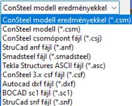

# Fájltípusok

<!-- wp:paragraph -->

A **Consteel 15** által kezelt fájltípusok:

<!-- /wp:paragraph -->

<!-- wp:image {"align":"left","id":32506,"width":199,"height":110,"sizeSlug":"full","linkDestination":"media"} -->

<!-- /wp:image -->

<!-- wp:paragraph -->

**.csm**: a ConsteelModel fájl, natív bináris formátumú. Megnyitható korábban számított eredményeket tartalmazó eredményfájllal együtt, vagy eredmények betöltése nélkül. Az eredményeket a **.csr** (ConsteelResult) kiterjesztésű fájlban tárolja a program. Ez a fájl önmagában nem nyitható meg és nem menthető. A **.csm** fájl menthető és megnyitható.

<!-- /wp:paragraph -->

<!-- wp:paragraph -->

**.csm**: az automatikus mentés által létrehozott modellfájl. Az automatikus mentés időintervalluma az [_**Opciók**_ ](../1_0_general-description/1_2_the-main-window#opciók-menü)menüben állítható.

<!-- /wp:paragraph -->

<!-- wp:paragraph -->

**.csm.bak**: a biztonsági mentés által létrehozott fájl. A biztonsági mentés az [_**Opciók**_ ](../1_0_general-description/1_2_the-main-window.md#opciók-menü)menüben állítható be. Biztonsági mentés minden manuális mentésnél létrejön és tárolja az előzőleg mentett modell állapotot. Szükség esetén a **.bak** kiterjesztés törölhető, ezáltal a fájl, mint modellfájl betölthető a programba.

<!-- /wp:paragraph -->

<!-- wp:paragraph -->

**.csj**: önálló Consteel Joint kapcsolati modellfájl. Megnyitás és mentés is lehetséges ebben a formátumban.

<!-- /wp:paragraph -->

<!-- wp:paragraph -->

**.smadsteel**: az online [felhőtárhely](../2_0_file-handling/2_2_cloud-save-and-sharing-models.md#felhőtárhely-szolgáltatások), a Steelspace formátuma. A felhőtárhelyről letöltött smadsteel fájl a Consteel-ben megnyitható és normál .csm modellként vagy ismét .smadsteel formátumban elmenthető.

<!-- /wp:paragraph -->

<!-- wp:paragraph -->

**.dxf**: _AutoCad_ ASCII text fájl. Vonalas objektumok nyithatók meg belőle. Megnyitás, mentés.

<!-- /wp:paragraph -->

<!-- wp:paragraph -->

**.xlsx**: excel formátumú [_SAF_](https://www.saf.guide/en/stable/getting-started/what-is-saf.html) modell. Pillanatnyilag csak a megnyitás lehetséges.

<!-- /wp:paragraph -->

<!-- wp:spacer {"height":"10px","editorskit":{"devices":false,"desktop":true,"tablet":true,"mobile":true,"loggedin":true,"loggedout":true,"acf_visibility":"","acf_field":"","acf_condition":"","acf_value":"","migrated":false,"unit_test":false},"editorskit_typography":{"name":"","family":"","weight":""},"extUtilities":[]} -->

<!-- /wp:spacer -->

<!-- wp:paragraph -->

A **Consteel 14** vagy korábbi verziók által kezelt fájltípusok:

<!-- /wp:paragraph -->

<!-- wp:image {"align":"left","id":32020,"width":203,"height":164,"sizeSlug":"full","linkDestination":"none"} -->

<!-- /wp:image -->

<!-- wp:paragraph -->

**.csm**: a ConsteelModel fájl, natív bináris formátumú. Megnyitható korábban számított eredményeket tartalmazó eredményfájllal együtt, vagy eredmények betöltése nélkül. Az eredményeket a **.csr** (ConsteelResult) kiterjesztésű fájlban tárolja a program. Ez a fájl önmagában nem nyitható meg és nem menthető. A **.csm** fájl menthető és megnyitható.

<!-- /wp:paragraph -->

<!-- wp:paragraph -->

**.csm**: az automatikus mentés által létrehozott modellfájl. Az automatikus mentés időintervalluma az **Opciók** menüben állítható.

<!-- /wp:paragraph -->

<!-- wp:paragraph -->

.csm.bak: a biztonsági mentés által létrehozott fájl. A biztonsági mentés az [**Opciók** ](../1_0_general-description/1_2_the-main-window.md#opciók-menü) menüben állítható be. Biztonsági mentés minden manuális mentésnél létrejön és tárolja az előzőleg mentett modell állapotot. Szükség esetén a .bak kiterjesztés törölhető, ezáltal a fájl, mint modellfájl betölthető a programba.

<!-- /wp:paragraph -->

<!-- wp:paragraph -->

**.anf**: _StruCad_ szöveges fájl. Csak megnyitás.

<!-- /wp:paragraph -->

<!-- wp:paragraph -->

**.csf**: régi _Consteel_ verzió bináris fájltípusa (Consteel 2.x, 3.x). Csak megnyitás.

<!-- /wp:paragraph -->

<!-- wp:paragraph -->

**.asc**: _Tekla Structures_ ASCII fájl. Csak megnyitás.

<!-- /wp:paragraph -->

<!-- wp:paragraph -->

**.dxf**: _AutoCad_ text fájl. Megnyitás, mentés.

<!-- /wp:paragraph -->

<!-- wp:paragraph -->

**.sc1**: _BoCad_ text fájl típus. Megnyitás, mentés. (Bocad opcionális modulja szükséges a Bocad oldali mentéshez, olvasásához)

<!-- /wp:paragraph -->

<!-- wp:paragraph -->

**.snf**: _StruCad_ text fájl típus. Megnyitás, mentés.

<!-- /wp:paragraph -->
