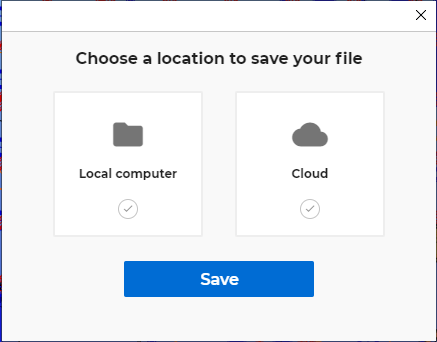
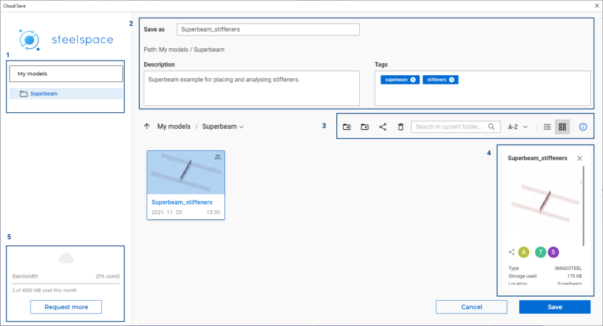
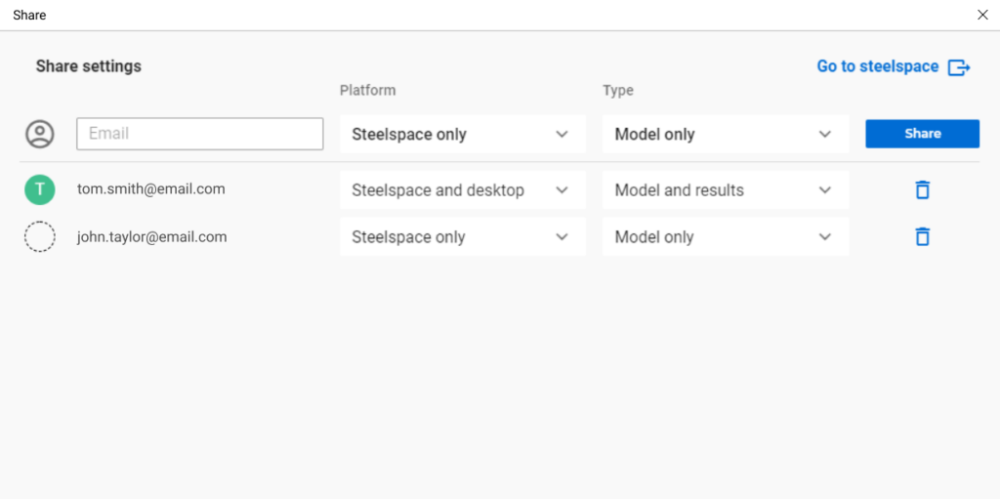

# Felhőtárhely szolgáltatások

<!-- wp:paragraph -->

A funkció magyar nyelvű változata egyelőre nem elérhető.

<!-- /wp:paragraph -->

<!-- wp:paragraph -->

A modellek felhőtárhelyre történő mentése, onnan való megnyitása és megosztása a Consteel 15-ös verziójától elérhető új funkciók. A felhőbe mentett modellek a Steelspace platform által biztosított személyes felhőtárhelyen tárolódnak, ahonnan gyorsan elérhetők, megnyithatók vagy megoszthatók, közvetlenül a Consteel-ből.

<!-- /wp:paragraph -->

<!-- wp:paragraph -->

A felhőbe mentett modellek folyamatosan szinkronizált példánya a számítógép _C:\\Users{felhasználónév}\\AppData\\Local\\ConSteel\\CloudModels_ mappájában találhatók. A modellszinkronizálás a felhasználó előfizetési csomagjában meghatározott havi adatmennyiség-korlát terhére történik. A modellszinkronizálás az első felhőmentés, modellmegosztás vagy a modell bezárása során történik, az összes többi művelet a modellt csak a helyi mappába menti, az adatforgalom csökkentése érdekében. Szinkronizálási probléma esetén( amikor a helyi és a felhőben tárolt modell nem azonos, és nem egyértelmű, hogy melyik a megfelelő), a felhasználó választhatja ki, hogy melyik modellverzióval szeretné folytatni.

<!-- /wp:paragraph -->

<!-- wp:heading {"level":3} -->

### Mentés a felhőbe

<!-- /wp:heading -->

<!-- wp:paragraph -->

A modell első mentésekor vagy a _Mentés másként..._ parancsra megjelenő ablakban megadható, hogy a mentés a helyi mappába (Local computer) vagy a felhőbe (Cloud) történjen. A második esetben megjelenik az online felhőtárhely ablaka.

<!-- /wp:paragraph -->

<!-- wp:image {"align":"right","id":27768,"width":328,"height":257,"sizeSlug":"full","linkDestination":"none"} -->

<!-- /wp:image -->

<!-- wp:paragraph -->

Az ablak bal oldalán a felhőtárhely mappastruktúrája látható **(1)**.

<!-- /wp:paragraph -->

<!-- wp:paragraph -->

A jobb oldal felső mezőjében kell megadni a modell nevét, valamint lehetőség van magyarázó leírást és címkéket is rendelni a modellhez. **(2)**.

<!-- /wp:paragraph -->

<!-- wp:paragraph -->

Alatta a már felhőben tárolt modelleken és mappákon elérhető parancsok ikonjai láthatók. Balról jobbra haladva: _Áthelyezés _(move), _Új mappa létrehozása_ (Create new folder), _Modell megosztása_ (Share model), _Törlés _(Delete), _Keresés _(Search), _Rendezés _(Sort by name or date), _Lista vagy kártya nézet_ (List or card view), végül a modell \_Részletes információ_s paneljének ki- vagy bekapcsolása **(3)**.

<!-- /wp:paragraph -->

<!-- wp:paragraph -->

Alul, jobb oldalon láthatók az éppen kiválasztott modell részletes információi, amennyiben a panel be van kapcsolva (ld. előző bekezdés) **(4)**.

<!-- /wp:paragraph -->

<!-- wp:paragraph -->

A modell felhőbe mentése a havi adatmennyiségi korlát terhére történik. A havi korlátot a felhasználó [tagsági szintje](https://consteelsoftware.com/hu/termekek/ajanlatok-csomagok/#ccm) határozza meg, és a bal alsó sarokban látható az aktuális állapota **(5)**.

<!-- /wp:paragraph -->

<!-- wp:image {"align":"center","id":28251,"width":720,"height":390,"sizeSlug":"large","linkDestination":"none"} -->

Mentés a felhőbe

<!-- /wp:image -->

<!-- wp:html -->

https://www.youtube.com/watch?v=8UHqT7wl5dI

<!-- /wp:html -->

<!-- wp:heading {"level":3} -->

### Modell megnyitása felhőből

<!-- /wp:heading -->

<!-- wp:paragraph -->

Kattints a Fájl menüben vagy a Projekt Centerben a "Megnyitás felhőből" parancsra és hozzáférhetsz a felhőben tárolt modelleidhez. Csak válaszd ki a modellt amit megszeretnél nyitni és kattints a Megnyitás gombra. További információért látogass el a [fájlmegnyitással kapcsolatos leírásunkhoz](https://consteelsoftware.com/manual/general-description/installing-and-running-the-software/#cloudopen).

<!-- /wp:paragraph -->

<!-- wp:heading {"level":3} -->

### Modell megosztása

<!-- /wp:heading -->

<!-- wp:paragraph -->

A felhőbe mentett modellek megoszthatók más felhasználókkal. A megosztott modellek megtekintéséhez a címzettnek is rendelkeznie kell Consteel felhasználói fiókkal. Amennyiben a megadott e-mail címhez nem tartozik fiók, ezt az e-mail cím előtt egy szaggatott kör jelzi. **_[Fiók nyitása](/manual/altalanos-ismertetes/a-szoftver-telepitese-es-futtatasa/#A-regisztráció-menete)_** néhány kattintással ingyenesen elérhető bárki számára a[ weboldalunkon](https://consteelsoftware.com/hu/).

<!-- /wp:paragraph -->

<!-- wp:paragraph -->

Az e-mail cím megadása után választani kell, hogy melyik platformon lehessen megnyitni a megosztott modellt. A megosztott modell a "Steelspace only" választása esetén csak a webböngésző alapú Steelspace platformon, míg a "_Steelspace and desktop_" választása estén a Steelspace-en és a Consteel 15-ben is elérhető lesz.

<!-- /wp:paragraph -->

<!-- wp:paragraph -->

Ezután a megosztás módját kell meghatározni. _"Model only"_ esetén csak a modell bemenő adatai, míg _"Model and result"_ esetén a kiszámított eredmények is megosztásra kerülnek.

<!-- /wp:paragraph -->

<!-- wp:paragraph -->

Egy megosztott modellből felhasználót eltávolítani (és ezzel a megosztást az ő részére megszüntetni) a felhasználó sorának végén látható szemeteskuka ikonra történő kattintással lehet.

<!-- /wp:paragraph -->

<!-- wp:image {"align":"center","id":28245,"width":768,"height":383,"sizeSlug":"large","linkDestination":"none"} -->

Modell megosztás beállítása

<!-- /wp:image -->
