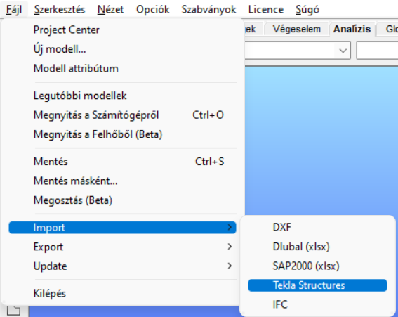
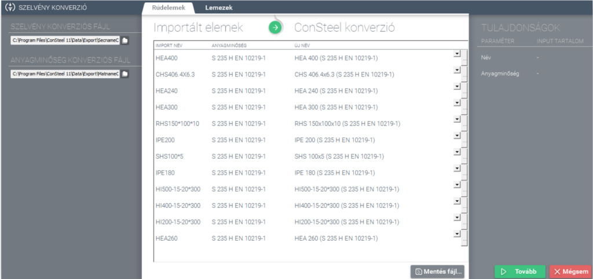
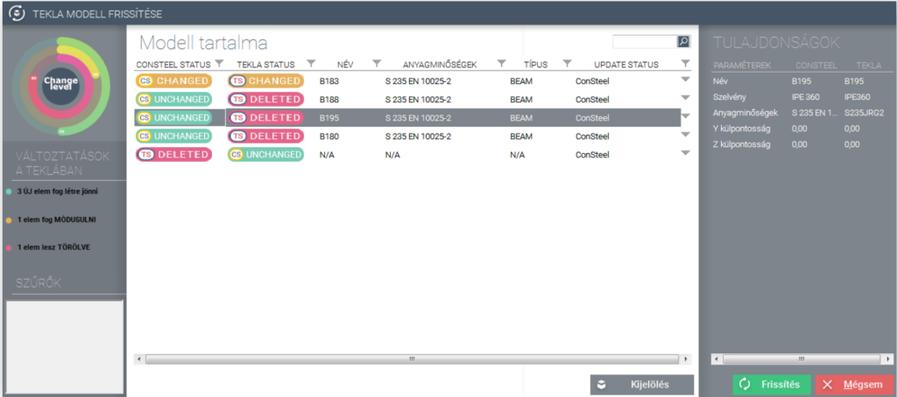

# Tekla Structures modellek importálása, exportálása és frissítése

<!-- wp:paragraph -->

A statikai és a szerkesztői modell közötti zökkenőmentes és gyors átmenettel jelentős időt és pénzt lehet megspórolni. Ennek elősegítésére a _Consteel_ magas fokú kapcsolattal rendelkezik a _Tekla Structures_ program 64 bites változataival. A globális szerkezeti modell (gerendák, oszlopok, födémek, falak) exportálása mellett a Consteel csomóponti modelljei rendelkeznek a megfelelő Tekla komponenssel. Így a megtervezett szerkezeti modell az elhelyezett kapcsolatokkal további modellezési munka nélkül is egyetlen részletes szerkezeti modellé alakítható.

<!-- /wp:paragraph -->

<!-- wp:paragraph -->

A _Consteel_ a _Tekla_ .NET API technológiáját használja az import és export folyamatok során. Ez lehetővé teszi a _Tekla_ modellek külső programokból történő közvetlen elérését. Ennek megfelelően a kapcsolathoz mind a _Consteel_, mind a _Tekla_ szoftvereknek ugyan azon a számítógépen kell futnia.

<!-- /wp:paragraph -->

<!-- wp:spacer -->

<!-- /wp:spacer -->

<!-- wp:heading {"level":3} -->

### Rúdelemek importálása Tekla Structures-ből

<!-- /wp:heading -->

<!-- wp:paragraph -->

Az import során lehetőségünk van a _Tekla Structures_ programban definiált szerkezeti elemek beolvasására. A konstrukciós szoftverben elérhető elemek közül a rúdszerkezeteket (gerendák, oszlopok, íves rudak) lehet importálni.

<!-- /wp:paragraph -->

<!-- wp:columns -->

<!-- wp:column {"width":"50%","editorskit":{"devices":false,"desktop":true,"tablet":true,"mobile":true,"loggedin":true,"loggedout":true,"acf_visibility":"","acf_field":"","acf_condition":"","acf_value":"","migrated":false,"unit_test":false}} -->

<!-- wp:image {"align":"right","id":7436,"width":354,"height":261,"sizeSlug":"full","linkDestination":"media","editorskit":{"devices":false,"desktop":true,"tablet":true,"mobile":true,"loggedin":true,"loggedout":true,"acf_visibility":"","acf_field":"","acf_condition":"","acf_value":"","migrated":false,"unit_test":false}} -->

<!-- /wp:image -->

<!-- /wp:column -->

<!-- wp:column {"width":"50%","editorskit":{"devices":false,"desktop":true,"tablet":true,"mobile":true,"loggedin":true,"loggedout":true,"acf_visibility":"","acf_field":"","acf_condition":"","acf_value":"","migrated":false,"unit_test":false}} -->

<!-- wp:image {"align":"left","id":7442,"width":354,"height":261,"sizeSlug":"full","linkDestination":"media"} -->

<!-- /wp:image -->

<!-- /wp:column -->

<!-- /wp:columns -->

<!-- wp:image {"align":"right","id":32079,"width":284,"height":226,"sizeSlug":"full","linkDestination":"media"} -->

<!-- /wp:image -->

<!-- wp:paragraph -->

Az import funkció a következő _Tekla Structures_ verziókkal kompatibilis.

<!-- /wp:paragraph -->

<!-- wp:list {"type":"1","className":"is-style-checked","editorskit":{"indent":40,"devices":false,"desktop":true,"tablet":true,"mobile":true,"loggedin":true,"loggedout":true,"acf_visibility":"","acf_field":"","acf_condition":"","acf_value":"","migrated":false,"unit_test":false}} -->

- 19.0, 19.1 64 bit
- 20.0, 20.1 64 bit
- 21.0, 21.1 64 bit
- 2016, 2016i 64 bit
- 2017, 2017i
- 2019, 2019i
- 2020
- 2021

<!-- /wp:list -->

<!-- wp:paragraph -->

A _Tekla Structures_ modellek importálásához feltétlenül szükséges, hogy párhuzamosan mind a két program fusson, továbbá az, hogy a _Tekla Structures_-ben nyitva legyen az importálandó szerkezeti modell, valamint a _Consteel_-ben egy üres vagy már használt modell. A helyes import folyamathoz javasoljuk, hogy a _Tekla Structures_ Default környezettel induljon el. Ezt követően válasszuk a _**Fájl**_ menü **Import** almenüjében található **Tekla Structures** opciót.

<!-- /wp:paragraph -->

<!-- wp:paragraph -->

Ezután megnyílik az Importálás funkció ablak, ahol az "Importált elemek" részben lehetőségünk van kiválasztani, hogy mely elemeket kerüljenek beimportálásra:

<!-- /wp:paragraph -->

<!-- wp:image {"align":"left","id":32093,"width":298,"height":304,"sizeSlug":"full","linkDestination":"media"} -->

<!-- /wp:image -->

<!-- wp:list {"className":"is-style-default"} -->

- Minden elem
- Kijelölt elemek

<!-- /wp:list -->

<!-- wp:paragraph -->

Amennyiben csak a kijelölt elemeket szeretnénk beolvasni, a kijelölést a művelet megkezdése előtt el kell végezni a _Tekla Structures_-ben. Emellett lehetőségünk van a raszter hálót is importálni a Tekla Structures-ból.

<!-- /wp:paragraph -->

<!-- wp:paragraph -->

Az ablak alsó részében, a "Fóliák" alatt kiválaszthatjuk, hogy az importálandó elemeket egy előre létrehozott fóliára hívjuk be a Consteel-be, vagy a _Tekla Structures_-ben, az osztályok által megadott fóliarendszert használjuk. Az utóbbi esetben a külön osztályon lévő elemeket külön fóliára tölthetjük be, melyek színei követik a _Tekla Structures_ osztályokban definiált színeket.

<!-- /wp:paragraph -->

<!-- wp:paragraph -->

Ezután az _**Import**_ gombra kattintva elindíthatjuk a folyamatot.

<!-- /wp:paragraph -->

<!-- wp:spacer {"height":"1px","editorskit":{"devices":false,"desktop":true,"tablet":true,"mobile":true,"loggedin":true,"loggedout":true,"acf_visibility":"","acf_field":"","acf_condition":"","acf_value":"","migrated":false,"unit_test":false},"editorskit_typography":{"name":"","family":"","weight":""},"extUtilities":[]} -->

<!-- /wp:spacer -->

<!-- wp:paragraph -->

Következő lépésben adjuk meg a beillesztés referencia pontját a _Tekla Structures_-ben. Felhívjuk a figyelmet, hogy célszerű ellenőrizni a _Tekla Structures_ koordináta rendszerének irányát a helyes importáláshoz. A referencia pont megadása után megjelenik a _**Szelvény konverzió**_ ablak, ahol a szelvénynevek és az anyagnevek megfeleltetése végezhető el. A _Tekla Structures_-ben alkalmazott profilok és anyagminőségek elnevezései eltérhetnek a _Consteel_-ban használt elnevezésektől. A megfeleltetés kétféle módon történhet: a konverziós fájlok alapján, vagy manuálisan.

<!-- /wp:paragraph -->

<!-- wp:image {"align":"center","id":32100,"width":768,"height":362,"sizeSlug":"large","linkDestination":"media"} -->

<!-- /wp:image -->

<!-- wp:list -->

- _Automatikus megfeleltetés_:

  - A konverziós file alapján egyértelműen megfeleltethető a Tekla-ból importálásra kerülő szelvény a szabványos szelvénykönyvtárban szereplő Consteel szelvénynek.
  - _Automatikus, „szabványos makró szelvény”_: A Consteel szabványos szelvénytárában név szerint nem szereplő, de paramétereit tekintve szabványos szelvénynek megfeleltethető szelvény. A szelvény hozzárendelés ebben az esetben is automatikusan történik

- _Manuális megfeleltetés_: A konverziós file alapján egyértelműen nem feleltethető meg a Tekla-ból érkező szelvény a Consteel szabványos szelvénytárában található egyik szelvénynek sem. _Manuálisan megfeleltetett makró szelvény_: Ha a Consteel szabványos makró szelvényt nem tud társítani az importált keresztmetszethez, a hozzá rendelés a **_(…)_** ikonra kattintva (vagy a már betöltött szelvények közül választva) manuálisan elvégezhető. Ebben az esetben az automatikusan meg nem feleltethető szelvény kontúrja a konverziós ablak _**Tulajdonságok**_ részén kirajzolásra kerül.

<!-- /wp:list -->

<!-- wp:paragraph -->

Változtatás esetén az adatok a mentés () gomb segítségével elmenthetők egy új konverziós fájlba későbbi felhasználás céljából. A **Tulajdonság** ablakban megjelennek az importált elemek jellemzői: név és anyagminőség. A **Tovább** gomb megnyomása után utolsó lépésként adjuk meg a beillesztési pontot a Consteel modelltérben, ami után az importált modell megjelenik.

<!-- /wp:paragraph -->

<!-- wp:heading {"level":3} -->

### Rúdelemek importálásának korlátai

<!-- /wp:heading -->

<!-- wp:paragraph -->

_**Rúdelemek – importálható szelvények**_

<!-- /wp:paragraph -->

<!-- wp:list -->

- I és H profilok:

  - Melegen hengerelt
  - Hegesztett szimmetrikus, állandó és változó magasságú hegesztett
  - Hegesztett nem szimmetrikus, állandó és változó magasságú hegesztett

- L profilok:

  - Melegen hengerelt, egyenlő és nem egyenlő szárú
  - Hidegen hajlított, egyenlő és nem egyenlő szárú

- U profilok:

  - Melegen hengerelt

- T profilok:

  - Melegen hengerelt

- C profilok:

  - Hidegen alakított szimmetrikus szelvények
  - Hidegen alakított aszimmetrikus szelvények

- Doboz szelvények:

  - Szimmetrikus, állandó magasságú hegesztett
  - Nem szimmetrikus, állandó magasságú hegesztett doboz szelvényeknél a kisebb övszélességgel jön létre a szelvény

- Köracél profilok:

  - Állandó magasságú
  - Változó fő- és mellék tengelyhosszú profil nem importálható

- Zártszelvények:

  - Melegen hengerelt négyzet és téglalap alakú, állandó magasságú
  - Változó magasságú zártszelvény esetén a változó km-i beállításokat kézzel kell megadni

- Csőszelvények:

  - Melegen hengerelt, állandó és változó magasságú

- Z profilok

  - Hidegen alakított szimmetrikus
  - Hidegen alakított aszimmetrikus szelvények

- Törtvonalú, folytatólagos gerenda nem importálható

<!-- /wp:list -->

<!-- wp:paragraph -->

_**Lemezelemek**_

<!-- /wp:paragraph -->

<!-- wp:list -->

- Kör alaprajzú lemez
- Téglalap alaprajzú lemez

<!-- /wp:list -->

<!-- wp:paragraph -->

_**Kapcsolatok**_

<!-- /wp:paragraph -->

<!-- wp:list -->

- Tekla Structures-ben definiált makrók elemei nem importálhatóak

<!-- /wp:list -->

<!-- wp:spacer -->

<!-- /wp:spacer -->

<!-- wp:heading {"level":3} -->

### Rúdelemek és komplett modell exportálása Tekla Structures szoftverbe

<!-- /wp:heading -->

<!-- wp:paragraph -->

A szerkezeti modell (pl.: gerendák, oszlopok, födémek, falak) exportálásán túl, a _Consteel_ kapcsolatoknak is megvannak a megfelelő _Tekla_ komponensei, így lehetőség van egy lépésben a teljes szerkezeti modell (vázszerkezet és csomópontok) szerkesztői modellé konvertálására is.

<!-- /wp:paragraph -->

<!-- wp:image {"align":"center","id":7468,"width":467,"height":212,"sizeSlug":"full","linkDestination":"media"} -->

<!-- /wp:image -->

<!-- wp:paragraph -->

Az exportáláshoz a _Tekla Structures_ 19.0 vagy újabb verziója szükséges!

<!-- /wp:paragraph -->

<!-- wp:paragraph -->

A _Consteel _modell_ Tekla Structures_-be való exportálásához elengedhetetlen, hogy egyszerre fusson mind a két program ugyan azon a számítógépen, és meg legyen nyitva egy üres modell a _Tekla Structures_-ben. Exportáláshoz válaszuk a **Fájl** menü **Export** almenüjében található **Tekla Structures** opciót.

<!-- /wp:paragraph -->

<!-- wp:image {"align":"center","id":32079,"sizeSlug":"full","linkDestination":"media"} -->

<!-- /wp:image -->

<!-- wp:paragraph -->

A funkció elindításával megnyílik az exportálás ablaka. Az "Exportált elemek" alatt választható, hogy a teljes modell, vagy csak a felhasználó által kiválasztott elemek kerüljenek exportálásra. Ezen kívül hozzáadhatjuk az exportálandó elemekhez a raszterhálót és a kapcsolatokat is. Fontos tudni, hogy a kapcsolatok közül csak a _Consteel_ modellben elhelyezettek kerülnek exportálásra!

<!-- /wp:paragraph -->

<!-- wp:image {"align":"left","id":32086,"width":329,"height":307,"sizeSlug":"full","linkDestination":"media"} -->

<!-- /wp:image -->

<!-- wp:paragraph -->

Az "Export beállítások" alatt választható, hogy az exportált elemek a Tekla modell felülírásával exportálódjanak, vagy egy meglévő modell mellé kerüljenek.

<!-- /wp:paragraph -->

<!-- wp:paragraph -->

Következő lépésként ki kell választani a modellbeillesztés referencia pontját a Consteel-ben, majd az _**Export**_ gombra kattintva elindíthatjuk a funkciót.

<!-- /wp:paragraph -->

<!-- wp:paragraph -->

Következő lépésként a _Tekla Structures_-ben is meg kell adni a beillesztés referencia pontját. A referencia pont megadása után megjelenik a _**Szelvény konverzió**_ ablaka. Mivel a _Tekla_ elnevezései eltérhetnek a _Consteel_-ben használt elnevezésektől, ebben az ablakban végezhető el a szelvénynevek és az anyagnevek megfeleltetése. A megfeleltetés történhet manuálisan, vagy az előre elkészített konverziós fájlok alapján.

<!-- /wp:paragraph -->

<!-- wp:spacer {"height":"1px","editorskit":{"devices":false,"desktop":true,"tablet":true,"mobile":true,"loggedin":true,"loggedout":true,"acf_visibility":"","acf_field":"","acf_condition":"","acf_value":"","migrated":false,"unit_test":false},"editorskit_typography":{"name":"","family":"","weight":""},"extUtilities":[]} -->

<!-- /wp:spacer -->

<!-- wp:paragraph -->

Változtatás esetén az adatok a mentés () gomb segítségével elmenthetők későbbi felhasználás céljából. A **Tulajdonság** ablakban megjelennek az importált elemek jellemzői: név és anyagminőség. Az **Tovább** gomb megnyomásával megtörténik a modell exportálása.

<!-- /wp:paragraph -->

<!-- wp:image {"align":"center","id":32111,"width":512,"height":241,"sizeSlug":"large","linkDestination":"media"} -->

<!-- /wp:image -->

<!-- wp:heading {"level":3} -->

### Rúdelemek és kapcsolatok exportálásának korlátai

<!-- /wp:heading -->

<!-- wp:paragraph -->

_**Rúdelemek – exportálható szelvények**_

<!-- /wp:paragraph -->

<!-- wp:list -->

- Standard szelvények

- Makró szelvények

  - Hegesztett I állandó magasságú
  - Hegesztett I változó magasságú
  - Hegesztett szekrény keresztmetszet
  - Hegesztett C szelvények
  - Hidegen alakított Z szelvények
  - Máltai kereszt szelvény
  - Hegesztett kalap szelvény
  - Hegesztett WQ szelvény
  - Hegesztett T szelvény

- Lemezek

  - Kör alaprajzú lemez
  - Téglalap alaprajzú lemez

- Íves elemek nem exportálhatók

- Összetett szelvények nem exportálhatók

<!-- /wp:list -->

<!-- wp:paragraph -->

_**Talplemez (félmerev vagy csuklós) (1042)**_

<!-- /wp:paragraph -->

<!-- wp:list -->

- A kiékelés nem kerül exportálásra
- A lehorgonyzó csavarok típusát kézzel kell beállítani a _Tekla_-ban (_Consteel_ beállításnak nincs hatása az exportra)
- A lehorgonyzó csavaroknak csak a következő tulajdonságai kerülnek átvitelre: átmérő, anyagminőség
- Az alaptestek nem kerülnek exportálásra
- A felső és alsó övek varrata azonos lesz a _Tekla_-ban (_Consteel_ beállításnak nincs hatása az exportra)

<!-- /wp:list -->

<!-- wp:paragraph -->

**_Oszlop-gerenda nyomatékbíró homloklemezes kapcsolata kiékeléssel (40)_**

<!-- /wp:paragraph -->

<!-- wp:list -->

- Alsó és felső kiékelések méretei azonosak lesznek a _Tekla_-ban (a felső kiékelés az alsó adatai alapján kerül felvételre)
- Nyírási merevítők nem kerülnek exportálásra, csak a gerinchizlaló lemezek
- Övmerevítők nem kerülnek exportálásra

<!-- /wp:list -->

<!-- wp:paragraph -->

**_Oszlop-gerenda egyszerű homloklemezes kapcsolata kiékeléssel (144)_**

<!-- /wp:paragraph -->

<!-- wp:list -->

- Az oszlop felső túlnyúlását manuálisan kell megadni Tekla-ban

<!-- /wp:list -->

<!-- wp:paragraph -->

**_Gerendák nyomatékbíró vagy egyszerű homloklemezes kapcsolata szögben (tetőgerinc) kiékelés nélkül (40)_**

<!-- /wp:paragraph -->

<!-- wp:list -->

- A bal és a jobb oldal külön makróban kerül exportálásra. A makrókat fel kell robbantani és a csavarokat újra kell definiálni a Tekla-ban

<!-- /wp:list -->

<!-- wp:paragraph -->

**_Gerendák nyomatékbíró toldása kiékeléssel (106)_**

<!-- /wp:paragraph -->

<!-- wp:list -->

- Nincs felső kiékelés

<!-- /wp:list -->

<!-- wp:paragraph -->

_**Taréjcsomóponti kiékelés (106)**_

<!-- /wp:paragraph -->

<!-- wp:list -->

- Felső kiékelés exportálása nem lehetséges

<!-- /wp:list -->

<!-- wp:paragraph -->

_**Merevített homloklemez (27)**_

<!-- /wp:paragraph -->

<!-- wp:list -->

- A _Tekla_-ban nincs gerincmerevítő lemez

<!-- /wp:list -->

<!-- wp:spacer -->

<!-- /wp:spacer -->

<!-- wp:heading {"level":3} -->

### Consteel és Tekla Structures modellek változás követése: Tekla update

<!-- /wp:heading -->

<!-- wp:paragraph -->

Az import és export funkciók mellett lehetőségünk nyílik a statikai és a szerkezeti modellek változásainak követésére. A Consteel változáskövetés funkciójának segítségével, a Consteel és a Tekla Structures modell összehasonlításával, egyszerűen és vizuálisan ellenőrizhetők a módosított, törölt és újonnan létrehozott elemek.

<!-- /wp:paragraph -->

<!-- wp:paragraph -->

A Tekla modell frissítése mindig az aktuális Consteel modell alapján valósul meg. Az elemek összehasonlítása az alábbi attribútumok szerint történik:

<!-- /wp:paragraph -->

<!-- wp:list -->

- Elem név
- Anyagnév
- Keresztmetszet név
- Keresztmetszeti jellemzők
- Elem geometria és pozíció

<!-- /wp:list -->

<!-- wp:image {"align":"right","id":32119,"width":411,"height":103,"sizeSlug":"full","linkDestination":"media"} -->

<!-- /wp:image -->

<!-- wp:paragraph -->

A változáskövetés működéséhez szükség van egy komplett modell [import ](#rúdelemek-importálása-tekla-structures-ből) vagy [export](#rúdelemek-és-komplett-modell-exportálása-tekla-structures-szoftverbe)végrehajtására (ld. előző pontok).

<!-- /wp:paragraph -->

<!-- wp:paragraph -->

Tekla modell változáskövetéséhez fontos, hogy mindkét program fusson ugyan azon a számítógépen, és a modell legyen megnyitva Tekla Structures-ben. Ezután a _**File**_ menü _**Export**_ fül _**TEKLA Structures frissítés**_ funkcióra kattintva a következő dialógablak jelenik meg:

<!-- /wp:paragraph -->

<!-- wp:image {"align":"center","id":32126,"width":345,"height":225,"sizeSlug":"full","linkDestination":"media"} -->

<!-- /wp:image -->

<!-- wp:paragraph -->

A dialógon eldönthetjük, hogy a teljes modellt, vagy annak csak egy részét szeretnénk frissíteni. A megfelelő beállítások után a _**Tovább**_ gombra kattintva haladhatunk tovább.

<!-- /wp:paragraph -->

<!-- wp:paragraph -->

A modellek frissítésekor a párhuzamosan futó Consteel és Tekla modellek összehasonlításra kerülnek. Azon elemek esetében, amelyek frissítése nem egyértelmű a felhasználó dönthet, melyik változatot kívánja használni. Ezt az alábbi ablakban lehet megtenni, mely ilyen esetben automatikusan megjelenik:

<!-- /wp:paragraph -->

<!-- wp:image {"align":"center","id":32134,"width":768,"height":341,"sizeSlug":"large","linkDestination":"media"} -->

<!-- /wp:image -->

<!-- wp:paragraph -->

Az utolsó oszlopban lehet kiválasztani, hogy az adott elem mely modellbeli állapota legyen megtartva. A _**Frissítés**_ gombra való kattintással a változtatások alkalmazásra kerülnek. A Consteel-ben újonnan létrehozott elemek automatikusan exportálásra kerülnek a Tekla Structures-be. A következő táblázat tartalmazza az összehasonlítás és az egyesítés (Merge) eseteit:

<!-- /wp:paragraph -->

<!-- wp:image {"align":"center","id":7533,"width":423,"height":331,"sizeSlug":"full","linkDestination":"media"} -->

<!-- /wp:image -->
