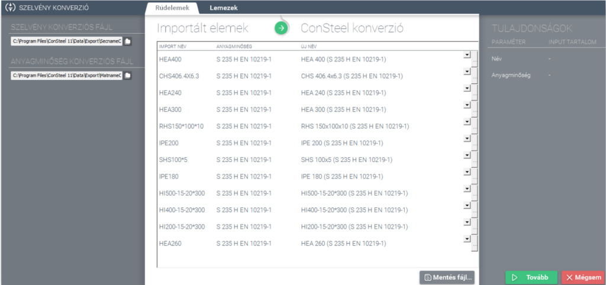

# IFC modell import és export

<!-- wp:paragraph -->

Az IFC (Industry Foundation Classes) egy nyílt leírású, az építő ipar és létesítmény management számára, a BIM (Building Information Modeling) adat cserét lehetővé tevő nemzetközi szabvány (openBIM).

<!-- /wp:paragraph -->

<!-- wp:paragraph -->

A BuildingSMART International szervezet publikálja és fejleszti a hivatalos specifikációkat az épület modell leírásához és az adatátviteli követelményeket.

<!-- /wp:paragraph -->

<!-- wp:heading {"level":3} -->

### IFC fájl importálása

<!-- /wp:heading -->

<!-- wp:image {"align":"right","id":32393,"width":425,"height":339,"sizeSlug":"full","linkDestination":"media"} -->

<!-- /wp:image -->

<!-- wp:paragraph -->

Az import funkció az alábbi IFC sémával létrehozott ifc fájlok beolvasását támogatja:

<!-- /wp:paragraph -->

<!-- wp:list {"type":"I","className":"is-style-arrow"} -->

- IFC 2x3

<!-- /wp:list -->

<!-- wp:paragraph -->

Az IFC fájl importálása funkció a _**Fájl**_ menü _**Import**_ almenüjében található.

<!-- /wp:paragraph -->

<!-- wp:paragraph -->

Az _**IFC**_ funkcióra kattintva megnyílik az Import funkció ablak. Itt legelső lépésként ki kell választani az adott IFC fájlt, amelyet be szeretnénk olvasni Consteel-be. Továbbá definiálható, hogy a beolvasott modell milyen méretaránnyal kerüljön beimportálásra. Az elhelyezési pont megadható manuálisan, de ha ezt nem tesszük meg, a szoftver a globális koordináta rendszer origójához fogja igazítani az importálásra kerülő modellt. Az elhelyezés síkja szintén ezen a dialóg ablakon adható meg.

<!-- /wp:paragraph -->

<!-- wp:image {"align":"center","id":32407,"width":323,"height":452,"sizeSlug":"full","linkDestination":"media"} -->

<!-- /wp:image -->

<!-- wp:paragraph -->

Az _**Import**_ gombra kattintva megjelenik a _**Szelvény konverzió**_ ablak, ahol a szelvénynevek és az anyagnevek megfeleltetése végezhető el. A beimportált profilok és anyagminőségek elnevezései eltérhetnek a _Consteel_-ben használt elnevezésektől, ezért szükség lehet ezek egymással való megfeleltetésére. A _**Szelvény konverzió**_ ablakban feltüntetésre kerül az egyes elemek import neve, anyagminősége és a Consteel által megfeleltetett új neve. A megfeleltetés kétféle módon történhet: a konverziós fájlok alapján, vagy manuálisan.

<!-- /wp:paragraph -->

<!-- wp:image {"id":32100,"sizeSlug":"large","linkDestination":"media"} -->

<!-- /wp:image -->

<!-- wp:list -->

- _Egyértelmű megfeleltetés_

  - A konverziós file alapján egyértelműen megfeleltethető az importálásra kerülő szelvény a szabványos szelvénykönyvtárban szereplő Consteel szelvénynek.

- Részben egyértelmű megfeleltetés

  - „_Szabványos makró” szelvények esetén_: a beolvasásra kerülő szelvényekhez nem lehet egyértelműen hozzárendelni egyetlen szelvényt sem a Consteel saját szelvénykönyvtárából. Többnyire szabványos makró szelvények esetén történhet így a megfeleltetés (pl.: hegesztett I szelvények). Ilyenkor az _Új név_ oszlopban található cellák üresen maradnak, és a felhasználó két opció közül választhat:

    - a legördülő menüből kiválaszt és hozzárendel egy, a beimportált szelvénynek megfelelő szelvényt a betöltött szelvények közül,
    - a hárompontos () ikonra kattintva betölt egy új szelvényt a szelvénykonverziós dialógra, amit aztán hozzárendel a beimportált szelvényhez.

  - _Makró szelvények megfeleltetése_: a beolvasásra kerülő szelvényekhez nem lehet egyértelműen hozzárendelni egyetlen szelvényt sem a Consteel saját szelvénykönyvtárából, viszont ebben az esetben megjelenik egy kis ábra a szelvénykonverziós ablak jobb oldalán, mely a beimportált szelvény keresztmetszetét illusztrálja. Az _Új név_ oszlopban található cellák üresen maradnak, és a megfeleltetés az előző esethez hasonlóan, kétféle képen történhet:

    - legördülő menüből
    - hárompontos ikonnal, új szelvény betöltésével

<!-- /wp:list -->

<!-- wp:paragraph -->

Változtatás esetén az adatok a mentés () gomb segítségével elmenthetők későbbi felhasználás céljából. A _**Tulajdonság**_ ablakban megjelennek az importált elemek jellemzői: név és anyagminőség. A _**Tovább**_ gomb megnyomása után megtörténik az importálás.

<!-- /wp:paragraph -->

<!-- wp:heading {"level":4} -->

#### Importálható objektumok

<!-- /wp:heading -->

<!-- wp:paragraph -->

**_Acél rúdelemek_**

<!-- /wp:paragraph -->

<!-- wp:list {"className":"is-style-arrow"} -->

- I profilok:

  - Általános helyzetű, melegen hengerelt, állandó övvastagságú egyenes és íves szimmetrikus I szelvényű rúdelemek
  - Általános helyzetű, hegesztett, állandó övvastagságú egyenes és íves szimmetrikus I szelvényű rúdelemek
  - Általános helyzetű, hegesztett, állandó övvastagságú egyenes és íves aszimmetrikus I szelvényű rúdelemek
  - Általános helyzetű, melegen hengerelt, lejtős övű egyenes és íves I szelvényű rúdelemek

- H profilok:

  - Általános helyzetű, melegen hengerelt, állandó övvastagságú egyenes és íves H szelvényű rúdelemek
  - Általános helyzetű hegesztett, állandó övvastagságú egyenes és íves H szelvényű rúdelemek

- T profilok:

  - Általános helyzetű, melegen hengerelt egyenes és íves T szelvényű rúdelemek
  - Általános helyzetű, hegesztett egyenes és íves T szelvényű rúdelemek

- U profilok:

  - Általános helyzetű, melegen hengerelt állandó övvastagságú egyenes és íves U szelvényű rúdelemek
  - Általános helyzetű, melegen hengerelt lejtős övű egyenes és íves U szelvényű rúdelemek

- Melegen hengerelt zártszelvények:

  - Általános helyzetű, melegen hengerelt egyenes és íves zártszelvényű rúdelemek

- Hidegen alakított zártszelvények:

  - Általános helyzetű, hidegen alakított egyenes és íves zártszelvényű rúdelemek

- Melegen hengerelt csőszelvények:

  - Általános helyzetű, melegen hengerelt egyenes és íves csőszelvényű rúdelemek

- Hidegen alakított csőszelvények:

  - Általános helyzetű, hidegen alakított egyenes és íves csőszelvényű rúdelemek

- Melegen hengerelt L profilok:

  - Melegen hengerelt, egyenlő és nem egyenlő szárú L szelvényű rúdelemek

- Hidegen alakított L profilok:

  - Hidegen alakított, egyenlő és nem egyenlő szárú L szelvényű egyenes és íves rúdelemek

- Hidegen alakított C profilok:

  - Hidegen alakított, általános helyzetű, peremmel rendelkező, egyenes és íves C szelvényű rúdelemek

  - Hidegen alakított, általános helyzetű, peremmel rendelkező, ferde övű, egyenes és íves C szelvényű rúdelemek

  - Hidegen alakított, általános helyzetű, visszahajtott peremmel rendelkező, egyenes és íves C szelvényű rúdelemek
  - Hidegen alakított, általános helyzetű, perem nélküli, egyenes és íves C szelvényű rúdelemek

- Lindab C profilok:

  - Hidegen alakított, általános helyzetű peremmel rendelkező, aszimmetrikus C szelvényű egyenes és íves rúdelemek

- Hegesztett C profilok:

  - Hegesztett, általános helyzetű, perem nélküli, szimmetrikus C szelvényű, egyenes és íves rúdelemek

- Hidegen alakított J profilok:

  - Hidegen alakított, általános helyzetű, J szelvényű, egyenes és íves rúdelemek

- Hidegen alakított U profilok:

  - Hidegen alakított, általános helyzetű, U szelvényű, egyenes és íves rúdelemek

- Hidegen alakított Z profilok:

  - Hidegen alakított, általános helyzetű, peremmel rendelkező, Z szelvényű, egyenes és íves rúdelemek
  - Hidegen alakított, általános helyzetű, ferde peremmel rendelkező, Z szelvényű, egyenes és íves rúdelemek
  - Hidegen alakított, általános helyzetű, perem nélküli, Z szelvényű, egyenes és íves rúdelemek

- Laposacélok:

  - Általános helyzetű laposacél szelvényű egyenes és íves rúdelemek

- Négyzetacélok:

  - Általános helyzetű négyzetacél szelvényű egyenes és íves rúdelemek

- Doboz szelvények:

  - Általános helyzetű, hegesztett doboz szelvényű egyenes és íves rúdelemek

- Máltai kereszt profil:

  - Általános helyzetű, hegesztett máltai kereszt szelvényű egyenes és íves rúdelemek

- Fél máltai kereszt profil:

  - Általános helyzetű, hegesztett fél máltai kereszt szelvényű egyenes és íves rúdelemek

- PI szelvény:

  - Általános helyzetű, hegesztett PI szelvényű egyenes és íves rúdelemek

- WQ szelvény:

  - Általános helyzetű, hegesztett WQ szelvényű egyenes és íves rúdelemek

<!-- /wp:list -->

<!-- wp:paragraph -->

**_Vasbeton rúdelemek_**

<!-- /wp:paragraph -->

<!-- wp:list {"className":"is-style-arrow"} -->

- Általános helyzetű, T szelvényű, egyenes vasbeton rúdelemek
- Általános helyzetű, kör szelvényű, egyenes vasbeton rúdelemek
- Általános helyzetű, téglalap szelvényű, egyenes vasbeton rúdelemek
- Általános helyzetű, I szelvényű, egyenes vasbeton rúdelemek
- Általános helyzetű, üreges téglalap szelvényű, egyenes vasbeton rúdelemek
- Általános helyzetű, trapéz szelvényű, egyenes vasbeton rúdelemek
- Általános helyzetű, üreges kör szelvényű, egyenes vasbeton rúdelemek

<!-- /wp:list -->

<!-- wp:paragraph -->

**_Lemezelemek_**

<!-- /wp:paragraph -->

<!-- wp:list {"className":"is-style-arrow"} -->

- Általános áttöréssel rendelkező vagy áttörés nélküli, vízszintes helyzetű, szabályos alaprajzú lemezek lekerekítéssel, letöréssel vagy lekerekítés és letörés nélkül
- Általános áttöréssel rendelkező vagy áttörés nélküli, vízszintes helyzetű, poligon alaprajzú lemezek lekerekítéssel, letöréssel vagy lekerekítés és letörés nélkül
- Általános áttöréssel rendelkező vagy áttörés nélküli, vízszintes helyzetű, kör alaprajzú lemezek
- Általános áttöréssel rendelkező vagy áttörés nélküli, általános helyzetű, szabályos alaprajzú lemezek lekerekítéssel, letöréssel vagy lekerekítés és letörés nélkül
- Általános áttöréssel rendelkező vagy áttörés nélküli, általános helyzetű, poligon alaprajzú lemezek lekerekítéssel, letöréssel vagy lekerekítés és letörés nélkül
- Általános áttöréssel rendelkező vagy áttörés nélküli, általános helyzetű, kör alaprajzú lemezek

<!-- /wp:list -->

<!-- wp:paragraph -->

**_Tárcsaelemek_**

<!-- /wp:paragraph -->

<!-- wp:list {"className":"is-style-arrow"} -->

- Áttöréssel rendelkező vagy áttörés nélküli függőleges helyzetű tárcsák, letöréssel, lekerekítéssel vagy lekerekítés és letörés nélkül

<!-- /wp:list -->

<!-- wp:heading {"level":3} -->

### IFC Export

<!-- /wp:heading -->

<!-- wp:image {"align":"right","id":32386,"width":455,"height":324,"sizeSlug":"full","linkDestination":"media"} -->

<!-- /wp:image -->

<!-- wp:paragraph -->

Az export funkció az alábbi IFC séma írását támogatja.

<!-- /wp:paragraph -->

<!-- wp:list -->

- IFC 2x3

<!-- /wp:list -->

<!-- wp:paragraph -->

Exportáláshoz válaszuk a _**Fájl**_ menü _**Export**_ almenüjében található _**IFC**_ opciót.

<!-- /wp:paragraph -->

<!-- wp:paragraph -->

A megjelenő IFC export ablakban, legelső lépésben meg kell adnunk az IFC fájl kimenti elérési útját és fájlnevét. Ez alatt a modell méretarányát és a beillesztési pontot kell megadni. Utóbbi megadható kézzel egy tetszőleges pontot kijelölve is, e nélkül a modell globális origója lesz a beillesztési pont. Legvégül az elhelyezés síkját kell megadni, majd az _**Export**_ gombra kattintva az exportálás megtörténik. Az exportálás egyik korlátja, hogy nincs lehetőség a szerkezetnek csak egyes kijelölt elemeit exportálni IFC fájlba, hanem mindig a teljes modell kiírásra kerül.

<!-- /wp:paragraph -->

<!-- wp:image {"align":"center","id":32400,"width":323,"height":452,"sizeSlug":"full","linkDestination":"media"} -->

<!-- /wp:image -->

<!-- wp:heading {"level":4} -->

#### Exportálható objektumok

<!-- /wp:heading -->

<!-- wp:paragraph -->

**_Acél rúdelemek_**

<!-- /wp:paragraph -->

<!-- wp:list {"className":"is-style-arrow"} -->

- I profilok:

  - Általános helyzetű, melegen hengerelt, állandó övvastagságú, egyenes és íves szimmetrikus I szelvényű rúdelemek
  - Általános helyzetű, melegen hengerelt, lejtős övű, egyenes és íves I szelvényű rúdelemek
  - Általános helyzetű, hegesztett, állandó övvastagságú, egyenes és íves, szimmetrikus I szelvényű rúdelemek
  - Általános helyzetű, hegesztett, állandó övvastagságú, egyenes és íves, aszimmetrikus I szelvényű rúdelemek

- H profilok:

  - Általános helyzetű, melegen hengerelt, állandó övvastagságú, egyenes és íves H szelvényű rúdelemek
  - Általános helyzetű, hegesztett, állandó övvastagságú, egyenes és íves H szelvényű rúdelemek

- T profilok:

  - Általános helyzetű, melegen hengerelt, egyenes és íves T szelvényű rúdelemek
  - Általános helyzetű, hegesztett, egyenes és íves T szelvényű rúdelemek

- U profilok:

  - Általános helyzetű, melegen hengerelt, állandó övvastagságú, egyenes és íves U szelvényű rúdelemek
  - Általános helyzetű, melegen hengerelt, lejtős övű, egyenes és íves U szelvényű rúdelemek

- Melegen hengerelt zártszelvények:

  - Általános helyzetű, melegen hengerelt, egyenes és íves zártszelvényű rúdelemek

- Hidegen alakított zártszelvények:

  - Általános helyzetű, hidegen alakított egyenes és íves zártszelvényű rúdelemek

- Melegen hengerelt csőszelvények:

  - Általános helyzetű, melegen hengerelt egyenes és íves csőszelvényű rúdelemek

- Hidegen alakított csőszelvények:

  - Általános helyzetű, hidegen alakított egyenes és íves csőszelvényű rúdelemek

- Melegen hengerelt L profilok:

  - Melegen hengerelt, egyenlő és nem egyenlő szárú L szelvényű rúdelemek

- Hidegen alakított L profilok:

  - Hidegen alakított, egyenlő és nem egyenlő szárú L szelvényű egyenes és íves rúdelemek

- Hidegen alakított C profilok:

  - Hidegen alakított, általános helyzetű, peremmel rendelkező, egyenes és íves C szelvényű rúdelemek

  - Hidegen alakított, általános helyzetű, peremmel rendelkező, ferde övű, egyenes és íves C szelvényű rúdelemek

  - Hidegen alakított, általános helyzetű, visszahajtott peremmel rendelkező, egyenes és íves C szelvényű rúdelemek
  - Hidegen alakított, általános helyzetű, perem nélküli, egyenes és íves C szelvényű rúdelemek

- Lindab C profilok:

  - Hidegen alakított, általános helyzetű peremmel rendelkező, aszimmetrikus C szelvényű egyenes és íves rúdelemek

- Hegesztett C profilok:

  - Hegesztett, általános helyzetű perem nélküli, szimmetrikus C szelvényű egyenes és íves rúdelemek

- Hidegen alakított J profilok:

  - Hidegen alakított, általános helyzetű J szelvényű egyenes és íves rúdelemek

- Hidegen alakított U profilok:

  - Hidegen alakított, általános helyzetű U szelvényű egyenes és íves rúdelemek

- Hidegen alakított Z profilok:

  - Hidegen alakított, általános helyzetű peremmel rendelkező Z szelvényű egyenes és íves rúdelemek
  - Hidegen alakított, általános helyzetű ferde peremmel rendelkező Z szelvényű egyenes és íves rúdelemek
  - Hidegen alakított, általános helyzetű perem nélküli Z szelvényű egyenes és íves rúdelemek

- Laposacélok:

  - Általános helyzetű laposacél szelvényű egyenes és íves rúdelemek

- Négyzetacélok:

  - Általános helyzetű négyzetacél szelvényű egyenes és íves rúdelemek

- Doboz szelvények:

  - Általános helyzetű, hegesztett doboz szelvényű egyenes és íves rúdelemek

- Máltai kereszt profil:

  - Általános helyzetű, hegesztett máltai keresztszelvényű egyenes és íves rúdelemek

- Fél máltai kereszt profil:

  - Általános helyzetű, hegesztett fél máltai keresztszelvényű egyenes és íves rúdelemek

- PI szelvény:

  - Általános helyzetű, hegesztett PI szelvényű egyenes és íves rúdelemek

- WQ szelvény:

  - Általános helyzetű, hegesztett WQ szelvényű egyenes és íves rúdelemek

<!-- /wp:list -->

<!-- wp:paragraph -->

**_Vasbeton rúdelemek_**

<!-- /wp:paragraph -->

<!-- wp:list {"className":"is-style-arrow"} -->

- Általános helyzetű, T szelvényű, egyenes vasbeton rúdelemek
- Általános helyzetű, kör szelvényű, egyenes vasbeton rúdelemek
- Általános helyzetű, téglalap szelvényű, egyenes vasbeton rúdelemek
- Általános helyzetű, I szelvényű, egyenes vasbeton rúdelemek
- Általános helyzetű, üreges téglalap szelvényű, egyenes vasbeton rúdelemek
- Általános helyzetű, trapéz szelvényű, egyenes vasbeton rúdelemek
- Általános helyzetű, üreges kör szelvényű, egyenes vasbeton rúdelemek

<!-- /wp:list -->

<!-- wp:paragraph -->

**_Lemezelemek_**

<!-- /wp:paragraph -->

<!-- wp:list {"className":"is-style-arrow"} -->

- Általános áttöréssel rendelkező vagy áttörés nélküli, vízszintes helyzetű, szabályos alaprajzú lemezek lekerekítéssel, letöréssel vagy lekerekítés és letörés nélkül
- Általános áttöréssel rendelkező vagy áttörés nélküli, vízszintes helyzetű, poligon alaprajzú lemezek lekerekítéssel, letöréssel vagy lekerekítés és letörés nélkül
- Általános áttöréssel rendelkező vagy áttörés nélküli, vízszintes helyzetű, kör alaprajzú lemezek
- Általános áttöréssel rendelkező vagy áttörés nélküli, általános helyzetű, szabályos alaprajzú lemezek lekerekítéssel, letöréssel vagy lekerekítés és letörés nélkül
- Általános áttöréssel rendelkező vagy áttörés nélküli, általános helyzetű, poligon alaprajzú lemezek lekerekítéssel, letöréssel vagy lekerekítés és letörés nélkül
- Általános áttöréssel rendelkező vagy áttörés nélküli, általános helyzetű, kör alaprajzú lemezek

<!-- /wp:list -->

<!-- wp:paragraph -->

**_Tárcsaelemek_**

<!-- /wp:paragraph -->

<!-- wp:list {"className":"is-style-arrow"} -->

- Áttöréssel rendelkező vagy áttörés nélküli függőleges helyzetű tárcsák, letöréssel, lekerekítéssel vagy lekerekítés és letörés nélkül

<!-- /wp:list -->
