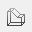
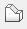
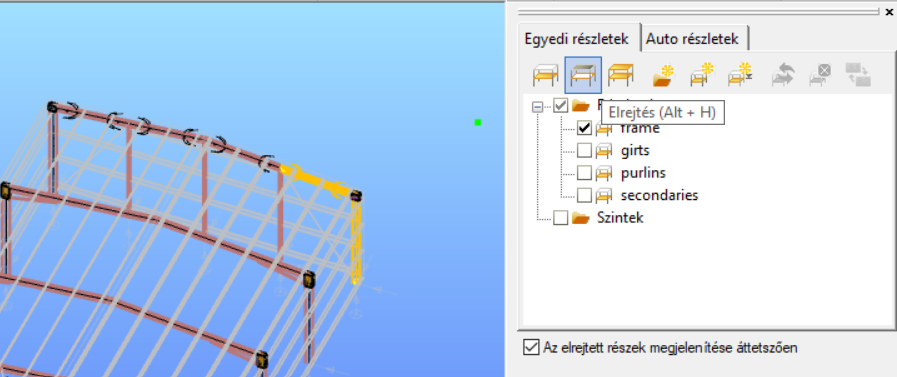

# Modell nézetek

A modell helyességének elsődleges ellenőrzési eszköze a grafikus felület. Az ellenőrzéshez elengedhetetlenek az átlátható és széleskörűen felhasználható modell nézetek. A grafikus ellenőrzéssel egyszerűen eldönthetjük, hogy a megfelelő objektum került-e a megfelelő helyre. 

<!-- wp:image {"align":"left","id":7682,"width":182,"height":209,"sizeSlug":"full","linkDestination":"media"} -->

A nézet beállítás funkciói a baloldali sávon találhatóak. A szokásos modellnézeteken (felülnézet, elölnézet, oldalnézet, izometrikus nézet) túl, négy megjelenítési lehetőség használható az objektumok megjelenítésére:

- **Szerkesztő nézet** : a legegyszerűbb modellnézet, ahol a rudakat egyenesek (vagy ívek), a lemezeket vastagság nélküli síkidomok, a támaszokat tengelyeik reprezentálják. _Használata a modellépítés során ajánlott, mert a megjelenő fogópontok ebben a nézetben láthatóak a legtisztábban, elősegítve az elemek pontos elhelyezését._

- **Drótvázas nézet** : megjelennek a szelvények alakjai és a lemezek vastagságai, támaszokat továbbra is tengelyeik reprezentálják.

- **Takartvonalas nézet** : a keresztmetszetek és a lemezek tükröződések nélküli, testnézettel jelennek meg. A támaszok is testnézetben jelennek meg.

- **Test nézet** : a keresztmetszetek és a lemezek tükröződéssel és csillogással kiegészített testnézettel jelennek meg. A támaszok is testnézetben jelennek meg.

Ahogy a modellépítés során az egyre összetettebbé válik, a részletkezelő segítségével megoldható, hogy csak a modell egy kiválasztott részlete legyen látható. Ehhez válasszuk ki a modell kívánt elemeit, majd kattintsunk a _**Részlet kezelő**_ ablakban a _**Részlet modell nézet**_ ikonra.

A parancs hatására a kiválasztott elemeken kívül minden más rejtetté válik:

Ha az _**Elrejtett részek megjelenítése áttetszően**_ jelölőnégyzetet bekapcsoljuk, a rejtett elemek halvány szürke színnel láthatóvá válnak.

**Consteel 17**-től elérhető a **Elrejtés** funkció (Alt+H). Válassza ki azokat az elemeket, amelyeket el szeretne rejteni, majd aktiválja a elrejtés ikont vagy használd az Alt+H billentyűkombinációt a végrehajtáshoz.

A teljes modell újbóli láthatóvá tételéhez kattintsunk a **_Részlet kezelő_** ablakában a _**Teljes modell**_ nézet parancsra:

További információt ld. a **_[Részlet kezelő](../3_0_model-view/3_3_portions-manager.md)_** fejezetben!