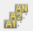
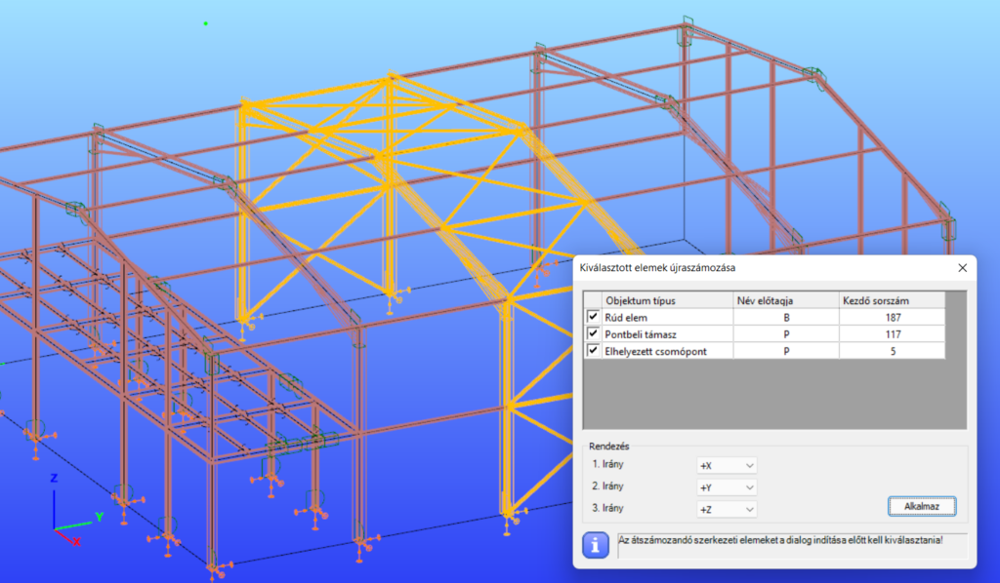

# Objektum átnevezés és újraszámozás

<!-- wp:paragraph -->

A különböző objektumok áttekinthetősége és a dokumentálhatóság érdekében neveket és címkéket használ a program az objektumok megkülönböztetésére. A legtöbb objektum nevét és számát a program automatikusan adja a modellezés folyamán. Néhány esetben azonban (pl. kapcsolatok létrehozásakor) a felhasználó adhat nevet az új objektumnak.

<!-- /wp:paragraph -->

<!-- wp:paragraph -->

Objektum átnevezésére és újraszámozására a következő funkciók érhetőek el:

<!-- /wp:paragraph -->

<!-- wp:list {"className":"is-style-default"} -->

- **Végeselem pontok számozása**– teljesen automatikusan történik, a felhasználó nem tudja befolyásolni a számozást. Ezek a számok csak a *Végeselem* és \_Analízis \_füleken láthatók.
- **Szerkezeti elemek nevei** – a szerkezeti objektumok (oszlopok, gerendák, lemezek) elhelyezésekor, másolásakor az elemnevek automatikusan létrejönnek. A nevek egy előtagból és egy számból állnak (például „B1” egy rúdelemnél). Ezek az elemnevek megjelennek a képernyő jobb oldalán található _[Objektumfában ](/manual/altalanos-ismertetes/a-fokepernyo/#oldalpanel)_ és az _[Objektum tulajdonságok](/manual/altalanos-ismertetes/a-fokepernyo/#Object-properties-window)_ ablakban is. A nevek módosítása történhet egyesével a név átírásával az objektum tulajdonságok között, vagy az automatikus újraszámozás funkció (ld. lejjebb) segítségével.
- **Szerkezeti támaszok, elemvég folytonosságok és kapcsolati elemek nevei** – a nevek mutatják a támaszok, elemvég folytonosságok és kapcsolati elemek típusait (például: “Merev” „Folytonos” vagy “yy, zz, w”).
- **Kapcsolatok nevei**– a nevek az elhelyezett csomópontok felhasználó által megadott neveit mutatja (például: „Oszlop-gerenda 01”)

<!-- /wp:list -->

<!-- wp:paragraph -->

**_Objektumok újraszámozása_**

<!-- /wp:paragraph -->

<!-- wp:paragraph -->

Az újraszámozáshoz először ki kell választani az újraszámozandó objektumokat, majd a _**Szerkezeti elemek**_ fülön található _**Kiválasztott elemek újraszámozása**_  gombra kell kattintani.

<!-- /wp:paragraph -->

<!-- wp:image {"align":"center","id":32789,"width":768,"height":449,"sizeSlug":"large","linkDestination":"media"} -->

<!-- /wp:image -->

<!-- wp:paragraph -->

A funkció elindításával a _**Kiválasztott elemek újraszámozása**_ ablak jelenik meg, ami már tartalmazza az előzőleg kiválasztott objektumtípusokat. A kiválasztott objektumtípusok neve előtt lévő kijelölő négyzettel állítható be, hogy az újraszámozás melyik objektum típusokra történjen.

<!-- /wp:paragraph -->

<!-- wp:list {"className":"is-style-checked"} -->

- Megadható a név előtagja
- Megadható a számozás kezdősorszáma
- Az újraszámozás iránya beállítható a három főtengely irányába (X, Y Z)

<!-- /wp:list -->

<!-- wp:paragraph -->

Az Alkalmaz gombra kattintva a bejelölt elem típusok új neveket kapnak a megadott előtag és kezdő sorszám, illetve a rendezési elv alapján.

<!-- /wp:paragraph -->

<!-- wp:paragraph -->

**_Feliratok láthatósága_**

<!-- /wp:paragraph -->

<!-- wp:paragraph -->

A feliratok láthatóságát az alsó állapotsoron lehet beállítani. Részletes leírást ld. a _**[Főképernyő - Állapotsor](/manual/altalanos-ismertetes/a-fokepernyo/#allapotsor)**_ fejezetében!

<!-- /wp:paragraph -->
