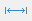
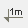
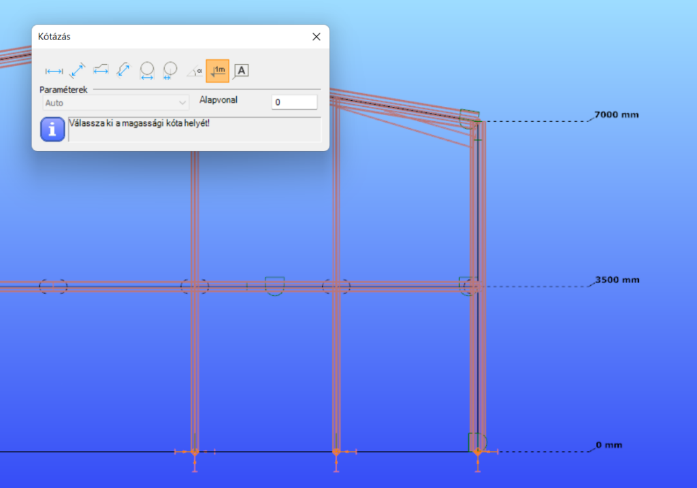

# Kótázás
<!-- wp:paragraph -->

A modell dokumentálásakor lényeges, hogy a szerkezet méretei dokumentálhatók legyenek. A méretezés eszköztára a _**Geometria**_ fülön érhető el.

<!-- /wp:paragraph -->

<!-- wp:image {"align":"center","id":32802,"width":647,"height":79,"sizeSlug":"full","linkDestination":"media"} -->

<!-- /wp:image -->

<!-- wp:image {"align":"right","id":32809,"width":359,"height":152,"sizeSlug":"full","linkDestination":"media"} -->

<!-- /wp:image -->

<!-- wp:paragraph -->

Az eszköztáron számos méretezési mód áll rendelkezésre:

<!-- /wp:paragraph -->

<!-- wp:list -->

- **Vetületi méretvonal elhelyezése** - a kiválasztott vonal elem globális X, Y, vagy Z tengelyre vetített méretének elhelyezésé.

<!-- /wp:list -->

<!-- wp:paragraph {"editorskit":{"indent":40,"devices":false,"desktop":true,"tablet":true,"mobile":true,"loggedin":true,"loggedout":true,"acf_visibility":"","acf_field":"","acf_condition":"","acf_value":"","migrated":false,"unit_test":false}} -->

_Lehetőségek_:

<!-- /wp:paragraph -->

<!-- wp:list {"editorskit":{"indent":60,"devices":false,"desktop":true,"tablet":true,"mobile":true,"loggedin":true,"loggedout":true,"acf_visibility":"","acf_field":"","acf_condition":"","acf_value":"","migrated":false,"unit_test":false}} -->

- Auto: az egér mozgatása közben a rendszer érzékeli a kívánt viszonyítási tengelyt.
- Globális X tengely szerint: X tengelyre vetített méret kótázása.
- Globális Y tengely szerint: Y tengelyre vetített méret kótázása.
- Globális Z tengely szerint: Z tengelyre vetített méret kótázása.

<!-- /wp:list -->

<!-- wp:image {"align":"center","id":7862,"width":535,"height":417,"sizeSlug":"full","linkDestination":"media"} -->

<!-- /wp:image -->

<!-- wp:list -->

- **Hosszanti méretvonal elhelyezése** - lineáris elem hosszméretének elhelyezése, az objektum középvonala és a globális koordináta rendszer X,Y síkja által meghatározott síkban, vagy az előbbire merőleges síkban, ami tartalmazza az elem középvonalát. Az egérkurzor mozgatása közben a rendszer érzékeli a kívánt síkot.

<!-- /wp:list -->

<!-- wp:image {"align":"center","id":7874,"width":425,"height":350,"sizeSlug":"full","linkDestination":"media"} -->

<!-- /wp:image -->

<!-- wp:list -->

- **Vetületi méretvonal elhelyezése két pont között**  Két pont közötti távolság globális koordináta-rendszer X,Y vagy Z tengelyére vetített méretének elhelyezése.

<!-- /wp:list -->

<!-- wp:paragraph {"editorskit":{"indent":40,"devices":false,"desktop":true,"tablet":true,"mobile":true,"loggedin":true,"loggedout":true,"acf_visibility":"","acf_field":"","acf_condition":"","acf_value":"","migrated":false,"unit_test":false}} -->

_Lehetőségek_:

<!-- /wp:paragraph -->

<!-- wp:list {"editorskit":{"indent":60,"devices":false,"desktop":true,"tablet":true,"mobile":true,"loggedin":true,"loggedout":true,"acf_visibility":"","acf_field":"","acf_condition":"","acf_value":"","migrated":false,"unit_test":false}} -->

- Auto: az egér mozgatása közben a rendszer érzékeli a kívánt viszonyítási tengelyt.
- Globális X tengely szerint: X tengelyre vetített méret kótázása a két kiválasztott pont között.
- Globális Y tengely szerint: Y tengelyre vetített méret kótázása a két kiválasztott pont között.
- Globális Z tengely szerint: Z tengelyre vetített méret kótázása a két kiválasztott pont között.

<!-- /wp:list -->

<!-- wp:list {"type":"A","className":"is-style-default"} -->

- **Hosszanti méretvonal elhelyezése két pont között** - a két pont közötti távolság méretvonala az alábbi síkokban helyezhető el:

<!-- /wp:list -->

<!-- wp:list {"editorskit":{"indent":60,"devices":false,"desktop":true,"tablet":true,"mobile":true,"loggedin":true,"loggedout":true,"acf_visibility":"","acf_field":"","acf_condition":"","acf_value":"","migrated":false,"unit_test":false}} -->

- Az objektum középvonalát tartalmazó és a globális X,Y síkra merőleges síkban
- A fenti síkra merőleges, az objektum középvonalát tartalmazó síkban.

<!-- /wp:list -->

<!-- wp:paragraph {"editorskit":{"indent":40,"devices":false,"desktop":true,"tablet":true,"mobile":true,"loggedin":true,"loggedout":true,"acf_visibility":"","acf_field":"","acf_condition":"","acf_value":"","migrated":false,"unit_test":false}} -->

Az egérkurzor mozgatása közben a rendszer érzékeli a kívánt síkot.

<!-- /wp:paragraph -->

<!-- wp:list {"type":"A"} -->

- **Méretvonal elhelyezése kör átmérőjére** 
- **Méretvonal elhelyezése kör sugarára** 
- **Két vonal között szögkóta elhelyezése**  A két egyenest kiválasztását követően bármely szög méretvonala elhelyezhető.
- **Magassági méretvonal elhelyezése**  A funkció egy szerkezet kijelölt pontjainak a megadott magassági alapvonaltól mért Globális Z irányba eső relatív magassági méretei adhatóak meg.

<!-- /wp:list -->

<!-- wp:paragraph {"editorskit":{"indent":40,"devices":false,"desktop":true,"tablet":true,"mobile":true,"loggedin":true,"loggedout":true,"acf_visibility":"","acf_field":"","acf_condition":"","acf_value":"","migrated":false,"unit_test":false}} -->

Az **Alapvonal** paraméterrel a modell globális Z=0 síkjának a magassági értékét adhatjuk meg. Minden megjelölt pont magassági értéke ehhez a szinthez lesz viszonyítva.

<!-- /wp:paragraph -->

<!-- wp:image {"align":"center","id":32816,"width":512,"height":359,"sizeSlug":"large","linkDestination":"media"} -->

<!-- /wp:image -->

<!-- wp:list -->

- **Szövegdoboz elhelyezése egy adott vonalhoz** ****- a szöveges mezőben megadott szöveg (pl.: A3) elhelyezhető a modellen.

<!-- /wp:list -->

<!-- wp:image {"align":"center","id":32825,"width":493,"height":371,"sizeSlug":"full","linkDestination":"media"} -->

<!-- /wp:image -->
