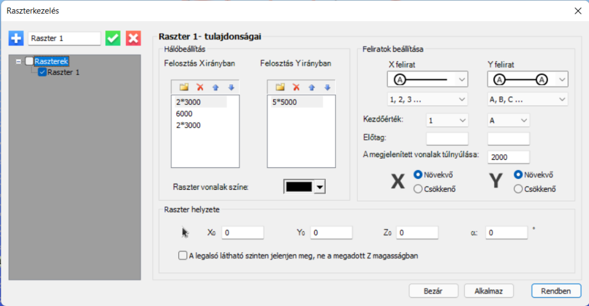

# Modell raszter
<!-- wp:paragraph -->

A _**geometria**_ fülön található _**Modell raszter**_ parancs segítségével lehetőség van általános _modell raszter_ létrehozására.

<!-- /wp:paragraph -->

<!-- wp:image {"align":"center","id":33061,"width":628,"height":80,"sizeSlug":"full","linkDestination":"media","className":"is-style-editorskit-rounded"} -->

<!-- /wp:image -->

<!-- wp:paragraph -->

A parancsikonra kattintva az alábbi **Raszterkezelés** című dialógablak nyílik meg.

<!-- /wp:paragraph -->

<!-- wp:image {"align":"center","id":33065,"width":768,"height":401,"sizeSlug":"large","linkDestination":"media"} -->

<!-- /wp:image -->

<!-- wp:paragraph -->

A **Raszterkezelés** dialóg funkciói az alábbiak:

<!-- /wp:paragraph -->

<!-- wp:list -->

- Új raszter létrehozása 
- A raszter tulajdonságok elfogadása és véglegesítése 
- A korábban létrehozott raszter törlése 

<!-- /wp:list -->

<!-- wp:paragraph -->

Modell raszter tulajdonságai:

<!-- /wp:paragraph -->

<!-- wp:list -->

- A _Hálóbeállítás_ részben a raszter felosztás definiálása végezhető el X és Y irányban:

  - Raszter új sorának létrehozása a  parancsikonnal lehetséges. A raszterháló távolságok megadhatók egy egyszerű számértékkel (pl. 6000) vagy több azonos távolság esetén egy szorzószám és egy távolság érték szorzataként (pl. 2\*3000)

  - Meglévő sor törölhető a  parancsikonnal.

  - A raszter értékek sorrendje a  parancsikonokkal módosítható.

<!-- /wp:list -->

<!-- wp:list -->

- A _Feliratok beállítása_ részben a tengelyfeliratokat lehet definiálni:

  - Megadható, hogy a tengelyfelirat a tengely mely végein jelenjen meg
  - Feliratként lehetőség van nagy és kisbetű, egész és római szám használatára is

  - A kezdőérték a legördülő menüből választható ki

  - Egyedi előtagot is lehet definiálni tetszőleges karakter megadásával
  - Megadhatjuk a megjelenített tengelyvonalak túlnyúlását
  - Lehetőség van változtatni a feliratok sorrendjén, mely lehet növekvő vagy csökkenő X és Y irányban egyaránt.

<!-- /wp:list -->

<!-- wp:list -->

- A raszter modellbeli pozícióját a dialóg alsó részén található _Raszter helyzete_ részben lehet megadni:

  - A beillesztési pont megadható a globális koordináta rendszerben (X0, Y0, Z0), vagy kijelölhető a  ikonra kattintva

  - A raszter elforgatása definiálható egy alfa szögérték megadásával. Az érték a globális + X tengelytől értelmezett

  - Megadható, hogy a raszter a megadott Z érték helyett a legalsó látható szinten jelenjen meg. (Ha még nincsenek _[definiált szintek](../3_0_model-view/3_3_portions-manager.md)_ a modellben, akkor a raszter a globális 0 szinten fog megjelenni.)

<!-- /wp:list -->
