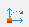
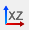
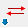

# Koordináta rendszerek

<!-- wp:paragraph -->

Az alkalmazott koordinátarendszereknek a helyes modellezésben és az eredmények értelmezésében fontos szerepe van. Ez a fejezet részletesen ismerteti a _Consteel_-ben alkalmazott koordinátarendszereket.

<!-- /wp:paragraph -->

<!-- wp:media-text {"align":"","mediaId":8108,"linkDestination":"media","mediaType":"image","mediaWidth":18,"mediaSizeSlug":"full","verticalAlignment":"top","imageFill":false} -->

<!-- wp:paragraph {"placeholder":"Content…"} -->

A _Consteel_-ben a következő két típusú koordinátarendszer használható: Descartes-féle derékszögű (XYZ), és polárkoordináta-rendszer (α, β, L). Polárkoordináta-rendszerben az “α” a pontot az origóval összekötő egyenes "XY" síkra vetített vetületének az „X” tengellyel bezárt szöge, a “β” a pontot az origóval összekötő egyenes és az „XY” sík által bezárt szög, az „L” pedig a pont origóból mért távolsága.

<!-- /wp:paragraph -->

<!-- /wp:media-text -->

<!-- wp:media-text {"align":"","mediaId":8102,"linkDestination":"media","mediaType":"image","mediaWidth":18,"mediaSizeSlug":"full","verticalAlignment":"top","imageFill":false} -->

<!-- wp:paragraph {"placeholder":"Content…"} -->

Általánosan elmondható, hogy minden Descartes-féle koordinátarendszer (tengelyek iránya, forgatás előjele) a jobb kéz szabályt követi. Ez a szabály érvényesül a geometria és a terhek modellezésénél is. A globális és a lokális rendszerek esetén is a tengelyekkel szembe nézve az órajárásával ellentétes irányú nyomaték a pozitív.

<!-- /wp:paragraph -->

<!-- /wp:media-text -->

<!-- wp:paragraph -->

A továbbiakban az alábbi jelölési rendszert használjuk:

<!-- /wp:paragraph -->

<!-- wp:paragraph -->

Globális geometria esetén (3D szerkezeti modellezéskor):

<!-- /wp:paragraph -->

<!-- wp:image {"align":"right","id":8117,"width":230,"height":230,"sizeSlug":"full","linkDestination":"media","className":"is-style-editorskit-rounded"} -->

<!-- /wp:image -->

<!-- wp:list -->

- X, Y, Z: globális koordinátarendszer
- x, y, z: lokális koordinátarendszer

<!-- /wp:list -->

<!-- wp:paragraph -->

Keresztmetszeteknél (2D szelvénymodell):

<!-- /wp:paragraph -->

<!-- wp:list -->

- v, w: keresztmetszet szerkesztői rendszer
- Y, Z: keresztmetszet súlypontjába eltolt keresztmetszet szerkesztői rendszer
- y, z: keresztmetszet főtengelyi rendszer

<!-- /wp:list -->

<!-- wp:spacer -->

<!-- /wp:spacer -->

<!-- wp:heading {"level":3} -->

### Felhasználói koordinátarendszer, lokális koordináta rendszer

<!-- /wp:heading -->

<!-- wp:image {"align":"right","id":33116,"width":359,"height":246,"sizeSlug":"full","linkDestination":"media","className":"is-style-editorskit-rounded"} -->

<!-- /wp:image -->

<!-- wp:paragraph -->

A **Felhasználói koordinátarendszer** (_FKR_) a könnyebb és gyorsabb modellezést teszi lehetővé. Az FKR egy speciálisan elhelyezett derékszögű koordinátarendszer (XYZ).

<!-- /wp:paragraph -->

<!-- wp:paragraph -->

 A koordinátarendszerek létrehozását és módosítását elősegítő eszközök a bal oldali sávon található _**Raszterháló és koordinátarendszer beállítása**_ gomb megnyomásával érhetők el a megjelenő _**Raszterháló és koordinátarendszer**_ dialógablakon keresztül.

<!-- /wp:paragraph -->

<!-- wp:paragraph -->

A Globális és a Felhasználói koordináta rendszerek közötti váltás az alsó állapotsoron található kapcsolóval történik:

<!-- /wp:paragraph -->

<!-- wp:image {"align":"center","id":33123,"width":241,"height":32,"sizeSlug":"full","linkDestination":"media"} -->

<!-- /wp:image -->

<!-- wp:paragraph -->

A \_**Raszterháló és koordinátarendszer **\_dialógon az első parancsikonnal  a globális koordinátarendszerhez lehet visszatérni. A további parancsikonok balról jobbra haladva:

<!-- /wp:paragraph -->

<!-- wp:list -->

- A koordináta-rendszer origójának áthelyezése 
- FKR váltása a globális „XY” síkra 
- FKR váltása a globális „XZ” síkra 
- FKR váltása a globális „YZ” síkra 
- FKR megadása 3 ponttal: origó, ”X” és “Y” tengelyek iránya 
- FKR tengelyeinek beállítása egy síkidom lokális koordinátarendszerének megfelelően. Az FKR origója a síkidom első pontjába kerül 

<!-- /wp:list -->

<!-- wp:image {"align":"right","id":33131,"width":203,"height":98,"sizeSlug":"full","linkDestination":"media","className":"is-style-editorskit-rounded"} -->

<!-- /wp:image -->

<!-- wp:list -->

- FKR „X” tengelyének megadása két ponttal 
- FKR „Y” tengelyének megadása két ponttal 
- FKR „Z” tengelyének megadása két ponttal 
- A kiválasztott tengely irányának megfordítása 

<!-- /wp:list -->

<!-- wp:spacer -->

<!-- /wp:spacer -->

<!-- wp:heading {"level":3} -->

### Rúdelemek lokális koordináta-rendszere

<!-- /wp:heading -->

<!-- wp:paragraph -->

A rúdelemek középvonala határozza meg a rúdelemek lokális koordináta-rendszerének „x” tengelyét. A lokális koordináta-rendszer (LKR) „x” tengelye a rúdelem kezdőpontjából (**J**) mutat a rúdelem végpontjába (**K**).

<!-- /wp:paragraph -->

<!-- wp:media-text {"align":"","mediaId":8272,"linkDestination":"media","mediaType":"image","mediaWidth":23,"mediaSizeSlug":"full","verticalAlignment":"top","imageFill":false} -->

<!-- wp:paragraph {"placeholder":"Content…"} -->

Alapesetben, ha egy rúd lokális koordináta-rendszerének „x” tengelye egybeesik a globális „X” tengellyel, akkor a rúd lokális “y” és “z” tengelyeinek irányai megegyeznek a globális “Y” és “Z” tengelyek irányával. Rúdelemek keresztmetszetének elhelyezkedése a következő: a keresztmetszet súlypontja illeszkedik a rúdelem középvonalára, és a szelvény „Y” és „Z” koordinátatengelyei egybeesnek a rúdelem lokális „y” és „z” koordináta tengelyeivel.

<!-- /wp:paragraph -->

<!-- /wp:media-text -->

<!-- wp:media-text {"align":"","mediaId":8278,"linkDestination":"media","mediaType":"image","mediaWidth":23,"mediaSizeSlug":"full","verticalAlignment":"top","imageFill":false} -->

<!-- wp:paragraph {"placeholder":"Content…"} -->

Tetszőleges helyzetű rúd (amely nem egy függőleges helyzetű oszlop) esetén, a rúd lokális „xz” tengelyei által meghatározott sík mindig merőleges a globális „XY” síkra, és a rúd lokális „z” tengelye a globális „Z” tengely irányába mutat. Íves rudak esetén a rúd lokális koordináta-rendszerének “x” tengelye a mindenkori érintő.

<!-- /wp:paragraph -->

<!-- /wp:media-text -->

<!-- wp:media-text {"align":"","mediaId":8284,"linkDestination":"media","mediaType":"image","mediaWidth":23,"mediaSizeSlug":"full","verticalAlignment":"top","imageFill":false} -->

<!-- wp:paragraph {"placeholder":"Content…"} -->

Ha a rúd középvonala függőleges (oszlopok esetében), akkor a rúd lokális „y” tengelyének iránya megegyezik a globális „Y” tengellyel. A lokális „z” tengely iránya az oszlop "x" tengelyének irányától (a kezdő és a végpont helyzetétől) függ.

<!-- /wp:paragraph -->

<!-- /wp:media-text -->

<!-- wp:media-text {"align":"","mediaId":8290,"linkDestination":"media","mediaType":"image","mediaWidth":23,"mediaSizeSlug":"full","verticalAlignment":"top","imageFill":false} -->

<!-- wp:paragraph {"placeholder":"Content…"} -->

Rúdigénybevételek értelmezése és előjele a rúd lokális koordinátarendszere alapján történik az ábrának megfelelően

<!-- /wp:paragraph -->

<!-- /wp:media-text -->

<!-- wp:spacer -->

<!-- /wp:spacer -->

<!-- wp:heading {"level":3} -->

### Síkidomok lokális koordinátarendszere

<!-- /wp:heading -->

<!-- wp:image {"align":"right","id":8296,"width":365,"height":289,"sizeSlug":"full","linkDestination":"media"} -->

<!-- /wp:image -->

<!-- wp:paragraph -->

Síkidomok lokális koordinátarendszere (LKR) által meghatározott „xy” sík megegyezik a síkidom síkjával, a „z” tengely pedig merőleges a síkra, illetve iránya a jobb kéz szabálynak megfelelően alakul. A síkidomok lokális koordináta tengelyeit meghatározó szabályok:

<!-- /wp:paragraph -->

<!-- wp:paragraph -->

Derékszögű négyszög síkidomok létrehozása esetén:

<!-- /wp:paragraph -->

<!-- wp:list -->

- az “x” és “y” tengelyek iránya párhuzamos a síkidom éleivel. A “z” tengely iránya pedig a jobbkéz szabály szerinti.

<!-- /wp:list -->

<!-- wp:paragraph -->

Sokszög síkidomok létrehozása esetén:

<!-- /wp:paragraph -->

<!-- wp:list -->

- az “x” párhuzamos az első és második pont által meghatározott oldaléllel, ami a síkidom első oldaléle,
- az “y” tengely a harmadik megadott pont által meghatározott irányba mutat. Ez a pont határozza meg a poligon második oldalélét,
- a “z” tengely iránya a jobbkéz szabály szerint alakul.

<!-- /wp:list -->

<!-- wp:spacer {"height":"20px","editorskit":{"devices":false,"desktop":true,"tablet":true,"mobile":true,"loggedin":true,"loggedout":true,"acf_visibility":"","acf_field":"","acf_condition":"","acf_value":"","migrated":false,"unit_test":false},"editorskit_typography":{"name":"","family":"","weight":""},"extUtilities":[]} -->

<!-- /wp:spacer -->

<!-- wp:image {"align":"right","id":33150,"width":320,"height":102,"sizeSlug":"full","linkDestination":"media","className":"is-style-editorskit-rounded"} -->

<!-- /wp:image -->

<!-- wp:heading {"level":3} -->

### Lokális koordináta-rendszerek módosítása

<!-- /wp:heading -->

<!-- wp:paragraph -->

Szerkezeti elemek lokális koordináta-rendszerének irányát meg lehet változtatni a _**Szerkezeti elemek**_ fülön található _**Lokális koordináta rendszerek beállítása**_  parancsikon segítségével. A megnyíló, azonos nevű ablak tartalmazza a funkció összes parancsát.

<!-- /wp:paragraph -->

<!-- wp:paragraph -->

Első lépésben ki kell választani, hogy rúd , felület  vagy pontbeli támasz  lokális koordináta rendszerét akarjuk módosítani. Ezután ki kell jelölni a módostani kívánt eleme(ke)t, majd a kívánt módosításhoz tartozó parancsikonra kell kattintani, majd az információs sávban  megjelenő utasításnak megfelelően a modelltérben történő egérkattintással meg kell adni az irányvektort vagy -pontot, amit elvégezve megtörténik a LKR módosítása. A módosítási lehetőségek parancsikonjai (balról jobbra haladva) az alábbiak:

<!-- /wp:paragraph -->

<!-- wp:list -->

- az "X" tengely irányának megadása irányvektorral 
- az "Y" tengely irányának megadása irányvektorral 
- az "Z" tengely irányának megadása irányvektorral 
- az "X" tengely irányának megadása irányponttal 
- az "Y" tengely irányának megadása irányponttal 
- az "Z" tengely irányának megadása irányponttal 
- az "X" tengely irányának megfordítása 
- az "Y" tengely irányának megfordítása 
- az "Z" tengely irányának megfordítása 
- A lokális Z tengely beállítása a kapcsolódó rudak által alkotott felületre merőlegesen  (Egyszer görbült felületek rúdelemein alkalmazható).

<!-- /wp:list -->
