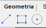
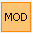

# Rajzolás

<!-- wp:paragraph -->

A rajzolás funkciói a _**Geometria**_ fülön találhatóak.

<!-- /wp:paragraph -->

<!-- wp:image {"id":33362,"width":90,"height":56,"sizeSlug":"full","linkDestination":"media","className":"is-style-editorskit-rounded"} -->

<!-- /wp:image -->

<!-- wp:image {"align":"right","id":33392,"width":239,"height":102,"sizeSlug":"full","linkDestination":"media","className":"is-style-editorskit-rounded"} -->

<!-- /wp:image -->

<!-- wp:paragraph -->

**_Vonal rajzolása_**

<!-- /wp:paragraph -->

<!-- wp:paragraph -->

 Egyenes rajzolása az egyenes kezdő- és végpontjának megadásával.

<!-- /wp:paragraph -->

<!-- wp:paragraph -->

 Vonallánc rajzolása az első pont, majd a vonallánc szakaszpontjainak megadásával. Befejezés az _**Esc**_ billentyű lenyomásával.

<!-- /wp:paragraph -->

<!-- wp:image {"align":"right","id":33385,"width":239,"height":101,"sizeSlug":"full","linkDestination":"media","className":"is-style-editorskit-rounded"} -->

<!-- /wp:image -->

<!-- wp:paragraph -->

**_Téglalap rajzolása_**

<!-- /wp:paragraph -->

<!-- wp:paragraph -->

 Téglalap rajzolása XZ síkban az átlópontok megadásával.

<!-- /wp:paragraph -->

<!-- wp:paragraph -->

 Tetszőleges irányú téglalap rajzolása. Az alapél és egy harmadik pont a megadásával.

<!-- /wp:paragraph -->

<!-- wp:image {"align":"right","id":33378,"width":239,"height":101,"sizeSlug":"full","linkDestination":"media","className":"is-style-editorskit-rounded"} -->

<!-- /wp:image -->

<!-- wp:paragraph -->

**_Kör rajzolása_**

<!-- /wp:paragraph -->

<!-- wp:paragraph -->

 Kör rajzolása a középpont és egy kerületi pont megadásával. A kör síkja párhuzamos a [_FKR_ ](../4_0_drawing-geometry/4_1_coordinate-systems.md#felhasználói-koordinátarendszer-lokális-koordináta-rendszer)síkjával és a megadott középponton megy át.

<!-- /wp:paragraph -->

<!-- wp:paragraph -->

 Kör rajzolása a kör két pontjának megadásával. A kör létrehozható az [FKR ](../4_0_drawing-geometry/4_1_coordinate-systems.md#felhasználói-koordinátarendszer-lokális-koordináta-rendszer)síkján kívül is.

<!-- /wp:paragraph -->

<!-- wp:paragraph -->

 Kör rajzolása 3 térbeli pont megadásával. A kör síkját a három megadott pont határozza meg.

<!-- /wp:paragraph -->

<!-- wp:paragraph -->

****Ív rajzolása****

<!-- /wp:paragraph -->

<!-- wp:image {"align":"right","id":33371,"width":239,"height":101,"sizeSlug":"full","linkDestination":"media","className":"is-style-editorskit-rounded"} -->

<!-- /wp:image -->

<!-- wp:paragraph -->

Az ívek létrehozhatók az aktuális _FKR_ síkján kívül is.

<!-- /wp:paragraph -->

<!-- wp:paragraph -->

 Körív rajzolása középpont, kezdőpont és szög megadásával. A szög megadása történhet pontfogással a modelltérben, vagy a szög megadásával a dialógon.

<!-- /wp:paragraph -->

<!-- wp:paragraph -->

 Körív rajzolása 3 pont (kezdőpont, végpont és egy harmadik pont) megadásával.

<!-- /wp:paragraph -->

<!-- wp:paragraph -->

 Körív rajzolása kezdőpont, végpont és érintő megadásával.

<!-- /wp:paragraph -->

<!-- wp:image {"align":"right","id":33399,"width":359,"height":152,"sizeSlug":"full","linkDestination":"media","className":"is-style-editorskit-rounded"} -->

<!-- /wp:image -->

<!-- wp:paragraph -->

**_Síkidom szerkesztés_**

<!-- /wp:paragraph -->

<!-- wp:paragraph -->

 Síkidom rajzolása. (ld. lentebb)

<!-- /wp:paragraph -->

<!-- wp:paragraph -->

 Lyuk rajzolása. Először a kilyukasztani kívánt síkidomot kell kiválasztani, majd a lyuk geometriáját kell megrajzolni a választott síkidomnak megfelelően (négyszög, zárt poligon vagy kör).

<!-- /wp:paragraph -->

<!-- wp:paragraph -->

 Síkidom módosítása. A parancsikon a síkidom módosítás alábbi parancsait aktiválja:

<!-- /wp:paragraph -->

<!-- wp:paragraph {"editorskit":{"indent":40,"devices":false,"desktop":true,"tablet":true,"mobile":true,"loggedin":true,"loggedout":true,"acf_visibility":"","acf_field":"","acf_condition":"","acf_value":"","migrated":false,"unit_test":false}} -->

 Él megtörésével új pont hozzáadása a síkidomhoz. Ehhez ki kell jelölni a kívánt élt, majd meg kell adni az új pont helyét.

<!-- /wp:paragraph -->

<!-- wp:paragraph {"editorskit":{"indent":40,"devices":false,"desktop":true,"tablet":true,"mobile":true,"loggedin":true,"loggedout":true,"acf_visibility":"","acf_field":"","acf_condition":"","acf_value":"","migrated":false,"unit_test":false}} -->

 A síkidom valamely pontjának vagy íves szakaszának törlése. A törlés után mindkét esetben a szomszédos sarokpontok között egy egyenes szakasz jön létre.

<!-- /wp:paragraph -->

<!-- wp:paragraph -->

 Síkidom lokális „x” vagy "y" tengelyének módosítása két pont megadásával. Első lépésben a módosítani kívánt síkidomot kell kiválasztani, majd a módosítani kívánt tengelyt a dialóg utolsó parancsikonjával . Ezután a tengely az irányvektor két pontjának megadásával definiálható.

<!-- /wp:paragraph -->

<!-- wp:paragraph -->

**Síkidom rajzolás módjai**

<!-- /wp:paragraph -->

<!-- wp:paragraph -->

 Téglalap alakú síkidomok rajzolási módjai: téglalap vagy térben elhelyezkedő téglalap.

<!-- /wp:paragraph -->

<!-- wp:paragraph -->

 Kör alakú síkidomok rajzolási módjai: kör megadása sugárral, átmérővel, vagy 3 kerületi ponttal.

<!-- /wp:paragraph -->

<!-- wp:paragraph -->

 Sokszög alakú síkidom rajzolása. Pontok megadását követően a sokszög bezárása a jobb egérgombbal történhet.

<!-- /wp:paragraph -->

<!-- wp:paragraph -->

 Síkidom rajzolása vonalak kijelölésével. A vonalak végei nem nyúlhatnak túl a sarokpontokon.

<!-- /wp:paragraph -->
