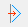
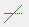

# Módosítás
<!-- wp:paragraph -->

**A négy leggyakrabban használt módosítási funkció a bal oldali sávon található:**

<!-- /wp:paragraph -->

<!-- wp:paragraph -->

 **Pont és él mozgatása.** Pont vagy él kijelölése, majd új helyzet megadása. A funkcióval módosíthatók az egyenesek vagy ívek végpontjainak helyzetei, és a síkidomok, illetve síkidomokban definiált lyukak sarokpontjainak és éleinek helyzetei.

<!-- /wp:paragraph -->

<!-- wp:image {"align":"right","id":33433,"width":359,"height":197,"sizeSlug":"full","linkDestination":"media","className":"is-style-editorskit-rounded"} -->

<!-- /wp:image -->

<!-- wp:paragraph -->

 **Kijelölt objektumok eltolása.** A kiválasztott objektumok mozgathatók vagy másolhatók. Első lépésként a módosítandó elemeket kell kiválasztani, majd a **Kijelölt objektumok eltolása** ikonra kell kattintani.

<!-- /wp:paragraph -->

<!-- wp:paragraph -->

A dialógblak bal oldali választó gombjaival kiválasztható a módosítás módja (másolás vagy mozgatás). Másolás választása esetén megadható a másolatok száma is.

<!-- /wp:paragraph -->

<!-- wp:paragraph -->

A mozgatás/másolás két pont megadásával történik a modelltérben. A funkció elindítható előzetes elemkiválasztás nélkül is. Ebben az esetben első lépésként a másolandó/mozgatandó eleme(ke)t kell kiválasztani.

<!-- /wp:paragraph -->

<!-- wp:paragraph -->

A kiválasztott elemek, terhek és támaszok mozgatásra/másolásra kerülnek a két ponttal meghatározott vektor alapján, illetve a beállított opciók szerint. A mozgatás/másolás funkció független az aktuális _FKR_-től.

<!-- /wp:paragraph -->

<!-- wp:paragraph {"editorskit":{"indent":40,"devices":false,"desktop":true,"tablet":true,"mobile":true,"loggedin":true,"loggedout":true,"acf_visibility":"","acf_field":"","acf_condition":"","acf_value":"","migrated":false,"unit_test":false}} -->

**A funkció működését befolyásoló opciók:**

<!-- /wp:paragraph -->

<!-- wp:list {"className":"is-style-default","editorskit":{"indent":60,"devices":false,"desktop":true,"tablet":true,"mobile":true,"loggedin":true,"loggedout":true,"acf_visibility":"","acf_field":"","acf_condition":"","acf_value":"","migrated":false,"unit_test":false}} -->

- **Szerkezeti elemek másolása:**

  - _Jelölve_ (alapértelmezetten): a szerkezeti elemek mozgatásra/másolásra kerülnek.

  - _Jelöletlen_: a szerkezeti elemeken elhelyezett terhek és/vagy támaszok mozgatása/másolása a szerkezeti elem mozgatása/másolása nélkül.

- **Terhek másolása** (csak a másolás esetén van hatása): amennyiben az adott szerkezeti elemen van elhelyezett teher, ezt az opciót használva a terhek is másolva lesznek. Ha a mozgatás az aktív funkció, a terhek automatikusan az elemmel együtt mozdulnak el.

  - _Jelölve_ (alapértelmezetten): a terhek a szerkezeti elemmel együtt kerülnek másolásra. Amennyiben kizárólag terhek vannak kijelölve, úgy az alábbi opciók is aktívvá válnak:

    - _Eredeti tehereset:_ a kiválasztott terhek másolatai az eredeti teheresetben maradnak.
    - _Új tehereset:_ a terhek másolatai mind külön teheresetekbe kerülnek. Annyi új tehereset jön létre, ahány példányban történik a másolás. Az új teheresetek nevei az eredeti névből és egy "-x" utótagból állnak össze, ahol az "x" egy növekvő egész szám.

  - _Jelöletlen_: a terhek nem kerülnek másolásra.

- **Támaszok másolása**

  - _Jelölve_ (alapértelmezetten): a kiválasztott szerkezeti elemek a hozzájuk tartozó támaszokkal együtt kerülnek másolásra.

  - _Jelöletlen_: a kiválasztott szerkezeti elemek a hozzájuk tartozó támaszok nélkül kerülnek másolásra.

- **Pontok összekötése:**

  - _Jelölve_: a másolt elemek és az eredeti elemek végpontjai egyenesekkel összekötésre kerülnek.

  - _Jelöletlen_ (alapértelmezetten): a másolt elemek és az eredeti elemek végpontjai nem kerülnek összekötésre.

<!-- /wp:list -->

<!-- wp:image {"align":"right","id":33449,"width":359,"height":197,"sizeSlug":"full","linkDestination":"media","className":"is-style-editorskit-rounded"} -->

<!-- /wp:image -->

<!-- wp:paragraph -->

 **Kijelölt objektumok tükrözése.** Kijelölt elemek tükrözés két pont által meghatározott tengely körül. A tükrözés síkja mindig merőleges lesz az aktuális _FKR_-re.

<!-- /wp:paragraph -->

<!-- wp:paragraph -->

Első lépésként a tükrözendő elemeket kell kiválasztani, majd a _**Kijelölt objektumok tükrözése**_ ikonra kell kattintani.

<!-- /wp:paragraph -->

<!-- wp:paragraph -->

A tükrözés tengelye két ponttal adható meg. A tengely megadása után a kiválasztott elemek másolásra vagy mozgatásra kerülnek az új pozícióba.

<!-- /wp:paragraph -->

<!-- wp:paragraph -->

A dialógon található opciók hatásai megegyeznek a mozgatás funkciónál leírtakkal (ld. fentebb).

<!-- /wp:paragraph -->

<!-- wp:image {"align":"right","id":33442,"width":359,"height":196,"sizeSlug":"full","linkDestination":"media","className":"is-style-editorskit-rounded"} -->

<!-- /wp:image -->

<!-- wp:paragraph -->

 **Kijelölt objektumok forgatása.**

<!-- /wp:paragraph -->

<!-- wp:paragraph -->

Első lépésként a forgatandó elemeket kell kiválasztani, majd a _**Kijelölt objektumok forgatása**_ ikonra kell kattintani.

<!-- /wp:paragraph -->

<!-- wp:paragraph -->

A forgatáshoz meg kell adni a forgatás középpontját, majd a forgatás referencia pontját, végül a forgatás iránypontját. A forgatás szögének megadása történhet pontfogással a modelltérben, vagy a szög értékének megadásával a dialógon. Másolás esetén megadható a másolatok száma.

<!-- /wp:paragraph -->

<!-- wp:paragraph -->

A dialógon található opciók hatásai megegyeznek az eltolás funkciónál leírtakkal (ld. fentebb).

<!-- /wp:paragraph -->

<!-- wp:paragraph -->

**A további módosítási funkciók a** _Geometria_ fülön találhatók:

<!-- /wp:paragraph -->

<!-- wp:paragraph -->

 **Kijelölt objektumok átméretezése**. Átméretezéshez először ki kell választani az átméretezendő objektumokat, majd meg kell adni egy referencia pontot és egy nagyító pontot (a referencia pont és a nagyító pont közötti távolság határozza meg az átméretezés mértékét). Az utolsó pont megadása után megtörténik az átméretezés. Az objektumok hosszai az átméretezésnek megfelelően fognak megváltozni. Az átméretezett objektumokon lévő vonalmenti terhek hosszai is megváltoznak az átméretezésnek megfelelően.

<!-- /wp:paragraph -->

<!-- wp:paragraph -->

 **Kijelölt vonalelem megtörése.** Megtöréshez ki kell választani a vonalelemet és egy törési pontot a vonalelem tengelye mentén, majd meg kell adni a kiválasztott pont új pozícióját. Az eredeti vonalelem két elemre kerül felbontásra.

<!-- /wp:paragraph -->

<!-- wp:paragraph -->

A kiválasztott pont új pozíciójának koordinátái megadhatók begépeléssel is az aktuális koordinátarendszer szerint.

<!-- /wp:paragraph -->

<!-- wp:paragraph -->

 **Kijelölt vonalelem görbítése**. Görbítéshez ki kell választani a görbítendő vonalelemet, majd meg kell adni a beillesztési pontot.

<!-- /wp:paragraph -->

<!-- wp:paragraph -->

 **Kijelölt körív kiegyenesítése.** Kiegyenesítéshez ki kell választani a kiegyenesítendő ívet, amit a program letöröl, a kezdő- és végpontját pedig egyenes szakasszal köti össze.

<!-- /wp:paragraph -->

<!-- wp:paragraph -->

 **Kijelölt objektum felosztása.** Vonalak és rudak adott darabszámú, vagy adott hosszúságú részekre osztása.

<!-- /wp:paragraph -->

<!-- wp:paragraph -->

Az **Egyenlő részekre** opció választása esetén megadhatók a szakaszok száma vagy a szakaszok hosszai állíthatók be.

<!-- /wp:paragraph -->

<!-- wp:paragraph -->

A **Változó hosszúságú részekre** opció választása esetén a szakaszok relatív vagy abszolút hosszai adhatók meg A vagy B végpontoktól.

<!-- /wp:paragraph -->

<!-- wp:columns -->

<!-- wp:column -->

<!-- wp:image {"align":"right","id":33457,"width":357,"height":236,"sizeSlug":"full","linkDestination":"media","className":"is-style-editorskit-rounded"} -->

<!-- /wp:image -->

<!-- /wp:column -->

<!-- wp:column -->

<!-- wp:image {"align":"left","id":33464,"width":358,"height":238,"sizeSlug":"full","linkDestination":"media","className":"is-style-editorskit-rounded"} -->

<!-- /wp:image -->

<!-- /wp:column -->

<!-- /wp:columns -->

<!-- wp:paragraph -->

 **Kijelölt objektumok darabolása metszéspontok mentén.** Daraboláshoz ki kell választani a két metsző objektumot. Mind a két objektum feldarabolásra kerül a metszéspontban. Működik egyenes és íves elemekkel, valamint síkidomokkal is.

<!-- /wp:paragraph -->

<!-- wp:paragraph -->

 **Kijelölt vonalelem vagy síkidom vágása vágóéllel vagy vágósíkkal**. Vágáshoz először ki kell jelölni a vágóélt vagy -síkot, majd meg kell adni a vágandó vonalelem vagy síkidom eldobandó részét. Működik egyenes és íves elemekkel, valamint síkidomokkal is.

<!-- /wp:paragraph -->

<!-- wp:paragraph -->

 **Kijelölt vonalelem vagy síkidom határvonalakhoz vagy határsíkhoz igazítása.** Igazításhoz először ki kell jelölni a határvonalat vagy -síkot, majd a meghosszabbítandó elemet. Síkidomok esetében a parancs akkor végrehajtható, ha a síkidom élei a nyújtás során nem metsződnek egymásba.

<!-- /wp:paragraph -->

<!-- wp:paragraph -->

 **Kijelölt szakasz adott részének kivágása.** Kivágáshoz először ki kell jelölni az objektumot, majd a kivágandó szakasz kezdő és végpontját.

<!-- /wp:paragraph -->

<!-- wp:paragraph -->

 **Két kijelölt vonalelem letörése.** Letöréshez először ki kell választani a két egyenes elemet. A letörés a kiválasztás sorrendjében fog történni.

<!-- /wp:paragraph -->

<!-- wp:image {"align":"center","id":33479,"width":323,"height":146,"sizeSlug":"full","linkDestination":"media","className":"is-style-editorskit-rounded"} -->

<!-- /wp:image -->

<!-- wp:paragraph -->

 **Két kijelölt vonalelem metszéspontjában az élek lekerekítése.** Lekerekítéshez először ki kell választani a két egyenes elemet, majd meg kell adni a lekerekítés sugarát.

<!-- /wp:paragraph -->

<!-- wp:image {"align":"center","id":33472,"width":359,"height":116,"sizeSlug":"full","linkDestination":"media","className":"is-style-editorskit-rounded"} -->

<!-- /wp:image -->
