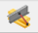

# Kapcsolati elemek

<!-- wp:paragraph -->

A kapcsolati elem azoknak az elemeknek az összekötésére szolgál, amelyek referenciavonalai nem kapcsolódnak közvetlenül egymáshoz. A Consteelben háromféle kapcsolati elem használható:

<!-- /wp:paragraph -->

<!-- wp:list -->

- [Kapcsolati elem (hagyományos)](#Kapcsolati_elem)
- [Okos kapcsolati elem](#smart-link)
- [Kényszer elem](#constraints)

<!-- /wp:list -->

<!-- wp:heading {"level":3} -->

### Kapcsolati elem (hagyományos típus)

<!-- /wp:heading -->

<!-- wp:image {"id":35085,"width":324,"height":77,"sizeSlug":"full","linkDestination":"media","className":"is-style-editorskit-rounded"} -->

<!-- /wp:image -->

<!-- wp:paragraph -->

A kapcsolati elemek alapvető tulajdonságai az alábbiak:

<!-- /wp:paragraph -->

<!-- wp:list -->

- Kapcsolódás pozíciója: itt lehet megadni azt a pontot a kapcsolati elem hosszának a százalékában, ahol a megadott folytonosságot értelmezni kell. Az érték 0 és 1 között lehet
- Elfordulás: a megadott szöggel el lehet forgatni a kapcsolati elemet
- Folytonosság: előre definiált folytonosságokat lehet rendelni a definiált pozícióhoz. Ha új folytonossági típus szükséges, akkor az a hárompontos  ikonra kattintva létrehozható.

<!-- /wp:list -->

<!-- wp:paragraph {"align":"justify"} -->

A kapcsolati elemeknek két típusa van a Consteelben. Az egyikkel két szerkezeti pontot, a másikkal két élt lehet összekapcsolni.

<!-- /wp:paragraph -->

<!-- wp:heading {"level":4} -->

#### Két szerkezeti pont összekötése ()

<!-- /wp:heading -->

<!-- wp:paragraph -->

Két szerkezeti pont köthető össze ezzel a típusú kapcsolati elemmel. A paraméterek megadása után a kapcsolati elem elhelyezéséhez ki kell jelölni azt a két szerkezeti pontot, amiket ez az elem össze fog kapcsolni. Az elsőnek kijelölt pont lesz a kapcsolati elem kezdőpontja.

<!-- /wp:paragraph -->

<!-- wp:image {"align":"center","id":35093,"width":358,"height":193,"sizeSlug":"full","linkDestination":"media","className":"is-style-editorskit-rounded"} -->

<!-- /wp:image -->

<!-- wp:paragraph {"align":"justify"} -->

Például, ha egy jelentős magasságú oszlophoz egy konzol kapcsolódik, akkor ajánlatos a konzolt nem az oszlop referenciavonalába bekötni, hanem csak az oszlopövig modellezni és ezt a végpontot egy kapcsolóelemmel az oszlop referenciavonalába bekötni. Ily módon modellezett szerkezet számítása pontosabb, a valós helyzethez közelebb álló eredményt ad.

<!-- /wp:paragraph -->

<!-- wp:image {"align":"center","id":35101,"width":461,"height":261,"sizeSlug":"full","linkDestination":"media","className":"is-style-editorskit-rounded"} -->

<!-- /wp:image -->

<!-- wp:heading {"level":4} -->

#### Két egyenlő hosszúságú, párhuzamos él összekötése ()

<!-- /wp:heading -->

<!-- wp:paragraph -->

Egyenlő hosszúságú és párhuzamos élek és rúdelemek köthetők össze ezzel a típusú kapcsolati elemmel. A megadása a pont-pont kapcsolati elemmel analóg módon történik.

<!-- /wp:paragraph -->

<!-- wp:paragraph -->

Felhasználható például egy külpontos födém és egy gerenda összekapcsolására

<!-- /wp:paragraph -->

<!-- wp:image {"align":"center","id":9046,"width":698,"height":296,"sizeSlug":"full","linkDestination":"media"} -->

<!-- /wp:image -->

<!-- wp:image {"align":"center","id":9052,"width":698,"height":295,"sizeSlug":"full","linkDestination":"media"} -->

<!-- /wp:image -->

<!-- wp:heading {"level":3} -->

### Okos kapcsolati elem megadása ()

<!-- /wp:heading -->

<!-- wp:paragraph {"align":"justify"} -->

Az új típusú okos kapcsolati elem lehetővé teszi a geometriai változások egyszerűbb kezelését az összekapcsolt elemek között. Az elem követi annak a rúdelemnek a geometriai változásait (mozgatás, forgatás, szelvény változás), amelyre el lett helyezve (_**Főszelvény**_). Ezen kívül a hozzá kapcsolódó másik rúdelem (_**Kapcsolódó szelvény**_) is követi a kapcsolati elem és ezáltal a főszelvény változásait.

<!-- /wp:paragraph -->

<!-- wp:paragraph {"align":"justify"} -->

Tipikus felhasználási lehetősége ennek az elemnek a főtartó-szelemen kapcsolata. Ezzel az objektummal a főtartó adott pontjaiban olyan kapcsolati elemeket tudunk elhelyezni, melyeknek végpontjához később egyszerűen tudunk szelemeneket kapcsolni, a köztük lévő külpontosság előre definiált paraméterei alapján. Bármilyen geometriai vagy szelvény változás esetén a kapcsolati elem követi a főtartó módosulását, a hozzá kapcsolt szelemennel együtt.

<!-- /wp:paragraph -->

<!-- wp:paragraph -->

A parancs elindítása után megjelenik az _**Okos kapcsolati elem szerkesztése**_ párbeszédablak:

<!-- /wp:paragraph -->

<!-- wp:image {"align":"center","id":35109,"width":625,"height":518,"sizeSlug":"full","linkDestination":"media","className":"is-style-editorskit-rounded"} -->

<!-- /wp:image -->

<!-- wp:paragraph {"align":"justify"} -->

\#1 A _Főszelvény_ (A) mezőben lehet megadni a kapcsolati elem lokális külpontosságát a főszelvény valamely nevezetes pontjához képest.

<!-- /wp:paragraph -->

<!-- wp:paragraph {"align":"justify"} -->

\#2 A _Folytonosság_ mezőben a kapcsolati elem folytonosságát lehet kiválasztani a már meglévő típusok közül választva, vagy új típust létrehozva. A két rúdelem közötti kapcsolódási pontot megadhatjuk kézzel a „Pozíció megadása manuálisan” jelölőnégyzet bejelölésével, vagy ennek üresen hagyásával automatikusan is. Ekkor a kapcsolódás pozíciója mindig a főszelvény profiljának a peremén lesz.

<!-- /wp:paragraph -->

<!-- wp:paragraph {"align":"justify"} -->

\#3 A _Kapcsolódó szelvény_ (B) mezőben megadhatunk a kapcsolati elem számára egy külpontosság növekményt a kapcsolódó szelvény megadása által. Az itt megadott szelvény magasságát és a szelvény viszonyítási pontját figyelembe véve határozza meg a program a kapcsolati elem hosszát.

<!-- /wp:paragraph -->

<!-- wp:paragraph -->

A kapcsolati elem(ek) elhelyezésére két lehetőség van.

<!-- /wp:paragraph -->

<!-- wp:paragraph {"align":"justify"} -->

 Ebben a funkcióban a kapcsolati elemek egyesével helyezhetők el a rúdelem adott pontjára kattintással. Az elhelyezett okos kapcsolati elem mindig párhuzamos a rúd Z tengelyével.

<!-- /wp:paragraph -->

<!-- wp:paragraph {"align":"justify"} -->

 Csoportos elhelyezésnél először a párbeszédablak alsó részén meg kell adni az elhelyezési távolságokat a rúd kezdőpontjától mérve, majd az elhelyezéshez egy rúdelemre kell kattintani. Ha olyan kiosztás van megadva, amely nem helyezhető el az adott rúdon (mert a rúd nem elég hosszú ahhoz), akkor a program nem hajtja végre a műveletet, és a „Főszelvény megadott paramétereivel nem hozható létre okos kapcsolati elem!” figyelmeztető üzenettel tájékoztat erről.

<!-- /wp:paragraph -->

<!-- wp:image {"align":"left","id":21420,"width":67,"height":71,"sizeSlug":"full","linkDestination":"none"} -->

<!-- /wp:image -->

<!-- wp:paragraph {"align":"justify"} -->

Fontos tudni, hogy jelenleg a kapcsolati elemek nem másolhatók a rúdelemekkel együtt. Már elhelyezett okos kapcsolati elemeket tartalmazó rúd másolása esetén a rajta elhelyezett okos kapcsolati elemek nem másolódnak együtt, hanem azokat külön kijelölve egy újabb művelettel lehet másolni.

<!-- /wp:paragraph -->

<!-- wp:spacer {"height":"10px"} -->

<!-- /wp:spacer -->

<!-- wp:heading {"level":3} -->

### Kényszer elemek

<!-- /wp:heading -->

<!-- wp:paragraph {"align":"justify"} -->

Az ilyen típusú kapcsolati elemek különlegesek, mivel kézzel nem hozhatók létre, így külön parancsikon sem tartozik ezekhez a menüsoron. A kényszer elemek automatikusan jönnek létre a végeselem-generálás során, ha a következő objektumok jelen vannak a modellben:

<!-- /wp:paragraph -->

<!-- wp:list -->

- Keret sarkok a [**_Keret sarok varázsló_**](/manual/szerkezetmodellezes/keretsarok-varazslo/) segítségével
- Héj végeselem típusra módosított rúdelem (ld. a **_[Superbeam](/manual/szerkezetmodellezes/superbeam/)_** fejezetet további információért)

<!-- /wp:list -->

<!-- wp:paragraph -->

A kényszer elemek vastag narancssárga vonalakkal jelennek meg a modell véges elem nézetében. A kényszerek a 7 szabadságfokú rúdelem alakváltozások egészét, vagy csak egy részét viszik át egyik csomópontból a másikba, vagy a rúdból a héjelem alapú megjelenítésébe.

<!-- /wp:paragraph -->

<!-- wp:paragraph -->

**Keretsarkok**

<!-- /wp:paragraph -->

<!-- wp:paragraph -->

A keretsarkokban létrehozott kényszerek, amelyek csak a gerenda és az oszlop közötti öblösödési deformációkat adják át a keretsarok objektum típusának megfelelően. A keret sarok típusokról további információkat ld: [**_Keretsarok varázsló_**](/manual/szerkezetmodellezes/keretsarok-varazslo/)

<!-- /wp:paragraph -->

<!-- wp:paragraph -->

**Superbeam**

<!-- /wp:paragraph -->

<!-- wp:image {"align":"right","id":35125,"width":316,"height":91,"sizeSlug":"full","linkDestination":"media","className":"is-style-editorskit-rounded"} -->

<!-- /wp:image -->

<!-- wp:paragraph {"align":"justify"} -->

Az átvitt alakváltozások típusa az objektumtulajdonságok ablakban elérhető legördülő menüből választható ki. Az alapértelemezett típus az _Eltolódás_. A kényszer elemek tulajdonságait megadhatjuk egyformán az egész gerendára vonatkozóan, vagy az egyes kényszere elemekre egyenként is.

<!-- /wp:paragraph -->

<!-- wp:paragraph {"align":"justify"} -->

Az első esetben a tulajdonságok a rúd mindkét végén csak együtt módosíthatók. Ehhez magát a rudat kell kijelölni a normál modelltérben. A második esetben a kényszerelemek tulajdonságai egyenként is megadhatók, a szuperbeam elem lemezekké történő átalakítása után a végeselemes nézetben.

<!-- /wp:paragraph -->

<!-- wp:paragraph {"align":"justify"} -->

Az „_Eltolódás_” beállítás az elmozdulások átvitelét eredményezi mind a 3 globális irányban, beleértve a 7SZF gerendaelemek öblösödési deformációit is. Az „_Eltolódás és elfordulás_” beállítás az előbbiekhez hozzáveszi az elfordulásokat is mind a 3 globális irányban.

<!-- /wp:paragraph -->
