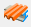
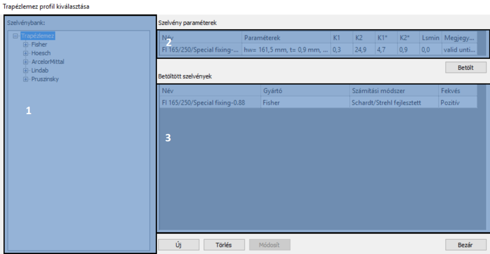

# Nyírási mező

<!-- wp:paragraph -->

A nyírási mező objektummal figyelembe vehető a trapézlemez megtámasztó hatása a kihajlás számításban. A nyírási merevséget csak a 7 szabadságfokú rúdelemeket használó végeselem szoftverek képesek kezelni.

<!-- /wp:paragraph -->

<!-- wp:image {"align":"left","id":21420,"width":65,"height":69,"sizeSlug":"full","linkDestination":"none"} -->

<!-- /wp:image -->

<!-- wp:paragraph {"align":"justify"} -->

**Nagyon fontos** megjegyezni, hogy az implementálásra került képletek által meghatározott nyírási merevségek csak abban az esetben szolgáltatnak megfelelő eredményt, ha a trapézlemezeket megfelelő módon rögzítjük. Ilyen rögzítési követelmény a trapézlemezek mind a 4 oldalán való rögzítése az alszerkezethez.

<!-- /wp:paragraph -->

<!-- wp:spacer {"height":"1px"} -->

<!-- /wp:spacer -->

<!-- wp:heading {"level":3} -->

### Nyírási merevség értelmezése

<!-- /wp:heading -->

<!-- wp:paragraph {"align":"justify"} -->

Az 1. ábrán a nyírási merevség értelmezése látható. A nyírási diafragma elmozdulása e \[mm] egy adott F \[kN] nyíróerő hatására \[1]. A nyírási rugalmasság definíció szerint:

$$c=\dfrac{e}{F} \quad  [mm/kN]$$

<!-- /wp:paragraph -->

<!-- wp:paragraph {"align":"justify"} -->

A nyírási rugalmasság reciproka a nyírási merevség, melyet S-el jelöl a szakirodalom:

$$S=\dfrac{F}{e} \quad [kN/mm]$$

<!-- /wp:paragraph -->

<!-- wp:image {"align":"center","id":9067,"width":466,"height":405,"sizeSlug":"full","linkDestination":"media"} -->

Nyírási mező deformációja adott erőre \[1]

<!-- /wp:image -->

<!-- wp:paragraph -->

A nyírási rugalmasságot és nyírási merevséget legtöbbször trapézlemezeknél értelmezik. Egy ilyen lemez esetén a teljes nyírási rugalmasság (C) az alábbi komponensekből tevődik össze:

<!-- /wp:paragraph -->

<!-- wp:list -->

- Profil torzulása

<!-- /wp:list -->

<!-- wp:image {"align":"center","id":9073,"width":413,"height":110,"sizeSlug":"full","linkDestination":"media"} -->

<!-- /wp:image -->

<!-- wp:list -->

- Nyírási alakváltozás a lemezben

<!-- /wp:list -->

<!-- wp:image {"align":"center","id":9079,"sizeSlug":"full","linkDestination":"media"} -->

<!-- /wp:image -->

<!-- wp:list -->

- Rögzítő elemek megcsúszása

<!-- /wp:list -->

<!-- wp:columns -->

<!-- wp:column -->

<!-- wp:image {"align":"right","id":9085,"sizeSlug":"full","linkDestination":"media"} -->

<!-- /wp:image -->

<!-- wp:paragraph -->

<!-- /wp:paragraph -->

<!-- /wp:column -->

<!-- wp:column -->

<!-- wp:image {"align":"left","id":9091,"sizeSlug":"full","linkDestination":"media"} -->

<!-- /wp:image -->

<!-- /wp:column -->

<!-- /wp:columns -->

<!-- wp:list -->

- Összeillesztések elmozdulása

<!-- /wp:list -->

<!-- wp:image {"align":"center","id":9097,"sizeSlug":"full","linkDestination":"media"} -->

<!-- /wp:image -->

<!-- wp:list -->

- Gerenda - szelemen kapcsolat elmozdulása

<!-- /wp:list -->

<!-- wp:image {"align":"center","id":9103,"sizeSlug":"full","linkDestination":"media"} -->

<!-- /wp:image -->

<!-- wp:list -->

- Tengelyirányú igénybevétel (alakváltozás) a hosszirányú szélső elemekben

<!-- /wp:list -->

<!-- wp:image {"align":"center","id":9109,"sizeSlug":"full","linkDestination":"media"} -->

<!-- /wp:image -->

<!-- wp:paragraph {"align":"justify"} -->

Az imént felsorolt 6 különböző komponens összegzésével kapjuk a teljes nyírási rugalmasság értéket (C). Ennek a reciprokaként kapjuk meg a nyírási merevséget (S), melyet figyelembe lehet venni a stabilitási analízis során.

<!-- /wp:paragraph -->

<!-- wp:heading {"level":3} -->

### Nyírási merevség számítása

<!-- /wp:heading -->

<!-- wp:paragraph {"align":"justify"} -->

A nyírási merevség meghatározásához a különböző német trapézlemez gyártók eltérő számítási módszereket fejlesztettek ki a saját termékükhöz. A gyártónként meghatározott eljárásokat minden esetben csak a saját termékéhez lehet használni.

<!-- /wp:paragraph -->

<!-- wp:paragraph -->

Az alábbi módszerek lettek beépítve a programba:

<!-- /wp:paragraph -->

<!-- wp:list -->

- [Hoesch](#Hoesch)
- [Fischer](#Fischer)
- [Arcelor](#Arcelor)
- [EuroCode](#Eurocode-shear-stiffness)

<!-- /wp:list -->

<!-- wp:heading {"level":4} -->

#### Hoesch panelek nyírási merevségének meghatározása

<!-- /wp:heading -->

<!-- wp:paragraph -->

A Hoesch panelek esetén a nyírási merevség meghatározásához a következő képletet ajánlja a gyártó (DIN 18807, Schardt/Strehl eljárás):

<!-- /wp:paragraph -->

<!-- wp:paragraph -->

$$S=\dfrac{10^{4}}{K_1+\dfrac{K_2}{L}}*a \quad  (1)$$

<!-- /wp:paragraph -->

<!-- wp:paragraph -->

**S**: nyírási merevség \[kN]

<!-- /wp:paragraph -->

<!-- wp:paragraph -->

**K1**: trapézlemez szelvénytől függő paraméter \[m/kN]

<!-- /wp:paragraph -->

<!-- wp:paragraph -->

**K2**: trapézlemez szelvénytől függő paraméter \[m2/kN]

<!-- /wp:paragraph -->

<!-- wp:paragraph -->

**L**: nyírási mező teljes hossza borda irányban \[m]

<!-- /wp:paragraph -->

<!-- wp:paragraph -->

**a**: effektív szélesség, stabilizáló mező szélessége \[m]

<!-- /wp:paragraph -->

<!-- wp:columns -->

<!-- wp:column {"width":"50%","editorskit":{"devices":false,"desktop":true,"tablet":true,"mobile":true,"loggedin":true,"loggedout":true,"acf_visibility":"","acf_field":"","acf_condition":"","acf_value":"","migrated":false,"unit_test":false}} -->

<!-- wp:paragraph {"editorskit":{"devices":false,"desktop":true,"tablet":true,"mobile":true,"loggedin":true,"loggedout":true,"acf_visibility":"","acf_field":"","acf_condition":"","acf_value":"","migrated":false,"unit_test":false}} -->

Az ábrán látható egy épület vázlatos rajza, rajta az előbb említett jelölések értelmezésével. A nyírási merevség (S) meghatározására szolgáló képlet itt is csak abban az esetben igaz, ha a trapézlemez az épület mind a 4 oldalán kellő sűrűséggel kerül rögzítésre.

<!-- /wp:paragraph -->

<!-- wp:paragraph {"align":"justify"} -->

A **K1** és **K2** értékeket a trapézlemez gyártók egyedileg határozzák meg az összes különböző vastagságú és profilú trapézlemezük esetén. Ezeket a K1 és K2 értékeket a honlapjaikon lévő tanúsítványokban találhatjuk meg. Nem árt tudni, hogy ezek az értékek egy meghatározott dátumig érvényesek, tehát célszerű ezekben a dokumentumokban az érvényességi dátumot ellenőrizni a használat előtt.

<!-- /wp:paragraph -->

<!-- wp:paragraph -->

**A meghatározott S értékek (1) abban az esetben érvényesek, ha a trapézlemez minden völgyben rögzítésre kerül az alszerkezethez. Ha csak minden 2. völgyben kerül rögzítésre akkor az S értékét egy 0,2-es tényezővel kell megszorozni.**

<!-- /wp:paragraph -->

<!-- /wp:column -->

<!-- wp:column {"width":"50%"} -->

<!-- wp:image {"align":"center","id":13640,"width":290,"height":539,"sizeSlug":"full","linkDestination":"media"} -->

<!-- /wp:image -->

<!-- /wp:column -->

<!-- /wp:columns -->

<!-- wp:heading {"level":4} -->

#### Fischer panelek nyírási merevségének meghatározása

<!-- /wp:heading -->

<!-- wp:paragraph {"align":"justify"} -->

A Fischer trapézlemez gyártó cég a nyírási merevség meghatározásához az általa gyártott trapézlemezekre a következő képletet ajánlja (fejlesztett Schardt/Strehl eljárás) (2). Bekerült a képletbe 3 db új változó, a **K** 1, a **K** 2 és az **e** L, melyek segítségével figyelembe lehet venni a trapézlemezek rögzítésének a hatását is. Ezen kívül a 104 pedig bekerült a nevezőben lévő K tényezőkbe.

<!-- /wp:paragraph -->

<!-- wp:paragraph -->

$$S=\cfrac{1}{(K_1+K_1^{*}e_L)+\cfrac{K_2+K_2^{}}{L}}a \quad  (2)$$

<!-- /wp:paragraph -->

<!-- wp:paragraph -->

**S**: nyírási merevség értéke \[kN]

<!-- /wp:paragraph -->

<!-- wp:paragraph -->

**K1**: trapézlemez szelvénytől függő paraméter \[10-4\*m/kN]

<!-- /wp:paragraph -->

<!-- wp:paragraph -->

**K2**: trapézlemez szelvénytől függő paraméter \[10-4\*m2/kN]

<!-- /wp:paragraph -->

<!-- wp:paragraph -->

**K1**: trapézlemez szelvénytől függő paraméter \[10-4\*1/kN]

<!-- /wp:paragraph -->

<!-- wp:paragraph -->

**K2**: trapézlemez szelvénytől függő paraméter \[10-4\*m2/kN]

<!-- /wp:paragraph -->

<!-- wp:paragraph -->

**eL**: trapézlemez rögzítések távolsága hosszirányban \[m]

<!-- /wp:paragraph -->

<!-- wp:paragraph -->

**a**: trapézlemez rögzítések távolsága hosszirányban \[m]

<!-- /wp:paragraph -->

<!-- wp:paragraph {"align":"justify"} -->

A meghatározott S értékek (2) abban az esetben érvényesek, ha a trapézlemez minden völgyben rögzítésre kerül az alszerkezethez. Ha csak minden 2. völgyben kerül rögzítésre akkor az S értékét egy 0,2-es tényezővel kell megszorozni.

<!-- /wp:paragraph -->

<!-- wp:heading {"level":4} -->

#### Arcelor panelek nyírási merevségének meghatározása

<!-- /wp:heading -->

<!-- wp:paragraph -->

Az Arcelor trapézlemez gyártó cég a következő képletet (3) (Bryan/Davies eljárás) ajánlja az általa gyártott szelvények esetén:

<!-- /wp:paragraph -->

<!-- wp:paragraph -->

$$S=\cfrac{10^{4}}{[(K_1^{'}*a_2+K_1^{}e_L)+\cfrac{K_2^{'}*a_1a_4+K_2^{}a_3}{L_S}}a \quad  (3)$$

<!-- /wp:paragraph -->

<!-- wp:paragraph -->

**S**: nyírási merevség értéke \[kN]

<!-- /wp:paragraph -->

<!-- wp:paragraph -->

**K1’**: trapézlemez szelvénytől függő paraméter \[m/kN]

<!-- /wp:paragraph -->

<!-- wp:paragraph -->

**K2’**: trapézlemez szelvénytől függő paraméter \[m2/kN]

<!-- /wp:paragraph -->

<!-- wp:paragraph -->

**K1**: trapézlemez szelvénytől függő paraméter \[1/kN]

<!-- /wp:paragraph -->

<!-- wp:paragraph -->

**K2**: trapézlemez szelvénytől függő paraméter \[m2/kN]

<!-- /wp:paragraph -->

<!-- wp:paragraph -->

**Ls**: nyírási mező teljes hossza borda irányban \[m]

<!-- /wp:paragraph -->

<!-- wp:paragraph -->

**α1, α2, α3**: támaszközök és keretállások számától függő paraméter (táblázatosan adott értékek)

<!-- /wp:paragraph -->

<!-- wp:paragraph -->

**α4**: hosszirányú paneltoldások számától függő paraméter

<!-- /wp:paragraph -->

<!-- wp:paragraph -->

**a**: effektív szélesség, stabilizáló mező szélessége \[m]

<!-- /wp:paragraph -->

<!-- wp:paragraph {"align":"justify"} -->

A módszer feltételezi, hogy a vizsgált nyírási mező határa mentén a panelek mind a 4 oldalon megfelelő távolsággal rögzítve vannak a tartószerkezetekhez.

<!-- /wp:paragraph -->

<!-- wp:paragraph {"align":"justify"} -->

Szintén érvényes Arcelor panelek nyírási merevségének számításánál, hogy a meghatározott S értékek (2) abban az esetben érvényesek, ha a trapézlemez minden völgyben rögzítésre kerül az alszerkezethez. Ha csak minden 2. völgyben kerül rögzítésre akkor az S értékét egy 0,2-es tényezővel kell megszorozni.

<!-- /wp:paragraph -->

<!-- wp:heading {"level":4} -->

#### Eurocode által megadott képlet nyírási merevség számításához

<!-- /wp:heading -->

<!-- wp:paragraph -->

Az Eurocode \[7] is ad egy ajánlást a trapézlemezek nyírási merevségének a meghatározására.

<!-- /wp:paragraph -->

<!-- wp:paragraph -->

$$S=(1000*\sqrt{t^{3}}(50+10\sqrt[3]{b_{roof}})\frac{1}{h_w})a$$

<!-- /wp:paragraph -->

<!-- wp:paragraph -->

**S**: nyírási merevség értéke \[kN]

<!-- /wp:paragraph -->

<!-- wp:paragraph -->

**t**: trapézlemez vastagsága \[mm]

<!-- /wp:paragraph -->

<!-- wp:paragraph -->

**hw**: trapézlemez magassága \[mm]

<!-- /wp:paragraph -->

<!-- wp:paragraph -->

**a**: effektív szélesség, stabilizáló mező szélessége \[m]

<!-- /wp:paragraph -->

<!-- wp:paragraph -->

**broof**: a nyírási mező hossza a panel bordáinak irányával párhuzamosan (a tető szélessége) \[mm]

<!-- /wp:paragraph -->

<!-- wp:paragraph -->

A módszer nem követeli meg, hogy a paneleket a vizsgált nyírási mező határa mentén mind a 4 oldalon rögzítsék a tartószerkezetekhez. Minimális követelmény, hogy a panelek 2 oldalon, megfelelő távolsággal rögzítve legyenek a közvetlenül stabilizált szerkezetekhez.

<!-- /wp:paragraph -->

<!-- wp:paragraph {"align":"justify"} -->

A meghatározott S értékek (4) abban az esetben érvényesek, ha a trapézlemez minden völgyben rögzítésre kerül az alszerkezethez. Ha csak minden 2. völgyben kerül rögzítésre akkor az S értékét egy 0,2-es tényezővel kell megszorozni.

<!-- /wp:paragraph -->

<!-- wp:heading {"level":3} -->

### Nyírási merevség megadása

<!-- /wp:heading -->

<!-- wp:image {"align":"right","id":35140,"width":392,"height":530,"sizeSlug":"full","linkDestination":"media","className":"is-style-editorskit-rounded"} -->

<!-- /wp:image -->

<!-- wp:paragraph -->

A nyírási mező beállításait részletező dialóg az alábbi ikonnal  hívható fel. A dialóg ablak 4 funkcióból épül fel.

<!-- /wp:paragraph -->

<!-- wp:paragraph {"align":"justify"} -->

\#1 - Itt adható meg a _**nyírási merevség**_ értéke. A merevséget definiálhatjuk kézzel, de a () ikonra kattintva lehetőségünk van bizonyos paraméterek megadásával automatikus merevséget is számítani ([Lásd _**5.11.3.1**_](#Shear-field-stiffness-calculation)).

<!-- /wp:paragraph -->

<!-- wp:paragraph -->

\#2 - Effektív szélesség megadása

<!-- /wp:paragraph -->

<!-- wp:paragraph -->

\#3 - Lokális külpontosság referenciájának és értékének megadása (z \[mm]). A típus mezőben kell megadni a külpontosság vonatkoztatási pontját, ami az alábbi lehet:

<!-- /wp:paragraph -->

<!-- wp:image {"align":"right","id":9125,"width":215,"height":268,"sizeSlug":"full","linkDestination":"media"} -->

<!-- /wp:image -->

<!-- wp:paragraph {"editorskit":{"indent":40,"devices":false,"desktop":true,"tablet":true,"mobile":true,"loggedin":true,"loggedout":true,"acf_visibility":"","acf_field":"","acf_condition":"","acf_value":"","migrated":false,"unit_test":false}} -->

0\. Referencia vonal

<!-- /wp:paragraph -->

<!-- wp:paragraph {"editorskit":{"indent":40,"devices":false,"desktop":true,"tablet":true,"mobile":true,"loggedin":true,"loggedout":true,"acf_visibility":"","acf_field":"","acf_condition":"","acf_value":"","migrated":false,"unit_test":false}} -->

2\. közép - lent

<!-- /wp:paragraph -->

<!-- wp:paragraph {"editorskit":{"indent":40,"devices":false,"desktop":true,"tablet":true,"mobile":true,"loggedin":true,"loggedout":true,"acf_visibility":"","acf_field":"","acf_condition":"","acf_value":"","migrated":false,"unit_test":false}} -->

5\. közép - közép

<!-- /wp:paragraph -->

<!-- wp:paragraph {"editorskit":{"indent":40,"devices":false,"desktop":true,"tablet":true,"mobile":true,"loggedin":true,"loggedout":true,"acf_visibility":"","acf_field":"","acf_condition":"","acf_value":"","migrated":false,"unit_test":false}} -->

8\. közép - fent

<!-- /wp:paragraph -->

<!-- wp:paragraph {"editorskit":{"indent":40,"devices":false,"desktop":true,"tablet":true,"mobile":true,"loggedin":true,"loggedout":true,"acf_visibility":"","acf_field":"","acf_condition":"","acf_value":"","migrated":false,"unit_test":false}} -->

A  ikonra kattintva felugrik a szelvénykeresztmetszet illusztráció, melyen szintén megadhatjuk a _**nyírási merevség**_ külpontosságának vonatkoztatási pontját.

<!-- /wp:paragraph -->

<!-- wp:spacer {"height":"1px"} -->

<!-- /wp:spacer -->

<!-- wp:image {"align":"right","id":9131,"width":333,"height":269,"sizeSlug":"full","linkDestination":"media","className":"is-style-editorskit-rounded"} -->

<!-- /wp:image -->

<!-- wp:paragraph -->

\#4 - Nyírási mező pozíciója a rúdelem mentén:

<!-- /wp:paragraph -->

<!-- wp:list {"ordered":true,"type":"1","className":"is-style-default","editorskit":{"indent":40,"devices":false,"desktop":true,"tablet":true,"mobile":true,"loggedin":true,"loggedout":true,"acf_visibility":"","acf_field":"","acf_condition":"","acf_value":"","migrated":false,"unit_test":false}} -->

1. X1 távolság megadása:

   - a rúdelem 'A' végpontjától mérve
   - a rúdelem 'B' végpontjától mérve

2. X2 távolság megadása:

   - a rúdelem 'A' végpontjától mérve

   - a rúdelem 'B' végpontjától mérve

   - relatívan az X1 távolsághoz viszonyítva

<!-- /wp:list -->

<!-- wp:paragraph -->

\#5 - a  ikonra kattintva kiválasztható, mely rúdelemre kerüljön a definiált trapézlemezünk.

<!-- /wp:paragraph -->

<!-- wp:heading {"level":4} -->

#### Nyírási merevség számítása

<!-- /wp:heading -->

<!-- wp:image {"align":"right","id":35148,"width":510,"height":350,"sizeSlug":"full","linkDestination":"media","className":"is-style-editorskit-rounded"} -->

<!-- /wp:image -->

<!-- wp:paragraph -->

Az ablak bal alsó sarkában az **Új** gombra kattintva létrehozhatunk egy új nyírási mező definíciót. A legfelső mezőben lehet megadni az új definíció nevét. Első lépésként ki kell választanunk a trapézlemez szelvényét. A () ikonra kattintva nyitható meg a szelvényválasztó ablak. A dialóg ablak felépítése az alábbi:

<!-- /wp:paragraph -->

<!-- wp:image {"align":"right","id":35156,"width":512,"height":266,"sizeSlug":"large","linkDestination":"media","className":"is-style-editorskit-rounded"} -->

<!-- /wp:image -->

<!-- wp:paragraph -->

\#1 - Szelvénybank: e panelen vannak feltűntetve az egyes gyártók termékei. Itt választhatjuk ki, mely szelvényt szeretnénk alkalmazni a merevség számításához.

<!-- /wp:paragraph -->

<!-- wp:paragraph -->

\#2 - Szelvény paraméter: a kiválasztott termék paraméterei kerülnek itt megjelenítésre.

<!-- /wp:paragraph -->

<!-- wp:paragraph {"align":"justify"} -->

\#3 - Betöltött szelvények: azon szelvények kerülnek a panelre, melyek előzőleg betöltésre kerültek. A művelet **Betölt** parancsra kattintva végezhető el. Egyszerre több szelvény is betölthetünk a katalógusból, melyek a panelen automatikusan sorba rendeződnek.

<!-- /wp:paragraph -->

<!-- wp:paragraph -->

A **Törlés** parancsra kattintva törölhetőek a kiválasztott trapézszelvények.

<!-- /wp:paragraph -->

<!-- wp:paragraph {"align":"justify"} -->

Lehetőségünk van akár manuálisan is szelvényt definiálni. A funkció az **Új** parancsra kattintással érhető el. A felugró ablakon megadhatjuk a betöltésre kerülő trapézlemezünk geometriáját. Emellett megadható a gyártó is, illetve nevet is adhatunk a kézzel definiált trapézlemezünknek.

<!-- /wp:paragraph -->

<!-- wp:paragraph -->

A szelvény betöltését követően a további paraméterek megadása szükséges a merevség számításához.

<!-- /wp:paragraph -->

<!-- wp:list {"type":"A","className":"is-style-arrow"} -->

- Alkalmazott eljárás a merevség számításakor:

  - Schardt/Strehl által fejlesztett eljárás

  - EC alapú eljárás

- Rögzítés:

  - Minden völgyben
  - Minden második völgyben

- A nyírási mező teljes hossza bordairányban (Ls)

- A rögzítés távolsága hosszirányú toldásnál (es)

<!-- /wp:list -->

<!-- wp:image {"align":"right","id":35164,"width":227,"height":336,"sizeSlug":"full","linkDestination":"media","className":"is-style-editorskit-rounded"} -->

<!-- /wp:image -->

<!-- wp:paragraph -->

Ezen információk ismeretében a program automatikusan számítja a _**nyírási merevség**_ értékét. A merevség számításhoz szükséges paraméterek elsőre nem biztos, hogy egyértelműnek tűnnek, ebben az esetben a kis ábrák nagyon nagy segítséget nyújthatnak. Az illusztrációk segítségével könnyen értelmezhetővé válnak a bemenő paraméterek.

<!-- /wp:paragraph -->

<!-- wp:paragraph -->

Ezután már vissza is térhetünk a nyírási mező bázis dialógjára, ahol további bemenő adatok alapján megadható a figyelembe vett _**nyírási mező**_.

<!-- /wp:paragraph -->
