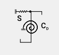

# Szelemensor

<!-- wp:paragraph -->

Szelemen méretezéssel kapcsolatos funkciók 3 nagy egységre különülnek el:

<!-- /wp:paragraph -->

<!-- wp:image {"align":"center","id":35175,"width":768,"height":47,"sizeSlug":"large","linkDestination":"media"} -->

<!-- /wp:image -->

<!-- wp:paragraph -->

\#1 - _**[Szelemensor elhelyezése](#szelemensor-1)**_: szelemensor definiálásának dialógja, a panelen találhatóak a megtámasztási viszonyokkal kapcsolatos beállítások

<!-- /wp:paragraph -->

<!-- wp:paragraph -->

\#2 - _**[Feltámaszkodási szakasz](#feltámaszkodási-zóna)**_: feltámaszkodási szakasz és a támasz környezetének geometriai viszonyai adhatók meg

<!-- /wp:paragraph -->

<!-- wp:paragraph -->

\#3 - _**[Szelemen átfedéses toldás](#szelemenek-átfedéses-toldása)**_ elhelyezés: szelemen toldási szakaszára vonatkozó geometriai paraméterek adhatók meg a panelen

<!-- /wp:paragraph -->

<!-- wp:spacer {"height":"15px"} -->

<!-- /wp:spacer -->

<!-- wp:heading {"level":3} -->

### Szelemensor

<!-- /wp:heading -->

<!-- wp:paragraph -->

A szelemensor fő dialóg ablakához további négy dialóg panel kapcsolódik közvetlenül, melyek a későbbiekben ismertetésre kerülnek.

<!-- /wp:paragraph -->

<!-- wp:image {"align":"right","id":35183,"width":512,"height":358,"sizeSlug":"large","linkDestination":"media","className":"is-style-editorskit-rounded"} -->

<!-- /wp:image -->

<!-- wp:heading {"level":4} -->

#### Funkciók

<!-- /wp:heading -->

<!-- wp:paragraph -->

\#1 - Szelemensor objektum nevének megadása: az objektum neve a szerkesztő dobozban szöveg és szám karakter formájában adható meg

<!-- /wp:paragraph -->

<!-- wp:paragraph -->

\#2 - Magyarázó ábra: jelölések és paraméterek értelmezésére szolgáló rajz

<!-- /wp:paragraph -->

<!-- wp:paragraph -->

\#3 - Támasz merevségének megadása: lehetőségek a burkolat megtámasztó hatásának megadására.

<!-- /wp:paragraph -->

<!-- wp:paragraph -->

\#4 - Parancssor:

<!-- /wp:paragraph -->

<!-- wp:list -->

- **Új szelemen** objektum létrehozása
- meglévő, aktuálisan kiválasztott szelemen objektum törlése a **Töröl** parancs segítségével
- meglévő, aktuálisan kiválasztott szelemen objektum elhelyezése az **Elhelyez** parancs segítségével
- a beállítások elfogadása az **Alkalmaz** parancs segítségével

<!-- /wp:list -->

<!-- wp:image {"align":"right","id":35191,"width":381,"height":296,"sizeSlug":"full","linkDestination":"media","className":"is-style-editorskit-rounded"} -->

<!-- /wp:image -->

<!-- wp:paragraph -->

Az **Elhelyez** parancsra kattintva megnyílik a szelemensor elhelyezésének paramétereit rögzítő dialóg ablak

<!-- /wp:paragraph -->

<!-- wp:paragraph -->

\#1 - Megadási opciók: elem kijelöléssel, vonal rajzolással történő megadás

<!-- /wp:paragraph -->

<!-- wp:paragraph -->

\#2 - Szelemensor objektum kiválasztása: legördülő menüből

<!-- /wp:paragraph -->

<!-- wp:paragraph -->

\#3 - Burkolat külpontossága: megadható manuálisan z irányú külpontosság, illetve automatikusan:

<!-- /wp:paragraph -->

<!-- wp:list {"className":"is-style-arrow","editorskit":{"indent":40,"devices":false,"desktop":true,"tablet":true,"mobile":true,"loggedin":true,"loggedout":true,"acf_visibility":"","acf_field":"","acf_condition":"","acf_value":"","migrated":false,"unit_test":false}} -->

- Legördülő menüből kiválasztva

  - Közép – fent

  - Közép – lent

- a () ikonra kattintva grafikusan ([Lásd _**5.11.3.1**_](./5_12_shear-field.md#nyírási-mező))

<!-- /wp:list -->

<!-- wp:paragraph -->

Az **Elhelyez befejezés** parancsra kattintva elfogadhatók a beállítások

<!-- /wp:paragraph -->

<!-- wp:paragraph -->

\#4 - Pozíció megadása: A vagy B végponttól adott távolságra mm egységben értelmezve

<!-- /wp:paragraph -->

<!-- wp:paragraph -->

\#5 - Információs panel: utasítások megjelenítését szolgáló panel

<!-- /wp:paragraph -->

<!-- wp:heading {"level":4} -->

#### Rugók szerepe

<!-- /wp:heading -->

<!-- wp:image {"align":"right","id":21114,"sizeSlug":"full","linkDestination":"none"} -->

<!-- /wp:image -->

<!-- wp:paragraph -->

A szelemenek teherbírásában a burkolat megtámasztó hatása nagyon jelentős lehet. Ezt a hatást a szelemenhez csatlakozó elemek merevségéből lehet származtatni, modellezésük rugók formájában történik. Kétféle rugó típust lehet figyelembe venni:

<!-- /wp:paragraph -->

<!-- wp:list -->

- Eltolódási (nyírási) rugó: a burkolat nyírási merevségéből származtatható (S)
- Elfordulási rugó: kapcsolati merevségből és a szelemen szelvény torzulásból származtatható (CD)

<!-- /wp:list -->

<!-- wp:heading {"level":4} -->

#### Eltolódási rugó

<!-- /wp:heading -->

<!-- wp:paragraph -->

Az eltolódási rugó megadása nem kötelező. Megadása előtt ki kell választani a szelemenre kerülő burkolat típusát, ami kétféle lehet:

<!-- /wp:paragraph -->

<!-- wp:list -->

- Trapézlemez
- Szendvicspanel

<!-- /wp:list -->

<!-- wp:paragraph -->

A kiválasztásnak megfelelően változik a szelemensor dialógablak tartalma.

<!-- /wp:paragraph -->

<!-- wp:paragraph {"align":"justify"} -->

Trapézlemezes héjalás választása esetén a nyírási merevség megadható kézzel az effektív szélességgel együtt, illetve a  gombra kattintva, a korábban bemutatott nyírási mező dialógablak segítségével, automatikusan is (ld.: [Lásd _**5.11.3.1**_](./5_12_shear-field.md#nyírási-merevség-számítása) pont).

<!-- /wp:paragraph -->

<!-- wp:paragraph -->

Szendvicspanel héjalás esetén a nyírási merevség csak kézzel adható meg.

<!-- /wp:paragraph -->

<!-- wp:columns -->

<!-- wp:column -->

<!-- wp:image {"align":"right","id":35207,"width":253,"height":134,"sizeSlug":"full","linkDestination":"media","className":"is-style-editorskit-rounded"} -->

<!-- /wp:image -->

<!-- /wp:column -->

<!-- wp:column -->

<!-- wp:image {"align":"left","id":35199,"width":254,"height":136,"sizeSlug":"full","linkDestination":"media","className":"is-style-editorskit-rounded"} -->

<!-- /wp:image -->

<!-- /wp:column -->

<!-- /wp:columns -->

<!-- wp:heading {"level":4} -->

#### Elfordulási rugó

<!-- /wp:heading -->

<!-- wp:paragraph -->

Hasonlóan az eltolódási rugóhoz, az elfordulási rugó megadása is opcionális. Az elfordulási rugó két komponensből (kapcsolati merevség és szelvény torzulás) tevődik össze. A végleges rugómerevségben a komponensek reciproka kerül összegzésre. Zérus merevség, illetve inaktív jelölőnégyzetek esetén az adott komponens merevsége nullázódik.

<!-- /wp:paragraph -->

<!-- wp:image {"align":"center","id":35215,"width":376,"height":241,"sizeSlug":"full","linkDestination":"none","className":"is-style-editorskit-rounded"} -->

<!-- /wp:image -->

<!-- wp:image {"align":"right","id":35224,"width":451,"height":145,"sizeSlug":"full","linkDestination":"media","className":"is-style-editorskit-rounded"} -->

<!-- /wp:image -->

<!-- wp:list {"ordered":true,"type":"1"} -->

1. Kapcsolati merevség

<!-- /wp:list -->

<!-- wp:paragraph -->

Automatikus számítást választva, trapézlemez fedés esetén a  gombra kattintva, az Eurocode egyszerűsített számítási módszere szerint történik a kapcsolati merevség meghatározása. A felugró ablakban mindössze a folyóméterenkénti rögzítőelemek számát kell megadni:

<!-- /wp:paragraph -->

<!-- wp:spacer {"height":"1px"} -->

<!-- /wp:spacer -->

<!-- wp:image {"align":"right","id":35232,"width":385,"height":201,"sizeSlug":"full","linkDestination":"media","className":"is-style-editorskit-rounded"} -->

<!-- /wp:image -->

<!-- wp:paragraph -->

Szendvicspanel fedést választva, a kapcsolati merevség automatikus számításához több adatot kell megadni:

<!-- /wp:paragraph -->

<!-- wp:list {"className":"is-style-default"} -->

- A külső acélpajzs alakja:

  - Síklemez
  - Trapézlemez

- Szigetelőanyag típusa:

  - PUR kitöltés

  - Ásványgyapot kitöltés

- Szigetelőanyag rugalmassági modulusa MPa-ban

<!-- /wp:list -->

<!-- wp:paragraph -->

Kézi megadás esetén a rugómerevségeket be kell írni a külső teher által, a kapcsolatokban okozott húzó-, illetve nyomóerő esetére is.

<!-- /wp:paragraph -->

<!-- wp:image {"align":"right","id":35241,"width":314,"height":269,"sizeSlug":"full","linkDestination":"media","className":"is-style-editorskit-rounded"} -->

<!-- /wp:image -->

<!-- wp:list {"ordered":true,"start":2} -->

2. Szelemen szelvény torzulás

<!-- /wp:list -->

<!-- wp:paragraph -->

A rugómerevség megadása a kapcsolati merevség megadásához hasonlóan történik. Automatikus számításhoz a  gombra kattintás után a felugró ablakban, a rögzítő elem és a gerinc – öv csatlakozási pont közötti távolságot kell megadni mm-ben. A számítás az EN 1993 - 1- 3 10.1.5 szerint történik, ahogy erre a panelen lévő megjegyzés is felhívja a figyelmet.

<!-- /wp:paragraph -->

<!-- wp:paragraph -->

Kézi megadás esetén az alábbi két esethez szükséges megadni a torzulásból származó merevség komponens értékét:

<!-- /wp:paragraph -->

<!-- wp:list {"type":"A"} -->

- A szelemen a torzulást követően a szelvény gerincénél érintkezik a burkolattal
- A szelemen a torzulást követően a szelvény övének szélső pontjánál érintkezik a burkolattal

<!-- /wp:list -->

<!-- wp:spacer {"height":"1px"} -->

<!-- /wp:spacer -->

<!-- wp:image {"align":"left","id":21420,"width":79,"height":84,"sizeSlug":"full","linkDestination":"none"} -->

<!-- /wp:image -->

<!-- wp:paragraph -->

**Figyelem!** A szelemen tervezés funkció csak Z és C típusú profilokra alkalmazható. Egyéb, hidegen alakított gyártói szelvényekre, illetve nem Z vagy C típusú felhasználói szelvényekre nem helyezhető el szelemensor objektum.

<!-- /wp:paragraph -->

<!-- wp:spacer {"height":"10px"} -->

<!-- /wp:spacer -->

<!-- wp:heading {"level":3} -->

### Feltámaszkodási zóna

<!-- /wp:heading -->

<!-- wp:paragraph -->

A feltámaszkodási zóna, mint ahogyan az a nevében is megjelenik, a szelemen megtámasztási pontjára vonatkozó geometriai paraméterek megadására szolgáló funkció.

<!-- /wp:paragraph -->

<!-- wp:image {"align":"right","id":35251,"width":379,"height":236,"sizeSlug":"full","linkDestination":"media","className":"is-style-editorskit-rounded"} -->

<!-- /wp:image -->

<!-- wp:paragraph -->

\#1 - Feltámaszkodási zóna nevének megadása: az objektum neve szöveg és szám karakter formájában adható meg

<!-- /wp:paragraph -->

<!-- wp:paragraph -->

\#2 - Magyarázó ábra: jelölések és paraméterek értelmezésére szolgáló rajz

<!-- /wp:paragraph -->

<!-- wp:paragraph -->

\#3 - Feltámaszkodási hossz geometriai és teherbírási adatainak megadása:

<!-- /wp:paragraph -->

<!-- wp:list -->

- Feltámaszkodási hossz mm-ben

- Számítás során használt teherbírás érték kiválasztása:

  - Gerinc nyírási teherbírásának alkalmazása a számítás során

  - Gerinc keresztirányú teherbírásának alkalmazása a számítás során

    - A szelvény keresztirányú teherbírása \[kN]
    - B szelvény keresztirányú teherbírása \[kN]

<!-- /wp:list -->

<!-- wp:paragraph {"editorskit":{"indent":60,"devices":false,"desktop":true,"tablet":true,"mobile":true,"loggedin":true,"loggedout":true,"acf_visibility":"","acf_field":"","acf_condition":"","acf_value":"","migrated":false,"unit_test":false}} -->

A keresztirányú teherbírást (lokális erőbevezetéssel szembeni ellenállást) kézzel kell megadni az EC 1993-1-3 6.1.7 fejezete alapján.

<!-- /wp:paragraph -->

<!-- wp:paragraph -->

\#4 - Parancssor:

<!-- /wp:paragraph -->

<!-- wp:list -->

- **Új** eltámaszkodási zóna objektum létrehozása
- meglévő, aktuálisan kiválasztott feltámaszkodási zóna objektum törlése a **Töröl** parancs segítségével
- meglévő, aktuálisan kiválasztott feltámaszkodási zóna objektum elhelyezése az **Elhelyez** parancs segítségével
- a beállítások elfogadása az **Alkalmaz** parancs segítségével

<!-- /wp:list -->

<!-- wp:paragraph -->

Az**Elhelyez** parancsra kattintva megnyílik a feltámaszkodási szakasz elhelyezésének paramétereit rögzítő dialóg ablak:

<!-- /wp:paragraph -->

<!-- wp:image {"align":"right","id":35259,"width":428,"height":152,"sizeSlug":"full","linkDestination":"media","className":"is-style-editorskit-rounded"} -->

<!-- /wp:image -->

<!-- wp:paragraph -->

\#1 - Megadási opciók: elem kijelöléssel

<!-- /wp:paragraph -->

<!-- wp:paragraph -->

\#2 - Szelemen feltámaszkodási zóna objektum kiválasztása: legördülő menüből

<!-- /wp:paragraph -->

<!-- wp:paragraph -->

Az **Elhelyezés befejezése** parancsra kattintva a dialógablak bezáródik, és visszatér a feltámaszkodási zóna beállítási párbeszédablaka.

<!-- /wp:paragraph -->

<!-- wp:paragraph -->

\#3 - Információs panel: utasítások megjelenítését szolgáló panel

<!-- /wp:paragraph -->

<!-- wp:spacer {"height":"10px"} -->

<!-- /wp:spacer -->

<!-- wp:heading {"level":3} -->

### Szelemenek átfedéses toldása

<!-- /wp:heading -->

<!-- wp:paragraph -->

A szabvány két fő toldás típust különböztet meg. Mindkét toldás típushoz egyedi, a tervezéshez és az ellenőrzéshez szükséges, teherbírás számítási formulák tartoznak:

<!-- /wp:paragraph -->

<!-- wp:list -->

- Szelemen átfedéses/átlapolásos toldás
- Szelemen toldóelemes toldás

<!-- /wp:list -->

<!-- wp:paragraph -->

Jelenleg a programban csak átfedéses/átlapolásos toldás elérhető el. A dialógablak felépítése az alábbi:

<!-- /wp:paragraph -->

<!-- wp:image {"align":"right","id":35268,"width":396,"height":341,"sizeSlug":"full","linkDestination":"media","className":"is-style-editorskit-rounded"} -->

<!-- /wp:image -->

<!-- wp:paragraph -->

\#1 - Szelemen átfedéses toldás objektum nevének megadása: az objektum neve a szerkesztő dobozban szöveg és szám karakter formájában adható meg

<!-- /wp:paragraph -->

<!-- wp:paragraph -->

\#2 - Magyarázó ábra: jelölések és paraméterek értelmezésére szolgáló rajz

<!-- /wp:paragraph -->

<!-- wp:paragraph -->

\#3 - Átfedés hosszának megadása: mindkét rúdelem túlnyúló szakaszának megadása távolság értékkel (mm-ben), vagy a rúdhossz százalékában (%).

<!-- /wp:paragraph -->

<!-- wp:paragraph -->

\#4 - Az együttes szelvény merevségének megoszlása a két rúd között.

<!-- /wp:paragraph -->

<!-- wp:paragraph -->

\#5 - Feltámaszkodási zóna: lehetőség van az átfedéssel egyidejűleg egy feltámaszkodási szakasz megadására is a korábban ismertetett módon.

<!-- /wp:paragraph -->

<!-- wp:paragraph -->

\#6 - Parancssor:

<!-- /wp:paragraph -->

<!-- wp:list -->

- **Új** szelemen átfedéses toldás objektum létrehozása
- meglévő, aktuálisan kiválasztott szelemen átfedéses toldás objektum törlése a **Töröl** parancs segítségével
- meglévő, aktuálisan kiválasztott szelemen átfedéses toldás objektum elhelyezése az **Elhelyez** parancs segítségével
- a beállítások elfogadása az **Alkalmaz** parancs segítségével

<!-- /wp:list -->

<!-- wp:paragraph -->

Az **Elhelyez** parancs hatására megnyílik a **Szelemen átlapolás elhelyezése** című párbeszédablak:

<!-- /wp:paragraph -->

<!-- wp:image {"align":"right","id":35276,"width":413,"height":148,"sizeSlug":"full","linkDestination":"media","className":"is-style-editorskit-rounded"} -->

<!-- /wp:image -->

<!-- wp:paragraph -->

\#1 - Megadási opciók: elem kijelöléssel

<!-- /wp:paragraph -->

<!-- wp:paragraph -->

\#2 - Szelemen átfedéses toldás objektum kiválasztása: legördülő menüből

<!-- /wp:paragraph -->

<!-- wp:paragraph -->

AZ **Elhelyezés befejezése** parancsra kattintva a dialógablak bezáródik, és visszatér a **Szelemenek átfedéses toldása** dialógablak.

<!-- /wp:paragraph -->

<!-- wp:paragraph -->

\#3 - Információs panel: utasítások megjelenítését szolgáló panel

<!-- /wp:paragraph -->
