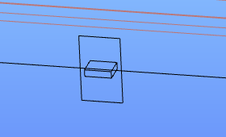
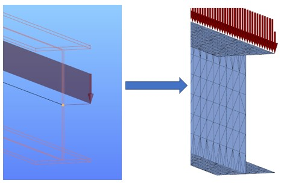

# Superbeam

<!-- wp:image {"align":"center","id":11637,"width":798,"height":350,"sizeSlug":"full","linkDestination":"media"} -->

<!-- /wp:image -->

<!-- wp:heading {"level":3} -->

### Leírás

<!-- /wp:heading -->

<!-- wp:paragraph -->

A _**Superbeam koncepció**_ kibővíti a hagyományos 7 szabadságfokú rúdelem lehetőségeit. Ez az innovatív megoldás lehetővé teszi az egyidejű analízist kétféle, konzisztensen generált végeselem modellen. A rúdszerkezet modellezése továbbra is a hagyományos 1D rúdelemekkel történik, azonban az analízis bármely rúdelem esetében elvégezhető a hagyományos 7-szabadságfokú rúd végeselem, vagy a héj végeselem segítségével. Ezáltal lehetővé válik egyes szerkezeti részek alaposabb vizsgálata a 2D héjmodell pontosságával, megtartva az 1D rúdelemek kínálta egyszerű modellezés és módosítás lehetőségét. Fontos megjegyezni, hogy ez a végeselem modell váltás teljesen automatikusan történik, és bármikor visszafordítható.

<!-- /wp:paragraph -->

<!-- wp:paragraph {"align":"right","fontSize":"small"} -->

 A funkció a Consteel 15-ös verziójával került be a programba

<!-- /wp:paragraph -->

<!-- wp:paragraph -->

Bármely rúdelemre megadható, hogy az alábbi két analízis modell közül melyik legyen érvényes a következő futtatás során:

<!-- /wp:paragraph -->

<!-- wp:list -->

- **Rúd modell** (7SZF végeselemekkel) a már korábbról ismert analízis és méretezési lehetőségekkel
- **Héj modell** (héj végeselemekkel) konzisztens módon összekapcsolva a teljes modellel

<!-- /wp:list -->

<!-- wp:paragraph {"align":"right","fontSize":"small"} -->

Jelenleg csak bizonyos szelvény típusokra elérhető, ld. lentebb!

<!-- /wp:paragraph -->

<!-- wp:paragraph -->

Ha a héj modell van kiválasztva egy adott rúdhoz, akkor az analízishez szükséges végeselemes háló automatikusan létrejön a végeselem-generálás során, az analízis futtatási folyamat elején. Az egész folyamat teljesen adaptív, így bármikor lehet váltani a kétféle analízis modell között.

<!-- /wp:paragraph -->

<!-- wp:columns -->

<!-- wp:column {"width":"33.34%","editorskit":{"devices":false,"desktop":true,"tablet":true,"mobile":true,"loggedin":true,"loggedout":true,"acf_visibility":"","acf_field":"","acf_condition":"","acf_value":"","migrated":false,"unit_test":false}} -->

<!-- wp:image {"align":"center","id":11619,"width":338,"height":150,"sizeSlug":"full","linkDestination":"media","editorskit":{"devices":false,"desktop":true,"tablet":true,"mobile":true,"loggedin":true,"loggedout":true,"acf_visibility":"","acf_field":"","acf_condition":"","acf_value":"","migrated":false,"unit_test":false}} -->

A gerenda 3D nézete

<!-- /wp:image -->

<!-- /wp:column -->

<!-- wp:column {"width":"33.34%","editorskit":{"devices":false,"desktop":true,"tablet":true,"mobile":true,"loggedin":true,"loggedout":true,"acf_visibility":"","acf_field":"","acf_condition":"","acf_value":"","migrated":false,"unit_test":false}} -->

<!-- wp:image {"align":"center","id":11625,"width":338,"height":150,"sizeSlug":"full","linkDestination":"media"} -->

7SZ rúdmodell öblösödési merevítőkkel

<!-- /wp:image -->

<!-- /wp:column -->

<!-- wp:column {"width":"33.33%","editorskit":{"devices":false,"desktop":true,"tablet":true,"mobile":true,"loggedin":true,"loggedout":true,"acf_visibility":"","acf_field":"","acf_condition":"","acf_value":"","migrated":false,"unit_test":false}} -->

<!-- wp:image {"align":"center","id":11631,"width":338,"height":150,"sizeSlug":"full","linkDestination":"media"} -->

Héj modell lyukakkal és merevítőkkel

<!-- /wp:image -->

<!-- /wp:column -->

<!-- /wp:columns -->

<!-- wp:paragraph -->

A Superbeam funkció lehetővé teszi további szerkezeti részletek modellezését és analízisét is, melyek az alábbiak:

<!-- /wp:paragraph -->

<!-- wp:paragraph -->

**_[Merevítők](./5_16_stiffener.md)_**

<!-- /wp:paragraph -->

<!-- wp:paragraph -->

_**[Gerinc kivágások](./5_15_cutout.md)**_

<!-- /wp:paragraph -->

<!-- wp:paragraph -->

Jelenleg ezek az objektumok csak akkor lesznek figyelembe az analízis és a méretezés során, ha a rúd végeselemes modellje héj típusú. A rúd végeselemként modellezett elemek merevítői és kivágásai nem befolyásolják az analízist, és a méretezés során sem lesznek figyelembe véve. (További információért lásd a vonatkozó fejezeteket.)

<!-- /wp:paragraph -->

<!-- wp:heading {"level":3} -->

### Használat

<!-- /wp:heading -->

<!-- wp:paragraph -->

Ahhoz, hogy egy rúdelemen használni lehessen a héjmodell nyújtotta lehetőségeket, meg kell változtatni a rúd végeselem típusát. Ehhez először ki kell jelölni a modelltérben az adott rúdelemet, majd a jobb oldali _Objektumok tulajdonságai_ ablakban a "Végeselem típusa" mezőre kell kattintani (lásd alább).

<!-- /wp:paragraph -->

<!-- wp:columns {"className":"is-style-default"} -->

<!-- wp:column {"width":"25%","editorskit":{"devices":false,"desktop":true,"tablet":true,"mobile":true,"loggedin":true,"loggedout":true,"acf_visibility":"","acf_field":"","acf_condition":"","acf_value":"","migrated":false,"unit_test":false}} -->

<!-- wp:image {"align":"left","id":35332,"width":272,"height":174,"sizeSlug":"full","linkDestination":"media","className":"is-style-editorskit-rounded","editorskit":{"devices":false,"desktop":true,"tablet":true,"mobile":true,"loggedin":true,"loggedout":true,"acf_visibility":"","acf_field":"","acf_condition":"","acf_value":"","migrated":false,"unit_test":false}} -->

<!-- /wp:image -->

<!-- /wp:column -->

<!-- wp:column {"width":"75%"} -->

<!-- wp:paragraph -->

A legördülő listában elérhető végeselem-típusok a keresztmetszet típusától függenek (lásd a _**[Rúdelemek](./5_2_line-members.md)**_ fejezetet is). Jelenleg csak hegesztett I vagy H típusú keresztmetszeteket lehet héjelemre módosítani. A későbbiekben más típusú keresztmetszetek is rendelkezésre fognak állni. Egy adott rúd végeselem modelljének héjelemre történő módosítását egy kis szimbólum is jelzi a modelltérben a rúd referenciavonalán.

<!-- /wp:paragraph -->

<!-- wp:image {"id":11674,"width":183,"height":111,"sizeSlug":"large","linkDestination":"none"} -->

<!-- /wp:image -->

<!-- /wp:column -->

<!-- /wp:columns -->

<!-- wp:image {"align":"right","id":35340,"width":263,"height":96,"sizeSlug":"full","linkDestination":"media","className":"is-style-editorskit-rounded"} -->

<!-- /wp:image -->

<!-- wp:paragraph -->

A következő sorban a _Végeselem felosztás módja_ mezőben lehet megadni, hogy a végeselemek méretének meghatározása automatikusan vagy kézzel történjen.

<!-- /wp:paragraph -->

<!-- wp:paragraph -->

Automatikus mód kiválasztása esetén az hálógenerálás az alábbi szabályok szerint történik:

<!-- /wp:paragraph -->

<!-- wp:list -->

- Övek esetében: b/4 vagy 25 mm közül a kisebbik (ahol b = az öv félszélessége).
- A gerincnél: h/6 vagy 100 mm közül a kisebbik (ahol h = a gerinc magassága).

<!-- /wp:list -->

<!-- wp:paragraph -->

Kézi megadás esetén a végeselemek méretét a következő két sorban lehet beállítani mm-ben, külön-külön a gerinchez és az övekhez.

<!-- /wp:paragraph -->

<!-- wp:separator {"align":"center"} -->

---

<!-- /wp:separator -->

<!-- wp:paragraph {"editorskit":{"indent":40,"devices":false,"desktop":true,"tablet":true,"mobile":true,"loggedin":true,"loggedout":true,"acf_visibility":"","acf_field":"","acf_condition":"","acf_value":"","migrated":false,"unit_test":false}} -->

_Felhívjuk a figyelmet arra, hogy ha nagyon eltérő végeselem-méretet választunk az övek és a gerinc számára, akkor a hálógenerálás torz elemekhez vezethet, ami a számítás pontatlanságát eredményezheti._

<!-- /wp:paragraph -->

<!-- wp:separator {"align":"center"} -->

---

<!-- /wp:separator -->

<!-- wp:paragraph -->

A következő sorban a **kényszerelemek** típusa választható ki, mely lehet

<!-- /wp:paragraph -->

<!-- wp:image {"align":"right","id":21890,"width":340,"height":399,"sizeSlug":"full","linkDestination":"media"} -->

<!-- /wp:image -->

<!-- wp:list -->

- _Eltolódás_ (alapértelmezett), vagy
- _Eltolódás és elfordulás_.

<!-- /wp:list -->

<!-- wp:paragraph -->

A **kényszerek** olyan speciális modellelemek, amelyek a rúdból héjjá alakítás során automatikusan generálódnak, és a héjmodell csomópontjait kötik össze a modell más részével, például egy folytonosan csatlakozó rúdelemmel. A kényszerelemek narancssárga vonalakkal rajzolódnak ki a modell végeselemes nézetében (lásd az ábrát). További részleteket ld.: [**_Kényszer elemek_**](./5_11_link-elements.md#kapcsolati-elemek)

<!-- /wp:paragraph -->

<!-- wp:paragraph -->

A rúdelem végeselem modellje bármikor megváltoztatható, amint azt korábban említettük.

<!-- /wp:paragraph -->

<!-- wp:paragraph -->

<!-- /wp:paragraph -->

<!-- wp:paragraph -->

Jelenleg a Superbeam héjmodell használata nem kompatibilis az alábbi Consteel eszközökkel vagy funkciókkal:

<!-- /wp:paragraph -->

<!-- wp:list -->

- diafragma
- keretsarok varázsló
- nyírási mező
- rúd kezdeti görbeség
- vonalmenti kapcsolati elem
- Superbeam héjmodellé alakított rúdelemek egymáshoz kapcsolása
- elhelyezett csomópont
- szelemensor és szelemen toldás
- hatásvonal

<!-- /wp:list -->

<!-- wp:heading {"level":3} -->

### Az automatikus konverzió elvei

<!-- /wp:heading -->

<!-- wp:paragraph -->

A Consteel jól definiált konvertálási elveket használ a rúdelemek héjelemekké történő automatikus átalakításához, hogy a külpontosan elhelyezett objektumok (terhek, támaszok, stb.) a konvertálás után is használhatók legyenek. Ha azonban az automatikus konverzió váratlan vagy nem kívánt megoldást eredményez, a felhasználó "felrobbanthatja" a konvertált rudat, és a külpontos objektumokat a szokásos módon közvetlenül a héj modellre helyezheti el. A "felrobbantás" végleges konverziót jelent, ellentétben az ebben a fejeztben leírt automatikus konverzióval. Ennek módját lásd az _**[ Rúdelemek konvertálása lemezekké](./5_6_convert-members-to-plates.md)**_ c. fejezetben.

<!-- /wp:paragraph -->

<!-- wp:paragraph -->

Az automatikus konvertálás elvei:

<!-- /wp:paragraph -->

<!-- wp:list -->

- A terhek és támaszok általában a legközelebbi vonalhoz/élhez lesznek áthelyezve.

<!-- /wp:list -->

<!-- wp:image {"align":"center","id":29605,"width":344,"height":432,"sizeSlug":"full","linkDestination":"none"} -->

<!-- /wp:image -->

<!-- wp:list -->

- Ha egy teher vagy támasz egy szimmetrikus profil közepén, annak bal vagy jobb szélén van elhelyezve, egyenlő távolságra az alsó és felső övektől, akkor az a konvertálás után a felső öv azonos szélére kerül át.

<!-- /wp:list -->

<!-- wp:image {"align":"center","id":29611,"width":382,"height":247,"sizeSlug":"full","linkDestination":"none"} -->

<!-- /wp:image -->

<!-- wp:list -->

- A referenciavonalon definiált terhek és támaszok a felső öv és a gerinc csatlakozó élére kerülnek áthelyezésre.

<!-- /wp:list -->

<!-- wp:image {"align":"center","id":29617,"width":379,"height":241,"sizeSlug":"full","linkDestination":"none"} -->

<!-- /wp:image -->

<!-- wp:list -->

- A konvertálás után a csatlakozó rúdelemek, kapcsolati elemek és merev testek az eredeti helyükön, a tényleges végeselem ponthoz kapcsolódnak.

<!-- /wp:list -->

<!-- wp:image {"align":"center","id":29620,"width":695,"height":259,"sizeSlug":"large","linkDestination":"none"} -->

<!-- /wp:image -->

<!-- wp:heading {"level":3} -->

### Bemutató videó

<!-- /wp:heading -->

<!-- wp:html -->

https://www.youtube.com/watch?v=3eTiNTNFI-g

<!-- /wp:html -->
