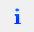

# Gerinc kivágás

<!-- wp:paragraph {"align":"justify"} -->

A gerinckivágások modellezése jelenleg hegesztett I vagy H típusú keresztmetszetekhez áll rendelkezésre, de a későbbiekben más típusú keresztmetszetekhez is elérhető lesz majd. A kivágás hatása csak akkor lesz figyelembe véve az analízis és a méretezés során, ha a rúd végeseleme héj típusú. A normál 7SZF végeselemmel történő analízis ezeket az objektumokat nem veszi figyelembe.

<!-- /wp:paragraph -->

<!-- wp:columns -->

<!-- wp:column {"width":"50%","editorskit":{"devices":false,"desktop":true,"tablet":true,"mobile":true,"loggedin":true,"loggedout":true,"acf_visibility":"","acf_field":"","acf_condition":"","acf_value":"","migrated":false,"unit_test":false}} -->

<!-- wp:image {"align":"center","id":11447,"width":493,"height":265,"sizeSlug":"full","linkDestination":"media"} -->

<!-- /wp:image -->

<!-- /wp:column -->

<!-- wp:column {"width":"50%","editorskit":{"devices":false,"desktop":true,"tablet":true,"mobile":true,"loggedin":true,"loggedout":true,"acf_visibility":"","acf_field":"","acf_condition":"","acf_value":"","migrated":false,"unit_test":false}} -->

<!-- wp:image {"align":"center","id":11392,"width":523,"height":265,"sizeSlug":"full","linkDestination":"media","editorskit":{"devices":false,"desktop":true,"tablet":true,"mobile":true,"loggedin":true,"loggedout":true,"acf_visibility":"","acf_field":"","acf_condition":"","acf_value":"","migrated":false,"unit_test":false}} -->

<!-- /wp:image -->

<!-- /wp:column -->

<!-- /wp:columns -->

<!-- wp:heading {"level":3} -->

### Kivágás létrehozása 

<!-- /wp:heading -->

<!-- wp:paragraph -->

Gerinckivágások hegesztett I vagy H keresztmetszetű rudakon definiálhatók, függetlenül attól, hogy a rúd végeselem típusa 7SZF rúd vagy héj. A parancs elindítása után megjelenő párbeszédablakban három típusú kivágást lehet definiálni:

<!-- /wp:paragraph -->

<!-- wp:columns -->

<!-- wp:column {"width":"33.34%","editorskit":{"devices":false,"desktop":true,"tablet":true,"mobile":true,"loggedin":true,"loggedout":true,"acf_visibility":"","acf_field":"","acf_condition":"","acf_value":"","migrated":false,"unit_test":false}} -->

<!-- wp:image {"align":"center","id":39375,"width":294,"height":385,"sizeSlug":"full","linkDestination":"media","className":"is-style-editorskit-rounded","editorskit":{"devices":false,"desktop":true,"tablet":true,"mobile":true,"loggedin":true,"loggedout":true,"acf_visibility":"","acf_field":"","acf_condition":"","acf_value":"","migrated":false,"unit_test":false}} -->

<!-- /wp:image -->

<!-- /wp:column -->

<!-- wp:column {"width":"33.34%","editorskit":{"devices":false,"desktop":true,"tablet":true,"mobile":true,"loggedin":true,"loggedout":true,"acf_visibility":"","acf_field":"","acf_condition":"","acf_value":"","migrated":false,"unit_test":false}} -->

<!-- wp:image {"align":"center","id":39367,"width":294,"height":385,"sizeSlug":"full","linkDestination":"media","className":"is-style-editorskit-rounded"} -->

<!-- /wp:image -->

<!-- /wp:column -->

<!-- wp:column {"width":"33.33%","editorskit":{"devices":false,"desktop":true,"tablet":true,"mobile":true,"loggedin":true,"loggedout":true,"acf_visibility":"","acf_field":"","acf_condition":"","acf_value":"","migrated":false,"unit_test":false}} -->

<!-- wp:image {"align":"center","id":39359,"width":294,"height":385,"sizeSlug":"full","linkDestination":"media","className":"is-style-editorskit-rounded"} -->

<!-- /wp:image -->

<!-- /wp:column -->

<!-- /wp:columns -->

<!-- wp:paragraph -->

A párbeszédablak legfelső részén a szokásos elhelyezési módok ikonjai találhatók:

<!-- /wp:paragraph -->

<!-- wp:list -->

-  a kivágások elhelyezhetők **egyenként** a rúd referencia vonalán történő kattintással,
-  vagy **többszörös** elhelyezéssel a rúd helyi koordinátarendszerében értelmezett relatív távolságokkal megadva.
-  Meglévő kivágások tulajdonságainak átvétele új definíciókhoz.

<!-- /wp:list -->

<!-- wp:paragraph -->

A párbeszédablak _Paraméterek_ szakaszában a kivágás pozícióját és méreteit kell megadni. Az elhelyezéshez választani kell egy referenciavonalat az ablak bal oldalán található legördülő mezőben (_Illesztés_) A kiválasztott referenciavonal a mező alatti ábrán látható. A referenciavonal lehet:

<!-- /wp:paragraph -->

<!-- wp:columns -->

<!-- wp:column {"width":"24%","editorskit":{"devices":false,"desktop":true,"tablet":true,"mobile":true,"loggedin":true,"loggedout":true,"acf_visibility":"","acf_field":"","acf_condition":"","acf_value":"","migrated":false,"unit_test":false}} -->

<!-- wp:list {"editorskit":{"devices":false,"desktop":true,"tablet":true,"mobile":true,"loggedin":true,"loggedout":true,"acf_visibility":"","acf_field":"","acf_condition":"","acf_value":"","migrated":false,"unit_test":false}} -->

- a rúd referencia vonala,
- a gerinc középvonala,
- a felső öv,
- az alsó öv.

<!-- /wp:list -->

<!-- /wp:column -->

<!-- wp:column {"width":"19%","editorskit":{"devices":false,"desktop":true,"tablet":true,"mobile":true,"loggedin":true,"loggedout":true,"acf_visibility":"","acf_field":"","acf_condition":"","acf_value":"","migrated":false,"unit_test":false}} -->

<!-- wp:image {"align":"center","id":39407,"width":169,"height":158,"sizeSlug":"full","linkDestination":"media","className":"is-style-editorskit-rounded"} -->

<!-- /wp:image -->

<!-- /wp:column -->

<!-- wp:column {"width":"19%","editorskit":{"devices":false,"desktop":true,"tablet":true,"mobile":true,"loggedin":true,"loggedout":true,"acf_visibility":"","acf_field":"","acf_condition":"","acf_value":"","migrated":false,"unit_test":false}} -->

<!-- wp:image {"align":"center","id":39399,"width":160,"height":158,"sizeSlug":"full","linkDestination":"media","className":"is-style-editorskit-rounded"} -->

<!-- /wp:image -->

<!-- /wp:column -->

<!-- wp:column {"width":"19%","editorskit":{"devices":false,"desktop":true,"tablet":true,"mobile":true,"loggedin":true,"loggedout":true,"acf_visibility":"","acf_field":"","acf_condition":"","acf_value":"","migrated":false,"unit_test":false}} -->

<!-- wp:image {"align":"center","id":39391,"width":163,"height":158,"sizeSlug":"full","linkDestination":"media","className":"is-style-editorskit-rounded"} -->

<!-- /wp:image -->

<!-- /wp:column -->

<!-- wp:column {"width":"19%"} -->

<!-- wp:image {"align":"center","id":39383,"width":164,"height":158,"sizeSlug":"full","linkDestination":"media","className":"is-style-editorskit-rounded"} -->

<!-- /wp:image -->

<!-- /wp:column -->

<!-- /wp:columns -->

<!-- wp:paragraph -->

A választott referenciavonal nem csak a kivágás pozícionálását határozza meg, hanem a kivágás tengelyét is, mivel az mindig merőleges lesz a választott referencia vonalra.

<!-- /wp:paragraph -->

<!-- wp:image {"align":"center","id":11597,"width":311,"height":313,"sizeSlug":"full","linkDestination":"media"} -->

<!-- /wp:image -->

<!-- wp:paragraph -->

A párbeszédablak jobb oldalán a kiválasztott geometriának megfelelő paraméterek adhatók meg. Megadható külpontosság is minden típushoz. A kör alakú kivágásokhoz egyidejűleg egy merevítő csövet is definiálhatunk.

<!-- /wp:paragraph -->

<!-- wp:paragraph -->

Az összes paraméter megadása után a kivágás elhelyezhető a rudakon:

<!-- /wp:paragraph -->

<!-- wp:list -->

- egyenként a rúd referenciavonalára kattintva, vagy
- a párbeszédablak alján egy sorozat elhelyezés megadásával az összes objektum egy egérkattintással elhelyezhető a rúd referenciavonalán.

<!-- /wp:list -->

<!-- wp:heading {"level":3} -->

### Analízis és méretezés

<!-- /wp:heading -->

<!-- wp:paragraph -->

**Analízis**

<!-- /wp:paragraph -->

<!-- wp:paragraph {"align":"justify"} -->

A program a kivágások hatását csak akkor veszi figyelembe az analízis során, ha a rúd végeselemtípusa héj. (A kivágások automatikusan bekerülnek a hálóba a végeselemes osztás során.) Normál 7SZF gerenda végeselemmel futtatva az analízist, ezek az objektumok nem lesznek figyelembe véve.

<!-- /wp:paragraph -->

<!-- wp:paragraph -->

**Méretezés**

<!-- /wp:paragraph -->

<!-- wp:paragraph -->

A kivágások a méretezésben jelenleg nincsenek figyelembe véve.

<!-- /wp:paragraph -->

<!-- wp:spacer {"height":"11px","editorskit":{"devices":false,"desktop":true,"tablet":true,"mobile":true,"loggedin":true,"loggedout":true,"acf_visibility":"","acf_field":"","acf_condition":"","acf_value":"","migrated":false,"unit_test":false},"editorskit_typography":{"name":"","family":"","weight":""},"extUtilities":[]} -->

<!-- /wp:spacer -->

<!-- wp:heading {"level":3} -->

### Bemutató videó

<!-- /wp:heading -->

<!-- wp:html -->

<YouTubeEmbedded>7osFX9RpGnk</YouTubeEmbedded>

<!-- /wp:html -->
