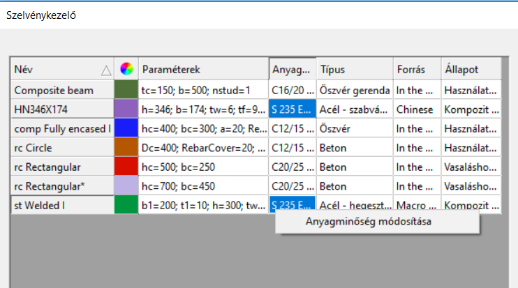

# Szelvénykezelő

<!-- wp:paragraph -->

Ahhoz, hogy szelvényeket használhassunk a modellben, előbb be kell azokat tölteni a modelladatbázisba. A szelvények betöltését a **Szelvénykezelő** párbeszédpanelen lehet elvégezni. A **Szelvénykezelő** párbeszédpanel a **Szerkezeti elemek** fülön található  parancsra kattintva nyitható meg. A párbeszédablak a rúdelemek dialógablakból (gerenda és oszlop) is elérhető a _Szelvény_ legördülő menüje melletti  paranccsal. Ebben a párbeszédablakban látható az összes korábban betöltött szelvény, és a jobb oldalon található megfelelő gombokra kattintva új szelvények tölthetők be, illetve hozhatók létre.

<!-- /wp:paragraph -->

<!-- wp:image {"align":"center","id":33574,"width":734,"height":440,"sizeSlug":"full","linkDestination":"media","className":"is-style-editorskit-rounded"} -->

Az ablak legnagyobb részét a szelvények táblázata foglalja el a bal oldalon, amely a következő oszlopokat tartalmazza:

- Név - szelvény neve

- Szín - minden szelvény a létrehozása után automatikusan kap egy színt, amely a színpalettára kattintva módosítható

- Paraméterek - itt láthatók a szelvény fő méretei

- Anyag

- Típus

- Forrás - lehet valamilyen szabványos szelvény (pl. európai), gyártói, makró vagy rajzolt szelvény

- Állapot - _Használt_ vagy _Nem használt_ attól függően, hogy van-e elhelyezett szerkezeti elem az adott szelvényből

Az ablak jobb oldalán találhatók a szelvények kezeléséhez szükséges parancsgombok. Az első három gomb, amelyek a "Szelvény felvétel" név alatt vannak csoportosítva, a szelvények létrehozására és a szelvény adatbázisba történő betöltésére szolgál. Ezeket a funkciókat az **_[Rúdelemek](../5_0_structural-modeling/5_2_line-members.md)_** fejezet írja le.

Ez alatt a szelvények módosítására szolgáló parancsok találhatók:

- Módosítás - a szelvények paramétereinek módosítására szolgál

- Eltávolít - csak olyan szelvények törölhetők, melyek _Nem használt_ állapotúak, azaz nincsenek a modellben felhasználva

- Másol - szelvények másolása. Az új szelvény neve az eredeti névből és a "_Másolat_" utótagból jön létre.

- Szelvény lista export - a lista egy .csv fájlba kerül exportálásra, amely Excel vagy ezzel kompatibilis programban nyitható meg.

Tulajdonságok...

Megnyitja a kiválasztott szelvényt a **[Keresztmetszet modulban](../../category/section-module)**.

**Fontos tudni**, hogy az anyagminőség a szelvényhez tartozó paraméter, nem a rúdelemhez. Ezért azt mindig a szelvény betöltésekor (létrehozásakor) kell megadni!

A szelvények betöltésével és létrehozásával kapcsolatos részleteket lásd a **_[Rúdelemek](../5_0_structural-modeling/5_2_line-members.md)_** című fejezetben!

**Consteel 17**-től kezdve a Szelvénykezelő panelen belül az acélszelvények anyaga megváltoztatható jobb kattintással és az „Anyagminőség módosítása” funkciót választva. Ez a módosítás alkalmazható egyedi szelvényekre vagy egyszerre több szelvényre is.

