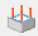

# Rúdelemek

<!-- wp:paragraph -->

Rúdelemek a következő keresztmetszeti típusokkal modellezhetők: vékony-falú acél, vasbeton és kompozit. Elhelyezéstől függően a szerkezeti elemek lehetnek oszlopok és gerendák. Az oszlop egy speciális helyzetű rúdelem, amely mindig függőleges, emiatt az elhelyezésük egyszerűbb, mert csak a magasságát kell definiálni.

<!-- /wp:paragraph -->

<!-- wp:paragraph -->

Rúdelemek rajzolása a  vagy  parancs hatására megnyíló _**Rúd szerkesztő**_ vagy _**Oszlop szerkesztő**_ dialógablakok segítségével lehetséges. A két dialóg közötti különbség mindössze annyi, hogy az oszlop szerkesztőben az oszlop magasságát is meg kell adni. A dialógok az alábbi modellezési opciókat tartalmazzák:

<!-- /wp:paragraph -->

<!-- wp:paragraph -->

 Rúdelem rajzolása referencia vonallal

<!-- /wp:paragraph -->

<!-- wp:paragraph -->

 Egyenes vonal, vagy vonallánc rajzolása

<!-- /wp:paragraph -->

<!-- wp:paragraph -->

 Körív (középpont, kezdőpont és szög megadásával; 3 pont megadásával; kezdőpont, végpont és érintő megadásával) rajzolása

<!-- /wp:paragraph -->

<!-- wp:paragraph -->

 Meglévő vonal átalakítása rúdelemmé

<!-- /wp:paragraph -->

<!-- wp:paragraph -->

 Meglévő rúdelem paramétereinek kiolvasása a rúdelemre való kattintással és azok alkalmazása a létrehozandó új rúdelemhez

<!-- /wp:paragraph -->

<!-- wp:paragraph -->

Rúdelem paramétereinek megadása a dialóg középső részén történik:

<!-- /wp:paragraph -->

<!-- wp:columns -->

<!-- wp:column -->

<!-- wp:columns -->

<!-- wp:column -->

<!-- wp:image {"align":"center","id":33627,"width":362,"height":355,"sizeSlug":"full","linkDestination":"media","className":"is-style-editorskit-rounded","editorskit":{"devices":false,"desktop":true,"tablet":true,"mobile":true,"loggedin":true,"loggedout":true,"acf_visibility":"","acf_field":"","acf_condition":"","acf_value":"","migrated":false,"unit_test":false}} -->

<!-- /wp:image -->

<!-- /wp:column -->

<!-- wp:column -->

<!-- wp:image {"align":"center","id":33634,"width":361,"height":383,"sizeSlug":"full","linkDestination":"media","className":"is-style-editorskit-rounded","editorskit":{"devices":false,"desktop":true,"tablet":true,"mobile":true,"loggedin":true,"loggedout":true,"acf_visibility":"","acf_field":"","acf_condition":"","acf_value":"","migrated":false,"unit_test":false}} -->

<!-- /wp:image -->

<!-- /wp:column -->

<!-- /wp:columns -->

<!-- /wp:column -->

<!-- /wp:columns -->

<!-- wp:image {"align":"right","id":33574,"width":490,"height":293,"sizeSlug":"full","linkDestination":"media","className":"is-style-editorskit-rounded","editorskit":{"devices":false,"desktop":true,"tablet":true,"mobile":true,"loggedin":true,"loggedout":true,"acf_visibility":"","acf_field":"","acf_condition":"","acf_value":"","migrated":false,"unit_test":false}} -->

Az egyes adatmezők értelmezése fentről lefelé haladva az alábbi:

- **Szelvény:** gerenda vagy oszlop létrehozása előtt a legördülő menüből ki kell választani a megfelelő szelvényt. A legördülő menü a betöltött szelvényeket tartalmazza. Ha nincs szelvény betöltve, akkor a legördülő menü mellett található  gombra kattintva megnyíló [ _**Szelvénykezelő**_ ](./5_1_section-administration.md)dialógon betölthetők a szükséges szelvények. További információk a szelvények betöltéséről és kezeléséről a következő alfejezetekben találhatók. A Consteel-ben használt szelvénymodellekről és szabványos vizsgálatokról részletes információk találhatók a **_[Szelvénymodul](../../category/section-module)_** fejezetben.

- _Folytonosság (kezdő, vég)_: előre definiált csukló típusok választhatók ki a rúdelem végeihez. A  gombra kattintva új csukló típusokat is létrehozhatunk.

- _Kezdeti görbeség:_ fél szinusz hullám alakú kezdeti görbeség definiálható a két lokális irányba, merőlegesen az elem referenciatengelyére („y,z”). A megadott amplitúdó az elem felében értendő.

- _Végeselem típusa_

Az elérhető típusok a kiválasztott szelvénytől függenek.

**Acélszelvények esetén:**

- Egyszeresen vagy kétszeresen szimmetrikus hegesztett (makró) szelvények esetén négy lehetőség közül kell választani:

  - **7 DOF rúdelem**: az öblösödés hatását is tartalmazó, 7 szabadságfokú (SZF) csomópontokból álló rúdelem. Az öblösödés figyelembevétele különösen a normál, nyitott szelvényű acélszelvényekből felépített szerkezetekben lehet jelentős.

  * **Héjelem**: a rúdelem az analízis során a keresztmetszetének megfelelő héjelemmé alakul át. Az alkalmazott terhek, támaszok, merevítő bordák és nyílások is átalakításra kerülnek. Az elem megtartja 1D jellemzőit is, így ez az átalakítás nem végérvényes. Az ilyen elemek bármikor visszaalakíthatók normál rúdelemekké. Ezekre az elemekre a szabványos méretezés jelenleg nem lehetséges.

    -  Ez a típus nem választható ezen a párbeszédpanelen. Csak a modellben elhelyezett rudakat lehet az **_[Objektum tulajdonságok ablakban](../1_0_general-description/1_2_the-main-window.md#objektum-tulajdonságok-ablak)_** héjelemmé módosítani. További információ erről a **_[Superbeam fejezetben található.](../5_0_structural-modeling/5_14_superbeam.md)_**
   

  - **Húzott rúd**: tengelyirányú nyomást nem tud felvenni. Ha az analízis során nyomás lép fel egy ilyen elemben, a program figyelmen kívül hagyja az elemet.

  * **Húzott rúd (pótátlós merevítés)** Consteel 17-től, húzott pótátlós merevítési rendszer egyedi húzott elemeire alkalmazható opció, amely során azt feltételezzük, hogy a merevítő elemek párosan vannak úgy elhelyezve, hogy mindig csak az egyik dolgozik húzásra, a másik pedig nyomás hatására kihajlik. Az így megjelölt elemek a rugalmas sajátérték számításhoz szükséges linearizálás miatt, mint húzott-nyomott elemek lesznek figyelembevéve, 50%-ra csökkentett keresztmetszeti jellemzőkkel.

* Minden más szelvény típus esetén a fentiekből csak az alábbi három típus választható:

  - **7 DOF rúdelem**

  - **Húzott rúd**
 
  - **Húzott rúd (pótátlós merevítés)** Consteel 17-től
 

**Vasbeton vagy Öszvér keresztmetszet esetén:**

Ilyen típusú keresztmetszetek esetén csak a _6 DOF rúdelem_ elemtípus használható, ami egy hagyományos, 6 szabadságfokú végeselem típust jelent.

- _Elemcsoport_: a szerkezeti elemek különböző szempontok szerinti csoportosítására szolgál (kiválasztás, mértékadó eredmény, érzékenységvizsgálat stb.). A három pontos  ikonra kattintva a _**Szerkezeti elemek csoportjai**_ dialógon új elemcsoportok definiálhatók.

- _Végeselemek száma_: a megadott végeselem számot használja a program az analízis során. Alapesetben az automatikus van beállítva, amely a legtöbb esetben a legoptimálisabb megoldást adja.

- _Lokális külpontosság_: lokális külpontosság definiálható az elem lokális koordinátarendszerében („y, z”), illetve megadható elforgatás is a lokális „x” tengely körül.

- Az ablak alsó része a felhasználókat támogató információk és parancsok kijelzésére szolgál.

Szükséges megjegyezni, hogy nem csak a külpontos normálerőknek van hatása az analízis eredményére (további nyomaték), hanem a külpontos nyomatéknak és csavarásnak (további nyomaték és csavarás, valamint **bimoment**) is!

### Acél rúdelemek

Első lépésként a keresztmetszet betöltést kell elvégezni. Ez elvégezhető mind a [**szelvénykezelőből**](../5_0_structural-modeling/5_1_section-administration.md) ()közvetlenül, mind pedig a **rúd szerkesztő** dialógról is. Acél keresztmetszetek betöltéséhez a Consteel, a szabványos szelvénytárban megtalálható szelvényeken és a makró szelvényeken túl, rajzolt (egyedi) szelvények betöltésére is lehetőséget ad.

<!-- /wp:image -->

<!-- /wp:column -->

<!-- wp:column {"verticalAlignment":"top","width":"95%"} -->

<!-- wp:paragraph -->

Fontos megjegyezni, hogy Consteel-ben az anyagminőség a szelvény egy paramétere, így annak definiálását a szelvény betöltésnél kell megtenni!

<!-- /wp:paragraph -->

<!-- /wp:column -->

<!-- /wp:columns -->

<!-- wp:image {"align":"right","id":33694,"width":512,"height":275,"sizeSlug":"large","linkDestination":"media","className":"is-style-editorskit-rounded","editorskit":{"devices":false,"desktop":true,"tablet":true,"mobile":true,"loggedin":true,"loggedout":true,"acf_visibility":"","acf_field":"","acf_condition":"","acf_value":"","migrated":false,"unit_test":false}} -->

#### Szelvénykönyvtár

A _**Szelvénykezelő**_ párbeszédpanelen a szabványos szelvények esetén a következő könyvtárak érhetők el:

- Standard (európai) szelvénykönyvtár

- Amerikai szelvénykönyvtár (metrikus és angolszász méretekkel)

- Brit szelvénykönyvtár

- Kínai szelvénykönyvtár

- Orosz szelvénykönyvtár

- Gyártói szelvények (különböző gyártók egyedi szelvény katalógusai)

#### Makró szelvények

Makró szelvényt négyféle kategóriában lehet létrehozni:

1\. **Lemezekből hegesztett típusok:**

- I vagy H szelvény

- Szekrény szelvény

- Máltai szelvény

- Fél máltai szelvény

- Kalap szelvény

- T szelvény

- WQ szelvény

- Ferde övű I vagy H szelvény

- C szelvény

2\. **Melegen hengerelt típusok:**

- Párhuzamos övű I vagy H szelvény

- L szelvény (párhuzamos szárak)

- Párhuzamos övű U szelvény

- CHS szelvény

- T szelvény (fél I) szelvény

- Lemez szelvény

- Zártszelvény

- Köracél

3\. **Hidegen alakított típusok:**

- RHS zártszelvény

- Körcső szelvény

- L szelvény

- Nem szimmetrikus U szelvény

- Z szelvény

- C szelvény

- Szigma szelvény

- Zeta szelvény

- Kalap szelvény

A hidegen alakított szelvénymakrók utóbbi 5 szelvény típusánál lehetőség van merevítők megadására is. Az öveken egyszer vagy kétszer hajlított élmerevítőt, és kétféle közbenső merevítőt, a gerinceken pedig háromféle különböző típusú közbenső merevítőt lehet definiálni. A gerincmerevítők esetén lehetőség van a merevítők kettőzésére is. Az így definiált merevítőket az EN 1993-1-3 szabványban meghatározott módon, a torzulásos horpadás (distortional buckling) számításánál veszi figyelembe a program.

A hidegen alakított makró szelvényeknél, amennyiben azok bevonatos anyagból készülnek, meg kell adni az EN 10143 szabványban definiált vastagsági tolerancia kategóriát is. Kétféle kategória létezik: normál és speciális. A szelvény tervezési falvastagságát ennek megfelelően az EN 1993-1-3 3.2.4. pont szerint számítja a program. Az általános építési gyakorlatban, az ilyen szelvények leggyakrabban az említett EN 10143 szabvány szerinti, bevonatos acéllemezekből készülnek, ezért ezeknél a makróknál az ebben a szabványban definiált vastagsági tolerancia kategóriákat vettük alapul.

<!-- wp:paragraph {"placeholder":"Content…"} -->

Fontos, hogy ha a tervező nem az adatbázisban szereplő bevonatos anyagok közül választ, és a választott anyag vastagsági toleranciája nagyobb mint 5%, ebben az esetben a tervezési falvastagság számítása nem lesz pontos. Ennek elkerülésére a szelvényt be kell importálni a szelvény rajzoló modulba, és ott kell megadni a vastagsági toleranciát. (A szelvény rajzolót ld. a következő alfejezetben!)

<!-- /wp:paragraph -->

<!-- /wp:media-text -->

<!-- wp:paragraph -->

4\. **Összetett típusok**

- I vagy H szelvény egyik övén U szelvény erősítéssel

- I vagy H szelvény mindkét övén U szelvény erősítéssel

- I vagy H szelvény övén fél I, vagy H szelvénnyel megerősítve

- I vagy H szelvény gerincén fél I, vagy H szelvénnyel megerősítve

- I vagy H szelvény övén szögacéllal megerősítve

- I vagy H szelvény övén lemezzel megerősítve

- I vagy H szelvény mindkét övén lemezzel megerősítve

- I vagy H szelvény övén I, vagy H szelvénnyel megerősítve

- Doboz szelvény szögacélból és lemezekből

- Zárt 2U keresztmetszet

- Zárt 2I keresztmetszet

- I és U keresztmetszet

- Nyitott 2U keresztmetszet

- Fél máltai keresztmetszet

- Nyitott 2C keresztmetszet

- Hevederezett keresztmetszet

#### Szelvény rajzolás

A harmadik lehetőség szelvény létrehozására a szelvény rajzolás a _**Keresztmetszet létrehozó**_ modulban. A funkciót a _**[Szelvénykezelő](../5_0_structural-modeling/5_1_section-administration.md)**_ dialógablak _**Szelvény rajzolása**_ nyomógombjával lehet elindítani.

Első lépésben, a parancs indítása után, egy felugró ablakban ki kell választani a szelvény típusát és anyagminőségét, valamint meg kell adni a szelvény nevét. A szelvény típusa kétféle lehet:

- Hidegen alakított szelvény

- Általános vékonyfalú szelvény

A szelvény típusa alapvetően befolyásolja a későbbi működését. **Hidegen alakított szelvény** esetén csak egyetlen vonallal lerajzolható szelvények hozhatók létre, melyeknél a falvastagság egységes, a szegmensek között automatikusan lekerekítési ív keletkezik, és a szelvény nem lehet zárt. Az ilyen szelvénnyel készült rudak méretezésénél a szilárdsági, a lokális és a globális stabilitás vizsgálatokon túl, a program figyelembe veszi a torzulásos horpadás (distortional buckling) hatására bekövetkező effektív keresztmetszet csökkenést is az EN 1993-1-3 szabvány alapján.

**Általános vékonyfalú szelvények** esetén különböző vastagságú lemezek használhatók, a szelvénynek nem kell egy vonallal lerajzolhatónak lennie, illetve készíthető egyszeresen zárt szelvény is. Ez a típus alapvetően a lemezekből hegesztett szelvények létrehozására szolgál. Ezen szelvények esetében csak a szilárdsági, a lokális (horpadás) és a globális stabilitás vizsgálat végezhető el.

Miután kiválasztottuk a szelvény típusát, a _**Tovább**_ gombra kattintva egy külön ablakban nyílik meg a _**Keresztmetszet létrehozó modul**_, melynek tartalma a választott szelvénytípustól függően némileg eltérő.

A szelvény rajzoló ablak felépítése az alábbi:

**1# Rajzterület**

**2# Parancsikonok**

**3# Diagnosztikai üzenetek**: itt jeleníti meg a program a különböző figyelmeztető és hibaüzeneteket

**4# Navigáció**: a _**Vissza**_ és a _**Tovább**_ gombokkal lehet lépni a keresztmetszet megadás egyes fázisai között

**5# Felhasználói felület beállítása:** a felugró ablakban négy fülön találhatók a _**Láthatóság**_, _**Raszterháló**_, _**Fogópontok**_ és _**Objektumok méretei**_ beállítására szolgáló paraméterek és kapcsolók

**6# Paraméterek megadása:** mindig az aktuális funkcióhoz, illetve a kijelölt elemhez tartozó paraméterek paneljait jeleníti meg

#### Hidegen alakított szelvények rajzolása

A hidegen alakított szelvények megadása 4 fázisban történik.

(1) Geometria rajzolása

(2) Tervezési paraméterek megadása szilárdsági és globális stabilitási vizsgálatokhoz

(3) Tervezési paraméterek megadása horpadás vizsgálathoz

(4) Merevítők definiálása

**(1)** Geometria rajzolása 

A szelvény geometriájának szerkesztése történik az első fázisban. A merevítőket makrók segítségével lehet könnyen és gyorsan megrajzolni. Lehetőség van korábban betöltött szelvény importálására is.

 A _**Sokszögvonal rajzolása**_ parancsikonnal indítható a geometria szerkesztése. A rajzolás történhet végpontok kijelölésével a rajztéren, vagy a _**Vonal rajzolás**_ felugró ablakban koordináták megadásával is. Koordinátákat derékszögű  vagy poláris  koordináta rendszerben adhatunk meg, az origó lehet lokális  vagy globális . Lokális megadás esetén az utoljára megadott pont az origó, globális esetén a rajztér közepén látható Y-Z tengelykereszt. A lemezszegmensek elhelyezése a rajzolt referenciavonalhoz képest lehet központos, balra, vagy jobbra igazított.  Ezt rajzolás közben, vagy utólag, akár egyenként is lehet módosítani az oldalsávon található _**Lemez szegmens paraméterek**_ című panelen. A lekerekítések a lemez szegmensek rajzolásakor automatikusan létrejönnek. A lekerekítési sugarat utólag, a lekerekítést kijelölve, az oldalsávon lehet módosítani egyenként, vagy egységesen megadva az egész szelvényre. Ugyan itt lehet megadni a névleges lemezvastagságot is.

A szelvény rajzoló ablakban minden paraméter beírása után az ENTER-t is meg kell nyomni ahhoz, hogy a beírt érték érvényesüljön!

A szegmensek rajzolását mindig csak valamelyik végponttól lehet folytatni. Ha befejeztük a rajzolást, az ESC billentyűvel, vagy az _**Exit**_ gombra kattintva lehet kilépni a parancsból. Ha elrontjuk valamelyik részt, az adott szakasz törlésével és újra rajzolásával lehet a hibát javítani.

 A következő két parancsikon a _**Közbenső merevítő**_ és az _**Élmerevítő**_ makrókat indítja el. Közbenső merevítő esetén három, élmerevítő esetén két típusból választhatunk. A jobb oldali oldalsávon jelenik meg a merevítő geometriai paramétereinek megadására szolgáló panel. Megadhatjuk azt is, hogy a merevítő a lemez melyik oldalára legyen elhelyezve. A parancs indítása után, a kurzorral valamelyik lemezszegmensre mutatva megjelenik a beállított paramétereknek megfelelő merevítő. A paraméterek beállítása után a kívánt helyre történő kattintással lehet elhelyezni a merevítőt. Elhelyezés után, a merevítőt kijelölve, a paraméterek, illetve közbenső merevítők esetében a pozíció is módosítható marad. Fontos tudni, hogy ezek a parancsok csak rajzolást segítő makrók. Az így megrajzolt lemezszakaszok csak a 4. fázisban definiálva válnak ténylegesen a lemezszegmenseket megtámasztó merevítőkké.

 A _**Szelvény importálása**_ parancsikonnal lehetőség van egy korábban létrehozott könyvtári, makró vagy rajzolt szelvény beolvasására és további szerkesztésére. Értelemszerűen csak hidegen alakított, egy vonallal lerajzolható szelvényt lehet importálni. A parancs kiadása után egy felugró ablakban jelennek meg azok a szelvények, amelyek alkalmasak a beolvasásra. A _**Tovább**_ gomb megnyomására a választott szelvény betöltődik. Ha már volt korábban megrajzolt geometria, a program figyelmeztet arra, hogy az eddig megrajzolt minden szegmens törlődni fog. Az importált szelvény megőrzi minden geometriai és tervezési paraméterét, és továbbra is szerkeszthető marad.

 A _**Szelvény robbantása**_ parancs a megrajzolt merevítőket és az íveket önálló lemezszegmensekké bontja szét. Ezután ezen elemek esetében is csak a vastagság és a külpontosság változtatható, a méretük és pozíciójuk nem. A felrobbantás által, a korábban egy lemezként definiált elemek külön szegmenseké alakulnak, melyek osztályozását önállóan lehet definiálni.

 A _**Méretvonal elhelyezés**_ paranccsal a szelvény egyes szegmenseit lehet méretvonalakkal ellátni. A felugró ablakban található két ikonnal lehet kiválasztani a méretvonal elhelyezésének módját:

 Méretvonal elhelyezés derékszögű koordináta rendszerben. Ezzel Y vagy Z irányú méretvonalakat lehet megadni.

 Méretvonal elhelyezés a lemezszegmenssel párhuzamosan.

A méretvonal elhelyezéséhez, a parancs indítása után, kattintsunk valamelyik lemezszegmensre, majd újabb kattintással helyezzük el a méretvonalat a kívánt pozícióba.

**(2)** Tervezési paraméterek megadása 

A geometria felvétele után a szilárdsági és globális stabilitási határállapotokhoz szükséges szabványos paramétereket kell megadni.

Az első, legördülő menüben a szelvény gyártási módját kell kiválasztani. Ez lehet hidegen hengerelt, élhajlított vagy egyéb hidegen alakítás.

Ez után a tervezési falvastagság számításához szükséges vastagsági toleranciát, és a 90°-os hajlítások számát kell megadni A hajlítások számát a program automatikusan kiszámítja, amennyiben makróval készült szelvényt importálunk be. Rajzolt szelvény esetén kézzel kell ezt a mezőt kitölteni.

Ezután következik a kihajlási és kifordulási görbék kiválasztása. Amennyiben egy szelvényt később _**Szelemensor**_ objektummal ellátott rúdelemen használunk, a kifordulás ellenőrzésekor a legalsó, _Szelemensor kifordulási görbéje_ mezőben megadott görbe lesz figyelembe véve.

**(3)** Lokális stabilitási paraméterek megadása

A harmadik fázisra lépve a rajzterületen megjelennek a lemezek hatékony lemezhossz számításhoz használt (bp) hosszai.

Egy szegmenst kijelölve, az oldalsávon lehet megadni, hogy a lemezosztályozásnál az adott szegmenst hogyan vegye figyelembe a számítás. Három lehetőség közül lehet választani:

- Automatikus osztályozás és hatékony hossz számítás  (Alapértelmezett)

- Osztályozás mellőzése, és a teljes hossz figyelembevétele 

- Osztályozás mellőzése, és a lemez elhagyása a hatékony keresztmetszetből 

A következő mezőben azt kell megadni, hogy a számításban az adott szegmens nyíróerő okozta horpadásra figyelembe legyen-e véve vagy sem, és melyik irányban.

**(4)** Merevítők definiálása

Ahhoz, hogy a megrajzolt merevítők ténylegesen szabványos merevítőként szerepeljenek a számításban, ebben a fázisban kell definiálni azokat. Első lépésben el kell dönteni, hogy a szelvény hidegen hajlított Z vagy C szelvény-e, vagy pedig az általános kategóriába tartozik. Ezt az oldalsávon található választógombbal lehet megadni.

Z vagy C szelvényt választva, a számítás, az övek megtámasztásában figyelembe veszi a másik öv feszültségi állapotát, és a gerinc merevségét is. Ehhez természetesen meg kell adni, hogy a szelvény mely részei alkotják az alsó és felső övet, illetve a gerincet, és meg kell adni a gerinc hosszát is. Általános szelvényt választva az élmerevítők számítása egymástól függetlenül történik.

További lényeges különbség, hogy csak a Z-C típusú szelvénnyel létrehozott rúdelemre lehet a későbbiekben [**Szelemensor**](../5_0_structural-modeling/5_13_purlins.md#szelemensor), [**Feltámaszkodási zóna**](../5_0_structural-modeling/5_13_purlins.md#feltámaszkodási-zóna) vagy [**Átfedéses szakasz**](../5_0_structural-modeling/5_13_purlins.md#szelemenek-átfedéses-toldása) objektumokat elhelyezni. ([**Lásd az 5.12 fejezetet!**](../5_0_structural-modeling/5_12_shear-field.md))

A bal oldali diagnosztika panel mellett megjelenik egy új panel, amely fa struktúrába rendezve jeleníti meg a szelvény definiált merevítőit.

A merevítők megadását a bal felső parancssoron található parancsikonokkal lehet indítani:

 **Merevítetlen öv kiválasztása:** csak Z vagy C típusú szelvényeknél használható. Amennyiben valamelyik öv merevítetlen, ezzel a paranccsal lehet ezt az övet definiálni. Keretezéssel vagy rákattintással ki kell jelölni a merevítetlen övhöz tartozó lemezszegmenseket, majd a bevitelt az **ENTER **gomb, vagy az ENTER billentyű megnyomásával befejezni.

 **Élmerevítő **_és_** kettős élmerevítő kiválasztása:** a felugró ablakban lévő súgó utasításait követve, 4 lépésben lehet a merevítőket definiálni. Az első lépésben keretezéssel vagy rákattintással ki kell jelölni az(oka)t a lemezszegmens(eke)t, amely(ek) a merevítőt alkotják, majd a bevitelt az **ENTER** gomb, vagy az ENTER billentyű megnyomásával befejezni. Ezután a merevített lemezt kell kijelölni, és ismét az ENTER-rel befejezni a műveletet. A következő lépésben a gerincet alkotó lemezt kell megadni, legvégül két ponttal meg kell határozni a gerinc hosszát. Minden lépést ugyan úgy az ENTER-rel kell lezárni. A folyamat lépésit a jobb oldali panelen lehet követni, ahol helyes bevitel esetén mind a három sorban OK felirat lesz olvasható.

Amennyiben a szelvény Z vagy C típusúnak van beállítva, a folyamat bármely lépésében az öv helyzetét is meg kell adni a fenti ábrán látható lenyíló menüben. A nyíl ikonra  kattintva valamely komponens újbóli bevitelét lehet elvégezni.

Legvégül meg kell adni a merevítő kritikus feszültségét a panel legalsó szakaszában. Itt lehet automatikus számítást, vagy kézi megadást választani. Fontos, hogy az automatikusan számítás csak Z vagy C típusú szelvényekre működik, mert a szabvány csak ilyen esetekre ad megoldást.

 **Közbenső merevítő**  és **kettős közbenső merevítő kiválasztása:** az élmerevítőhöz hasonlóan ki kell jelölni a merevítőt alkotó lemezszegmenseket, és az ENTER-rel elfogadni a bevitelt. További lépésekre nincs szükség, azonban a jobb oldali panelen a merevítő kritikus feszültségét, hasonlóan az élmerevítőhöz, ugyancsak meg kell adni.

A merevítők, a bevitel után kijelölhetők, és a paramétereik módosíthatók, illetve törlésre is lehetőség van a DEL billentyű leütésével.

A szelvény rajzolást végül a fázisjelző panelen található _**Ment és kilép**_ gomb megnyomásával zárhatjuk le.

#### Általános vékonyfalú szelvények rajzolása

Az általános vékonyfalú szelvények megadása 3 fázisban történik.

 \(1) Geometria rajzolása

 \(2) Tervezési paraméterek megadása szilárdsági és globális stabilitási vizsgálatokhoz

 \(3) Tervezési paraméterek megadása horpadás vizsgálathoz

Ennél a szelvénytípusnál kevesebb parancs áll rendelkezésre a szerkesztéshez, mivel nincs lehetőség külön merevítőket rajzolni és definiálni. A szerkesztés menete hasonló az előzőhöz.

**(1)** Geometria rajzolása 

 A _**Sokszögvonal rajzolása**_ parancs során használható dialóg megegyezik a hidegen alakított szelvény hasonló párbeszédablakával, részletesen ld. az előző alfejezetet.

A szerkesztés annyiban eltér az előzőtől, hogy itt a szelvény jellegéből adódóan, minden szegmensnek eltérő vastagságot lehet adni, és zárt szelvény is létrehozható. A rajzolás során egy végpontról egy már megrajzolt lemez közbenső pontjára kattintva a vonalrajzolás „átugrik” arra a pontra, és a szerkesztés arról a pontról folytatható. A szelvénymodellezés számára szükséges ún. „dummy” elemek is létrejönnek, melyek a képernyőn barna, szaggatott, íves vonallal ábrázolódnak.

 A **Pont és él mozgatása** paranccsal valamely végpont, vagy teljes szegmens eltolása hajtható végre. Pont kijelölése esetén a következő lépésben rögtön a mozgatás végpontját kell megadni, él kijelölése után először a kezdő-, majd a végpontját.

 A _**Szelvény importálása**_ parancs működése megegyezik az [előző fejezetben](#Drawing-of-Cold-Formed-Sections) leírttal.

 A _**Méretvonal elhelyezés**_ parancs működése megegyezik az [előző fejezetben](#hidegen-alakított-szelvények-rajzolása) leírttal.

**(2)** Tervezési paraméterek megadása

A geometria felvétele után a szilárdsági és globális stabilitási határállapotokhoz szükséges szabványos paramétereket kell megadni. Az előző alfejezetben leírtakhoz képest azzal az eltéréssel, hogy itt nincs lehetőség vastagsági tolerancia megadására, és nem definiálható szelemensor kihajlási görbe sem, hiszen ezen szelvényeket nem lehet szelemensor objektumhoz használni.

**(3)** Lokális stabilitási paraméterek megadása 

A harmadik, egyben utolsó fázisra lépve ezen szelvények esetében egyedül a keresztmetszet egyes alkotó lemezeinek osztályba sorolását lehet szabályozni az előző fejezetben megismerttel azonos módon. Részletesen ld. az előző fejezetet.

A szerkesztést itt is a _**Ment és kilép**_ paranccsal lehet befejezni.

### Vasbeton keresztmetszetek

**Consteel 16**

Oszlop és gerenda vasbeton keresztmetszetek definiálását a **_Makró szelvények_** között lehet elvégezni. **A vasbeton keresztmetszetek két fő típusa választható**: a méretezési opcióval rendelkező _(#1)_, és a méretezési opcióval nem rendelkező keresztmetszeti típus _(#2)_.

Vasbeton oszlop makró szelvények

Vasbeton gerenda makró szelvények

**Consteel 15**

Vasbeton keresztmetszetek definiálását a _**Makró szelvények**_ között lehet elvégezni. A vasbeton keresztmetszetek között két fő típus választható, a **méretezési opcióval rendelkező** _(#1)_, és a **méretezési opcióval nem rendelkező** keresztmetszeti típus _(#2)_.

#### Méretezési opcióval rendelkező vasbeton keresztmetszetek (#1)

**Consteel 16**

**_Méretezési opcióval rendelkező vasbeton szelvények_** szürke színnel és hálós vasalással vannak ábrázolva a **Makró szelvény felvétele** dialógon. Ilyen szelvényekből a Consteel-ben kétfajta keresztmetszet érhető el:

- Tömör kör alakú szelvény

- Téglalap alakú szelvény

Méretezési opció elérhető mind a gerendák, mind az oszlopok esetében.

A keresztmetszet kiválasztása után csupán a befoglaló méreteket, az alkalmazott betonminőséget, illetve a szerkezeti analízishez alkalmazott rugalmassági modulus értékét kell kiválasztani.

Mivel a lágyvasalás egy adott rúdelem hossza mentén változhat, ezért ennek definiálása egy külön funkció segítségével végezhető el:

- _**Oszlop vasalás**_  vagy

- _**Gerenda vasalás szerkesztő**_

melyek a **Szerkezeti elemek** fülön találhatók. A betonvasalásokat ezután a beton keresztmetszetű elemekhez kell rendelni. A hozzárendelés az elem kiválasztása után az **Objektum tulajdonságok** ablakban végezhető el.

**Consteel 15**

A Lágyvasalás méretezési opcióval rendelkező keresztmetszetek a **_Makró szelvény felvétel_** dialógon szürke színnel ábrázoltak. Ezekből a Consteel-ben kétfajta keresztmetszet érhető el.

- Tömör kör alakú szelvény

- Téglalap alakú szelvény

A keresztmetszet kiválasztása után csupán a befoglaló méreteket, az alkalmazott betonminőséget, illetve a szerkezeti analízishez alkalmazott rugalmassági modulus értékét kell kiválasztani.

Mivel a lágyvasalás egy adott rúdelem hossza mentén változhat, ezért ennek definiálása egy külön funkció segítségével végezhető el, a _**Szerkezeti elemek**_ fülön elhelyezett **Vasalás szerkesztő** dialógról ().

#### Gerenda vasalás definiálása

**Consteel 16**

A **_Gerenda vasalás szerkesztő_**  a Szerkezeti elemek fülön található. Elindítva megjelenik a **Vasalás szerkesztő** párbeszédablak.

Az ablak az Objektum tulajdonságok panelről is elérhető. Ehhez egy méretezési opcióval rendelkező vasbeton makrószelvényű rúdelemet kell kijelölni, majd a _Vasalás_ mező végén található  ikonra kell kattintani.

Gerenda vasalás, mint objektum paraméter

Gerenda vasalási objektum csak akkor hozható létre, ha a modellben van betöltött vasbeton gerenda-keresztmetszet.

Gerenda vasalás szerkesztő

- \#1 - A **_Hozzáadás_** gombbal új vasalási objektumot vehetünk fel. A **_Másolás_** gomb használatával a másolt objektum örökli az eredeti objektum paramétereit. Több objektum létrehozható, melyek között a váltás a legördülő menü segítségével, törlés pedig a törölni kívánt objektum kiválasztása után a **_Törlés_** gomb segítségével végezhető el.

- \#2 – A dialóg középső részén, a jobb oldali legördülő menüből, a vasalni kívánt keresztmetszet választható ki, aminek keresztmetszeti (befoglaló méretek, anyagminőség) adatai a legördülő menü alatt szöveges formában kerülnek megjelenítésre. A baloldalon található paraméterek, mint a lágyvas anyagminősége, betonfedések, alkalmazott csavarási vasmennyiség és az alkalmazott kengyelátmérő a jobb oldalon kiválasztott keresztmetszethez tartozóan kerülnek definiálásra.

- \#3 – A dialóg alsó része egy többfunkciós panel, melyen a rúdelem hossza mentén az alkalmazott felső és alsó hosszirányú, valamint a keresztirányú nyírási vasak definiálhatók, illetve a már definiált vasakból számolt előtervezési eredmények (MRd és VRd), szerkesztési szabályokra vonatkozó figyelmeztetések megjelenítésre kerülnek. A panel funkciói:

- **Grafikus megjelenítő**: miután egy beton rúdelemhez hozzárendeltünk egy vasalás objektumot az Objektum tulajdonságok panel Vasalás cellájában, megjelenik a gerenda hossza. Amennyiben rendelkezésre állnak analízis eredmények, úgy a teherkombinációkból származó nyomatéki igénybevételi ábrák is megjelenítésre kerülnek, melyekből a felső legördülő menük segítségével burkoló igénybevételi ábrák is kérhetők. Ha a baloldali felső legördülő menüben a Nyírási vasalás opció van kiválasztva, akkor a grafikus megjelenítőn a nyírási és nyírási burkoló ábrák kerülnek megjelenítésre. A nyomatéki, vagy burkoló nyomatéki ábrák minimális és maximális értékei is feltüntetésre kerülnek a grafikán. Definiált hossz- vagy nyírási vasalás megléte esetén, a grafikus megjelenítőn megjelenítésre kerül az abból számolt Mrd ill. Vrd nyomatéki és nyírási ellenállás is, illetve a beton keresztmetszet Vrd,c és a maximális Vrd,max értéke is. A kapcsolódó szerkesztési szabályok a panel alján kerülnek megjelenítésre.

  - Hosszirányú vas felvétele a baloldali felső legördülő menü _**Hosszvasalás**_ opciójának kiválasztása után a  gombbal végezhető el. A megjelenő _**Betonacél hozzáadása**_ dialógon a vas pozíciója, a szálak mennyisége, átmérője, és a rúdelem kezdő-végpontjától való pozicionálása állítható be. A _**Hozzáadás**_ gombra kattintva a hosszvasalás megjelenik a grafikus megjelenítőn. Egy vasalási objektum törlése a  megnyomása után az egyes vasak mellett megjelenő  jelre kattintva végezhető el.

  - _**Nyírási vasalás**_ a baloldali felső legördülő menü megfelelő opcióját választva definiálható, szintén a  gomb lenyomása után. A megjelenő Betonacél hozzáadása dialógon a kengyeltávolság, illetve a kezdő-végpozíció megadása után a Hozzáadás gombra kattintva a grafikus megjelenítőn megjelenik az alkalmazott kengyelkiosztás. Egy vasalási objektum törlése a  megnyomása után az egyes vasak mellett megjelenő  jelre kattintva végezhető el.

Egy vasalás objektum több rúdelemhez is hozzárendelhető, ha a rudak paraméterei (hossz és keresztmetszet) megegyeznek.

Amennyiben több, változó hosszal rendelkező rúdelemre kerül elhelyezésre a vasobjektum, a Consteel automatikusan létrehoz egy másolatot a vasobjektumról, amihez a megfelelő rúdhosszat rendeli hozzá.

**Consteel 15**

A _**Vasalás szerkesztő**_  dialóg bal oldali paneljén (**#1**) a gerenda vasalás opciót választva érhetők el a lágyvasalás felvételéhez szükséges beállítási és információs lehetőségek.

- **#2** -Amennyiben a modellben van betöltve méretezési opcióval rendelkező vasbeton keresztmetszet, úgy a _**Hozzáadás**_ gombbal új vasalási objektumot vehetünk fel. A **_Másolás_** gomb használatával a másolt objektum örökli az eredeti objektum paramétereit. Több objektum létrehozható, melyek között a váltás a legördülő menü segítségével, törlés pedig a törölni kívánt objektum kiválasztása után a **Törlés** gomb segítségével végezhető el.

- **#3** – A dialóg középső részén a jobb oldali legördülő menüből a vasalni kívánt keresztmetszet választható ki, aminek keresztmetszeti (befoglaló méretek, anyagminőség) adatai a legördülő menü alatt szöveges formában kerülnek megjelenítésre. A baloldalon található paraméterek, mint a lágyvas anyagminősége, betonfedések, alkalmazott csavarási vasmennyiség és az alkalmazott kengyelátmérő a jobb oldalon kiválasztott keresztmetszethez tartozóan kerülnek definiálásra

- **#4** – A dialóg alsó része egy többfunkciós panel, melyen a rúdelem hossza mentén az alkalmazott felső és alsó hosszirányú, valamint a keresztirányú nyírási vasak definiálhatók, illetve a már definiált vasakból számolt előtervezési eredmények (MRd és VRd), szerkesztési szabályokra vonatkozó figyelmeztetések megjelenítésre kerülnek. A panel funkciói:

- **Grafikus megjelenítő**: A megjelenítőben, miután az **Elhelyezés** gombbal a vasobjektum elhelyezésre került egy rúdelemen, megjelenik a gerenda hossza. Amennyiben rendelkezésre állnak analízis eredmények, úgy a teherkombinációkból származó nyomatéki igénybevételi ábrák is megjelenítésre kerülnek, melyekből a felső legördülő menük segítségével burkoló igénybevételi ábrák is kérhetők. Ha a baloldali felső legördülő menüben a Nyírási vasalás opció van kiválasztva, akkor a grafikus megjelenítőn a nyírási és nyírási burkoló ábrák kerülnek megjelenítésre. A nyomatéki, vagy burkoló nyomatéki ábrák minimális és maximális értékei is feltüntetésre kerülnek a grafikán.  
  Definiált hossz- vagy nyírási vasalás megléte esetén, a grafikus megjelenítőn megjelenítésre kerül az abból számolt Mrd ill. Vrd nyomatéki és nyírási ellenállás is, illetve a beton keresztmetszet Vrd,c és a maximális Vrd,max értéke is. A kapcsolódó szerkesztési szabályok a panel alján kerülnek megjelenítésre.

  - Hosszirányú vas felvétele a baloldali felső legördülő menü **Hosszvasalás** opciójának kiválasztása után a  gombbal végezhető el. A megjelenő **Betonacél hozzáadása** dialógon a vas pozíciója, a szálak mennyisége, átmérője, és a rúdelem kezdő-végpontjától való pozicionálása állítható be. A **Hozzáadás** gombra kattintva a hosszvasalás megjelenik a grafikus megjelenítőn. Egy vasalási objektum törlése a  megnyomása után az egyes vasak mellett megjelenő  jelre kattintva végezhető el.
 
  - **Nyírási vasalás** a baloldali felső legördülő menü megfelelő opcióját választva definiálható, szintén a  gomb lenyomása után. A megjelenő Betonacél hozzáadása dialógon a kengyeltávolság, illetve a kezdő-végpozíció megadása után a Hozzáadás gombra kattintva a grafikus megjelenítőn megjelenik az alkalmazott kengyelkiosztás. Egy vasalási objektum törlése a  megnyomása után az egyes vasak mellett megjelenő  jelre kattintva végezhető el.
 

Egy vasobjektum az **Elhelyezés** gomb segítségével több, azonos paraméterekkel (hossz és keresztmetszet) rendelkező rúdelemre is elhelyezhető.

Amennyiben több, változó hosszal rendelkező rúdelemre kerül elhelyezésre a vasobjektum, a Consteel automatikusan létrehoz egy másolatot a vasobjektumról, amihez a megfelelő rúdhosszat rendeli hozzá.

#### Oszlop vasalás definiálása

**Consteel 16**

Egy Consteel modell több oszlopvasalást is tartalmazhat, melyek a megfelelő rúdelemekhez rendelhetők. A létrehozott vasalások az **Oszlop vasalások** párbeszédpanel összefoglaló ablakában láthatók.

A téglalap és kör keresztmetszetű oszlopok külön füleken szerepelnek. A már definiált vasalások egy táblázatban vannak felsorolva a vonatkozó információikkal együtt.

Oszlop vasalások összefoglaló táblázata

Egy új vasalás definiálása az **+ Új létrehozása** gombbal indítható el. Új vasalást egy már meglévő alapján is lehet definiálni a **+ Új létrehozása meglévőből** gomb segítségével.

Egy vasalást a soron való dupla kattintással vagy a ikonnal lehet módosítani, és a ikonnal lehet törölni.

Téglalap szelvényű oszlop vasalás szerkesztője

A párbeszédpanel használatával hosszvasalások és kengyelek helyezhetők el a konkrét keresztmetszetben. A betonacélok megjelennek a keresztmetszet dinamikusan méretezett képén.

A **téglalap szelvényű** oszlopokban a vasbetétek elhelyezése relatív távolságok megadásával történik. A megadható hosszbetét pozíciók az alábbiak:

- **Fő sarokvasak**: használatuk kötelező, és a rúdelem teljes hosszán végigfutnak. A négyszögszelvényeknek mindig négy sarokvasa van. A betétek átmérője a legördülő listából választható ki.
- **Kiegészítő sarokvasak Y és Z irányban:** ezek mindkét irányban, a vonatkozó szerkesztési szabályok figyelembevételével, a sarokvasakhoz a lehető legközelebb kerülnek elhelyezésre. A használt koordinátarendszer Y és Z iránya megegyezik a rúdelemnek a 3D modellben használt helyi koordinátarendszerével. A kiegészítő sarokvasak használata nem kötelező, és nem teljes hosszúságú, kiegészítő vasalásként is definiálhatók a _Távolság kezdőponttól_ és a _Hossz_ értékek megadásával. A megadott *Hossz *értéknek tartalmaznia kell a szükséges lehorgonyzási hosszokat is, további automatikus hosszkorrekciókat nem végez a Consteel.

- **oldalsó vasak Y és Z irányban:** további, teljes hosszúságú vasbetétek helyezhetők el a sarkokban elhelyezett betonvasak között egyenletesen elosztva.

A kengyelezést az átmérő és a rúd teljes hosszán egyenlő kiosztási távolság megadásával lehet definiálni.

**Kör keresztmetszetű** szelvények esetében csak egyféle, adott darabszámú és átmérőjű, a kengyel mentén egyenletesen kiosztott hosszirányú betonacélt lehet megadni.

Kör szelvényű oszlop vasalás szerkesztője

**Consteel 15**

A _**Vasalás szerkesztő**_ dialóg bal oldali panelján (**#1**) az oszlop vasalás opciót választva érhetők el a lágyvasalás felvételéhez szükséges beállítási és információs lehetőségek.

- **#2** -Amennyiben a modellben van betöltve méretezési opcióval rendelkező vasbeton keresztmetszet, úgy a **_Hozzáadás_** gombbal új vasalási objektumot vehetünk fel. Több objektum létrehozható, melyek között a váltás a legördülő menü segítségével, törlés pedig a törölni kívánt objektum kiválasztása után a **_Törlés_** gomb segítségével végezhető el.

- **#3** – A legördülő menüben a modellben betöltött, méretezési opcióval rendelkező vasbeton keresztmetszetek kerülnek listázásra. A listából kiválasztott keresztmetszet paraméterei (befoglaló méret, beton anyagminőség) a legördülő menü alatt szöveges formában kerülnek megjelenítésre, valamint grafikus formában a dialóg középső részén (#5) kirajzolásra

- **#4** – A dialóg bal oldalán lévő panelon a fővasalás (keresztmetszet 4 sarokpontjában lévő acélbetét), illetve a kengyel paraméterei állíthatók be.

- **#5** – A dialóg középső részén a #3 résznél kiválasztott keresztmetszet kerül kirajzolásra, melyen a #4 résznél beállított fővasak és kengyel átmérők is az aktuális beállításoknak megfelelően megjelenítésre kerülnek. A fővasak mellé y és z irányban kiegészítő vasak felvételére is van lehetőség, ez a megfelelő oldalhoz tartozó jelölőnégyzet bekapcsolása után a vas paraméterek megadásával végezhető el

- **#6** – Annak érdekében, hogy a [ vasbeton szerkezetek tervezése fejezetben](../9_0_standard-design/9_2_reinforced-concrete-design.md) taglalt vizsgálatok elvégezhetők legyenek, az oszlopok vasalás objektumához kiegészítő tervezési paraméterek felvétele szükséges. Ennek felvételére a  ikonra kattintva a megjelenő tervezési paraméterek dialógon van lehetőség. A már létrehozott, elmentett és vasalási objektumhoz alkalmazni kívánt tervezési paramétereket a legördülő menüből van lehetőség kiválasztani. Új tervezési paraméter definiálásánál a kihajlási paramétereket, görbeségi paramétereket és a nyírási paramétereket szükséges megadni.

#### Méretezési opcióval nem rendelkező vasbeton keresztmetszetek (#2)

**Consteel 16**

Az ezzel a típussal létrehozott rúdelemek vasbeton tervezésre és vasbetétek ellenőrzésére nem alkalmasak, az ilyen keresztmetszetből felépített rúdelemek analízis eredményeket (lásd **[_**Eredmények megjelenítése**_](../8_0_structural-analysis/8_5_analysis-results.md)**), illetve teherbírási görbéket (lásd _[**Öszvér és vasbeton keresztmetszet**](../10_0_section-module/10_2_section-module.md#öszvér-és-vasbeton-keresztmetszet)_) tudnak szolgáltatni (az alkalmazott vasalásnak, és egyéb keresztmetszeti beállításoknak megfelelő merevséggel számolva).

A rendelkezésre álló oszlopszelvények a következők:

- Téglalap alakú szelvény lyukkal

- Körgyűrű alakú szelvény

A rendelkezésre álló gerendaszelvények a következők:

- Kétszeresen szimmetrikus I szelvény

- Egyszeresen szimmetrikus I szelvény

- Változó övvastagságú I szelvény

- Téglalap alakú szelvény lyukkal

- Füllel kiegészített téglalap alakú szelvény

- T alakú szelvény

- Változó övvastagságú T szelvény

- Trapéz alakú szelvény

- Fordított T alakú szelvény

A Consteel korábbi verziójával készített modellek tartalmazhatnak méretezési opció nélküli tömör téglalap és kör alakú szelvényeket. Ezeknek a szelvényeknek a létrehozása már nem áll rendelkezésre, de az ilyen szelvényeket tartalmazó modellek a Consteel újabb verzióiban is normálisan működnek.

Ezeknek az elavult szelvényeknek a funkcióit a Consteel 16-tól kezdődően teljesen felváltották az új funkciók.

**Consteel 15**

Az ezzel a típussal létrehozott rúdelemek vasbeton tervezésre és vasbetétek ellenőrzésére nem alkalmasak, az ilyen keresztmetszetből felépített rúdelemek analízis eredményeket (lásd [**Eredmények megjelenítése**](../8_0_structural-analysis/8_5_analysis-results.md#eredmények-megjelenítése/)), illetve teherbírási görbéket (lásd [**Öszvér és vasbeton keresztmetszet**](../10_0_section-module/10_2_section-module.md#öszvér-és-vasbeton-keresztmetszet)) tudnak szolgáltatni (az alkalmazott vasalásnak, és egyéb keresztmetszeti beállításoknak megfelelő merevséggel számolva).

Az elérhető keresztmetszetek:

- Tömör kör alakú szelvény

- Körgyűrű alakú szelvény

- Kétszeresen szimmetrikus I szelvény

- Egyszeresen szimmetrikus I szelvény

- Változó övvastagságú I szelvény

- Téglalap alakú szelvény

- Téglalap alakú szelvény lyukkal

- Füllel kiegészített téglalap alakú szelvény

- T alakú szelvény

- Változó övvastagságú T szelvény

- Trapéz alakú szelvény

- Fordított T alakú szelvény

A szelvények definiálásánál a befoglaló paramétereket, beton anyagminőséget, betonvasak paramétereit, és a szerkezeti analízisnél alkalmazott rugalmassági modulust szükséges megadni.

### Öszvér oszlop keresztmetszetek

Első lépésként definiálni kell az öszvér oszlop keresztmetszetét. Öt típusú keresztmetszet használható: betonba foglalt I profil, betonnal kitöltött I profil, betonnal kitöltött máltai kereszt, zártszelvénybe foglalt I profil, körcső szelvénybe foglalt I profil. A keresztmetszeti makrók a _**Makró szelvény**_ típusok között találhatók.

A keresztmetszet létrehozás során meg kell adni a vasbeton szelvény, a vasalás és a befoglalt acél szelvény paramétereit.

Az analízis során öszvér szerkezeti elemek esetén két fajta rugalmassági modulus használható, ami a dialóg közepén adható meg.

A keresztmetszetek létrehozása során megadható szabványos kezdeti görbeség is y és z irányokba, amik a felvett szerkezeti elemeken kerülnek alkalmazásra. Kezdeti görbeség alkalmazása mellet öszvér keresztmetszetű oszlopok esetén a keresztmetszeti vizsgálat elegendő az EuroCode szerint. Stabilitás vizsgálat nem szükséges.

### Öszvér gerenda keresztmetszetek

Első lépésként definiálni kell az öszvér gerenda keresztmetszetét. Kettő fajta keresztmetszet használható: öszvér gerenda állandó vastagságú betonlemezzel és öszvér gerenda trapézlemezzel. A keresztmetszeti makrók a _**Makró szelvény**_ típusok között találhatók.

Új öszvér gerenda keresztmetszet létrehozásakor meg kell adni a gerenda szélességét. Fontos megjegyezni, hogy az analízis során a tényleges effektív szélesség automatikusan meghatározásra kerül, a beállított tervezési paramétereknek megfelelően. A keresztmetszet létrehozása során megadott szélesség csak a grafikai megjelenítés és az önsúly meghatározása során kerül felhasználásra. Szélső (aszimmetrikus) keresztmetszet definiálásra is van lehetőség, a bal és a jobb oldali szélesség megadásával. A vasalás egyszerűen megadható a betonvasak távolságának, vagy a vashányad (mm2/m) megadásával.

A keresztmetszet létrehozása után, a szerkezeti elemek létrehozása megegyezik az acél szelvényű rudak létrehozásánál bemutatottakkal.

Analízis futtatása előtt meg kell adni a _**Tervezési paramétereket**_ az _**Objektum tulajdonságok**_ ablakban. Ehhez először ki kell jelölni az öszvér gerendá(ka)t.

A _**Tervezési beállítások**_ dialógon megadható a párhuzamos öszvér gerendák közötti távolság, a nyírócsapok pozíciójának száma, illetve választható az automatikus nyírócsap kiosztás is. Az automata számítás során a program a minimális nyírócsap pozícióból számolt nyírócsap darabszámmal elvégzi a nyomatéki ellenállás számítását.

A keletkező igénybevétel függvényében addig növeli a nyírócsapok számát, amíg a hajlítási ellenállás meghaladja a hajlítási igénybevételt. A különböző szerkezeti elemekhez különböző tervezési paraméterek is létrehozhatók.

### Kiékelés

A szerkezeti elemek szükség esetén a _**Kiékelés**_ funkció  alkalmazásával megerősíthetők.

Kiékelés „I” alakú hengerelt (IPE, HEA, stb.) és hegesztett szelvények esetén alkalmazhatók. A kiékelés egy fél hegesztett vagy hengerelt I szelvényként (egy övvel) kerülhet felvételre. A kiékelés dialógon először ki kell választani, hogy milyen típusú szelvényt szeretnénk alkalmazni. Hengerelt szelvény esetén a következő paraméterek adhatók meg: kiékelés hossza (L), kezdőmagassága (hs), végmagassága (he), alkalmazandó szelvény típusa és a kiékelés pozíciója. Az  ikon használatával lehetséges új szelvények betöltése a szelvénytárból, ezáltal alkalmazhatók különböző övszélességű elemek is.

Hegesztett szelvény alkalmazásánál további adatok megadása szükséges, melyek a következők: kiékelés gerinc vastagsága (tw), öv szélessége (b), öv vastagsága (tf).

A fekete nyíl gomb  használatával a geometriai adatok feltölthetők a kiválasztott gerenda adataival.

A kiékelés elhelyezéséhez először ki kell választani a rúdon a kiékelés kezdőpontját (ahol a kiékelés magassága a maximális lesz), majd meg kell adni a kiékelés irányát egy irányponttal. Abban az esetben, ha egy olyan pontba kívánjuk elhelyezni a kiékelést, ahova több rúd is befut (gyakori eset pl.: keretsarok), akkor a kezdőpont kiválasztása után ki kell választani azt az elemet, amelyikre el kívánjuk helyezni a kiékelést. A kiékelés pozíciójával adható meg, hogy az elemen hova kerüljön elhelyezésre a kiékelés. Hagyományos helyzetű gerendák esetén a pozíció hatása a következő:

- alsó

- felső

- szimmetrikus

Kiékelés önálló objektumként kijelölhető és módosítható az objektum tulajdonságok ablakban:

**Fontos tudni,** hogy a kiékelt elem szakaszon az automatikus végeselem generálás során új keresztmetszetek kerülnek előállításra, amely magában foglalja az eredeti szelvényt és a kiékelést. Az új keresztmetszetek külpontosan kerülnek elhelyezésre az elem középvonalán (kivétel szimmetrikus kiékelés esetén).

A keresztmetszetek külpontossága miatt az igénybevételek is külpontossá válnak, amiknek a hatása megjelenik az analízis eredményekben (például kiékelt keretsarok esetén, az erős tengelyi hajlító nyomaték egyensúlya csak akkor ál elő, ha figyelembe vesszük a normálerő külpontosságából keletkező extra nyomatékot).

### Változó keresztmetszetű elemek

Változó keresztmetszetű elemek használata acélszerkezetek gazdaságos tervezésnél kerülnek előtérbe, emiatt különösen fontos, hogy változó keresztmetszetű elemek modellezése gyors és egyszerű legyen. Változó keresztmetszetű elem létrehozásához először egy hegesztett I, H, doboz vagy hidegen hajlított C szelvényű rudat kell felvenni.

**Melegen hengerelt vagy egyéb makró keresztmetszetű rúd nem alakítható át változó keresztmetszetű rúddá.**

A _**Változó keresztmetszet**_  funkció segítségével kezdő- és végponti keresztmetszeti magasság adható meg. A két pont között a magasság lineárisan változik az elem hossza mentén.

Változó keresztmetszet létrehozásához a _**Változó keresztmetszetű rúd**_ dialógon először meg kell adni a keresztmetszet magassági paramétereit és a külpontosság igazítását.

A kezdő (H1) és végponti (H2) keresztmetszeti magasság nem teljesen független az eredeti keresztmetszet magasságától. Tanácsos az eredeti szelvényt úgy felvenni, hogy a magassága megközelítőleg megegyezzen a változó keresztmetszet legkisebb magasságával. Ha H1 vagy H2 közül valamelyik kisebb, mint az eredeti szelvény magasságának a fele, akkor a szoftver automatikusan felülírja ezt az értéket az eredeti magasság felére.

A kezdőponti keresztmetszeti magasság az elem kezdőpontján, a végponti érték pedig az elem végpontján kerül alkalmazásra. A H1 és H2 értékek a  gomb megnyomásával megcserélhetők. Az értékek megcserélése után újra ki kell választani az elemet, hogy a változtatás megtörténjen.

A változó keresztmetszetű rúd külpontos elhelyezésének szabálya összefügg az eredeti rúd tengelyének helyzetével.

1. _A kisebbik szelvény súlypontja legyen a tengelyvonalon:_ a kisebb H értékű rúdvég középpontján átmenő tengelyt helyezi az eredeti rúd tengelyére

2. _A nagyobbik szelvény súlypontja legyen a tengelyvonalon:_ a nagyobb H értékű rúdvég középpontján átmenő tengelyt helyezi az eredeti rúd tengelyére

3. _Az eredeti szelvény súlypontja legyen a tengelyvonalon:_ a változó keresztmetszetű rúd szélét helyezi az eredeti rúd szélére

A változó keresztmetszet helyzete lehet –z (a változó keresztmetszetű rúd bal oldala lesz párhuzamos az eredeti rúd tengelyével), szimmetrikus vagy +z (a változó keresztmetszetű rúd jobb oldala lesz párhuzamos az eredeti rúd tengelyével). A fenti definíciók határozzák meg a megadott magasságok külpontosságát a változó keresztmetszetű rúd helyi „z” koordinátatengelye mentén.

Az alábbi ábrák a különböző paraméterek alkalmazásának hatásait mutatják:

1. _A kisebbik szelvény súlypontja legyen a tengelyvonalon_: a kisebb H értékű rúdvég középpontján átmenő tengelyt helyezi az eredeti rúd tengelyére

**-z**

**szimmetrikus**

**+z**

2. _A nagyobbik szelvény súlypontja legyen a tengelyvonalon_: a nagyobb H értékű rúdvég középpontján átmenő tengelyt helyezi az eredeti rúd tengelyére

**-z**

**szimmetrikus**

**+z**

3. _Az eredeti szelvény súlypontja legyen a tengelyvonalon:_ a változó keresztmetszetű rúd szélét helyezi az eredeti rúd szélére

**-z**

**szimmetrikus**

**+z**

Az  megnyomásával egy korábban létrehozott változó keresztmetszetű rúdra kattintva kiolvashatók a magassági értékek, a külpontosság és a kiékelés pozíciója. A kiolvasás után egy új elemre való kattintással a változó keresztmetszet a kiolvasott paraméterek alapján fognak létrejönni.

Egy változó keresztmetszetű rúd kiválasztása esetén nemcsak a rúd, hanem a változó szelvényelem is automatikusan kiválasztásra kerül, és a paramétertáblában külön objektumként módosítható.

**Fontos tudni,** hogy változó keresztmetszetű elem esetén az automatikus végeselem generálás során új keresztmetszetek kerülnek előállításra a megfelelő keresztmetszeti magassággal. Az új keresztmetszetek külpontosan kerülnek elhelyezésre az elem középvonalán (kivétel szimmetrikus kiékelés esetén). A keresztmetszetek külpontossága miatt az igénybevételek is külpontossá válnak, amiknek a hatása megjelenik az analízis eredményekben (például változó keresztmetszetű keretsarok esetén, az erős tengelyi hajlító nyomaték egyensúlya csak akkor ál elő, ha figyelembe vesszük a normálerő külpontosságából keletkező extra nyomatékot).