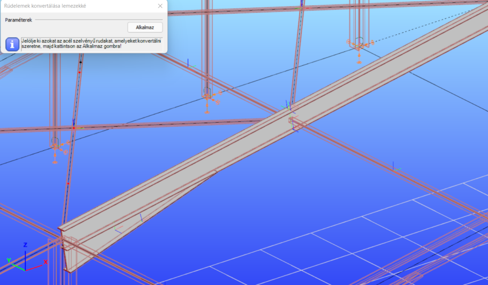

# Rúdelemek konvertálása lemezekké

<!-- wp:paragraph -->

Kiválasztott szerkezeti elemek konvertálhatók automatikusan lemezelemekké, a _**Szerkezeti elemek**_ fülön található _**Rúdelemek konvertálása lemezekké**_ () funkció segítségével.

<!-- /wp:paragraph -->

<!-- wp:paragraph -->

Ez a művelet végleges konvertálást eredményez (természetesen a _Visszavonás_ parancs továbbra is elérhető), ellentétben a héj végeselem típusra módosított rúdelemnek a végeselem generálás során történő automatikus felületelemmé konvertálásával (ld. [**Superbeam**](../5_0_structural-modeling/5_14_superbeam.md)).

<!-- /wp:paragraph -->

<!-- wp:image {"id":34749,"width":512,"height":300,"sizeSlug":"large","linkDestination":"media","className":"is-style-editorskit-rounded"} -->

<!-- /wp:image -->

<!-- wp:paragraph -->

Az alábbi keresztmetszetű rudak konvertálása lehetséges:

<!-- /wp:paragraph -->

<!-- wp:list -->

- Melegen hengerelt I, H és csőszelvény
- Hidegen hajlított C, Z és csőszelvény
- Hegesztett I, H és doboz szelvény

<!-- /wp:list -->

<!-- wp:paragraph -->

Melegen hengerelt szelvényű rúdelemek esetén, nem csak a szelvény övei és gerinc kerül átalakításra, hanem a nyakrész is, egy megfelelő méretű lemezelemmel helyettesítve. Ennek köszönhetően az eredeti és a már átkonvertált keresztmetszetek tulajdonságai megegyeznek.

<!-- /wp:paragraph -->

<!-- wp:paragraph -->

Az _**Alkalmaz**_ gombra kattintva a _Consteel_ lemezelemekké alakítja a kiválasztott rúdelemeket. A konvertálás figyelembe veszi az esetlegesen megadott külpontosságokat is, azaz a külpontosan felvett terhek és támaszok a konvertálás után az eredeti pozíciójukban maradnak. A bekötő elemek kapcsolódási pontjai, az elhelyezett kiékelés és a változó keresztmetszetű elem is automatikusan konvertálásra kerül. Az elem végein, ha nem szabad végről van szó, automatikusan létrejön egy merev test a megfelelő kényszerelemekkel, amely az átalakított lemezelemek végpontjait köti össze más modellrészekkel.

<!-- /wp:paragraph -->

<!-- wp:columns -->

<!-- wp:column -->

<!-- wp:image {"align":"center","id":22014,"height":500,"sizeSlug":"full","linkDestination":"media"} -->

Támasz a rúdelem végén

<!-- /wp:image -->

<!-- /wp:column -->

<!-- wp:column -->

<!-- wp:image {"align":"center","id":22002,"height":500,"sizeSlug":"large","linkDestination":"media"} -->

7SZF rúdelem a konvertálás után

<!-- /wp:image -->

<!-- /wp:column -->

<!-- wp:column -->

<!-- wp:image {"align":"center","id":22008,"height":500,"sizeSlug":"large","linkDestination":"media"} -->

Héj végeselem típusú rúdelem a konvertálás után

<!-- /wp:image -->

<!-- /wp:column -->

<!-- /wp:columns -->

<!-- wp:paragraph -->

Héj végeselem típusú rudak konvertálása után az egyes lemezek peremére egy-egy merev teste kerül, amelyek között csuklós kapcsolatok jönnek létre. E merev testek végpontjai kényszerelemekkel vannak összekötve, amelyek átadják a két modellrész (rúdelem és héj) közötti deformációkat. Ez a megoldás lehetővé teszi az öblösödési deformációk átvitelét is a kétféle végeselem típus között.

<!-- /wp:paragraph -->

<!-- wp:paragraph -->

A kényszerelemek kétfélék lehetnek, attól függően, hogy mely típusú deformációkat tudják közvetíteni:

<!-- /wp:paragraph -->

<!-- wp:list -->

- eltolódás
- eltolódás ás elfordulás

<!-- /wp:list -->
