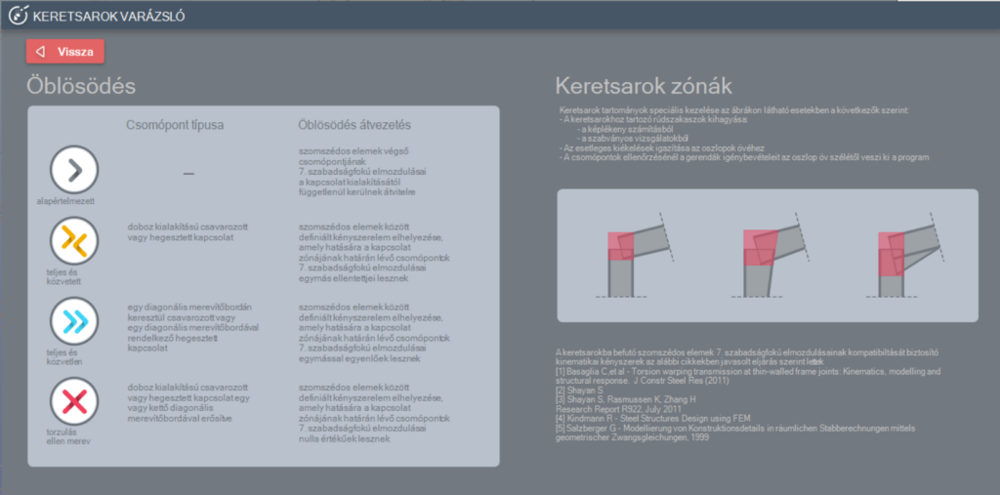

# Keretsarok varázsló
---
<!-- wp:image {"align":"center","id":34769,"width":447,"height":71,"sizeSlug":"full","linkDestination":"media","className":"is-style-default"} -->

<!-- /wp:image -->

<!-- wp:paragraph {"align":"justify"} -->

A Keretsarok varázsló egy hasznos kiegészítő funkció, amelynek segítségével még realisztikusabban modellezhető és számítható a keretsarok tartomány. A funkció automatikusan felismeri a keretsarok tartományt és a tartományban speciális eljárásokat alkalmaz a keretsarok modellezésére, a kihajlás számítására, illetve a képlékeny analízis és a szabványos ellenőrzés során.

<!-- /wp:paragraph -->

<!-- wp:paragraph -->

A mechanikai háttere a funkciónak az, hogy a – az általában merevített – keretsarok tartomány általában teljesen eltérő viselkedéssel rendelkezik, mint a keretsarokba bekötő rúdelemek. Mivel ezek a keretsarok tartományok relatíve rövidek, azért a viselkedését leginkább a nyírás befolyásolja, míg a bekötő oszlop, illetve gerenda elemek viselkedését a hajlítás.

<!-- /wp:paragraph -->

<!-- wp:paragraph -->

A Keretsarok varázsló funkciói:

<!-- /wp:paragraph -->

<!-- wp:image {"align":"left","id":34777,"width":347,"height":298,"sizeSlug":"full","linkDestination":"media","className":"is-style-editorskit-rounded"} -->

<!-- /wp:image -->

<!-- wp:paragraph {"align":"justify"} -->

\#1 - Keretsarok felismerés bekapcsolása. Bekapcsolás után lehet a megkezdeni a paraméterek beállítását. A korábban definiált keretsarkok is ki- vagy bekapcsolhatók ennek segítségével.

<!-- /wp:paragraph -->

<!-- wp:paragraph {"align":"justify"} -->

\#2 - További információk: a keretsarok varázsló információs panele hívható elő, mely a funkció bővebb leírását tartalmazza.

<!-- /wp:paragraph -->

<!-- wp:paragraph -->

Vezérlőpult

<!-- /wp:paragraph -->

<!-- wp:paragraph {"align":"justify"} -->

\#3 - Részletkezelő fa megjelenítő felülete, melyben beállíthatjuk, mely részletre mely keretsarok típus legyen elhelyezve. Fontos megjegyezni, hogy a speciális keretsarkok (#5, #6, #7) csak részletmodelleken helyezhetők el, egységesen a teljes modellre csak az alapértelmezett (default (#4)) keretsarkot lehet elhelyezni. Az elhelyezéshez először be kell pipálni ahhoz a részlethez tartozó jelölőnégyzetet, melyre el szeretnénk helyezni a speciális keretsarkot, majd rá is kell kattintani a részletmodell nevére csak ezután helyezhető el a keretsarok a részletmodellen.

<!-- /wp:paragraph -->

<!-- wp:paragraph -->

\#4 - Alapértelmezett keretsarok: a szomszédos elemek végső csomópontjainak 7. szabadságfokú elmozdulásai a kapcsolat kialakításától függetlenül kerülnek átvitelre.

<!-- /wp:paragraph -->

<!-- wp:paragraph {"align":"justify"} -->

\#5 - Teljes és közvetett keretsarok: doboz kialakítású csavarozott vagy hegesztett kapcsolat. Szomszédos elemek között definiált kényszerelemek elhelyezése, melynek hatására a kapcsolat zónájának határán a csomópontok 7. szabadságfokú elmozdulásai egymás ellentettjei lesznek.

<!-- /wp:paragraph -->

<!-- wp:paragraph {"align":"justify"} -->

\#6 - Teljes és közvetlen keretsarok: egy diagonális merevítőbordán keresztül csavarozott vagy egy diagonális merevítőbordával rendelkező hegesztett kapcsolat. Szomszédos elemek között definiált kényszerelemek elhelyezése, melynek hatására a kapcsolat zónájának határán a csomópontok 7. szabadságfokú elmozdulásai egymással azonosak lesznek.

<!-- /wp:paragraph -->

<!-- wp:paragraph {"align":"justify"} -->

\#7 - Torzulás ellen merev keretsarok: doboz kialakítása csavarozott vagy hegesztett kapcsolat egy vagy két diagonális merevítőbordával megerősítve. Szomszédos elemek között definiált kényszerelemek elhelyezése, melynek hatására a kapcsolat zónájának határán a csomópontok 7. szabadságfokú elmozdulásai zérus értékűek lesznek.

<!-- /wp:paragraph -->

<!-- wp:image {"align":"center","id":34785,"sizeSlug":"large","linkDestination":"media","className":"is-style-editorskit-rounded"} -->

<!-- /wp:image -->

<!-- wp:paragraph {"align":"justify"} -->

Az **Alkalmaz** gombra kattintás után a program észleli az azonosított csomópontokban lévő rúdelemek átfedő zónáit, beleértve az előforduló külpontosságokat, kiékeléseket vagy változó keresztmetszeteket, és létrehozza a keretsarok objektumokat, melyeket a beállított típusnak megfelelő áttetsző színű "dobozzal" ábrázol a modellben.

<!-- /wp:paragraph -->

<!-- wp:paragraph -->

A bekötő szerkezeti elemek keretsarok tartományon belüli részei elkülönítésre kerülnek és speciálisan kezelődnek:

<!-- /wp:paragraph -->

<!-- wp:list -->

- _Geometria_: az esetleges kiékelés a keretsarok tartomány széltől kezdődik. Így a kiékelés a valóságos mérettel és pozícióval kerül modellezésre

<!-- /wp:list -->

<!-- wp:image {"align":"center","id":34793,"width":341,"height":264,"sizeSlug":"full","linkDestination":"media","className":"is-style-editorskit-rounded"} -->

<!-- /wp:image -->

<!-- wp:list -->

- **Stabilitás számítás**:

  - Alapértelmezett keretsarok esetén a bekötő szerkezeti elemek keretsarok tartományon belüli részei kihagyásra kerülnek a stabilitás számításból.
  - Speciális keretsarok objektumok esetén a bekötő szerkezeti elemek keretsarok tartományon belüli részei is figyelembe vannak véve a stabilitásszámítás során.

- _Képlékeny analízis_: képlékeny csuklók nem alakulhatnak ki a keretsarok tartományon belül. Ennek megfelelően a képlékeny csuklók a pontos pozíciókban alakulnak ki (például az oszlopon a kiékelés alatt) és nem rúdelemek kapcsolódás pontjában, ahol a legnagyobb a hajlító nyomaték

<!-- /wp:list -->

<!-- wp:image {"align":"center","id":8850,"width":344,"height":240,"sizeSlug":"full","linkDestination":"media"} -->

<!-- /wp:image -->

<!-- wp:list -->

- **Szabványos ellenőrzés**: alapértelmezett és speciális keretsarok esetén is a szabványos ellenőrzés a bekötő szerkezeti elemeknek csak a keretsarok tartományon kívüli részén kerülnek elvégzésre. Így a hajlító nyomaték virtuális csúcsa a rúdelemek keretsarok tartományon belüli kapcsolódás pontjában (aminek valójában nincs valóságos mechanikai jelentése) kikerül a szabványos ellenőrzésből. A bekötő szerkezeti elemek szabványos ellenőrzése csak a valóságos és tényleges hajlító nyomatékra (és az egyidejű további igénybevételekre) kerül elvégzésre

<!-- /wp:list -->

<!-- wp:image {"align":"center","id":8857,"width":383,"height":275,"sizeSlug":"full","linkDestination":"media"} -->

<!-- /wp:image -->

<!-- wp:list -->

- _Csomópont tervezés_: hasonlóan az előző pontokhoz, a csomópont tervezéshez használt tervezési hajlító nyomaték és a nyíróerő a keretsarok tartomány szélén kerül meghatározásra, ott, ahol az oszlop-gerenda kapcsolat ténylegesen található

<!-- /wp:list -->
