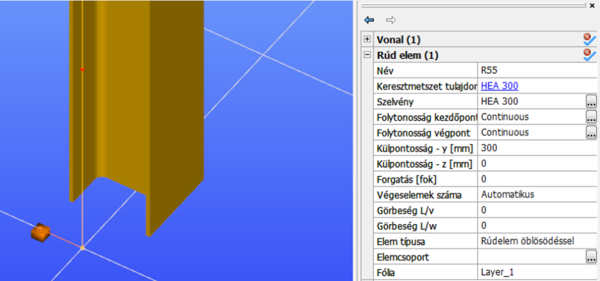
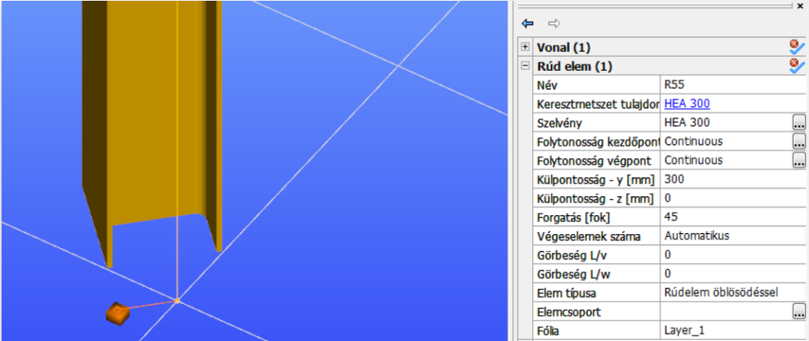
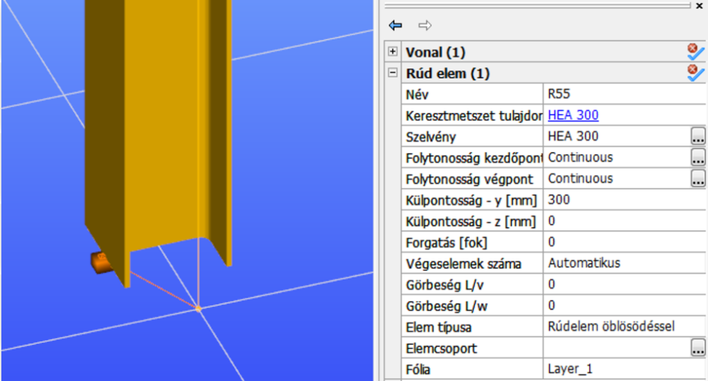

# Támaszok

<!-- wp:paragraph {"align":"justify"} -->

_Consteel_-ben háromfajta támasz használatára van lehetőség: pontbeli, vonalmenti és felületi támasz.

<!-- /wp:paragraph -->

<!-- wp:image {"align":"center","id":34847,"width":418,"height":80,"sizeSlug":"full","linkDestination":"media","className":"is-style-default"} -->

<!-- /wp:image -->

<!-- wp:paragraph {"align":"justify"} -->

Támaszok elhelyezhetők **globális (****)**, **lokális (****),** vagy **felhasználói(**) koordináta-rendszerek szerint. A támasz elhelyezés lokális koordináta-rendszer szerint funkció nagyon hasznos lehet ferde rúdelemekből álló szerkezet esetén. A lokális koordinátarendszer láthatósága bekapcsolható a _„Lokális koordináta rendszerek láthatósága”_ menüben. A lokális koordináta rendszerek tengelyeinek betűjelei bekapcsolhatóak a _„Feliratok láthatósága”_ menüben.

<!-- /wp:paragraph -->

<!-- wp:image {"align":"center","id":8897,"width":177,"height":264,"sizeSlug":"full","linkDestination":"media"} -->

<!-- /wp:image -->

<!-- wp:heading {"level":3} -->

### Pont támasz elhelyezése ()

<!-- /wp:heading -->

<!-- wp:image {"align":"center","id":34855,"width":359,"height":275,"sizeSlug":"full","linkDestination":"media","className":"is-style-editorskit-rounded"} -->

<!-- /wp:image -->

<!-- wp:paragraph -->

Pontbeli támasz vonal és felület elemen bárhol elhelyezhető (előre definiált pontokra nincs szükség; végpontok és fogópontok egyaránt használhatóak a támaszok elhelyezésére). Egyszerre több rúdelem végpontján is elhelyezhető a kiválasztott támasz a kijelölő funkció () használatával. A rúdelemek végpontjait ablakos kijelöléssel lehet kiválasztani.

<!-- /wp:paragraph -->

<!-- wp:paragraph -->

A **többszörös támasz** funkcióval (), egyszerre több támasz helyezhető el a kiválasztott rúdon, a támaszok közötti relatív távolságok megadásával. A támaszok kiosztása mindig a rúd kezdőpontjától (A vég) értelmezett. Ha az elem végén keretsarok objektum található, akkor az első távolságot a sarokzóna szélétől mérjük.

<!-- /wp:paragraph -->

<!-- wp:image {"align":"center","id":8909,"width":693,"height":385,"sizeSlug":"full","linkDestination":"media"} -->

<!-- /wp:image -->

<!-- wp:paragraph {"align":"justify"} -->

A többszörös támaszként elhelyezett támaszok egy objektumként vannak kezelve. A támaszok közötti távolság a támaszt kijelölve az objektum paramétereinél bármikor módosítható.

<!-- /wp:paragraph -->

<!-- wp:image {"align":"center","id":34889,"width":287,"height":227,"sizeSlug":"full","linkDestination":"media","className":"is-style-editorskit-rounded"} -->

<!-- /wp:image -->

<!-- wp:paragraph {"align":"justify"} -->

Az elhelyezés koordinátarendszerének kiválasztását követően, a legördülő menüből ki kell választani a megfelelő támaszt típust. A listában számos előre definiált típus található.

<!-- /wp:paragraph -->

<!-- wp:paragraph -->

Elhelyezéskor a kiválasztott koordináta rendszer határozza meg az irányok értelmezését. A különböző - **Globális** (), **Lokális **(**),** **Felhasználói**() - koordináta rendszerek szerinti támaszelhelyezést mutatja az alábbi példa:

<!-- /wp:paragraph -->

<!-- wp:image {"align":"center","id":8923,"width":311,"height":248,"sizeSlug":"full","linkDestination":"media"} -->

<!-- /wp:image -->

<!-- wp:paragraph {"align":"justify"} -->

A megtámasztott objektum külpontosságának megváltoztatása esetén a támasz megtartja az elhelyezéskor alkalmazott koordinátarendszerhez viszonyított irányítottságát.

<!-- /wp:paragraph -->

<!-- wp:paragraph {"align":"justify"} -->

Ha a modellezés során olyan új, speciális támasz alkalmazása válik szükségessé, amelynek tulajdonságai eltérnek az előre definiált és rendelkezésre álló támaszokétól, akkor a támasz típusa melletti három pontos ikonra () kattintva létrehozható új típusú támasz. A támasz definiálásához a szabadságfokok a következők szerint állíthatók: szabad, fix vagy félmerev. A félmerev szabadságfok esetén a merevség értéke kN/mm, kNmm/rad vagy kNm2/(rad/m) mértékegységekben adhatók meg.

<!-- /wp:paragraph -->

<!-- wp:image {"align":"center","id":34904,"width":386,"height":317,"sizeSlug":"full","linkDestination":"media","className":"is-style-editorskit-rounded"} -->

<!-- /wp:image -->

<!-- wp:paragraph {"align":"justify"} -->

A támaszok előre definiált elnevezései könnyen értelmezhetőek. Például „x,y,z,xx” támasz név jelentése a következő: minden elmozdulás gátolt az x, y és z irányokban, illetve az xx tengely körül gátolt az elfordulás is. A többi szabadságfok szabad.

<!-- /wp:paragraph -->

<!-- wp:paragraph -->

Lokális külpontosság is definiálható a támaszokon:

<!-- /wp:paragraph -->

<!-- wp:paragraph {"align":"justify"} -->

**(Ez a funkció használható, olyan merevítések megtámasztó hatásának a modellezésére, amelyek nem a megtámasztott rúd középvonalába, hanem például a felső övekhez kapcsolódnak.)**

<!-- /wp:paragraph -->

<!-- wp:image {"align":"center","id":34929,"width":357,"height":274,"sizeSlug":"full","linkDestination":"media","className":"is-style-editorskit-rounded"} -->

<!-- /wp:image -->

<!-- wp:image {"align":"right","id":34947,"width":168,"height":218,"sizeSlug":"full","linkDestination":"media","className":"is-style-editorskit-rounded"} -->

<!-- /wp:image -->

<!-- wp:paragraph -->

A támasz külpontosság megadható a **szelvény középvonalától**, vagy a **szelvény geometriáján**. A „0 – referencia vonal” lokális külpontosság típus csak a legördülő menüből választható.

<!-- /wp:paragraph -->

<!-- wp:paragraph -->

A lokális külpontosság a **szelvény geometriáján** két módon adható meg. Egyik lehetséges mód, hogy a legördülő menüből kerül kiválasztásra a szelvény geometriájának egyik tipikus pontja (1-9), vagy a három pontos ikonra  kattintva a megjelenő ábrán kerül kiválasztásra az egyik tipikus szelvény pont (1-9).

<!-- /wp:paragraph -->

<!-- wp:paragraph {"align":"justify"} -->

Az y és z mezőkben megadható lokális külpontosság értékek a fent beállított külpontosságokhoz adódnak hozzá.

<!-- /wp:paragraph -->

<!-- wp:image {"align":"center","id":34979,"width":497,"height":471,"sizeSlug":"full","linkDestination":"media","className":"is-style-editorskit-rounded"} -->

<!-- /wp:image -->

<!-- wp:paragraph -->

Ha a megtámasztott szelvény külpontossága megváltozik, akkor a támasz szelvényhez viszonyított fentiekben meghatározott külpontosságát megtartja.

<!-- /wp:paragraph -->

<!-- wp:paragraph -->

Attól függően, hogy a támasz külpontosságát a szelvény referencia vonalához vagy a szelvény geometriájához adtuk meg, a szelvény külpontosság változása esetén a támasz helyzete az alábbiak szerint változik:

<!-- /wp:paragraph -->

<!-- wp:paragraph -->

A “0 – Referencia vonal” külpontosság típus használata esetén:

<!-- /wp:paragraph -->

<!-- wp:paragraph {"align":"justify","editorskit":{"indent":40,"devices":false,"desktop":true,"tablet":true,"mobile":true,"loggedin":true,"loggedout":true,"acf_visibility":"","acf_field":"","acf_condition":"","acf_value":"","migrated":false,"unit_test":false}} -->

A szelvény “y” vagy „z” külpontosságának módosítása estén, mivel a támasz a szelvény referenciavonalához tartja meg a relatív helyzetét és nem a szelvényhez, a támasz helye nem változik. A szelvény “Forgatás” szögnek módosítása esetén, a referenciavonal is elfordul, ezért a támasz is elfordul.

<!-- /wp:paragraph -->

<!-- wp:paragraph -->

Ha a támasz helyzetét a szelvény geometriához (az 1-9 szelvénypozíciók valamelyikéhez) adjuk meg:

<!-- /wp:paragraph -->

<!-- wp:paragraph {"align":"justify","editorskit":{"indent":40,"devices":false,"desktop":true,"tablet":true,"mobile":true,"loggedin":true,"loggedout":true,"acf_visibility":"","acf_field":"","acf_condition":"","acf_value":"","migrated":false,"unit_test":false}} -->

A szelvény “y” vagy „z” külpontosságának módosítása esetén, mivel a támasz a szelvény egy tipikus pontjához viszonyított relatív helyzetét tartja meg, ezért a támasz helyzete a szelvénnyel együtt változik. A szelvény “Forgatás” szögnek módosítása esetén, a referenciavonal is elfordul, ezért a támasz is elfordul.

<!-- /wp:paragraph -->

<!-- wp:paragraph -->

**Példák a különböző típusú külpontosságokra:**

<!-- /wp:paragraph -->

<!-- wp:paragraph {"align":"justify","editorskit":{"indent":40,"devices":false,"desktop":true,"tablet":true,"mobile":true,"loggedin":true,"loggedout":true,"acf_visibility":"","acf_field":"","acf_condition":"","acf_value":"","migrated":false,"unit_test":false}} -->

_1. Példa:_ Mind a két támasz -150mm-es y irányú külpontossággal lett elhelyezve, de a bal oldali esetben a külpontosság a szelvény referencia vonalától, míg a jobb oldali esetben a szelvény geometria közép-közép pontjától lett megadva.

<!-- /wp:paragraph -->

<!-- wp:image {"align":"center","id":35049,"width":469,"height":289,"sizeSlug":"full","linkDestination":"media","className":"is-style-editorskit-rounded"} -->

<!-- /wp:image -->

<!-- wp:paragraph {"editorskit":{"indent":40,"devices":false,"desktop":true,"tablet":true,"mobile":true,"loggedin":true,"loggedout":true,"acf_visibility":"","acf_field":"","acf_condition":"","acf_value":"","migrated":false,"unit_test":false}} -->

Ha megváltoztatjuk mindkét oszlop külpontosságát y=100mm-re, akkor az elhelyezett támaszok új pozíciója az alábbi lesz:

<!-- /wp:paragraph -->

<!-- wp:image {"align":"center","id":35041,"width":471,"height":278,"sizeSlug":"full","linkDestination":"media","className":"is-style-editorskit-rounded"} -->

<!-- /wp:image -->

<!-- wp:paragraph {"align":"justify","editorskit":{"indent":40,"devices":false,"desktop":true,"tablet":true,"mobile":true,"loggedin":true,"loggedout":true,"acf_visibility":"","acf_field":"","acf_condition":"","acf_value":"","migrated":false,"unit_test":false}} -->

A baloldali esetben az elhelyezett támasz pozíciója nem változott, hiszen az oszlop referencia vonalának pozíciója sem változott, míg a jobboldali esetben a támasz együtt mozdult az oszloppal.

<!-- /wp:paragraph -->

<!-- wp:paragraph {"align":"justify","editorskit":{"indent":40,"devices":false,"desktop":true,"tablet":true,"mobile":true,"loggedin":true,"loggedout":true,"acf_visibility":"","acf_field":"","acf_condition":"","acf_value":"","migrated":false,"unit_test":false}} -->

_2. Példa:_ Támasz a globális koordináta rendszer szerint kerül elhelyezésre, külpontossága 150mm a megtámasztott oszlop lokális koordináta rendszerének z irányában. Támasz lokális külpontosság típusa: „0 – Referencia vonal”.

<!-- /wp:paragraph -->

<!-- wp:image {"align":"center","id":35033,"width":366,"height":313,"sizeSlug":"full","linkDestination":"media","className":"is-style-editorskit-rounded"} -->

<!-- /wp:image -->

<!-- wp:paragraph {"editorskit":{"indent":40,"devices":false,"desktop":true,"tablet":true,"mobile":true,"loggedin":true,"loggedout":true,"acf_visibility":"","acf_field":"","acf_condition":"","acf_value":"","migrated":false,"unit_test":false}} -->

Ha az oszlop külpontosságát y=300mm-re változtatjuk, akkor a támasz pozíciója nem változik.

<!-- /wp:paragraph -->

<!-- wp:image {"align":"center","id":35025,"width":512,"height":240,"sizeSlug":"large","linkDestination":"media","className":"is-style-editorskit-rounded"} -->

<!-- /wp:image -->

<!-- wp:paragraph {"editorskit":{"indent":40,"devices":false,"desktop":true,"tablet":true,"mobile":true,"loggedin":true,"loggedout":true,"acf_visibility":"","acf_field":"","acf_condition":"","acf_value":"","migrated":false,"unit_test":false}} -->

A támasz megtartotta a relatív pozícióját az oszlop referencia vonalától.

<!-- /wp:paragraph -->

<!-- wp:paragraph {"align":"justify","editorskit":{"indent":40,"devices":false,"desktop":true,"tablet":true,"mobile":true,"loggedin":true,"loggedout":true,"acf_visibility":"","acf_field":"","acf_condition":"","acf_value":"","migrated":false,"unit_test":false}} -->

Ha elforgatjuk az oszlopot 45 fokkal, akkor a támasz is ennek megfelelően elfordul, mivel forgatáskor az elem referencia vonala is fordul. Viszont a támasz megtartja irányultságát, ami a továbbiakban is az elhelyezéskor kiválasztott globális koordináta rendszer szerint van értelmezve.

<!-- /wp:paragraph -->

<!-- wp:image {"align":"center","id":35017,"width":512,"height":217,"sizeSlug":"large","linkDestination":"media","className":"is-style-editorskit-rounded"} -->

<!-- /wp:image -->

<!-- wp:paragraph {"align":"justify","editorskit":{"indent":40,"devices":false,"desktop":true,"tablet":true,"mobile":true,"loggedin":true,"loggedout":true,"acf_visibility":"","acf_field":"","acf_condition":"","acf_value":"","migrated":false,"unit_test":false}} -->

_3. Példa:_ Támasz a globális koordináta rendszer szerint került elhelyezésre, külpontossága 150mm a megtámasztott oszlop lokális koordináta rendszerének z irányában. Támasz lokális külpontosság típusa: „5 – Közép - Közép”.

<!-- /wp:paragraph -->

<!-- wp:image {"align":"center","id":35009,"width":503,"height":366,"sizeSlug":"full","linkDestination":"media","className":"is-style-editorskit-rounded"} -->

<!-- /wp:image -->

<!-- wp:paragraph {"editorskit":{"indent":40,"devices":false,"desktop":true,"tablet":true,"mobile":true,"loggedin":true,"loggedout":true,"acf_visibility":"","acf_field":"","acf_condition":"","acf_value":"","migrated":false,"unit_test":false}} -->

Ha az oszlop külpontosságát y=300mm-re változtatjuk, akkor a támasz együtt mozdul az oszloppal.

<!-- /wp:paragraph -->

<!-- wp:image {"align":"center","id":35001,"width":512,"height":276,"sizeSlug":"large","linkDestination":"media","className":"is-style-editorskit-rounded"} -->

<!-- /wp:image -->

<!-- wp:paragraph {"editorskit":{"indent":40,"devices":false,"desktop":true,"tablet":true,"mobile":true,"loggedin":true,"loggedout":true,"acf_visibility":"","acf_field":"","acf_condition":"","acf_value":"","migrated":false,"unit_test":false}} -->

Ha elforgatjuk az oszlopot 45 fokkal, akkor a támasz is ennek megfelelően elfordul, mivel forgatáskor az elem referencia vonala is fordul. Viszont a támasz megtartja irányultságát, ami a továbbiakban is az elhelyezéskor kiválasztott globális koordináta rendszer szerint van értelmezve.

<!-- /wp:paragraph -->

<!-- wp:image {"align":"center","id":9006,"width":391,"height":446,"sizeSlug":"full","linkDestination":"media"} -->

<!-- /wp:image -->

<!-- wp:paragraph {"align":"justify"} -->

Bármelyik külpontossági típust is válasszuk a támasz elhelyezéséhez, a támasz megtartja kiválasztott referencia ponttól mért relatív külpontosságát, a megtámasztott elem külpontosságának módosítása esetén is, illetve megtartja irányultságát az elhelyezéskor választott koordináta rendszernek megfelelően.

<!-- /wp:paragraph -->

<!-- wp:image {"align":"left","id":21420,"width":96,"height":102,"sizeSlug":"full","linkDestination":"none"} -->

<!-- /wp:image -->

<!-- wp:paragraph -->

**Figyelmeztetés!** Vegyük figyelembe, hogy az acél rúdelemek végeselemei 7 szabadságfokúak, ezért a pont támaszok is 7 szabadságfokkal rendelkeznek, ahol a 7. szabadságfok a szelvény öblösödését jelenti. Ezért, ha egy adott keresztmetszetnél az öblösödés kizárható (például egy merev kapcsolatnál), akkor ezen a helyen az öblösödést meg kell akadályozni. Több rúdelem találkozásánál, ahol a rudak külpontosak, ajánlott az öblösödést megakadályozó támasz alkalmazása!

<!-- /wp:paragraph -->

<!-- wp:spacer {"height":"1px"} -->

<!-- /wp:spacer -->

<!-- wp:heading {"level":3} -->

### Vonalmenti támasz elhelyezése ()

<!-- /wp:heading -->

<!-- wp:paragraph {"align":"justify"} -->

Vonalmenti támasz elhelyezhető egy meglévő vonalra (vonal elemen vagy felületi elem élén) vagy vonal rajzolásával (például egy felület elemen).

<!-- /wp:paragraph -->

<!-- wp:image {"align":"center","id":35059,"width":357,"height":230,"sizeSlug":"full","linkDestination":"media","className":"is-style-editorskit-rounded"} -->

<!-- /wp:image -->

<!-- wp:paragraph -->

A vonaltámaszoknak két előre definiált típusa van, a Fix és a Csuklós. A hárompontos  ikonra kattintva új vonalmenti támasz típus vehető fel az új támasz nevének, és kényszereinek megadásával.

<!-- /wp:paragraph -->

<!-- wp:image {"align":"center","id":35067,"width":394,"height":315,"sizeSlug":"full","linkDestination":"media","className":"is-style-editorskit-rounded"} -->

<!-- /wp:image -->

<!-- wp:paragraph -->

Vonalmenti támasz elhelyezése esetén a különböző koordinátarendszerek és külpontosságok hatása megegyezik a pontbeli támasz elhelyezésénél leírtakkal.

<!-- /wp:paragraph -->

<!-- wp:paragraph -->

 Kiválasztás funkció

<!-- /wp:paragraph -->

<!-- wp:paragraph -->

A vonalmenti támasz elhelyezhető egy felületi elem élének (amely lehet külső kerületen vagy belső áttörésen) vagy egy rúdelem tengelyének kiválasztásával.

<!-- /wp:paragraph -->

<!-- wp:paragraph -->

 Rajzolás funkció

<!-- /wp:paragraph -->

<!-- wp:paragraph {"align":"justify"} -->

Vonalmenti támasz elhelyezése rajzolással egy rúdelemen vagy felületi elemen kiválasztott két pontja között.

<!-- /wp:paragraph -->

<!-- wp:heading {"level":3} -->

### Felületi támasz elhelyezése ()

<!-- /wp:heading -->

<!-- wp:paragraph -->

Felületi támasz meglévő felület elemre helyezhető el.

<!-- /wp:paragraph -->

<!-- wp:paragraph -->

Alaphelyzetben nincs előre definiált felületi támasz. A három pontos  ikonra kattintva, a felhasználó felvehet felületi támaszokat. Három szabadságfokot lehet beállítani támaszonként.

<!-- /wp:paragraph -->

<!-- wp:image {"align":"center","id":35075,"width":664,"height":442,"sizeSlug":"full","linkDestination":"media","className":"is-style-editorskit-rounded"} -->

<!-- /wp:image -->

<!-- wp:paragraph -->

Egy felületi elemre kattintva a lemez teljes felületén elhelyezésre kerül a felületi támasz.

<!-- /wp:paragraph -->
