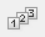
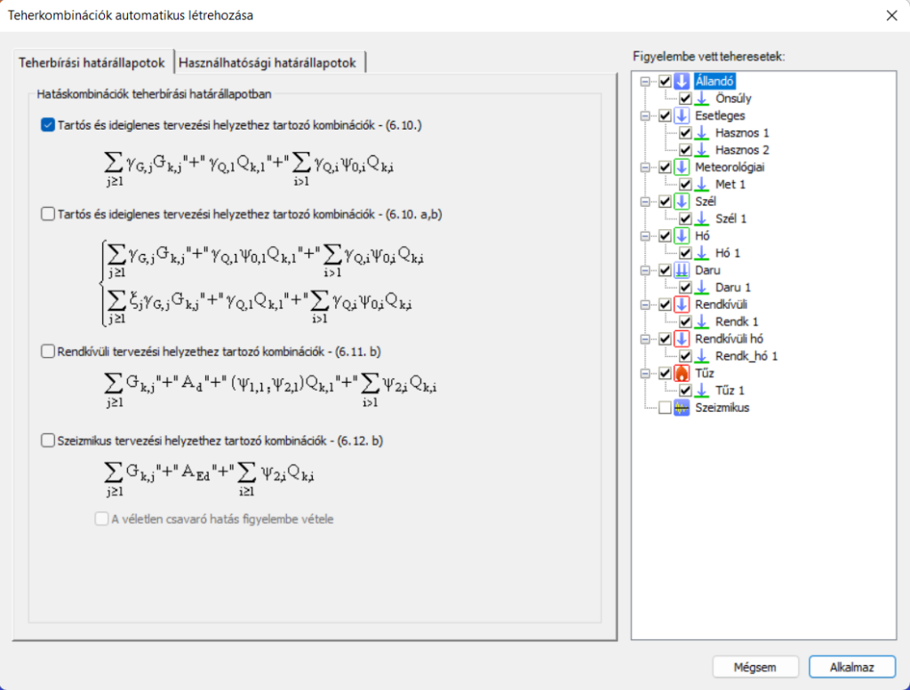
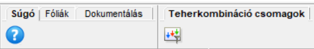
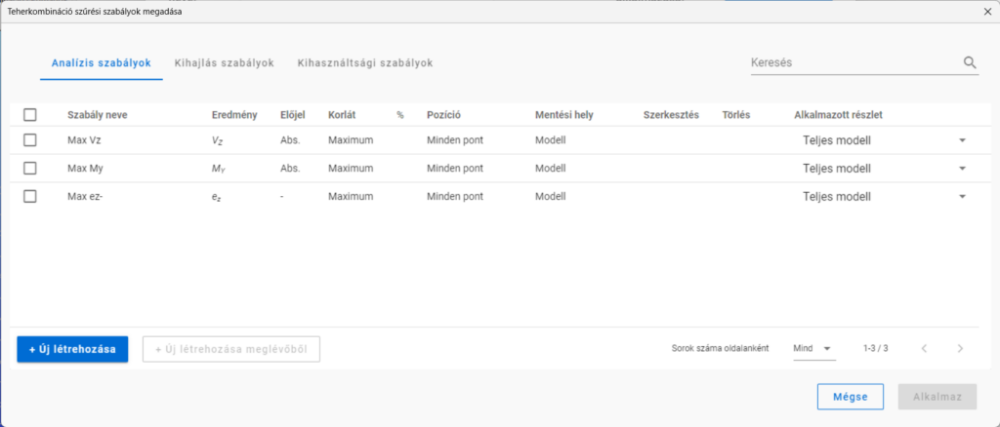

# Teherkombinációk

### Határállapotok

**Consteel 16**

Az EN 1990 szabvány alapján a szerkezeteket teherbírási (ULS), vagy használhatósági határállapotban (SLS) kell ellenőrizni. Ezek a határállapotok különböző tervezési állapotokhoz kapcsolódnak.

Teherbírási határállapotok:
- EQU (alapozás helyzeti állékonyságának elvesztése)

- STR (tartószerkezetek ellenőrzése)

- GEO (geotechnikai tervezéshez), stb.

Használhatósági határállapotok:

- karakterisztikus

- gyakori

- kvázi állandó

Tervezési állapotok:

- tartós és ideiglenes (P/T)

- rendkívüli (Acc)

- szeizmikus

A Consteelben bevezetett határállapotok az Eurocode-ban meghatározott határállapotok és tervezési állapotok kombinációi.

<!-- /wp:paragraph -->

<!-- wp:image {"align":"center","id":50981,"width":512,"height":262,"sizeSlug":"large","linkDestination":"media","className":"is-style-editorskit-rounded"} -->

Határállapot koncepció

- ULS STR P/T

- ULS GEO P/T

- ULS STR/GEO P/T (ez egy kombinált határállapot olyan esetekre, amikor az STR és GEO kombinációk azonosak lennének.)

- ULS EQU P/T

- ULS Acc

- ULS Seismic

- ULS Other

- SLS Char

- SLS Freq

- SLS Q-p

- SLS Seismic

- SLS Other

A nem szigorúan az Eurocode hatálya alá tartozó esetek számára, és a korábbi verziók fájljainak problémamentes átvétele érdekében az ULS és SLS határállapotok esetében is rendelkezésre áll egy "Egyéb" elnevezésű határállapot is.

A korábbi Consteel verziókban mentett modellek megnyitásakor a határállapotok az alábbiak szerint módosulnak:
- ULS -> ULS Other

- SLS -> SLS Other

- ULS EQ (generált szeizmikus) -> ULS Seismic

- SLS EQ (generált szeizmikus) -> SLS Seismic

A manuálisan létrehozott teherkombinációkhoz kézzel kell valamely határállapotot hozzárendelni. Szeizmikus kombinációkat nem lehet manuálisan létrehozni, azok csak automatikus generálás útján jöhetnek létre. Az ULS GEO P/T és ULS EQU P/T határállapotokban szereplő teherkombinációk csak alapozás tervezéshez használhatók. Következésképpen ezekben a határállapotokban a globális méretezési vizsgálatok nem kerülnek elvégzésre, és az analízis eredményei nem adódnak át a csomóponttervezéshez (kivéve a pontalap csomópontot).

## Teherkombinációk

**Consteel 16**

A kiválasztott _[tervezési szabványnak](../1_0_general-description/1_2_the-main-window.md#a-menü)_ megfelelően a teherkombinációk (TK) a [teheresetekből ](./6_1_load-cases-and-load-groups.md)állíthatók elő. A teherkombinációk () létrehozhatók manuálisan, a biztonsági és kombinációs tényezők teheresetenkénti megadásával, vagy a _Consteel_ **Teherkombinációk automatikus létrehozása** () funkciójának segítségével.

A teherkombinációkat a teherkombinációk táblázatában lehet kezelni, amelyet a Terhek fülön a Teherkombináció () parancsra kattintva lehet megnyitni.

Teherkombinációk táblázata

Az ablak tetején a kombinációk létrehozására és módosítására szolgáló parancsikonok találhatók. A parancsok alatt található maga a táblázat. Az első oszlop a teherkombináció neve. A név egy alapértelmezett névből és egy növekvő sorszámból épül fel. A név csak egyesével módosítható.

A második oszlop határozza meg, hogy a teherkombináció melyik határállapothoz tartozik. Fontos a határállapot helyes beállítása, mivel a tervezési ellenőrzések csak a teherbírási (ULS) kombinációkra, míg a használhatósági vizsgálatok csak a használhatósági (SLS) kombinációkra kerülnek végrehajtásra.

A további oszlopokban az egyes teheresetekre vonatkozó kombinációs tényezők szerepelnek. Egyszerre több tényező szerkesztése is lehetséges: ehhez válaszd ki a kívánt tényezőket, kattints rájuk a jobb egérgombbal, majd add meg a kívánt értéket a felugró ablakban. Több cella kijelölése történhet a **CTRL** vagy **SHIFT** gombok használatával, vagy az egér bal gombjának lenyomva tartásával és a kurzornak a cellák fölött történő mozgatásával. A cellák tartalma másolható és beilleszthető is a **CTRL+C** / **CTRL+V** billentyűkombinációkkal. A cellák tartalma az MS Excel vagy más táblázatkezelő alkalmazásokba/-ból is másolható.

A teherkombináció táblázat sárga sorai az automatikusan generált kombinációk. A fehér sorok a kézzel létrehozott vagy kézzel szerkesztett kombinációk.

 **Új teherkombináció létrehozása** - új sort hoz létre a teherkombinációk táblázatában. A kombinációs tényezőket kézzel kell kitölteni.

<!-- /wp:paragraph -->

<!-- wp:paragraph -->

 **Teherkombináció másolása**- Másolatot készít a korábban kijelölt sorokról. Az új teherkombinációk sorszámokat és fehér hátteret kapnak.

<!-- /wp:paragraph -->

<!-- wp:paragraph -->

 **Teherkombináció törlése**- Törli a korábban kijelölt sorokat.

<!-- /wp:paragraph -->

<!-- wp:paragraph -->

 **Teherkombinációk újraszámozása** - A táblázat összes teherkombinációjának nevét az eredetire változtatja.

<!-- /wp:paragraph -->

<!-- wp:image {"align":"right","id":50990,"width":512,"height":389,"sizeSlug":"large","linkDestination":"media"} -->

Teherkombinációk automatikus létrehozása

<!-- /wp:image -->

<!-- wp:paragraph -->

 **Teherkombinációk automatikus létrehozása** - a tervezési szabványnak és a _[tehercsoportok és teheresetek beállításainak](./6_1_load-cases-and-load-groups.md#az-automatikus-kombinációgenerálás-beállítási-lehetőségei)_ megfelelően. Megjelenik egy új ablak, ahol a kívánt kombinációs képletet ki lehet választani. Az ULS és SLS kombinációk két külön fülön helyezkednek el. A kívánt képlet szerinti kombinációk létrehozásához jelölje be az előtte lévő jelölőnégyzetet. A kombinálandó teheresetek a jobb oldali fa struktúrából választhatók ki. Végül, a kombinációk létrehozásához nyomja meg az **Alkalmaz** gombot.

<!-- /wp:paragraph -->

<!-- wp:paragraph {"align":"justify"} -->

A teherkombinációk generálása után a számítási idő minimalizálása érdekében lehetőség van a nem releváns sorok törlésére is.

<!-- /wp:paragraph -->

<!-- wp:paragraph -->

**Consteel 15**

<!-- /wp:paragraph -->

<!-- wp:paragraph -->

A kiválasztott _[tervezési szabványnak](../1_0_general-description/1_2_the-main-window.md)_ megfelelően a teherkombinációk (TK) a [teheresetekből ](./6_1_load-cases-and-load-groups.md#teheresetek-és-tehercsoportok)állíthatók elő. A teherkombinációk () létrehozhatók manuálisan, a biztonsági és kombinációs tényezők teheresetenkénti megadásával, vagy a _Consteel_ **Teherkombinációk automatikus létrehozása** () funkciójának segítségével.

<!-- /wp:paragraph -->

<!-- wp:paragraph -->

A teherkombinációkat a teherkombinációk táblázatában lehet kezelni, amelyet a Terhek fülön a Teherkombináció () parancsra kattintva lehet megnyitni.

<!-- /wp:paragraph -->

<!-- wp:image {"align":"right","id":35820,"width":512,"height":295,"sizeSlug":"large","linkDestination":"media","className":"is-style-editorskit-rounded","editorskit":{"devices":false,"desktop":true,"tablet":true,"mobile":true,"loggedin":true,"loggedout":true,"acf_visibility":"","acf_field":"","acf_condition":"","acf_value":"","migrated":false,"unit_test":false}} -->

<!-- /wp:image -->

<!-- wp:paragraph -->

Az ablak tetején a kombinációk létrehozására és módosítására szolgáló parancsikonok találhatók. A parancsok alatt található maga a táblázat. Az első oszlop a teherkombináció neve. A név egy alapértelmezett névből és egy növekvő sorszámból épül fel. A név csak egyesével módosítható.

<!-- /wp:paragraph -->

<!-- wp:paragraph -->

A második oszlop határozza meg, hogy a teherkombináció melyik határállapothoz tartozik. Fontos a határállapot helyes beállítása, mivel a tervezési ellenőrzések csak a teherbírási (ULS) kombinációkra, míg a használhatósági vizsgálatok csak a használhatósági (SLS) kombinációkra kerülnek végrehajtásra.

<!-- /wp:paragraph -->

<!-- wp:paragraph -->

A további oszlopokban az egyes teheresetekre vonatkozó kombinációs tényezők szerepelnek. Egyszerre több tényező szerkesztése is lehetséges: ehhez válaszd ki a kívánt tényezőket, kattints rájuk a jobb egérgombbal, majd add meg a kívánt értéket a felugró ablakban. Több cella kijelölése történhet a **CTRL** vagy **SHIFT** gombok használatával, vagy az egér bal gombjának lenyomva tartásával és a kurzornak a cellák fölött történő mozgatásával. A cellák tartalma másolható és beilleszthető is a **CTRL+C** / **CTRL+V** billentyűkombinációkkal. A cellák tartalma az MS Excel vagy más táblázatkezelő alkalmazásokba/-ból is másolható.

<!-- /wp:paragraph -->

<!-- wp:paragraph -->

A teherkombináció táblázat sárga sorai az automatikusan generált kombinációk. A fehér sorok a kézzel létrehozott vagy kézzel szerkesztett kombinációk.

<!-- /wp:paragraph -->

<!-- wp:paragraph -->

 **Új teherkombináció létrehozása** - új sort hoz létre a teherkombinációk táblázatában. A kombinációs tényezőket kézzel kell kitölteni.

<!-- /wp:paragraph -->

<!-- wp:paragraph -->

 **Teherkombináció másolása** - Másolatot készít a korábban kijelölt sorokról. Az új teherkombinációk sorszámokat és fehér hátteret kapnak.

<!-- /wp:paragraph -->

<!-- wp:paragraph -->

 **Teherkombináció törlése** - Törli a korábban kijelölt sorokat.

<!-- /wp:paragraph -->

<!-- wp:paragraph -->

 **Teherkombinációk újraszámozása** - A táblázat összes teherkombinációjának nevét az eredetire változtatja.

<!-- /wp:paragraph -->

<!-- wp:image {"align":"right","id":35828,"width":512,"height":389,"sizeSlug":"large","linkDestination":"media","className":"is-style-editorskit-rounded","editorskit":{"devices":false,"desktop":true,"tablet":true,"mobile":true,"loggedin":true,"loggedout":true,"acf_visibility":"","acf_field":"","acf_condition":"","acf_value":"","migrated":false,"unit_test":false}} -->

<!-- /wp:image -->

<!-- wp:paragraph -->

 **Teherkombinációk automatikus létrehozása** - a tervezési szabványnak és a _[tehercsoportok és teheresetek beállításainak](./6_1_load-cases-and-load-groups.md#teheresetek-és-tehercsoportok)_ megfelelően. Megjelenik egy új ablak, ahol a kívánt kombinációs képletet ki lehet választani. Az ULS és SLS kombinációk két külön fülön helyezkednek el. A kívánt képlet szerinti kombinációk létrehozásához jelölje be az előtte lévő jelölőnégyzetet. A kombinálandó teheresetek a jobb oldali fa struktúrából választhatók ki. Végül, a kombinációk létrehozásához nyomja meg az **Alkalmaz** gombot.

<!-- /wp:paragraph -->

<!-- wp:paragraph -->

Nagyszámú teherkombináció kiszámítása hosszú időt vesz igénybe az analízis során, ezért célszerű a teherkombinációk számát a lehető legkisebbre csökkenteni. Az automatikus teherkombináció létrehozása funkció használata esetén célszerű a generálás előtt kiszűrni a felesleges tehereseteket. A bejelölt jelölőnégyzet azt jelenti, hogy az adott tehereset(-csoport) felhasználásra kerül a teherkombinációk generálásához. A nem kívánt teheresetek kihagyásával jelentősen csökkenthető a generált kombinációk száma.

<!-- /wp:paragraph -->

<!-- wp:paragraph {"align":"justify"} -->

A teherkombinációk generálása után a számítási idő minimalizálása érdekében lehetőség van a nem releváns sorok törlésére is.

<!-- /wp:paragraph -->

<!-- wp:heading -->

## Teherkombináció csomagok

<!-- /wp:heading -->

<!-- wp:paragraph -->

A Consteel 16 (vagy újabb verzió) használatával már teherkombináció csomagok is létrehozhatók különböző célokra, például előzetes, szerkezeti vagy kapcsolati tervezéshez, stb. Egy teherkombináció csomag a tetszőlegesen kiválasztott teherkombinációk listáját jelenti. A cél egy adott tervezési fázisban a kiszámítandó teherkombinációk számának csökkentése a legrelevánsabbak kiválasztásával. Ez a szükséges számítási időt is hatékonyan csökkenti.

<!-- /wp:paragraph -->

<!-- wp:paragraph -->

A **Teherkombináció csomagok** () párbeszédablak a főablak **Teherkombináció csomagok** füléről érhető el.

<!-- /wp:paragraph -->

<!-- wp:image {"id":51134,"width":341,"height":54,"sizeSlug":"full","linkDestination":"none"} -->

<!-- /wp:image -->

<!-- wp:paragraph -->

Az analízishez használni kívánt teherkombináció csomagot az **Analízis paraméterei** ablak **[Teherkombinációk](../8_0_structural-analysis/8_3_analysis-settings.md#teherkombinációk-analízis-beállításainak-részletezése-aloldal)** aloldalán lehet kiválasztani a legördülő menüből. A Teherkombináció csomagok ablaka innen is elérhető a legördülő menü jobb oldalán található  ikonnal.

<!-- /wp:paragraph -->

<!-- wp:image {"align":"center","id":50999,"width":341,"height":141,"sizeSlug":"full","linkDestination":"media","className":"is-style-editorskit-rounded"} -->

Teherkombináció csomag kiválasztása analízishez

<!-- /wp:image -->

<!-- wp:paragraph -->

A funkció első indításakor egy üres táblázat jelenik meg:

<!-- /wp:paragraph -->

<!-- wp:image {"align":"center","id":51008,"width":512,"height":219,"sizeSlug":"large","linkDestination":"media","className":"is-style-editorskit-rounded"} -->

Teherkombináció csomagok táblázata

<!-- /wp:image -->

<!-- wp:paragraph -->

Később, a már létrehozott csomagok ebben a táblázatban lesznek láthatók a legfontosabb jellemzőikkel (teherkombinációk száma, az alkalmazott szabályok és a használt határállapotok) együtt. A csomagok egyenként szerkeszthetők vagy törölhetők a sor végén található ceruza  és szemetes kuka  ikon segítségével. A sorra való dupla kattintással szintén megnyitható a csomag szerkesztési párbeszédpanelje.

<!-- /wp:paragraph -->

<!-- wp:image {"align":"center","id":51089,"width":512,"height":219,"sizeSlug":"large","linkDestination":"media","className":"is-style-editorskit-rounded"} -->

Teherkombináció csomagok táblázata

<!-- /wp:image -->

<!-- wp:paragraph -->

Új csomagot a **+ Új létrehozása** gomb megnyomásával lehet definiálni a megnyíló **Teherkombináció csomag megadása** dialóg segítségével.

<!-- /wp:paragraph -->

<!-- wp:paragraph -->

Az **+ Új létrehozása meglévőből** gomb megnyomásával új teherkombináció csomagot lehet létrehozni a kiválasztott csomag alapján. A létrejövő új csomagnak új nevet kell adni mielőtt el lehetne menteni azt.

<!-- /wp:paragraph -->

<!-- wp:paragraph -->

#### **Teherkombináció csomag megadása**

<!-- /wp:paragraph -->

<!-- wp:paragraph -->

Az ablakban az összes létrehozott teherkombináció látható. A cél az, hogy megfelelően szűrt (szűkített) listákat, azaz teherkombináció csomagokat hozzunk létre a különböző tervezési feladatokhoz. Az aktuális csomagba kerülő teherkombinációk kiválasztása sokféleképpen történhet: határállapotok szerinti szűréssel, teheresetek szerinti szűréssel, előre meghatározott szabályok alkalmazásával vagy kézi kiválasztással.

<!-- /wp:paragraph -->

<!-- wp:image {"align":"center","id":51080,"width":512,"height":412,"sizeSlug":"large","linkDestination":"media","className":"is-style-editorskit-rounded"} -->

Teherkombináció csomag megadása

<!-- /wp:image -->

<!-- wp:paragraph -->

\#1 Csomag neve: a program automatikusan megad egy alapértelmezett nevet, ami átírható egy tetszőleges névre. Az új névnek különböznie kell a már létrehozott csomagok nevétől.

<!-- /wp:paragraph -->

<!-- wp:paragraph -->

\#2 Szűrés: határállapotok vagy teheresetek szerint. A gombok alatt megjelenő fastruktúrában dinamikusan láthatók a kiválasztott kombinációknak megfelelő határállapotok vagy teheresetek.

<!-- /wp:paragraph -->

<!-- wp:paragraph -->

\#3 Szabályok alkalmazása: a [**Szabályok** ](./6_2_load-combinations.md#szabályok)gombra kattintva a **Teherkombináció szűrési szabályok megadása** párbeszédpanel nyitható meg. Az előzőleg alkalmazott szabályok a gomb alatt láthatók egy nem szerkeszthető szövegdobozban.

<!-- /wp:paragraph -->

<!-- wp:paragraph -->

\#4 Teherkombinációk táblázata: itt megtalálható az összes teherkombináció a határállapot feltüntetésével és a kombináció leírásával együtt. A teherkombinációkat itt nem lehet szerkeszteni.

<!-- /wp:paragraph -->

<!-- wp:paragraph {"editorskit":{"indent":20,"devices":false,"desktop":true,"tablet":true,"mobile":true,"loggedin":true,"loggedout":true,"acf_visibility":"","acf_field":"","acf_condition":"","acf_value":"","migrated":false,"unit_test":false}} -->

\- A táblázat első oszlopában található jelölőnégyzetek mutatják, hogy az adott kombináció ki van-e választva.

<!-- /wp:paragraph -->

<!-- wp:paragraph {"editorskit":{"indent":20,"devices":false,"desktop":true,"tablet":true,"mobile":true,"loggedin":true,"loggedout":true,"acf_visibility":"","acf_field":"","acf_condition":"","acf_value":"","migrated":false,"unit_test":false}} -->

\- A második oszlopban a teherkombináció neve látható, a fejléc pedig jelzi a kiválasztott kombinációk számát.

<!-- /wp:paragraph -->

<!-- wp:paragraph {"editorskit":{"indent":20,"devices":false,"desktop":true,"tablet":true,"mobile":true,"loggedin":true,"loggedout":true,"acf_visibility":"","acf_field":"","acf_condition":"","acf_value":"","migrated":false,"unit_test":false}} -->

\- A harmadik oszlopban a határállapot neve látható, melyhez az adott kombináció tartozik, a fejléc pedig jelzi azon határállapotok számát, amelyek kombinációi mind ki vannak választva.

<!-- /wp:paragraph -->

<!-- wp:paragraph {"editorskit":{"indent":20,"devices":false,"desktop":true,"tablet":true,"mobile":true,"loggedin":true,"loggedout":true,"acf_visibility":"","acf_field":"","acf_condition":"","acf_value":"","migrated":false,"unit_test":false}} -->

\- A negyedik oszlop a tájékoztatás céljából a teherkombinációk leírását tartalmazza. Ha a leírás túl hosszú, vízszintes görgetősáv jelenik meg a sorban.

<!-- /wp:paragraph -->

<!-- wp:paragraph {"editorskit":{"indent":20,"devices":false,"desktop":true,"tablet":true,"mobile":true,"loggedin":true,"loggedout":true,"acf_visibility":"","acf_field":"","acf_condition":"","acf_value":"","migrated":false,"unit_test":false}} -->

\- A táblázat jobb felső sarkában található szem ikon segítségével szabályozhatjuk, hogy az összes, vagy csak a kiválasztott kombinációk legyenek láthatók a táblázatban.

<!-- /wp:paragraph -->

<!-- wp:paragraph -->

\#5 Mégse, Mentés másként, Mentés gombok:

<!-- /wp:paragraph -->

<!-- wp:paragraph {"editorskit":{"indent":20,"devices":false,"desktop":true,"tablet":true,"mobile":true,"loggedin":true,"loggedout":true,"acf_visibility":"","acf_field":"","acf_condition":"","acf_value":"","migrated":false,"unit_test":false}} -->

\- A **Mentés** gomb elmenti a kiválasztott teherkombinációk listáját a _Csomag neve_ mezőben megadott névvel. A csomag ezután megjelenik a **Teherkombináció csomagok** párbeszédpanel táblázatában.

<!-- /wp:paragraph -->

<!-- wp:paragraph {"editorskit":{"indent":20,"devices":false,"desktop":true,"tablet":true,"mobile":true,"loggedin":true,"loggedout":true,"acf_visibility":"","acf_field":"","acf_condition":"","acf_value":"","migrated":false,"unit_test":false}} -->

\- A **Mentés másként** gombbal új csomagot lehet létrehozni egy meglévőből. Ehhez egy korábban még nem használt nevet kell megadni. A csomag ezután megjelenik a **Teherkombináció csomagok** párbeszédpanel táblázatában.

<!-- /wp:paragraph -->

<!-- wp:paragraph {"editorskit":{"indent":20,"devices":false,"desktop":true,"tablet":true,"mobile":true,"loggedin":true,"loggedout":true,"acf_visibility":"","acf_field":"","acf_condition":"","acf_value":"","migrated":false,"unit_test":false}} -->

\- A **Mégse** gomb megnyomásával a párbeszédpanel mentés nélkül bezárul.

<!-- /wp:paragraph -->

<!-- wp:paragraph -->

#### **Szűrés határállapotok alapján**

<!-- /wp:paragraph -->

<!-- wp:paragraph -->

Minden olyan határállapot szerepel itt, amelyhez legalább egy teherkombináció hozzá van rendelve. A jelölőnégyzeteknek 3 állapota van:

<!-- /wp:paragraph -->

<!-- wp:paragraph -->

 kijelölt: az adott határállapothoz tartozó összes teherkombináció ki van választva.

<!-- /wp:paragraph -->

<!-- wp:paragraph -->

 részben kijelölt: az adott határállapothoz tartozó teherkombinációk közül legalább egy ki van választva, de nem az összes. Közvetlenül nem állítható be.

<!-- /wp:paragraph -->

<!-- wp:paragraph -->

 kijelöletlen: az adott határállapothoz tartozó teherkombinációk közül egy sincs kiválasztva.

<!-- /wp:paragraph -->

<!-- wp:paragraph -->

A jelölnégyzetek jelzik a teherkombinációk listájának állapotát a fentiek szerint, de a segítségükkel közvetlenül is módosítható a kombinációk kiválasztása.

<!-- /wp:paragraph -->

<!-- wp:image {"align":"left","id":51026,"width":512,"height":412,"sizeSlug":"large","linkDestination":"media","className":"is-style-editorskit-rounded"} -->

Teherkombinációk szűrése határállapotuk alapján

<!-- /wp:image -->

<!-- wp:paragraph -->

#### **Szűrés teheresetek alapján**

<!-- /wp:paragraph -->

<!-- wp:paragraph -->

Minden olyan tehereset látható itt, amely legalább egy teherkombinációban szerepel. A jelölőnégyzeteknek 3 állapota van:

<!-- /wp:paragraph -->

<!-- wp:paragraph -->

 kijelölt: az adott teheresetet tartalmazó összes teherkombinációt ki van választva.

<!-- /wp:paragraph -->

<!-- wp:paragraph -->

 részben kijelölt: az adott teheresetet tartalmazó teherkombinációk közül legalább egy ki van választva, de nem az összes. Közvetlenül nem állítható be.

<!-- /wp:paragraph -->

<!-- wp:paragraph -->

 kijelöletlen: az adott teheresetet tartalmazó teherkombinációk közül egy sincs kiválasztva

<!-- /wp:paragraph -->

<!-- wp:paragraph -->

A jelölnégyzetek jelzik a teherkombinációk listájának állapotát a fentiek szerint, de a segítségükkel közvetlenül is módosítható a kombinációk kiválasztása.

<!-- /wp:paragraph -->

<!-- wp:paragraph -->

#### **Szűrés szabályok alapján**

<!-- /wp:paragraph -->

<!-- wp:paragraph -->

A szabályok definiálását lásd a [Szabályok ](./6_2_load-combinations.md#szabályok)fejezetben.

<!-- /wp:paragraph -->

<!-- wp:paragraph -->

A szabályok segítségével lehetséges a kombinációk szűrése az analízis és/vagy a méretezési eredmények alapján.

<!-- /wp:paragraph -->

<!-- wp:image {"align":"center","id":51098,"width":512,"height":219,"sizeSlug":"large","linkDestination":"media"} -->

Teherkombináció szűrési szabályok táblázata

<!-- /wp:image -->

<!-- wp:paragraph -->

A meglévő szabályokat az összefoglaló táblázat első oszlopában található jelölőnégyzet bejelölésével, az utolsó oszlopban a vizsgálandó részletmodell kiválasztásával és az **Alkalmaz** gombra kattintással lehet alkalmazni. A szűrés a tényleges eredmények és a kiválasztott teherkombinációk alapján történik. A szűrés eredményeképpen keletkező teherkombináció lista a **_[Teherkombináció csomag megadása](./6_2_load-combinations.md#teherkombináció-csomag-megadása)_** párbeszédpanelen, a korábbiakhoz hasonlóan elmenthető. A számítási eredmények megváltozásával a kombinációk listája automatikusan nem frissül.

<!-- /wp:paragraph -->

<!-- wp:paragraph -->
:::info
A szabályok csak akkor alkalmazhatók, ha a megfelelő számítási eredmények rendelkezésre állnak. Azon teherkombinációk, melyekben az alkalmazott szabályhoz szükséges eredmény nem áll rendelkezésre, ki lesznek kapcsolva.
:::
<!-- /wp:paragraph -->

<!-- wp:paragraph -->

Egy szabály alkalmazásakor a program, a **[Teherkombináció csomag megadása](./6_2_load-combinations.md#teherkombináció-csomag-megadása)** párbeszédpanelen kiválasztott összes teherkombinációt megvizsgálja a szabály által megjelölt minden egyes helyen, majd kiválasztja a szabálynak megfelelő teherkombinációkat (vagyis azok kijelölve maradnak), míg a nem megfelelőek kijelölése megszűnik. Következésképpen a szabályok szerinti szűrés előtt kiválasztott teherkombinációk száma mindig nagyobb vagy egyenlő a szűrés utáni számmal. A szabályok szerinti szűrés soha nem választ ki olyan teherkombinációt, amely a szűrés előtt nem volt kijelölve a **[Teherkombináció csomag megadása](./6_2_load-combinations.md#teherkombináció-csomag-megadása)** párbeszédpanelen.

<!-- /wp:paragraph -->

<!-- wp:paragraph -->

A szabályok alkalmazhatók részletmodellekre is. Ez azt jelenti, hogy csak a kiválasztott részletmodellben szereplő csomópontok eredményeit vizsgáljuk a szabály alapján.

<!-- /wp:paragraph -->

<!-- wp:paragraph -->

Több szabály együttes alkalmazásakor a kiválasztott kombinációk listája a külön-külön előálló listák összesítése lesz.
:::warning
<!-- /wp:image -->

<!-- wp:paragraph -->

Két szabály szerinti szűrés eredménye különböző lesz attól függően, hogy a szabályokat egyszerre vagy egymás után alkalmazzuk, hiszen különbözőek a kombinációs listák is, melyekre a szűrőket alkalmazzuk.
:::
<!-- /wp:paragraph -->

<!-- wp:paragraph -->

Ha egynél több olyan teherkombináció van, melyeknek a szűrés alapját képező eredmény komponense pontosan megegyezik, akkor az összes teherkombináció kiválasztásra kerül. Ezért a csak önsúllyal terhelt elemek megakadályozhatják a hatékony szűrés végrehajtását. Erre az esetre megoldást jelenthet az ilyen elemeket kizáró részletmodellek használata a szűrőhöz.

<!-- /wp:paragraph -->

<!-- wp:paragraph -->

**Kézi kiválasztás**

<!-- /wp:paragraph -->

<!-- wp:paragraph -->

A terheléskombinációk kézi kiválasztása a táblázat első oszlopában található jelölőnégyzetekre kattintva lehetséges.

<!-- /wp:paragraph -->

<!-- wp:paragraph -->

**A szűrők kölcsönhatása**

<!-- /wp:paragraph -->

<!-- wp:paragraph -->

A határállapotok és a teheresetek szerinti szűrés egymással összhangban történik. A három-állású jelölőnégyzetek hatással vannak egymásra, mivel azok nem csak a kiválasztásra, hanem a listában kiválasztott elemek jelzésére is szolgálnak. Kézzel csak kijelölt vagy nem kijelölt állapotba állíthatók. A köztes (részben kijelölt) állapot csak akkor jelenhet meg, ha a lista további szűrés hatására változik.

<!-- /wp:paragraph -->

<!-- wp:paragraph -->

Lásd az alábbi példát:

<!-- /wp:paragraph -->

<!-- wp:paragraph -->

Először is, minden egyes kombináció ki van jelölve. A szűrők jelölőnégyzetei is mind kipipálva vannak:

<!-- /wp:paragraph -->

<!-- wp:image {"align":"left","id":51035,"width":512,"height":412,"sizeSlug":"large","linkDestination":"media","className":"is-style-editorskit-rounded"} -->

Szűrők kölcsönhatása - példa 1

<!-- /wp:image -->

<!-- wp:image {"align":"right","id":51044,"width":512,"height":412,"sizeSlug":"large","linkDestination":"media"} -->

Szűrők kölcsönhatása - példa 2

<!-- /wp:image -->

<!-- wp:spacer {"height":"1px"} -->

<!-- /wp:spacer -->

<!-- wp:paragraph -->

Ha a Határállapotok közül az _ULS Acc_ csoportot kikapcsoljuk,

<!-- /wp:paragraph -->

<!-- wp:image {"id":51053,"width":512,"height":412,"sizeSlug":"large","linkDestination":"media"} -->

Szűrők kölcsönhatása - példa 3

<!-- /wp:image -->

<!-- wp:paragraph -->

akkor a *Rendkívüli hó* tehereset is kikapcsolódik. Ezzel együtt az *Állandó* és a *Szél 1* ás *Szél 2* teheresetek részben kijelölt állapotúra változnak, mivel szerepelnek a kikapcsolt rendkívüli teherkombinációkban, de más teherkombinációkban is.

<!-- /wp:paragraph -->

<!-- wp:image {"id":51062,"width":512,"height":412,"sizeSlug":"large","linkDestination":"media","className":"is-style-editorskit-rounded"} -->

Szűrők kölcsönhatása - példa 4

<!-- /wp:image -->

<!-- wp:paragraph -->

A fenti lehetőségeken felül a kézi kiválasztás továbbra is lehetséges, és ez mindig hatással van a 3 állású jelölőnégyzetekre is.

<!-- /wp:paragraph -->

<!-- wp:paragraph -->

A fenti példánál maradva, a Tk-25 teheresetet kézzel kiválasztva, az ULS Acc határállapot részben kijelölt állapotúra módosul:

<!-- /wp:paragraph -->

<!-- wp:image {"id":51071,"width":512,"height":412,"sizeSlug":"large","linkDestination":"media","className":"is-style-editorskit-rounded"} -->

Szűrők kölcsönhatása - példa 5

<!-- /wp:image -->

<!-- wp:paragraph -->

A határállapotok vagy a teheresetek szerinti szűrés, valamint a kézi kiválasztás a szabályok szerinti szűrés előtti előszűrésre is alkalmas, hiszen a szabályok csak azokra a teherkombinációkra kerülnek alkalmazásra, amelyek kijelölt állapotúak és rendelkeznek a szükséges számítási eredményekkel.

<!-- /wp:paragraph -->

<!-- wp:paragraph -->

A kézi kiválasztás más szűrők használata után is lehetséges. Az elemek kijelölése és kijelölés megszüntetése egyaránt lehetséges.

<!-- /wp:paragraph -->

<!-- wp:heading {"level":3} -->

### Szabályok

<!-- /wp:heading -->

<!-- wp:paragraph -->

Szabályokat létrehozni, szerkeszteni és alkalmazni a **Teherkombináció szűrési szabályok megadása** című párbeszédablakban lehetséges. Ezt az ablakot a **_[Teherkombináció csomag megadása](./6_2_load-combinations.md#teherkombináció-csomag-megadása)_** dialóg **Szabályok** gombjára kattintva lehet megnyitni.

<!-- /wp:paragraph -->

<!-- wp:paragraph -->

Háromféle szabály létezik: _[analízis](#analízis-szabályok)_, [_kihajlási_ ](#kihajlási-szabályok)és _[kihasználtsági](#kihasználtsági-szabályok)_ szabályok, melyek a párbeszédpanel különböző lapjain jelennek meg.

<!-- /wp:paragraph -->

<!-- wp:image {"align":"center","id":51098,"width":512,"height":219,"sizeSlug":"large","linkDestination":"media","className":"is-style-editorskit-rounded"} -->

Teherkombináció szűrési szabályok táblázata

<!-- /wp:image -->

<!-- wp:paragraph -->

Minden új modell tartalmaz néhány, a használatot elősegítő alapértelmezett szabályt. A korábbi verziókban mentett modellekben ezek a szabályok nem találhatók meg.

<!-- /wp:paragraph -->

<!-- wp:paragraph -->

Új szabályokat az **+ Új létrehozása** gombbal lehet létrehozni, vagy ha egy szabály ki van jelölve, akkor a **+Új létrehozása meglévőből** gombbal. Új szabályt létrehozni mindig azon a fülön lehetséges, amelyik épp ki van választva. Pl. egy analízisszabály csak a párbeszédpanel **Analízis szabályok** lapján hozható létre.

<!-- /wp:paragraph -->

<!-- wp:paragraph -->

A szabályok szerkeszthetők vagy törölhetők egyenként a sor végén található és parancsok segítségével. A szabálydefiníciós párbeszédpanel megnyitható a sorra való dupla kattintással is.

<!-- /wp:paragraph -->

<!-- wp:paragraph -->

A szabálydefiníciós párbeszédpanelek általános funkciói

<!-- /wp:paragraph -->

<!-- wp:paragraph {"editorskit":{"indent":20,"devices":false,"desktop":true,"tablet":true,"mobile":true,"loggedin":true,"loggedout":true,"acf_visibility":"","acf_field":"","acf_condition":"","acf_value":"","migrated":false,"unit_test":false}} -->

\- A **Mentés** gomb elmenti a szabályt a Szabály neve cellába írt névvel. A szabály megjelenik a **Teherkombináció szűrési szabályok megadása** párbeszédpanel táblázatában.

<!-- /wp:paragraph -->

<!-- wp:paragraph {"editorskit":{"indent":20,"devices":false,"desktop":true,"tablet":true,"mobile":true,"loggedin":true,"loggedout":true,"acf_visibility":"","acf_field":"","acf_condition":"","acf_value":"","migrated":false,"unit_test":false}} -->

\- A **Mentés másként** gombbal egy új szabály hozható létre egy meglévőből. Az új szabály nevének a többitől eltérőnek kell lennie. A szabály megjelenik a **Teherkombináció szűrési szabályok megadása** párbeszédpanel táblázatában.

<!-- /wp:paragraph -->

<!-- wp:paragraph {"editorskit":{"indent":20,"devices":false,"desktop":true,"tablet":true,"mobile":true,"loggedin":true,"loggedout":true,"acf_visibility":"","acf_field":"","acf_condition":"","acf_value":"","migrated":false,"unit_test":false}} -->

\- A **Mégse** gomb megnyomásával a párbeszédpanel mentés nélkül bezárul.

<!-- /wp:paragraph -->

<!-- wp:paragraph {"editorskit":{"indent":20,"devices":false,"desktop":true,"tablet":true,"mobile":true,"loggedin":true,"loggedout":true,"acf_visibility":"","acf_field":"","acf_condition":"","acf_value":"","migrated":false,"unit_test":false}} -->

\- **Mentés helye**: a szabályt a modellbe vagy a számítógépre lehet menteni. Ha a számítógépre mentjük, akkor más modellekhez is felhasználható lesz, de nem lesz látható, ha a modellt egy másik számítógépen nyitjuk meg.

<!-- /wp:paragraph -->

<!-- wp:paragraph -->

#### **Analízis szabályok**

<!-- /wp:paragraph -->

<!-- wp:image {"align":"right","id":51107,"width":314,"height":313,"sizeSlug":"full","linkDestination":"media","className":"is-style-editorskit-rounded"} -->

Analízis szabály megadása

<!-- /wp:image -->

<!-- wp:paragraph -->

Az analízis szabályok segítségével a teherkombinációk szűrése a deformációk vagy az igénybevételek alapján történik. A program a deformációkat csak az SLS kombinációkban, a belső erőket csak az ULS kombinációkban vizsgálja.

\- _Pozíció_: az eredmények vizsgálatának helyét lehet itt megadni, mely lehet _Minden pont_, vagy _Csak elemvégek_ (jellemzően csomóponti tervezéshez használatos)

\- _Korlát:_

- **_Maximum:_** azon kombinációk kiválasztásához, amelyek az összes pontban a legnagyobb alakváltozást vagy igénybevételt okozzák (amelyik az _Eredmény típus_ mezőben meg van adva).

- **_Több mint a legnagyobb érték %-a:_** a '"Maximum" szerinti és azon kombinációk kiválasztása, amelyek a legnagyobb érték megadott százalékánál nagyobb deformációt vagy igénybevételt okoznak. Pl., ha egy bizonyos ponton az My,max=50 kNm, a _Korlát_ pedig 90%, akkor ez a szabály kiválasztja az összes olyan teherkombinációt, amely az adott pontban My=0,9\*50=45 kNm-t vagy ennél nagyobbat eredményez.

<!-- wp:image {"align":"right","id":51116,"width":314,"height":234,"sizeSlug":"full","linkDestination":"media","className":"is-style-editorskit-rounded"} -->

Kihajlási szabály megadása

<!-- /wp:image -->

<!-- wp:paragraph -->

#### **Kihajlási szabályok**

<!-- /wp:paragraph -->

<!-- wp:paragraph -->

_- Kihajlási szabályok_: kiválaszthatók azok az ULS teherkombinációk, amelyeknél a rugalmas kritikus teherszorzó (első kihajlási sajátérték) kisebb, mint a megadott érték.

<!-- /wp:paragraph -->

<!-- wp:paragraph -->

#### **Kihasználtsági szabályok**

<!-- /wp:paragraph -->

<!-- wp:image {"align":"left","id":51125,"width":314,"height":234,"sizeSlug":"full","linkDestination":"media","className":"is-style-editorskit-rounded"} -->

Kihasználtsági szabály megadása

<!-- /wp:image -->

<!-- wp:paragraph -->

A kihasználtsági szabályok segítségével a teherkombinációkat a kihasználtság alapján lehet kiválasztani. A figyelembe vett kihasználtság többféle méretezési ellenőrzésből származhat: mértékadó eredmények vagy az acél elemek részletes ellenőrzései, mint például az általános rugalmas szilárdsági ellenállás, a tiszta igénybevételi ellenállások, az interakciós ellenállások és a globális stabilitásvizsgálat. Kihasználtsági szabályokkal csak ULS kombinációkat lehet szűrni.

<!-- /wp:paragraph -->

<!-- wp:paragraph -->

A kihasználtsági szabályok ellenőrzése a részlet modell minden egyes végeselem pontját érinti.

<!-- /wp:paragraph -->

<!-- wp:paragraph -->

\- _Kihasználtság típus:_

<!-- /wp:paragraph -->

<!-- wp:list -->

- **_Mértékadó eredmények maximuma_:** minden egyes ponton csak egy domináns teherkombináció kihasználtságát tartalmazza, ugyanúgy, mint a Globális vizsgálatok fülön található domináns eredménytábla. Következésképpen csak egyféle korlát adható meg: a "Több mint" a megadott kihasználtsági érték (%-ban).

 - **_Acél – Mértékadó vizsgálat_**: minden pontban, minden teherkombinációban tartalmazza a domináns vizsgálat kihasználtsági értékeit. Korlátok:

  - **_Maximum_**: minden pontban a legnagyobb kihasználtságot eredményező kombinációk kiválasztása. Megegyezhet a mértékadó eredmények maximumával, kivéve, ha vannak olyan kombinációk, amelyeknél a kihasználtság azonos, és ez maximális.
 
  - **_Több mint a legnagyobb érték %-a_:** a '"Maximum" szerinti és azon kombinációk kiválasztása, amelyek minden keresztmetszetben az ott kiszámolt legnagyobb érték megadott százalékánál nagyobb kihasználtságot adnak. Például, ha egy adott pontban a legnagyobb kihasználtság 80%, a korlát pedig 90%, akkor ez a szabály kiválaszt minden olyan kombinációt, melynél a kihasználtság az adott pontban nagyobb vagy egyenlő mint 0,9\*80=72%.
 
  - **_Több mint_**: azon kombinációk kiválasztása, amelyek bármely ponton a megadott értéknél nagyobb kihasználtságot eredményeznek.
 

- **Acél – Általános rugalmas szilárdsági ellenállás, tiszta igénybevételi ellenállások, globális stabilitási ellenállás:** az egyes ellenőrzések kihasználtságait tartalmazzák minden egyes teherkombinációban, minden egyes pontban.

:::warning

Az **Acél – Mértékadó vizsgálat** eredménye azonos a **Globális vizsgálatok** fül táblázatának eredményeivel, az azonos legnagyobb értékek kezelését kivéve. Míg a globális vizsgálatoknál csak egy legnagyobb értéket adó kombináció jelenik meg, ebben a szűrőben az összes.

<!-- /wp:paragraph -->

<!-- wp:paragraph -->

Nem mindig a mértékadó vizsgálat az, amelyik a legnagyobb kihasználtságot adja: ha például a képlékeny interakciós formulák érvényesek, akkor ezek eredményei dominálnak az általános rugalmas keresztmetszet-ellenőrzés eredményeivel szemben, annak ellenére, hogy az utóbbiak értékei nagyobbak. Ha csak keresztmetszeti ellenőrzési eredmények állnak rendelkezésre, akkor az Acél - mértékadó eredményekben is csak ezek fognak szerepelni.
:::
 