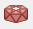

# Tehertípusok
<!-- wp:paragraph -->

A terhek modellezése a Terhek fülön elhelyezett funkciókkal történik. Minden elhelyezésre kerülő teher a legördülő menüből kiválasztott teheresethez fog tartozni.

<!-- /wp:paragraph -->

<!-- wp:image {"align":"center","id":35840,"width":489,"height":65,"sizeSlug":"full","linkDestination":"media"} -->

<!-- /wp:image -->

<!-- wp:image {"align":"right","id":35848,"width":358,"height":257,"sizeSlug":"full","linkDestination":"media","className":"is-style-editorskit-rounded"} -->

<!-- /wp:image -->

<!-- wp:heading {"level":3} -->

### Koncentrált teher ()

<!-- /wp:heading -->

<!-- wp:paragraph {"align":"justify"} -->

Koncentrált teher vonal és felület elemen bárhol elhelyezhető (előre definiált pontokra nincs szükség; végpontok és fogópontok egyaránt használhatók a terhek elhelyezésére).

<!-- /wp:paragraph -->

<!-- wp:paragraph -->

Koncentrált teher elhelyezhető **Globális (****)**, \***\*Lokális\*\*** **(****)** vagy **Felhasználói (**) koordinátarendszerek szerint.

<!-- /wp:paragraph -->

<!-- wp:paragraph {"align":"justify"} -->

A koncentrált teher esetében is alkalmazható külpontosság. A kiválasztott koordináta rendszer és az alkalmazott külpontosság hatása megegyezik a pontszerű támaszoknál bemutatottakkal (lásd 5.9.1 fejezet).

<!-- /wp:paragraph -->

<!-- wp:image {"align":"center","id":35856,"width":360,"height":304,"sizeSlug":"full","linkDestination":"media","className":"is-style-editorskit-rounded"} -->

<!-- /wp:image -->

<!-- wp:spacer {"height":"1px"} -->

<!-- /wp:spacer -->

<!-- wp:image {"align":"right","id":35864,"width":271,"height":376,"sizeSlug":"full","linkDestination":"media","className":"is-style-editorskit-rounded"} -->

<!-- /wp:image -->

<!-- wp:heading {"level":3} -->

### Vonalmenti megoszló teher ()

<!-- /wp:heading -->

<!-- wp:paragraph -->

Vonalmenti megoszló teher elhelyezhető egy meglévő vonalra (vonal elemen vagy felületi elem élén) vagy vonal rajzolásával (például egy felület elemen).

<!-- /wp:paragraph -->

<!-- wp:paragraph -->

Vonalmenti megoszló teher elhelyezhető **Globális (****)**, **(), **Lokális** (****), **Felhasználói** (****), **vagy **Globális vetületi rendszer** **(****)** koordinátarendszerek szerint.

<!-- /wp:paragraph -->

<!-- wp:paragraph {"align":"justify"} -->

Vonalmenti teher elhelyezhető a kiválasztás funkció () segítségével, a szerkezeti elemre kattintva, illetve egyidejűleg több rúdelemre is. Ehhez a Vonalmenti megoszló teher dialóg megnyitása előtt ki kell választani az elemeket, majd a Terhek elhelyezése () gombra kattintva elhelyezésre kerülnek a megadott terhek.

Az objektumok nem teljes hossza mentén ható, **részleges vonalmenti teher** felvételnek két módja van:

1. Az első lehetőség a rajzolás funkció. A rajzolás () ikonra kattintva a szerkezeti elemen megadható a vonalmenti teher kezdő és végpontja. A funkció használható egyenes és íves rudak esetén is a megfelelő rajzolási funkció kiválasztásával 

2\. A második lehetőség, a vonalmenti teher kezdő- és végpontja közti távolságának megadása a rúdelem végpontjaitól. A q1, q2 pozíciója beállítási lehetőség használatával a részleges vonalmenti teher 6 féle képen adható meg teljesen analóg módon a nyírási mezőnél megismertekkel. Például a q1 pozíciója megadható a rúd A és a B végétől is 3-3 féle képen:

A vonalmenti teher esetében is alkalmazható külpontosság. A kiválasztott koordináta rendszer és az alkalmazott külpontosság hatása megegyezik a pontszerű támasznál bemutatottakkal (lásd 5.9.1 fejezet).

Egy előzőleg már elhelyezett teher tulajdonságai beolvashatók a tulajdonságok funkció  kiválasztása után, a beolvasandó teherre kattintva.

#### Vonalmenti szélteher

Vonalmenti szélteher funkció, egy hatékony eszköz, amivel egyszerűen helyezhető el szélteher rúdelemeken. Szélteher egyszerűen felvehető az alapadatok megadásával. A hárompontos ikonok segítségével könnyen meghatározhatók a szükséges paraméterek.

A Vonalmenti megoszló teher elhelyezése funkció kiválasztása előtt, első lépésként ki kell választani azt a szerkezeti elemet, elemeket, amelyre a szélterhet szeretnénk elhelyezni.

A vonalmenti szélteherhez kapcsolódó funkciók a Vonalmenti megoszló teher dialóg Szélteher fülén találhatók.

Első lépésként a _Torlónyomás_ értékét kell megadni, vagy a három pontos ikonra () kattintva egy előzőleg létrehozott torlónyomás függvény is kiválasztható a legördülő menü segítségével, vagy a legördülő menü mellett található hárompontos ikonra () kattintva új torlónyomás függvény is létrehozható. A kiválasztott torlónyomás függvény felhasználásával kerül meghatározásra a megfelelő torlónyomás érték.

A jelölő négyzet bekapcsolásával a _Belső nyomás_ is figyelembe vehető. A belső nyomási tényező (cpi) megadható kézzel, vagy használható a Belső nyomás számítása funkció is, a három pontos ikonra kattintva ().

_Külső nyomás_ a hárompontos ikonra\_ () kattintva adható meg.

<!-- /wp:paragraph -->

<!-- wp:paragraph {"align":"justify"} -->

A _Belső nyomási tényezők_ számításához meg kell adni a teljes épület méreteit. Az épült méretei a _Globális szél paraméterek_ dialógon adhatók meg.

<!-- /wp:paragraph -->

<!-- wp:paragraph {"align":"justify"} -->

Az épület méretei mellett ezen a dialógon adható meg a fő szélirány iránya is, illetve itt adható meg a talajszint is, ha a modell legalsó pontja a valóságban nem a talaj szintjén lesz.

<!-- /wp:paragraph -->

<!-- wp:paragraph {"align":"justify"} -->

Következő lépésként ki kell választani valamelyik szabványos _Felület típust_ (fal, lapostető, nyeregtető stb.). A felület kiválasztása után a szükséges paraméterek betöltődnek a kiválasztott elem(ek)ről és az aktuális cpe értékek meghatározásra kerülnek.

<!-- /wp:paragraph -->

<!-- wp:paragraph -->

A vonalmenti szélteher meghatározáshoz meg kell adni a keret épületen belüli elhelyezkedését _A keret pozíciója_ megadásával, illetve a _Keretállás távolságot_.

<!-- /wp:paragraph -->

<!-- wp:paragraph {"align":"justify"} -->

Utolsó lépésként, ha szükséges ki kell választani a megfelelő vonalmenti szélteher esetet a Külső nyomási tényező dialóg alján található legördülő menüből.

<!-- /wp:paragraph -->

<!-- wp:paragraph -->

Az Rendben gomb megnyomásával létrejönnek a vonalmenti szélterhek.

<!-- /wp:paragraph -->

<!-- wp:paragraph -->

A Vonalmenti megoszló teher dialógon található Terhek elhelyezése () gomb megnyomásával a vonalmenti szélterhek elhelyezésre kerülnek az előzőleg kiválasztott szerkezeti elem(ek)re.

<!-- /wp:paragraph -->

<!-- wp:image {"align":"right","id":35904,"width":319,"height":170,"sizeSlug":"full","linkDestination":"media","className":"is-style-editorskit-rounded"} -->

<!-- /wp:image -->

<!-- wp:image {"align":"center","id":35912,"sizeSlug":"large","linkDestination":"media"} -->

<!-- /wp:image -->

<!-- wp:image {"align":"left","id":21420,"width":93,"height":99,"sizeSlug":"full","linkDestination":"none"} -->

<!-- /wp:image -->

<!-- wp:paragraph {"align":"justify"} -->

**FONTOS**: A megfelelő vonalmenti szélteher elhelyezéshez a használt lokális koordináta tengelyeknek (z tengely vagy y tengely) kifele kell mutatniuk az épületből

<!-- /wp:paragraph -->

<!-- wp:spacer {"height":"10px"} -->

<!-- /wp:spacer -->

<!-- wp:image {"align":"right","id":35921,"width":271,"height":363,"sizeSlug":"full","linkDestination":"media","className":"is-style-editorskit-rounded"} -->

<!-- /wp:image -->

<!-- wp:heading {"level":4} -->

#### Vonalmenti hóteher

<!-- /wp:heading -->

<!-- wp:paragraph {"align":"justify"} -->

Vonalmenti hóteher funkció, egy hatékony eszköz, amivel egyszerűen helyezhető el hóteher rúdelemeken. Hóteher egyszerűen felvehető az alapadatok megadásával.

<!-- /wp:paragraph -->

<!-- wp:paragraph -->

A Vonalmenti megoszló teher elhelyezése funkció kiválasztása előtt, első lépésként ki kell választani azt a szerkezeti elemet, elemeket, amelyre a hóterhet szeretnénk elhelyezni.

<!-- /wp:paragraph -->

<!-- wp:paragraph -->

A vonalmenti hóteherhez kapcsolódó funkciók a Vonalmenti megoszló teher dialóg Hóteher fülén találhatók.

<!-- /wp:paragraph -->

<!-- wp:paragraph -->

A hóteher paraméterek automatikusan betöltődnek az előzőleg kiválasztott EuroCode nemzeti mellékeltből, de az összes paraméter módosítható.

<!-- /wp:paragraph -->

<!-- wp:paragraph -->

Első lépésként az _Alaki tényezőt_ kell beállítani a hárompontos ikonra kattintva ().

<!-- /wp:paragraph -->

<!-- wp:paragraph {"align":"justify"} -->

Az alaki tényező meghatározásához a legördülő menüből ki kell választani a _Felület típusát_ (lapos tető, nyeregtető stb.) A felület kiválasztása után a szükséges paraméterek betöltődnek a kiválasztott elem(ek)ről és az aktuális alaki tényező meghatározásra kerül.

<!-- /wp:paragraph -->

<!-- wp:image {"align":"right","id":35929,"width":134,"height":228,"sizeSlug":"full","linkDestination":"media","className":"is-style-editorskit-rounded"} -->

<!-- /wp:image -->

<!-- wp:paragraph -->

Utolsó lépésként, ha szükséges ki kell választani a megfelelő vonalmenti hóteher esetet a Hóteher dialóg alján található legördülő menüből.

<!-- /wp:paragraph -->

<!-- wp:paragraph -->

Az Rendben gomb megnyomásával létrejönnek a vonalmenti hóterhek.

<!-- /wp:paragraph -->

<!-- wp:paragraph -->

A Vonalmenti megoszló teher dialógon található Terhek elhelyezése () gomb megnyomásával a vonalmenti hóterhek elhelyezésre kerülnek az előzőleg kiválasztott szerkezeti elem(ek)re.

<!-- /wp:paragraph -->

<!-- wp:spacer {"height":"1px"} -->

<!-- /wp:spacer -->

<!-- wp:heading {"level":3} -->

### Felület teher ()

Felület terhet háromféle módon lehet definiálni. Felületi nyomaték nem hozható létre.

1. **Egyenletes**en megoszló felület teher

6. **Lineáris**an változó felület teher

10. **Szélteher**

#### Egyenletesen megoszló felület teher megadása

A teher megadása a vonalmenti teher megadásához hasonlóan, kétféleképpen történhet.

A dialógon meg kell adni a teher intenzitását, majd a kiválasztás funkció () segítségével, a szerkezeti elem(ek)re kattintva a teher rákerül a kiválasztott felület(ek) egészére.

A felületet csak részlegesen terhelő teher esetében a rajzolás () funkciót kell választani. Ekkor aktívvá válik az utolsó 3 parancsikon, melyekkel négyszögletes, kör vagy poligon felületek rajzolása lehetséges.

<!-- /wp:paragraph -->

<!-- wp:columns {"verticalAlignment":"top","align":"wide"} -->

<!-- wp:column {"verticalAlignment":"top"} -->

<!-- wp:image {"align":"right","id":10071,"sizeSlug":"large","linkDestination":"media"} -->

<!-- /wp:image -->

<!-- /wp:column -->

<!-- wp:column {"verticalAlignment":"top"} -->

<!-- wp:image {"align":"center","id":10077,"sizeSlug":"full","linkDestination":"media"} -->

<!-- /wp:image -->

<!-- /wp:column -->

<!-- wp:column {"verticalAlignment":"top"} -->

<!-- wp:image {"align":"left","id":10083,"sizeSlug":"large","linkDestination":"media"} -->

<!-- /wp:image -->

<!-- /wp:column -->

<!-- /wp:columns -->

<!-- wp:paragraph {"align":"justify"} -->

A teher megadásához először ki kell jelölni a terhelendő felületet, majd a dialóg információs mezőjében adott instrukciók szerint, meg kell rajzolni a teher határoló éleit. Poligon teher esetében az utolsó sarokpont megadása után a jobb egérgombbal lehet befejezni a tehermegadást.

<!-- /wp:paragraph -->

<!-- wp:heading {"level":4} -->

#### Lineárisan változó felület teher megadása

Lineárisan változó felület teher definiálásához először a teher irányát kell megadni a dialóg legfelső sorában.

A teherintenzitás változásának megadása (tehereloszlás típusa) háromféle lehet:

- **Általános**: a teher intenzitását a felület 3 tetszőleges pontjában megadott intenzitás értékkel határozzuk meg, melyeket a dialógablak alsó részén (q1, q2, q3) kell megadni.

- **Lokális x-ben**: két pontot, és az azokhoz tartozó intenzitás értékeket kell megadni. A teher értéke a felület lokális x-tengelyével párhuzamosan változik.

- **Lokális y-ban**: az előzőhöz hasonlóan, de a lokális y-tengely mentén változó teher jön létre.

Az adatok beadása után a teher elhelyezéséhez először ki kell választani a felületet, majd a tehereloszlás típusától függően meg kell adni 2 vagy 3 pontot a felület tetszőleges helyén, mely pontokban érvényesek a korábban megadott intenzitás értékek.

Rajzolt () tehermegadás esetén, a felület kiválasztása után, először az előző pontban ismertetett módon meg kell rajzolni a felület terhelt részét, majd ezután kell megadni az intenzitás meghatározó pontokat.

#### Felületi szélteher megadása

<!-- /wp:heading -->

<!-- wp:paragraph -->

Felületi szélterhet jelenleg csak teherátadó felületre (ld. 6.4.4 fejezet) lehet definiálni. A felület szélteher definiálását a torlónyomás, valamint a külső és belső alaki tényezők megadásával kell kezdeni. Az egyes paraméterek dialógablakainak () leírását ld. a vonalmenti széltehernél (ld. 6.4.2.1 fejezet). A paraméterek beállítása után a terhet a kívánt felületet kijelölve lehet elhelyezni az adott felületen.

<!-- /wp:paragraph -->

<!-- wp:heading {"level":3} -->

### Teherátadó felület ()

Teherátadó felület egy speciális felület, ami a rajta elhelyezett felületi terheket osztja szét rudakra vonalmenti terhekként. Azokban az esetekben, ahol felületi terhet kell szétosztani rudakra, mint például hasznos teher vagy hóteher igen hatékonyan használható ez a funkció.

<!-- /wp:paragraph -->

<!-- wp:paragraph -->

A Terhek fülön található Teher átadó felület () ikonra kattintva az alábbi ablak jelenik meg:

<!-- /wp:paragraph -->

<!-- wp:image {"align":"right","id":35963,"width":366,"height":305,"sizeSlug":"full","linkDestination":"media"} -->

<!-- /wp:image -->

<!-- wp:paragraph {"align":"justify"} -->

Teherátadó felület rajzolási funkciói megegyeznek a síkidomok rajzolási funkcióival (téglalap, döntött téglalap, kör és zárt poligon rajzolása). A felület megrajzolása után megadható, hogy mely rudakra ossza szét a felület a felületi terhet. A felületi teher szétosztható csak a kijelölt elemekre, vagy az összes elemre, ami a teherátadó felület síkjában fekszik. Utóbbi esetben a megfelelő elemek kijelölésre kerülnek a modellben.

<!-- /wp:paragraph -->

<!-- wp:image {"align":"center","id":36351,"sizeSlug":"large","linkDestination":"media","className":"is-style-editorskit-rounded"} -->

<!-- /wp:image -->

<!-- wp:paragraph {"align":"justify"} -->

Az első opció kiválasztása esetén ki kell jelölni a modellben a felületi teher hordására szolgáló elemeket (a SHIFT + bal kattintással lehet elemeket eltávolítani a kijelölésből). A megfelelő elemek kiválasztása, majd a **Rendben **gomb megnyomása után létrejön a teherátadó felület.

<!-- /wp:paragraph -->

<!-- wp:paragraph {"align":"justify"} -->

Lehetőség van **teherátadó felületek csoportos elhelyezésé**re () is. Ekkor nem kell egyenként síkidom rajzolási funkcióval definiálni a felületeket. A kattintás után ki kell választani a megszokott ablakos kijelöléssel (balról jobbra vagy jobbról balra) mely rudakra akar teherátadó felületet definiálni. Fontos megjegyezni, hogy az egyedi teherátadó felületeket csak egy síkban lévő rúdelemek esetén lehet létrehozni (például 3 rúdelem által meghatározott háromszög).

<!-- /wp:paragraph -->

<!-- wp:image {"align":"center","id":35979,"width":768,"height":368,"sizeSlug":"large","linkDestination":"media","className":"is-style-editorskit-rounded"} -->

<!-- /wp:image -->

<!-- wp:paragraph {"align":"justify"} -->

A funkció nagy számítási igénye miatt egyszerre maximum 200 rúdelem kijelölése lehetséges (több rúdelem kijelölése esetén nem kerülnek létrehozásra a teherátadó felületek). Terhelendő rudak kiválasztásához vagy a kiválasztásból való kivételhez a rudakat a SHIFT billentyű lenyomása mellet kell kiválasztani a bal egérgombbal. A terhelendő rudak kiválasztása és az OK gomb megnyomása után a felület létrehozásra kerül.

<!-- /wp:paragraph -->

<!-- wp:paragraph -->

Felületi teher a teherátadó felületen a 6.4.3 fejezetben leírtak szerint helyezhető el.

<!-- /wp:paragraph -->

<!-- wp:paragraph -->

Teherátadó felületre elhelyezett terheknek két megjelenítési opciója van: felületi teher nézet és a szétosztott felületi teher nézet.

<!-- /wp:paragraph -->

<!-- wp:columns -->

<!-- wp:column -->

<!-- wp:image {"align":"center","id":10115,"width":479,"height":278,"sizeSlug":"full","linkDestination":"media"} -->

<!-- /wp:image -->

<!-- /wp:column -->

<!-- wp:column -->

<!-- wp:image {"align":"center","id":10121,"width":501,"height":278,"sizeSlug":"full","linkDestination":"media"} -->

<!-- /wp:image -->

<!-- /wp:column -->

<!-- /wp:columns -->

<!-- wp:paragraph -->

A nézetek között a grafikus szimbólumok láthatósága opció Szétosztott felületi teher gombjával lehet váltani.

<!-- /wp:paragraph -->

<!-- wp:image {"align":"center","id":10127,"sizeSlug":"full","linkDestination":"media"} -->

<!-- /wp:image -->

<!-- wp:paragraph -->

Felületi teher szétosztása két módszer szerint történhet:

<!-- /wp:paragraph -->

<!-- wp:image {"align":"right","id":35987,"width":329,"height":131,"sizeSlug":"full","linkDestination":"media","className":"is-style-editorskit-rounded"} -->

<!-- /wp:image -->

<!-- wp:paragraph -->

(1) Felületi teher szétosztása egyenletes vonalmenti teherré módszer az alábbiak figyelembevételével osztja szét a terhet:

- a vonalmenti terhek eredője megegyezik az eredeti felületi teher eredőjével

- a vonalmenti terhek állandóak az összes terhelt rúdelemen

(2) Felületi teher szétosztása szerkezeti pontok alapján módszer az alábbiak szerint osztja szét a terhet:

1. első lépésként a felületi teher a kiválasztott szerkezeti pontokba kerül koncentrálásra a Delaunay háromszögelési módszer használatával

6. következő lépésként a koncentrált terhek vonalmenti terhekké alakítása a kiválasztott elemekre a következő eljárások alapján:

- a vonalmenti terhek eredője megegyezik az eredeti felületi teher eredőjével

- a vonalmenti terhek lineárisan változók az összes terhelt rúdelemen

- a kiválasztott elemek metszéspontjaiban, a vonalmenti terhek végein, a teherintenzitások megegyeznek

A teherátadó felület működés módja a következő:

Első lépésként létre kell hozni a teherátadó felületet, majd ki kell választani a terhelendő elemeket. A terhelendő elemek kiválaszthatók egyénileg vagy az alapbeállítást változatlanul hagyva a szétosztás megtörténik az összes elemre, ami a teherátadó felület síkjában fekszik. Következő lépésként a felületi terhet kell elhelyezni a teherátadó felületen, ahol szükséges.

**Consteel 17-től** kezdve a felületi terhek elosztása a kiválasztott rúdelemekre még mindig automatikusan történik, de a létrehozott Szétosztott vonalmenti terheket egyenként ki lehet választani. Kiválasztva, a tulajdonságok (érték, külpontosság stb.) láthatóak, de nem szerkeszthetőek. Az összes Szétosztott vonalmenti teher kapcsolódik ahhoz a felületi teherhez, amelyből létrejött. A felhasználók szerkeszthetik a vonalmenti megoszló terhek tulajdonságait, miután leválasztották azokat a felületi teherből.

Ha kézzel helyezett felületi teherről van szó, felrobbantáshoz válassza ki a terhet, majd menjen az Objektum tulajdonságok ablakra → Vonalmenti teher→ Kapcsolódó felületi teher→ kattintson a piros X gombra. .

<!-- /wp:image -->

<!-- wp:image {"id":73263,"width":"618px","height":"auto","sizeSlug":"full","linkDestination":"none"} -->

<!-- /wp:image -->

<!-- wp:paragraph -->

A felületi teher felbontása után a következő figyelmeztetés jelenik meg:

<!-- /wp:paragraph -->

<!-- wp:image {"id":73273,"width":"382px","height":"auto","sizeSlug":"full","linkDestination":"none"} -->

<!-- /wp:image -->

<!-- wp:paragraph -->

Az generált meteorológiai felületi terhek esetén a felületi teher felbontásához, miután kiválasztották, a láthatóságoknál a "Szétosztott felületi teher" opciót kell választani. Ezután ugyanúgy járjon el, mint az előző esetben.

<!-- /wp:paragraph -->

<!-- wp:image {"id":73283,"width":"563px","height":"auto","sizeSlug":"full","linkDestination":"none"} -->

<!-- /wp:image -->

<!-- wp:paragraph -->

Ebben az esetben a következő figyelmeztetés jelenik meg:

<!-- /wp:paragraph -->

<!-- wp:image {"id":73293,"width":"381px","height":"auto","sizeSlug":"full","linkDestination":"none"} -->

<!-- /wp:image -->

<!-- wp:paragraph -->

A felületi terhek felbontása nem visszafordítható.

<!-- /wp:paragraph -->

<!-- wp:paragraph -->

A felületi terhek automatikus szétosztása ideiglenesen kikapcsolható a modellezés felgyorsítása érdekében. További információkért látogasson el az "Opciók" menübe.

<!-- /wp:paragraph -->

<!-- wp:heading {"level":4} -->

#### Teherátadó felület módosítása

<!-- /wp:heading -->

<!-- wp:paragraph {"align":"justify"} -->

A teherátadó felületek kijelölésével a beállítási paraméterek az Objektum tulajdonságok ablakban megváltoztathatók. A szétosztás módja könnyen átállítható síkbeli rudakról kijelölt rudakra. A kék pipa megnyomásával kiemelésre kerülnek a teherátadó felülethez hozzárendelt rudak.

<!-- /wp:paragraph -->

<!-- wp:image {"align":"center","id":35995,"width":230,"height":91,"sizeSlug":"full","linkDestination":"media","className":"is-style-editorskit-rounded"} -->

<!-- /wp:image -->

<!-- wp:paragraph {"align":"justify"} -->

Ha hozzárendelésnél a kijelölt rudak van kiválasztva, akkor a fekete nyíl megnyomásával megtekinthetjük és módosíthatjuk (hozzáadhatunk és kivonhatunk) a hozzárendelt rudakat.

<!-- /wp:paragraph -->

<!-- wp:heading {"level":3} -->

### Hőteher ()

<!-- /wp:heading -->

<!-- wp:paragraph -->

Hőteher definiálható rudakon () és felületeken () egyaránt.

<!-- /wp:paragraph -->

<!-- wp:paragraph {"align":"justify"} -->

Első lépésként ki kell választani a hőteher típusát: a keresztmetszet magassága vagy a szélessége mentén változó hőteher. A típus kiválasztása után meg kell adni a hőmérsékleti paramétereket: építési hőmérséklet (referencia), valamint az alsó és a felső szál hőmérsékletét. A paraméterek megadása után, a hőteher elhelyezhető a rudakon vagy a felületeken, mint egy hagyományos teher.

<!-- /wp:paragraph -->

<!-- wp:image {"align":"left","id":36019,"width":390,"height":300,"sizeSlug":"full","linkDestination":"media","className":"is-style-editorskit-rounded"} -->

<!-- /wp:image -->

<!-- wp:image {"align":"right","id":36011,"width":390,"height":299,"sizeSlug":"full","linkDestination":"media","className":"is-style-editorskit-rounded"} -->

<!-- /wp:image -->

<!-- wp:spacer {"height":"10px"} -->

<!-- /wp:spacer -->

<!-- wp:image {"align":"center","id":36003,"width":365,"height":220,"sizeSlug":"full","linkDestination":"media","className":"is-style-editorskit-rounded"} -->

<!-- /wp:image -->

<!-- wp:heading {"level":3} -->

### Előírt elmozdulás ()

<!-- /wp:heading -->

<!-- wp:paragraph -->

Pont támaszokra megadható előírt elmozdulás, ami elhelyezhető a **Globális (****)**, vagy **Felhasználói (**) **koordinátarendszerek** szerint. Az elmozdulás megadható komponensekkel vagy vektorosan.

<!-- /wp:paragraph -->

<!-- wp:image {"align":"center","id":36036,"width":371,"height":158,"sizeSlug":"full","linkDestination":"media","className":"is-style-editorskit-rounded"} -->

<!-- /wp:image -->

<!-- wp:heading {"level":3} -->

### Hosszváltozás (), feszítőerő ()

<!-- /wp:heading -->

<!-- wp:paragraph -->

Szerkezeti elem eredeti hálózati hosszának változása, illetve kezdeti feszítőerő is megadható és elhelyezhető, mint teher.

<!-- /wp:paragraph -->

<!-- wp:image {"align":"left","id":21420,"width":48,"height":51,"sizeSlug":"full","linkDestination":"none"} -->

<!-- /wp:image -->

<!-- wp:paragraph -->

Fontos tudni, hogy a ténylegesen kialakuló elmozdulás és feszítőerő mindkét esetben a csatlakozó szerkezet aktuális merevségétől függ!

<!-- /wp:paragraph -->

<!-- wp:spacer {"height":"1px"} -->

<!-- /wp:spacer -->

<!-- wp:paragraph -->

A Hosszváltozás () funkció segítségével modellezhetjük az előfeszítés hatását. A megjelenő párbeszédablakban meg kell adni a kívánt hosszváltozás értékét, majd a modellen rákattintani azokra a rudakra, amelyeken ezt alkalmazni szeretnénk.

<!-- /wp:paragraph -->

<!-- wp:image {"align":"center","id":36036,"width":371,"height":158,"sizeSlug":"full","linkDestination":"media","className":"is-style-editorskit-rounded"} -->

<!-- /wp:image -->

<!-- wp:paragraph -->

A rúd végeihez csatlakozó szerkezeti részek merevségétől függ, hogy ez a hosszváltozás ténylegesen létre tud-e jönni, és mekkora mértékben. A legtöbb esetben a tényleges hosszváltozás nem a teher megadáskor beírt érték lesz, hanem annál kisebb. Szélső esetben, ha a csatlakozó részek „végtelen” merevek, akkor a tényleges elmozdulás „végtelen” kicsi lesz, és a rúdban nagy normálerő ébred. A másik szélső helyzetben pedig, ha a rúd végei szinte szabadon el tudnak mozdulni, a tényleges hosszváltozás a megadott érték lesz, és a rúdban zérus(hoz közelítő) normálerő keletkezik.

<!-- /wp:paragraph -->

<!-- wp:paragraph -->

A Feszítőerő () funkció segítségével rúdelemekre teherként megadható feszítőerő is. A megjelenő párbeszédablakban meg kell adni a kívánt feszítőerő értékét, majd a modellen rákattintani azokra a rudakra, amelyeken ezt alkalmazni szeretnénk.

<!-- /wp:paragraph -->

<!-- wp:image {"align":"center","id":36028,"width":359,"height":164,"sizeSlug":"full","linkDestination":"media","className":"is-style-editorskit-rounded"} -->

<!-- /wp:image -->

<!-- wp:paragraph -->

A Consteel, a megadott feszítőerőt a rúd merevségének megfelelő elmozdulás értékre számítja át, és ezt az elmozdulást vezeti át a modellre. A rúd végeihez csatlakozó szerkezeti részek merevségétől függ, hogy ez az elmozdulás ténylegesen létre tud-e jönni, és mekkora mértékben. Ettől függ, hogy a rúdban, a számítás lefuttatása után, mekkora lesz a tényleges normálerő, ami a legtöbb esetben nem a teher megadáskor beírt feszítőerő lesz, hanem annál kisebb. Szélső esetben, ha a csatlakozó részek „végtelen” merevek, akkor a tényleges elmozdulás „végtelen” kicsi lesz, és a rúdban ki tud alakulni a megadott feszítő erő. A másik szélső helyzetben pedig, ha a rúd végei szinte szabadon el tudnak mozdulni, a rúdban a tényleges feszítő erő a nullához közelít.

<!-- /wp:paragraph -->
