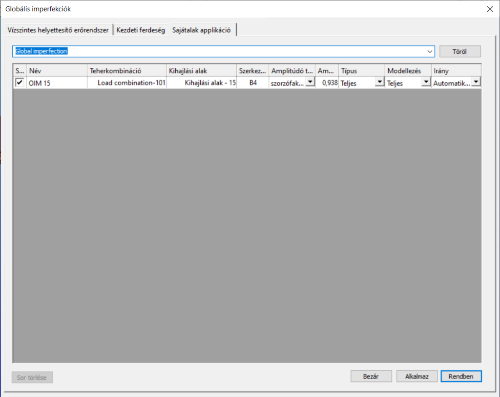

# Globális imperfekciók
<!-- wp:image {"align":"center","id":36054,"width":552,"height":82,"sizeSlug":"full","linkDestination":"media","className":"is-style-editorskit-rounded"} -->

<!-- /wp:image -->

<!-- wp:paragraph -->

Három fajta globális imperfekció alkalmazható a modellen a **Globális imperfekciók** () funkció segítségével. Számos globális imperfekció hozható létre, de egyszerre csak egy használható. A használt imperfekció az Analízis fül **_[Analízis paraméterek](../8_0_structural-analysis/8_3_analysis-settings.md#analízis-beállítások)_** dialógján választható ki.

<!-- /wp:paragraph -->

<!-- wp:image {"align":"right","id":36062,"width":288,"height":438,"sizeSlug":"full","linkDestination":"media","className":"is-style-editorskit-rounded"} -->

<!-- /wp:image -->

<!-- wp:heading {"level":3} -->

### Vízszintes helyettesítő erőrendszer

<!-- /wp:heading -->

<!-- wp:paragraph -->

Kezdeti ferdeség felvehető vízszintes helyettesítő erőrendszer használatával is.

<!-- /wp:paragraph -->

<!-- wp:paragraph {"align":"justify"} -->

A kiválasztott tehercsoportok alapján a vízszintes helyettesítő erőrendszer automatikusan előállításra kerül a kiválasztott teherkombinációkban. Az erőrendszer iránya meghatározható automatikusan a _Consteel_ által, vagy megadható minden egyes teherkombináció esetén.

<!-- /wp:paragraph -->

<!-- wp:paragraph {"align":"justify"} -->

_Szorzó tényező a helyettesítő terhek meghatározásához (Ni)_ kiválasztható a legördülő menüből, vagy megadható kézzel is.\_ A szorzótényező adja meg, hogy a kiválasztott terhek hány százaléka működjön, mint vízszintes helyettesítő erőrendszer. A tényező értéke 0 és 1 között változhat.

<!-- /wp:paragraph -->

<!-- wp:paragraph -->

Az **Alkalmaz** vagy a **Rendben** gomb megnyomásával létrehozható a definiált erőrendszer.

<!-- /wp:paragraph -->

<!-- wp:spacer {"height":"1px"} -->

<!-- /wp:spacer -->

<!-- wp:image {"align":"right","id":36070,"width":288,"height":438,"sizeSlug":"full","linkDestination":"media","className":"is-style-editorskit-rounded"} -->

<!-- /wp:image -->

<!-- wp:heading {"level":3} -->

### Kezdeti ferdeség

<!-- /wp:heading -->

<!-- wp:paragraph -->

Kezdeti ferdeség a teljes modellre adható meg.

<!-- /wp:paragraph -->

<!-- wp:paragraph -->

Az **Új** gomb megnyomásával tetszőleges számú kezdeti ferdeség hozható létre. Előzőleg létrehozott kezdeti ferdeség a **Töröl** gomb megnyomásával törölhető.

<!-- /wp:paragraph -->

<!-- wp:paragraph -->

Kezdeti ferdeség létrehozásához meg kell adni a ferdeség irányát, alapszint magasságát és a kezdeti ferdeség mértékét (1/Fi).

<!-- /wp:paragraph -->

<!-- wp:paragraph -->

Az **Alkalmaz** vagy a **Rendben** gomb megnyomásával létrehozható a definiált kezdeti ferdeség.

<!-- /wp:paragraph -->

<!-- wp:spacer {"height":"1px"} -->

<!-- /wp:spacer -->

<!-- wp:image {"align":"right","id":36078,"width":530,"height":354,"sizeSlug":"full","linkDestination":"media","className":"is-style-editorskit-rounded"} -->

<!-- /wp:image -->

<!-- wp:heading {"level":3} -->

### Sajátalak applikáció

<!-- /wp:heading -->

<!-- wp:paragraph {"align":"justify"} -->

Előzőleg már leszámolt kihajlási alakok is felvehetők, mint geometriai imperfekció. Egyszerre több kihajlási alak is egymásra halmozható és alkalmazható, mint egy imperfekció.

<!-- /wp:paragraph -->

<!-- wp:heading {"level":4} -->

#### Kihajlási sajátalak alkalmazása

<!-- /wp:heading -->

<!-- wp:paragraph -->

Kihajlási sajátalak alkalmazásához előzőleg le kell futtatni a stabilitás számítást.

<!-- /wp:paragraph -->

<!-- wp:paragraph -->

Az **Analízis** fül Kihajlás eredménynézet bármelyik meghatározott kihajlási alakja alkalmazható imperfekcióként.

<!-- /wp:paragraph -->

<!-- wp:paragraph {"align":"justify"} -->

A használni kívánt kihajlási alak kiválasztása után a grafikus felületen jobb egérgombbal kell kattintani, majd a megjelenő menün a _Sajátalak alkalmazása imperfekcióként_ menüpontot kell kiválasztani.

<!-- /wp:paragraph -->

<!-- wp:paragraph -->

A megjelenő ablakban az alábbi paramétereket lehet megadni:

<!-- /wp:paragraph -->

<!-- wp:image {"align":"right","id":36086,"width":233,"height":416,"sizeSlug":"full","linkDestination":"media","className":"is-style-editorskit-rounded"} -->

<!-- /wp:image -->

<!-- wp:list {"type":"I","className":"is-style-default"} -->

- _Imperfekciós csoport_: minden kiválasztott sajátalak egy imperfekciós csoportba fog kerülni, ami a legördítő menüből választható ki. Egy csoport tartalmazhat több sajátalakot is. Ebben az esetben a sajátalakok hatása összeadódik az analízis során. Az **Új csoport** gomb segítségével létrehozható új imperfekciós csoport is.
- _Imperfekció eset neve:_ egyedi név adható meg az imperfekciós esetnek

<!-- /wp:list -->

<!-- wp:list {"type":"I","className":"is-style-default"} -->

- _Imperfekció típusa:_

  - Teljes: imperfekció az össze teherkombinációban használva lesz
  - Lokális: az imperfekció csak abban a teherkombinációban lesz használva, amely a felhasznált kihajlási alakot okozta

- _Imperfekció modellezése:_

  - Teljes: kihajlási alak minden elmozdulási komponense alkalmazásra kerül a modellen (csomóponti eltolódás, elfordulás és öblösödés)
  - Csak eltolódás: csak a csomóponti elmozdulások kerülnek alkalmazásra

- _Amplitúdó előjele:_

  - Automatikus: imperfekció iránya minden egyes teherkombinációban a többi tehernek megfelelően kerül meghatározásra
  - Kézi: az imperfekció iránya a megadott amplitúdó előjelének megfelelően kerül meghatározásra

- _Amplitúdó típusa_:

  - _mm érték_: a kihajlási alak maximális elmozdulásának értéke adható meg mm-ben. A többi elmozdulási érték a megadott értékből kerül meghatározásra arányosítással
  - _szorzófaktor_: a számított elmozdulási értékek a megadott értékkel kerülnek felszorzásra

- _Amplitúdó értéke_: az előzőleg kiválasztott amplitúdó típusának értéke adható meg

<!-- /wp:list -->

<!-- wp:paragraph -->

A Rendben gomb megnyomásával a kiválasztott sajátalak kiválasztásra kerül imperfekcióként.

<!-- /wp:paragraph -->

<!-- wp:heading {"level":4} -->

#### Automatikus sajátalak amplitúdó meghatározás

<!-- /wp:heading -->

<!-- wp:paragraph -->

Imperfekció alkalmazása esetén állandó probléma a megfelelő (biztonságos, de egyben gazdaságos megoldást adó) amplitúdó meghatározása. EuroCode EN 1993-1-1 szabványban található néhány korlátozottan használható iránymutatás. Ezen iránymutatások, illetve saját fejlesztésű eljárások alapján a _Consteel_ automatikusan meg tudja határozni az imperfekció amplitúdóját. Erre három különböző módszer áll rendelkezésre. Az automatikus amplitúdó meghatározáshoz az _Amplitúdó értéke_ mező mellett található három pontos ikonra kell kattintani (), az előzőekben már bemutatott dialógon. Ekkor egy új párbeszédablak jelenik meg a három lehetséges amplitúdó számítási módszer használatához.

<!-- /wp:paragraph -->

<!-- wp:list -->

- _Ekvivalens kezdeti görbeség_

<!-- /wp:list -->

<!-- wp:image {"align":"right","id":36094,"sizeSlug":"full","linkDestination":"media","className":"is-style-editorskit-rounded"} -->

<!-- /wp:image -->

<!-- wp:paragraph {"align":"justify"} -->

Ennek az eljárásnak az EuroCode 1993-1-1 szabvány 5.3.2 (3)b táblázata az alapja, amelyben a kezdeti lokális görbeség tervezési értékei vannak meghatározva, kihajlási görbék szerint. Az amplitúdó meghatározásához meg kell adni az ekvivalens szerkezeti elemhosszt (ami nem feltétlenül egyenlő a szerkezeti elem tényleges hosszával). Ezek után a számított érték megjelenik a dialógon. Kifordulás esetén egy plusz tényezőt (k) is meg kell adni. Fontos megjegyezni, hogy ezek az értékek hivatalosan csak csuklósan megtámasztott, egyenes, állandó keresztmetszetű és egyenletes normálerővel vagy nyomatékkal terhelt szerkezeti elemre igaz. Más esetben a felhasználónak kell figyelembe vennie a kezdeti görbeség meghatározása során a speciális megtámasztás, geometria, illetve terhelés hatását. Végezetül a számított értéket (e0) a **Rendben** gomb megnyomásával lehet elfogadni, ami automatikusan beíródik az _Amplitúdó mértéke_ mezőbe.

<!-- /wp:paragraph -->

<!-- wp:list -->

- **Ekvivalens imperfekció a rugalmas stabilitásvesztési alak alapján**

<!-- /wp:list -->

<!-- wp:image {"align":"right","id":36119,"width":311,"height":306,"sizeSlug":"full","linkDestination":"media","className":"is-style-editorskit-rounded"} -->

<!-- /wp:image -->

<!-- wp:paragraph {"align":"justify"} -->

Ez az eljárás az EuroCode 5.3.2 (11) pontjában található előírásokon alapszik. Mivel ezek az iránymutatások erősen kötődnek a szerkezeti elem paramétereihez (keresztmetszet típusa, alakja, tulajdonságai, kihajlási görbéje stb.), ezért első lépésként ki kell jelölni a referencia elemet, amely alkalmas lehet az amplitúdó meghatározásához. Ehhez a _Sajátalak alkalmazása imperfekcióként_ parancsot az alkalmasnak talált referencia elemen történő jobb egér gomb kattintással kell kiválasztani a megjelenő menüből. A funkció neve mögött ilyenkor zárójelben megjelenik a kiválasztott elem neve is. A kiválasztott elemnek dominánsnak kell lennie a kihajlási sajátalakban.

<!-- /wp:paragraph -->

<!-- wp:paragraph -->

Az eljárás teljesen automatikusan számítja az amplitúdó értékét a kiválasztott kihajlási tengely alapján, az alábbi lépések szerint:

<!-- /wp:paragraph -->

<!-- wp:image {"align":"right","id":36111,"width":312,"height":203,"sizeSlug":"full","linkDestination":"media","className":"is-style-editorskit-rounded"} -->

<!-- /wp:image -->

<!-- wp:list {"ordered":true,"type":"1","className":"is-style-default"} -->

1. Igénybevételek meghatározása a szerkezeti elem végeselem pontjaiban a kiválasztott kihajlási alakkal megegyező deformált alakból

2. Kritikus hely meghatározása, ahol a legnagyobb a megfelelő hajlító (1. pontban meghatározott My vagy Mz) nyomaték

3. Az alábbi információk kiolvasása a kritikus pontból:

   - Normálerő értéke \[NEd] elsőrendű analízis alapján (imperfekciók nélkül) – normálerőnek nyomásnak kell lennie
   - Megfelelő hajlító nyomaték értéke \[My vagy Mz, továbbiakban MII-vel jelöli a szoftver. A szabványban EIhcr,max -nel jelölik]
   - Keresztmetszet tulajdonságai \[nyomás szerinti osztályozás, folyási határfeszültség, megfelelő keresztmetszeti modulus (Wy vagy Wz), megfelelő kihajlási görbe]

<!-- /wp:list -->

<!-- wp:paragraph {"align":"justify"} -->

Végezetül a számított értéket (hinit,max) a **Rendben** gomb megnyomásával lehet elfogadni, ami automatikusan beíródik az _Amplitúdó mértéke_ mezőbe. Fontos megjegyezni, hogy ez az előjárás csak nyomott szerkezeti elemek (tetszőleges megtámasztással) kihajlási problémájára ad megoldást.

<!-- /wp:paragraph -->

<!-- wp:image {"align":"right","id":36103,"width":283,"height":477,"sizeSlug":"full","linkDestination":"media","className":"is-style-editorskit-rounded"} -->

<!-- /wp:image -->

<!-- wp:list -->

- _Egyenértékű tökéletlenség módszere (Overall Imperfection Method, OIM)_

<!-- /wp:list -->

<!-- wp:paragraph {"align":"justify"} -->

A Consteel új, saját fejlesztésű módszere az imperfekció amplitúdójának automatikus meghatározására, teljes összhangban az Eurocode előírásaival. A módszer által meghatározott amplitúdóval skálázott imperfekciós másodrendű analízis és keresztmetszet méretezés ugyan azt a kihasználtság eredményt adja, mint a hagyományos teherbírási csökkentő tényezős méretezés. A Consteel-ben kifejlesztett új módszer a koncentrált erővel terhelt, prizmatikus, csuklós nyomott rúd egyszerű esetének a teljesen általánosított megoldása, amely bármilyen, nem egyenletes terhelésű, akár változó keresztmetszetű, külpontosan terhelt, és tetszőleges megtámasztású elemekre is használható, és teljesen összhangban van a szabvánnyal. Az egyszerű nyomott oszlop estében például az eredmény 100%-ban megegyezik a csökkentő tényezős módszer eredményével.

<!-- /wp:paragraph -->

<!-- wp:spacer {"height":"1px"} -->

<!-- /wp:spacer -->

<!-- wp:heading {"level":4} -->

#### Sajátalakok kezelése

<!-- /wp:heading -->

<!-- wp:paragraph {"align":"justify"} -->

A már létrehozott imperfekciós csoportok és az azokban lévő, alkalmazott sajátalakok a **Globális imperfekciók** dialóg **Sajátalak applikáció** fülén tekinthetők meg és szerkeszthetők.

<!-- /wp:paragraph -->

<!-- wp:paragraph -->

A felső legördítő menüből választható ki az imperfekciós csoport. A **Töröl** gombbal az egész csoport törölhető, beleértve az alkalmazott sajátalakokat is.

<!-- /wp:paragraph -->

<!-- wp:paragraph {"align":"justify"} -->

A dialóg középső részén látható(ak) a kiválasztott imperfekciós csoportban lévő imperfekciós esetek (alkalmazott sajátalakok). Az első oszlopban található jelölő négyzetekkel minden egyes imperfekció eset ki- és bekapcsolhatók. A táblázat többi oszlopában a beállított paraméterek láthatók és módosíthatók.

<!-- /wp:paragraph -->

<!-- wp:paragraph -->

A **Sor törlése** gomb segítségével a kijelölt imperfekciós esetek törölhetők.

<!-- /wp:paragraph -->

<!-- wp:image {"align":"center","id":36128,"width":512,"height":407,"sizeSlug":"large","linkDestination":"media","className":"is-style-editorskit-rounded"} -->

