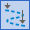
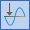
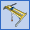
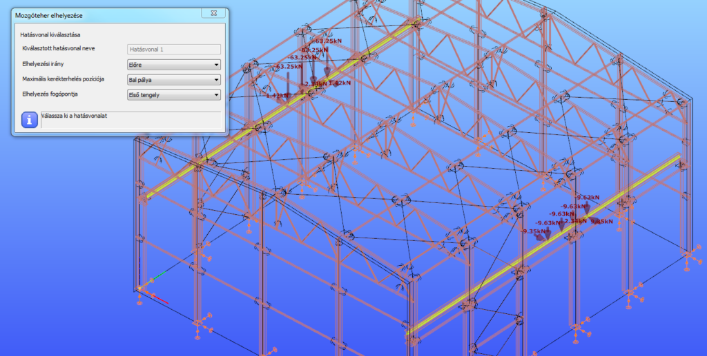
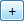
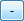

# Mozgó teher
<!-- wp:paragraph -->

A funkció segítségével, EuroCode alapú vagy teljesen felhasználó által definiált daru és vonatteher hozható létre és helyezhető a modellen kézzel, tetszőleges helyre, vagy hatásábra leterhelésével a mértékadó pozícióba.

<!-- /wp:paragraph -->

<!-- wp:image {"align":"center","id":36170,"sizeSlug":"full","linkDestination":"media","className":"caption-align-center is-style-editorskit-rounded","captionAlignment":"center"} -->

<!-- /wp:image -->

<!-- wp:heading {"level":3} -->
### Hatásvonal ()

<!-- /wp:heading -->

<!-- wp:image {"align":"right","id":36162,"width":383,"height":203,"sizeSlug":"full","linkDestination":"media","className":"is-style-editorskit-rounded"} -->

<!-- /wp:image -->

<!-- wp:paragraph -->

Mozgóteher elhelyezéséhez, vagy hatásábra számításához először létre kell hozni Hatásvonalat, azokon a szerkezeti elemeken, ahova a terhet szeretnénk elhelyezni, vagy az egységteher fog mozogni.

<!-- /wp:paragraph -->

<!-- wp:paragraph -->

Azon szerkezeti elemeken helyezhető el hatásábra, amelyek egy vonalban fekszenek és kapcsolódnak egymáshoz.

<!-- /wp:paragraph -->

<!-- wp:paragraph -->

Hatásvonal létrehozható a **kiválasztással** () vagy **rajzolással** ().

<!-- /wp:paragraph -->

<!-- wp:paragraph -->

Kiválasztás esetén az összes szerkezeti elemet ki kell választani a bal egérgombbal való kattintással, amire el szeretnénk helyezni a Hatásvonalat. A kiválasztás végén a jobb egérgombbal való kattintással fejezhető be a művelet.

<!-- /wp:paragraph -->

<!-- wp:paragraph -->

Rajzolás esetén a Hatásvonal kezdő és végpontját kell lebökni a modellben. A Hatásvonal létrehozásra kerül az összes olyan szerkezeti elemen, amely a rajzolt vonal alá esik.

<!-- /wp:paragraph -->

<!-- wp:paragraph -->

Kettős hatásvonal is létrehozható a jelölőnégyzet bekattintásával.

<!-- /wp:paragraph -->

<!-- wp:heading {"level":3} -->

### Hatásábra ()

<!-- /wp:heading -->

<!-- wp:image {"align":"right","id":36154,"width":284,"height":471,"sizeSlug":"full","linkDestination":"media","className":"is-style-editorskit-rounded"} -->

<!-- /wp:image -->

<!-- wp:paragraph -->

Hatásábra analízis futtatásához, először meg kell adni az Hatásábra paramétereket.

<!-- /wp:paragraph -->

<!-- wp:paragraph -->

(#1) A megjelenő dialógon első lépésként ki kell választani a legördülő menüből egy előzőleg létrehozott hatásvonal. Ha még nincs létrehozva hatásvonal, vagy egy ujjat szeretnénk létrehozni, akkor a három pontos () ikonra kattintva ez megtehető.

<!-- /wp:paragraph -->

<!-- wp:paragraph -->

(#2) Következő lépésként a vizsgálat helyét kell kiválasztani a modellen kiválasztó () funkció segítségével. (_A Consteel aktuális verziójában jelenleg még csak a modell egy tetszőleges keresztmetszete választható ki vizsgálati helynek, a másik két opció még további fejlesztést igénylenek._)

<!-- /wp:paragraph -->

<!-- wp:paragraph -->

(#3) Három fajta hatásábra választható:

<!-- /wp:paragraph -->

<!-- wp:list -->

- Elmozdulás

  - Lokális x, y és z tengely irányú elmozdulás

  - Lokális x, y és z tengelyek körüli elfordulás

- Igénybevétel

  - Erős (My) és gyenge (Mz) tengely körüli hajlítás

  - Normálerő (N)

  - Erős (Vy) és gyenge (Vz) tengely irányú nyírás

  - Csavarás (T)

  - Bimoment (B)

- Reakcióerő

  - Globális X, Y és Z tengely irányú reakcióerő

  - Globális X, Y és Z tengely körüli reakció nyomaték

<!-- /wp:list -->

<!-- wp:paragraph -->

Utolsó lépésként az egységerő irányát kell kiválasztani. Egyszerre több irány is megadható, de minden irányhoz külön hatásábra fog tartozni.

<!-- /wp:paragraph -->

<!-- wp:paragraph -->

Az **Alkalmaz** gombra kattintva a beállítások elmentődnek.

<!-- /wp:paragraph -->

<!-- wp:paragraph -->

Az **Új** gombra kattintva létrehozható másik hatásábra is.

<!-- /wp:paragraph -->

<!-- wp:heading {"level":4} -->

#### Hatásábrák kezelése

<!-- /wp:heading -->

<!-- wp:paragraph -->

A létrehozott hatásábra beállításokat a dialóg felső, táblázatos (#4) részében lehet megtekinteni és módosítani.

<!-- /wp:paragraph -->

<!-- wp:paragraph -->

A kiválasztott hatásábra bármely paramétere változtatható és az **Alkalmaz** gombbal elmenthető.

<!-- /wp:paragraph -->

<!-- wp:paragraph -->

A **Töröl** gomb megnyomásával a kiválasztott hatásábra beállítás eltávolítható.

<!-- /wp:paragraph -->

<!-- wp:paragraph -->

A _Számítás_ oszlopban található jelölőnégyzetek segítésével hatásábra ki- és bekapcsolható az analízis számára.

<!-- /wp:paragraph -->

<!-- wp:heading {"level":4} -->

#### Hatásábrák számítása

<!-- /wp:heading -->

<!-- wp:paragraph -->

Hatásábra analízis futtatását lásd a _**[8.3 Analízis beállítások](../8_0_structural-analysis/8_3_analysis-settings.md)**_ fejezetben

<!-- /wp:paragraph -->

<!-- wp:heading {"level":3} -->

### Daruteher ()

<!-- /wp:heading -->

<!-- wp:paragraph -->

Három típusú fel híddaru definiálható a programban:

<!-- /wp:paragraph -->

<!-- wp:list -->

- Szabványos: teljesen EuroCode EN 1991-3 alapú
- Szabványos teher alapú: EN 1991-3 szabvány által definiált kerékterheket kell megadni. A szükséges tehercsoportokat a Consteel előállítja
- Egyéni: közvetlen kerékterheléseket kell megadni minden egyes kerék esetében

<!-- /wp:list -->

<!-- wp:image {"align":"center","id":36179,"sizeSlug":"full","linkDestination":"media","className":"is-style-editorskit-rounded"} -->

<!-- /wp:image -->

<!-- wp:heading {"level":4} -->

#### Szabványos

<!-- /wp:heading -->

<!-- wp:image {"align":"right","id":36146,"width":306,"height":448,"sizeSlug":"full","linkDestination":"media","className":"is-style-editorskit-rounded"} -->

<!-- /wp:image -->

<!-- wp:paragraph -->

A teljesen EuroCode EN 1991-3 alapú daruteherhez a geometriai paramétereket (#1), a terhelést (#2) és a meghajtási adatokat (#3) kell megadni. A paraméterek megadása után a kerékterhelések automatikusan számítódnak.

<!-- /wp:paragraph -->

<!-- wp:paragraph -->

Az alábbi geometriai paraméterek (#1) megadása szükséges:

<!-- /wp:paragraph -->

<!-- wp:list -->

- Daruhíd fesztávolsága – L \[m]
- Minimum futómacska távolság – emin \[m]: futómacska és a darupálya tartó közötti lehetséges legkisebb távolság
- Tengelyek száma: a daruhíd tengelyeinek a száma választható ki a legördülő menüből. A tengelyek száma 2 és 10 között lehetnek. A tengelyek közötti távolságot a táblázat módosításával lehet megadni

<!-- /wp:list -->

<!-- wp:paragraph -->

A terhelési adatoknál (#2) meg kell adni a daruhíd önsúlyt (Qc1), a futómacska önsúlyt (Qc2) és az emelt súlyt (Qh) is. A Dinamikus tényezők gomb megnyomásával a dinamikus tényezők alapértékei megtekinthetők és módosíthatók.

<!-- /wp:paragraph -->

<!-- wp:paragraph -->

A fenti paramétereken túl még meg kell adni a meghajtási adatokat (#3) is:

<!-- /wp:paragraph -->

<!-- wp:list -->

- Kerék meghajtás: meg kell adni a meghajtott kerekek számát és a kerékmeghajtás típusát (központi vagy egyedi)
- Daru rendszer: a legördítő menüből ki kell választani a megfelelő EuroCode-os darurendszert. A darurendszerek definícióját lásd az EN 1991-3 szabvány megfelelő fejezetében
- Súrlódási tényező: meg kell adni a sín és a daru kereke közötti súrlódási tényezőt
- Megvezető eszköz: kétfajta megvezető eszköz közül lehet választani: karimás kerék és megvezető csap. A választott eszköznek megfelelően meg kell adni a szükséges geometriai paramétereket

<!-- /wp:list -->

<!-- wp:paragraph -->

Az automatikusan előállított kerékterhelések a dialóg alján található táblázatban (#4) megtekinthetők. A tehereset a legördülő menü segítségével változtatható.

<!-- /wp:paragraph -->

<!-- wp:image {"align":"right","id":36138,"width":324,"height":443,"sizeSlug":"full","linkDestination":"media","className":"is-style-editorskit-rounded"} -->

<!-- /wp:image -->

<!-- wp:paragraph -->

A kerekek nevében az első tag a tengely számát, míg a második a kerék számát jelöli.

<!-- /wp:paragraph -->

<!-- wp:heading {"level":4} -->

#### Szabványos teher alapú

<!-- /wp:heading -->

<!-- wp:paragraph -->

A szabványos teher alapú daruteher esetén a daru tengelyeinek a számát és az egyes szabványos kerékterheket kell megadni.

<!-- /wp:paragraph -->

<!-- wp:paragraph -->

A geometriai adatok (#1) mezőben a daruhíd tengelyeinek a száma választható ki a legördülő menüből. A tengelyek száma 2 és 10 között lehetnek. A tengelyek közötti távolságot a táblázat módosításával lehet megadni.

<!-- /wp:paragraph -->

<!-- wp:paragraph -->

A második mezőben (#2) az EuroCode alapú kerék terheket kell megadni minden egyes kerék esetén. A Dinamikus tényezők gomb megnyomásával a dinamikus tényezők alapértékei megtekinthetők és módosíthatók.

<!-- /wp:paragraph -->

<!-- wp:paragraph -->

Az automatikusan előállított kerékterhelések a dialóg alján található táblázatban (#3) megtekinthetők. A tehereset a legördülő menü segítségével változtatható.

<!-- /wp:paragraph -->

<!-- wp:paragraph -->

A kerekek nevében az első tag a tengely számát, míg a második a kerék számát jelöli.

<!-- /wp:paragraph -->

<!-- wp:heading {"level":4} -->

#### Egyéni daruteher

<!-- /wp:heading -->

<!-- wp:image {"align":"right","id":36187,"width":297,"height":238,"sizeSlug":"full","linkDestination":"media","className":"is-style-editorskit-rounded"} -->

<!-- /wp:image -->

<!-- wp:paragraph -->

Egyéni daruteher esetén az alábbi paraméterek megadása szükséges:

<!-- /wp:paragraph -->

<!-- wp:list -->

- Tengelyek száma: a daruhíd tengelyeinek a száma választható ki a legördülő menüből. A tengelyek száma 2 és 10 között lehetnek. A tengelyek közötti távolságot a táblázat módosításával lehet megadni
- Kerékterhelések három irányú (Fx, Fy és Fz) komponense minden egyes kerék esetében

<!-- /wp:list -->

<!-- wp:heading {"level":4} -->

#### Daruteher elhelyezése

<!-- /wp:heading -->

<!-- wp:paragraph -->

Daruteher kétféle képen helyezhető el a modellen, de mindenekelőtt az **Alkalmaz** gombra kattintva a létrehozott daruterhet el kell menteni.

<!-- /wp:paragraph -->

<!-- wp:image {"align":"right","id":36195,"width":768,"height":388,"sizeSlug":"large","linkDestination":"media","className":"is-style-editorskit-rounded"} -->

<!-- /wp:image -->

<!-- wp:paragraph {"style":{"typography":{"fontSize":18}}} -->

**Kézi daruteher elhelyezés**

<!-- /wp:paragraph -->

<!-- wp:paragraph -->

A Daruteher dialóg alján található Teher elhelyezése gomb segítségével a kiválasztott daru tehereset kézzel elhelyezhető a modellen.

<!-- /wp:paragraph -->

<!-- wp:paragraph -->

Első lépésként ki kell választani a bal egérgombbal a hatásvonalat, amire a terhet el szeretnénk helyezni. A kiválasztás után a bal egérgombbal lehelyezhető a daruteher a hatásvonal mentén.

<!-- /wp:paragraph -->

<!-- wp:paragraph -->

Az elhelyezés iránya, a maximális kerékterhelés pozíciója és az elhelyezés fogópontja kiválasztható a legördülő menük segítségével.

<!-- /wp:paragraph -->

<!-- wp:spacer {"height":"1px"} -->

<!-- /wp:spacer -->

<!-- wp:image {"align":"right","id":36204,"width":490,"height":294,"sizeSlug":"full","linkDestination":"media","className":"is-style-editorskit-rounded"} -->

<!-- /wp:image -->

<!-- wp:paragraph {"style":{"typography":{"fontSize":18}}} -->

**Daruteher elhelyezése hatásábra leterhelésével**

<!-- /wp:paragraph -->

<!-- wp:paragraph -->

Daruteher hatásábra leterhelésével is elhelyezhető a modellen.

<!-- /wp:paragraph -->

<!-- wp:paragraph -->

Hatásábra analízis futtatását lásd a **Meteorológiai terhek** és a **Szerkezet analízis** fejezetben!

<!-- /wp:paragraph -->

<!-- wp:paragraph -->

Hatásábra leterhelésével való daruteher elhelyezéshez, az **Analízis** fülön a _Hatásábra analízis_ típust kell választani. A leterhelendő hatásábra kiválasztása után a grafikus felületre jobb egérgombbal kell kattintani és megjelenő menüből a **Hatásábra leterhelése** menüpontot kell kiválasztani.

<!-- /wp:paragraph -->

<!-- wp:image {"align":"left","id":36212,"width":317,"height":317,"sizeSlug":"full","linkDestination":"media","className":"is-style-editorskit-rounded"} -->

<!-- /wp:image -->

<!-- wp:paragraph -->

A _Mozgóteher_ mezőben (#1) a terhelés tulajdonságait lehet beállítani:

<!-- /wp:paragraph -->

<!-- wp:list {"type":"A"} -->

- Az első legördülő menüből lehet kiválasztani az elhelyezni kívánt daruterhet
- Tehercsoport: szabványos és szabványos teher alapú daruteher esetén, a tehercsoportok automatikusan előállítódnak. Hatásábra leterhelhető valamelyik kiválasztott tehercsoporttal, vagy az _Automatikus_ funkció használatával a mértékadó esettel
- Maximális kerékterhelés pozíciója: függőleges kerékterhelés függ a futómacska pozíciójától. A maximális függőleges kerékterhelés lehet a jobb vagy a balpályán, vagy az _Automatikus_ funkció használatával a mértékadó állásban

<!-- /wp:list -->

<!-- wp:paragraph -->

A _Leterhelés mezőben_ (#2) található **Pozitív tartomány** és **Negatív tartomány** gombok segítségével a hatásábra leterhelhető. **Pozitív tartomány** használata esetén a leterhelés a maximális pozitív értéket fogja adni a keresztmetszetben, **Negatív tartomány** használata esetén a maximális negatívot. A terhelés pozíciója megjelenik a grafikus felületen, a leterhelés okozta maximális érték pedig a dialógon.

<!-- /wp:paragraph -->

<!-- wp:paragraph -->

Az elhelyezett teher elmenthető valamelyik teheresetbe, a _Teherállás mentése_ (#3) mező funkciónak a segítségével. A legördülő menüből kiválasztható valamelyik már létrehozott tehereset, vagy a három pontos ikonra kattintva létrehozható egy új eset. A **Mentés** gombra kattintva az elhelyezett teher elmenthető a kiválasztott teheresetbe.

<!-- /wp:paragraph -->

<!-- wp:image {"align":"right","id":36221,"width":360,"height":494,"sizeSlug":"full","linkDestination":"media","className":"is-style-editorskit-rounded"} -->

<!-- /wp:image -->

<!-- wp:heading {"level":3} -->

### Vonatteher ()

<!-- /wp:heading -->

<!-- wp:paragraph -->

Két fajta vonatteher hozható létre.

<!-- /wp:paragraph -->

<!-- wp:paragraph {"style":{"typography":{"fontSize":18}}} -->

**Szabványos vonatteher**

<!-- /wp:paragraph -->

<!-- wp:paragraph -->

A legördülő menüből kiválasztható három, előre definiált EuroCode szabvány szerinti vonatteher. A teher paraméterei megtekinthetők a lenti táblázatokban.

<!-- /wp:paragraph -->

<!-- wp:paragraph {"style":{"typography":{"fontSize":18}}} -->

**Egyéni vonatteher**

<!-- /wp:paragraph -->

<!-- wp:paragraph -->

_Egyéni_ esetben a koncentrált és a megoszló terhek táblázata szerkeszthető. A és agombok segítségével egy új sor adható hozzá, illetve vonható ki a táblázatokból.

<!-- /wp:paragraph -->

<!-- wp:paragraph -->

Koncentrált teher esetén a teher három komponensét és a pozícióját kell megadni.

<!-- /wp:paragraph -->

<!-- wp:paragraph -->

Megoszló teher esetén a kezdő és végponti intenzitás három komponensét, illetve a kezdő és a végpont pozícióját kell megadni.

<!-- /wp:paragraph -->

<!-- wp:paragraph -->

Vonatteher elhelyezése megegyezik a daruteher darutehernél bemutatottakkal (lásd **Meteorológiai terhek** fejezetet).

<!-- /wp:paragraph -->
