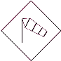

# Meteorological loads

All of the meteorological load generator-related functions (_**[Meteorological surface](#Meteorological-surfaces)**_ , **[Meteorological load generator](#Meteorological-load-generator)** ) can be found on the **Loads **tab.

<!-- /wp:paragraph -->

<!-- wp:paragraph -->

Meteorological load generator can generate wind and snow load for the most common type of structures according to the following standards:

<!-- /wp:paragraph -->

<!-- wp:list -->

- Wind

  - EuroCode 1 (EN 1991-4)

  - Spanish standard (SE-AE)

- Snow

  - EuroCode 1 (EN 1991-3)

<!-- /wp:list -->

<!-- wp:image {"align":"left","id":6758,"width":88,"height":93,"sizeSlug":"large","linkDestination":"none"} -->

<!-- /wp:image -->

<!-- wp:paragraph -->

**IMPORTANT NOTE**: Heights of the structure (h) for generating wind loads are calculated from the global z=0 level. therefore the structural model has to be placed to its real height in the modeling area measured from the global z=0 level. For example, the lowest edge of a windward wall cannot be placed below the global z=0 level, or if the model is a roof of a building, then the roof must be placed in the real height measured from the global z=0 level.

<!-- /wp:paragraph -->

<!-- wp:image {"align":"right","id":10228,"width":301,"height":330,"sizeSlug":"full","linkDestination":"media"} -->

<!-- /wp:image -->

<!-- wp:heading {"level":3} -->

### Load groups and load cases

<!-- /wp:heading -->

<!-- wp:paragraph -->

Load groups and load cases are automatically created during the generation process according to the placed meteorological surfaces and the selected wind directions.

<!-- /wp:paragraph -->

<!-- wp:paragraph -->

Safety factors and coefficient factors are loaded from the selected national NA.

<!-- /wp:paragraph -->

<!-- wp:heading {"level":3} -->

### Meteorological surfaces

<!-- /wp:heading -->

<!-- wp:paragraph -->

The first step to generate meteorological load is to place meteorological surfaces on the model. Meteorological surfaces contain all of the information and parameters that are necessary for load generation.

<!-- /wp:paragraph -->

<!-- wp:paragraph -->

Meteorological surfaces can be placed on any load transfer surface. It is advised to cover all meteorological load attacked sides of the model with load transfer surfaces.

<!-- /wp:paragraph -->

<!-- wp:paragraph -->

It is important to check the directions of the local axes of the load transfer surfaces. All z (blue) axes must point outward of the building. If modification is necessary, then it is recommended to use the invert z-axis tool on the** Edit load transfer surface** dialogue (see image below).

<!-- /wp:paragraph -->

<!-- wp:image {"align":"center","id":10381,"width":825,"height":539,"sizeSlug":"full","linkDestination":"media"} -->

<!-- /wp:image -->

<!-- wp:image {"align":"right","id":10387,"width":329,"height":274,"sizeSlug":"full","linkDestination":"media"} -->

<!-- /wp:image -->

<!-- wp:paragraph -->

Before placing the meteorological surfaces, all of the necessary parameters have to be set on the Meteorological surface () dialog.

<!-- /wp:paragraph -->

<!-- wp:spacer {"height":"12px","editorskit":{"devices":false,"desktop":true,"tablet":true,"mobile":true,"loggedin":true,"loggedout":true,"acf_visibility":"","acf_field":"","acf_condition":"","acf_value":"","migrated":false,"unit_test":false},"editorskit_typography":{"name":"","family":"","weight":""},"extUtilities":[]} -->

<!-- /wp:spacer -->

<!-- wp:heading {"level":3} -->

### Wind surface

<!-- /wp:heading -->

<!-- wp:paragraph -->

_**Velocity pressure**_

<!-- /wp:paragraph -->

<!-- wp:image {"align":"center","id":10374,"width":1010,"height":372,"sizeSlug":"full","linkDestination":"media"} -->

<!-- /wp:image -->

<!-- wp:image {"align":"right","id":10393,"width":354,"height":471,"sizeSlug":"full","linkDestination":"media"} -->

<!-- /wp:image -->

<!-- wp:paragraph -->

For the velocity pressure the following two parameters have to be set:

<!-- /wp:paragraph -->

<!-- wp:list -->

- Terrain category (#1)

<!-- /wp:list -->

<!-- wp:paragraph -->

From the dropdown menu the proper category can be selected or by clicking the three dot button () the standard definition of the categories can be seen.

<!-- /wp:paragraph -->

<!-- wp:paragraph -->

Roughness length (z0) and the minimum height (zmin) are loaded from the selected national NA.

<!-- /wp:paragraph -->

<!-- wp:list -->

- Parameters (#2)

<!-- /wp:list -->

<!-- wp:paragraph -->

All of the parameters are loaded from the selected national NA, only the basic wind velocity (vb) has to be set. By clicking the three-dot button () the fundamental value (vb,0) of wind velocity also can set manually or by using one of the implemented wind maps. In this case, the basic wind velocity pressure is automatically calculated.

<!-- /wp:paragraph -->

<!-- wp:image {"align":"left","id":6758,"width":82,"height":87,"sizeSlug":"full","linkDestination":"media"} -->

<!-- /wp:image -->

<!-- wp:paragraph -->

Velocity pressure dialog and the necessary parameters could be different according to the selected EuroCode national annex

<!-- /wp:paragraph -->

<!-- wp:spacer {"height":"17px","editorskit":{"devices":false,"desktop":true,"tablet":true,"mobile":true,"loggedin":true,"loggedout":true,"acf_visibility":"","acf_field":"","acf_condition":"","acf_value":"","migrated":false,"unit_test":false},"editorskit_typography":{"name":"","family":"","weight":""},"extUtilities":[]} -->

<!-- /wp:spacer -->

<!-- wp:image {"align":"right","id":10399,"width":257,"height":248,"sizeSlug":"full","linkDestination":"media"} -->

<!-- /wp:image -->

<!-- wp:paragraph -->

**_Internal pressure_**

<!-- /wp:paragraph -->

<!-- wp:paragraph -->

Internal pressure can be set for the generation:

<!-- /wp:paragraph -->

<!-- wp:list -->

- Pressure could be different in all wind directions
- Pressure could be equal in all wind directions
- Or, pressure could be equal in couples

<!-- /wp:list -->

<!-- wp:paragraph -->

The value can set manually, or the extreme values can be selected from the dropdown menus, or by clicking the three-dot button () one of the Eurocode internal pressure calculator methods can be used.

<!-- /wp:paragraph -->

<!-- wp:image {"align":"right","id":10405,"width":257,"height":248,"sizeSlug":"full","linkDestination":"media"} -->

<!-- /wp:image -->

<!-- wp:paragraph -->

With the checkbox (#1) alternative internal pressure can be set in all wind direction.

<!-- /wp:paragraph -->

<!-- wp:paragraph -->

_**Wind friction**_

<!-- /wp:paragraph -->

<!-- wp:paragraph -->

For wind friction, just the friction coefficient has to be set by selecting one of the national NA defined category or selecting the user defined.

<!-- /wp:paragraph -->

<!-- wp:paragraph -->

**_Geometrical parameters_**

<!-- /wp:paragraph -->

<!-- wp:paragraph -->

The following geometrical parameters have to be set:

<!-- /wp:paragraph -->

<!-- wp:image {"align":"right","id":10411,"width":392,"height":208,"sizeSlug":"full","linkDestination":"media"} -->

<!-- /wp:image -->

<!-- wp:list -->

- The direction of the basic wind in the global coordinate system. The basic wind direction is the 0° wind direction.
- Building dimensions to the basic wind direction
- Loaded area (A) of the wind load. If the loaded area is equal to or bigger than 10m2 then ConSteel uses cpe10 in the generation. If the area is equal to or smaller than 1m2 then ConSteel uses cpe1 in the generation. Between the two values, ConSteel interpolates between cpe10 and cpe1 acc. to the Eurocode rule.
- Ground level. ConSteel measures the height of the structure from the global Z=0 level for the wind load generation. Therefore the structure base level is not equal with the ground level, but the structure is placed on the global Z=0 level in ConSteel, the difference has to be set manually in the ground level field.

<!-- /wp:list -->

<!-- wp:heading {"level":3} -->

### Snow surface

<!-- /wp:heading -->

<!-- wp:paragraph -->

On the Snow load parameter dialog, the following parameters have to be set:

<!-- /wp:paragraph -->

<!-- wp:list -->

- Snow load zone (if it is necessary according to the selected NA)
- Site altitude (if it is necessary according to the selected NA)
- Wind (Ce) and thermal coefficient (Ct)
- Coefficient for exceptional snow load

<!-- /wp:list -->

<!-- wp:paragraph -->

The basic values are loaded from the selected national NA.

<!-- /wp:paragraph -->

<!-- wp:image {"align":"center","id":10368,"width":754,"height":317,"sizeSlug":"full","linkDestination":"media"} -->

<!-- /wp:image -->

<!-- wp:heading {"level":3} -->

### Placing meteorological surface

<!-- /wp:heading -->

<!-- wp:paragraph -->

When all of the necessary parameters are set, meteorological surfaces can be placed on the 3D model.

<!-- /wp:paragraph -->

<!-- wp:paragraph -->

From the dropdown menu (#1), the relevant standard surface category has to be chosen and a load transfer surface has to be selected with the left button of the mouse.

<!-- /wp:paragraph -->

<!-- wp:paragraph -->

The following symbol will be appeared on the load transfer surface, after the successful placement:

<!-- /wp:paragraph -->

<!-- wp:image {"align":"right","id":10350,"width":426,"height":354,"sizeSlug":"full","linkDestination":"media"} -->

<!-- /wp:image -->

<!-- wp:list -->

- Wind surface: 
- Snow surface:  (just on roofs)

<!-- /wp:list -->

<!-- wp:paragraph -->

The following standard categories can be selected from the menu (#1):

<!-- /wp:paragraph -->

<!-- wp:list -->

- Wall
- Flat roof (sharp eaves)
- Flat roof (with parapets)
- Flat roof (curved eaves)
- Flat roof (mansard eaves)
- Monopitch roof
- Duopitch roof

<!-- /wp:list -->

<!-- wp:image {"align":"right","id":10356,"width":228,"height":180,"sizeSlug":"full","linkDestination":"media"} -->

<!-- /wp:image -->

<!-- wp:paragraph -->

In case of duopitch roof not just one load transfer surface, but two connected load transfer surfaces have to be selected.

<!-- /wp:paragraph -->

<!-- wp:paragraph -->

By selecting the symbol, meteorological load surface can be modified in the** Object properties** window.

<!-- /wp:paragraph -->

<!-- wp:paragraph -->

In the case of a Wind surface, by clicking the three dots button in the Define zone row, the **Wind zone viewer **dialogue opens, where the calculated wind zones and cpe values can be seen and checked.

<!-- /wp:paragraph -->

<!-- wp:image {"align":"center","id":10362,"width":333,"height":573,"sizeSlug":"full","linkDestination":"media"} -->

<!-- /wp:image -->

<!-- wp:heading {"level":3} -->

### Meteorological load generator

<!-- /wp:heading -->

<!-- wp:paragraph -->

Meteorological load generator function can be found on the **loads **tab.

<!-- /wp:paragraph -->

<!-- wp:image {"align":"center","id":10344,"sizeSlug":"large","linkDestination":"media"} -->

<!-- /wp:image -->

<!-- wp:paragraph -->

The function can be used to automatically generate wind and snow loads based on the wind surface settings (internal pressure, velocity pressure, wind friction, geometric parameters) and snow surface settings (snow load parameters).

<!-- /wp:paragraph -->

<!-- wp:paragraph -->

Each direction and surface can be turned on and off for generation by clicking on the checkboxes.

<!-- /wp:paragraph -->

<!-- wp:image {"align":"center","id":10338,"width":619,"height":395,"sizeSlug":"large","linkDestination":"media"} -->

<!-- /wp:image -->

<!-- wp:paragraph -->

By clicking on the **OK** button the meteorological load generation will be performed. The necessary load groups and load cases will be created automatically.

<!-- /wp:paragraph -->
