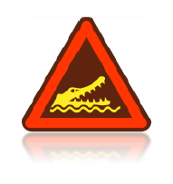

# Meteorológiai teher generálás
<!-- wp:paragraph -->

Az összes meteorológiai teher generálásához kapcsolódó funkció (**[Meteorológiai felület](#Meteorological-surfaces)** , **[Meteorológiai teher létrehozása](#Meteorological-load-generator)** ) a Terhek fülön találhatók.

<!-- /wp:paragraph -->

<!-- wp:paragraph -->

Meteorológiai teher generálás általános szerkezet típusokra végezhetők el az alábbi szabványok szerint:

<!-- /wp:paragraph -->

<!-- wp:list -->

- Szél

  - EuroCode 1 (EN 1991-4)

  - Spanyol szabvány (SE-AE)

  - Olasz szabvány

- Hó

  - EuroCode 1 (EN 1991-3)

<!-- /wp:list -->

<!-- wp:image {"align":"left","id":6758,"width":88,"height":93,"sizeSlug":"large","linkDestination":"none"} -->

<!-- /wp:image -->

<!-- wp:paragraph -->

**Fontos!** A szélteher generáláshoz szükséges épület magasságokat (h) a program a globális z=0 szinttől számítja. Ezért az épületet úgy kell modellezni, hogy a modelltérben az épület elemei a globális z=0 szinttől mérve a valós magasságba kerüljenek. Például, egy szél támadta fal alsó éle nem kerülhet a globális z=0 szint alá, illetve, ha csak egy tetőt modellezünk, akkor a tetőt a valós magasságban kell elhelyezni a z=0 szinttől.

<!-- /wp:paragraph -->

<!-- wp:spacer {"height":"1px"} -->

<!-- /wp:spacer -->

<!-- wp:image {"align":"right","id":36231,"width":297,"height":326,"sizeSlug":"full","linkDestination":"media","className":"is-style-editorskit-rounded"} -->

<!-- /wp:image -->

<!-- wp:heading {"level":3} -->

### Tehercsoportok és teheresetek

<!-- /wp:heading -->

<!-- wp:paragraph -->

A szükséges tehercsoportok és a teheresetek a generálás során automatikusan létrejönnek az elhelyezett meteorológiai felületeknek és kiválasztott szélirányoknak megfelelően.

<!-- /wp:paragraph -->

<!-- wp:paragraph -->

A biztonsági és egyidejűségi tényezők az előzőleg kiválasztott EuroCode nemzeti mellékletből töltődnek be.

<!-- /wp:paragraph -->

<!-- wp:heading {"level":3} -->

### Meteorológiai felület

<!-- /wp:heading -->

<!-- wp:paragraph -->

A meteorológiai terhek generálásának első lépése, hogy a megfelelő meteorológiai felületeket el kell helyezni a modellen. A meteorológiai felületek tartalmazzák az összes olyan információt és paramétert, amik elengedhetetlenek a terhek generálásához.

<!-- /wp:paragraph -->

<!-- wp:paragraph -->

Meteorológiai felületek teherátadó felületeken helyezhetők el. Javasolt, hogy a modell minden meteorológiai teher által terhelt felülete kerüljön beburkolásra.

<!-- /wp:paragraph -->

<!-- wp:paragraph -->

Fontos a teherátadó felületek lokális koordinátarendszerét ellenőrizni! Az összes teherátadó felületnek, amelyekre meteorológiai felületet is el kívánunk helyezni, a lokális z (kék) tengelyének kifele kell mutatni az épületből. Ha szükséges, akkor a Teherátadó felület dialógon a _z tengely megfordítása_ funkcióval a z tengely helyes irányba állítható (lásd az alábbi ábrát).

<!-- /wp:paragraph -->

<!-- wp:image {"align":"center","id":36239,"width":768,"height":502,"sizeSlug":"large","linkDestination":"media","className":"is-style-editorskit-rounded"} -->

<!-- /wp:image -->

<!-- wp:image {"align":"right","id":36247,"width":313,"height":264,"sizeSlug":"full","linkDestination":"media","className":"is-style-editorskit-rounded"} -->

<!-- /wp:image -->

<!-- wp:paragraph -->

A meteorológiai felületek elhelyezése előtt a szükséges paramétereket meg kell adni, a Meteorológiai felület () dialógon.

<!-- /wp:paragraph -->

<!-- wp:spacer {"height":"12px","editorskit":{"devices":false,"desktop":true,"tablet":true,"mobile":true,"loggedin":true,"loggedout":true,"acf_visibility":"","acf_field":"","acf_condition":"","acf_value":"","migrated":false,"unit_test":false},"editorskit_typography":{"name":"","family":"","weight":""},"extUtilities":[]} -->

<!-- /wp:spacer -->

<!-- wp:heading {"level":3} -->

### Szél felület

<!-- /wp:heading -->

<!-- wp:paragraph -->

**_Torlónyomás_**

<!-- /wp:paragraph -->

<!-- wp:image {"align":"center","id":36255,"width":982,"height":352,"sizeSlug":"full","linkDestination":"media","className":"is-style-editorskit-rounded"} -->

<!-- /wp:image -->

<!-- wp:image {"align":"right","id":10393,"width":354,"height":471,"sizeSlug":"full","linkDestination":"media"} -->

<!-- /wp:image -->

<!-- wp:paragraph -->

Torlónyomás dialógon az alábbi paramétereket kell megadni:

<!-- /wp:paragraph -->

<!-- wp:list -->

- Beépítettségi osztály (#1)

<!-- /wp:list -->

<!-- wp:paragraph -->

A legördülő menüből a megfelelő kategória kiválasztható, vagy a három pontos ikonra () kattintva a kategóriák szabványos definíciói is megtekinthetők. Az érdességi hossz (z0) és a legkisebb magasság (zmin) értékei automatikusan betöltődnek a kiválasztott nemzeti melléklet alapján.

<!-- /wp:paragraph -->

<!-- wp:list -->

- Paraméterek (#2)

<!-- /wp:list -->

<!-- wp:paragraph -->

Az összes paraméter automatikusan betöltődik a kiválasztott nemzeti melléklet alapján. Egyedül a szélsebesség alapértékét (vb) szükséges megadni. A három pontos ikonra () kattintva a szélsebesség kiindulási alapértéke (vb,0) is megadható vagy kiválasztható valamelyik szélsebesség térkép használatával.

<!-- /wp:paragraph -->

<!-- wp:image {"align":"left","id":6758,"width":82,"height":87,"sizeSlug":"full","linkDestination":"media"} -->

<!-- /wp:image -->

<!-- wp:paragraph -->

A torlónyomás dialóg és a szükséges paraméterek a különböző Eurocode nemzeti mellékletek esetén eltérők lehetnek

<!-- /wp:paragraph -->

<!-- wp:spacer {"height":"17px","editorskit":{"devices":false,"desktop":true,"tablet":true,"mobile":true,"loggedin":true,"loggedout":true,"acf_visibility":"","acf_field":"","acf_condition":"","acf_value":"","migrated":false,"unit_test":false},"editorskit_typography":{"name":"","family":"","weight":""},"extUtilities":[]} -->

<!-- /wp:spacer -->

<!-- wp:image {"align":"right","id":36271,"width":263,"height":203,"sizeSlug":"full","linkDestination":"media","className":"is-style-editorskit-rounded"} -->

<!-- /wp:image -->

<!-- wp:image {"align":"right","id":36287,"width":231,"height":230,"sizeSlug":"full","linkDestination":"media","className":"is-style-editorskit-rounded"} -->

<!-- /wp:image -->

<!-- wp:paragraph -->

****Belső nyomás****

<!-- /wp:paragraph -->

<!-- wp:paragraph -->

Belsőnyomás figyelembe vehető a teher generálásakor, az alábbiak szerint:

<!-- /wp:paragraph -->

<!-- wp:list -->

- Belső nyomás az összes szélirányban különböző
- Belső nyomás az összes irányban megegyező
- Belső nyomás iránypáronként megegyező

<!-- /wp:list -->

<!-- wp:paragraph -->

A belsőnyomás értéke megadható kézzel, vagy a legördülő menü segítségével a szélsőértékek kiválasztásával. A három pontos ikonra () kattintva a nyomási érték meghatározására használható a EuroCode belső nyomási érték számítója is.

<!-- /wp:paragraph -->

<!-- wp:paragraph -->

A jelölő négyzet (#1) segítségével alternatív belső nyomási tényező érték is megadható.

<!-- /wp:paragraph -->

<!-- wp:spacer {"height":"1px"} -->

<!-- /wp:spacer -->

<!-- wp:image {"align":"right","id":36263,"width":241,"height":238,"sizeSlug":"full","linkDestination":"media","className":"is-style-editorskit-rounded"} -->

<!-- /wp:image -->

<!-- wp:paragraph -->

**_Szélsúrlódás_**

<!-- /wp:paragraph -->

<!-- wp:paragraph -->

Szétsúrlódás felvétele esetén csak a szélsúrlódás tényezőt szükséges megadni. Használható valamelyik szabvány által definiált kategória, vagy kézzel is megadható a tényező értéke.

<!-- /wp:paragraph -->

<!-- wp:spacer {"height":"1px"} -->

<!-- /wp:spacer -->

<!-- wp:image {"align":"right","id":36295,"width":376,"height":199,"sizeSlug":"full","linkDestination":"media","className":"is-style-editorskit-rounded"} -->

<!-- /wp:image -->

<!-- wp:paragraph -->

****Geometriai paraméterek****

<!-- /wp:paragraph -->

<!-- wp:paragraph -->

Nyomási tényezők pontos számításához az alábbi geometriai tényezőket kell megadni:

<!-- /wp:paragraph -->

<!-- wp:list -->

- Fő szélirány iránya a globális koordináta rendszerben. A fő szélirány a 0° szélnek felel meg.
- Épület alaprajzi méretei a fő szélirány szerint
- Terhelt felület (A). Ha a terhelt felület 10m2 vagy nagyobb, akkor a _Consteel_ a teher generálása során a cpe10 értékeket használja. Ha a terhelt felület 1m2 vagy kisebb, akkor a _Consteel_ a cpe1 értékeket használja. 1m2 és 10m2 között az EuroCode előírásának megfelelően a cpe1 és cpe10 között interpolál a _Consteel_.

<!-- /wp:list -->

<!-- wp:heading {"level":3} -->

### Hó felület

<!-- /wp:heading -->

<!-- wp:paragraph -->

A Hóteher paraméter dialógon az alábbi paramétereket kell megadni:

<!-- /wp:paragraph -->

<!-- wp:list -->

- Hóteher zóna (ha szükséges a választott nemzeti melléklet szerint)
- Tengerszint feletti magasság (ha szükséges a választott nemzeti melléklet szerint)
- Szél miatti (Ce) és hőmérsékleti tényező (Ct)
- Rendkívüli hóteher tényezője

<!-- /wp:list -->

<!-- wp:paragraph -->

A megjelenített alapértékek a kiválasztott EuroCode nemzeti mellékletből töltődnek be.

<!-- /wp:paragraph -->

<!-- wp:image {"align":"center","id":36304,"width":739,"height":305,"sizeSlug":"full","linkDestination":"media","className":"is-style-editorskit-rounded"} -->

<!-- /wp:image -->

<!-- wp:heading {"level":3} -->

### Meteorológiai felület elhelyezése

<!-- /wp:heading -->

<!-- wp:paragraph -->

Az összes szükséges paraméter beállítása után, a meteorológiai felületek elhelyezhetők a 3D modellen.

<!-- /wp:paragraph -->

<!-- wp:image {"align":"right","id":36312,"width":247,"height":210,"sizeSlug":"full","linkDestination":"media","className":"is-style-editorskit-rounded"} -->

<!-- /wp:image -->

<!-- wp:paragraph -->

A legördülő menü (#1) segítségével a megfelelő szabványos felületi kategória kiválasztása után, a bal egér gombbal kiválaszthatók a teherátadó felületek.

<!-- /wp:paragraph -->

<!-- wp:paragraph -->

Sikeres elhelyezés után az alábbi szimbólumok jelennek meg a teherátadó felületeken:

<!-- /wp:paragraph -->

<!-- wp:list -->

- Szél felület: 
- Hó felület:  (csak tetőn)

<!-- /wp:list -->

<!-- wp:paragraph -->

A legördülő menüből (#1) az alábbi kategóriák választhatók ki:

<!-- /wp:paragraph -->

<!-- wp:list -->

- Fal
- Lapos tető (szögletes eresz)
- Lapos tető (mellvédekkel)
- Lapos tető (ívesen lekerekített eresz)
- Lapos tető (ferde eresz)
- Félnyeregtető
- Nyeregtető

<!-- /wp:list -->

<!-- wp:image {"align":"right","id":10356,"width":228,"height":180,"sizeSlug":"full","linkDestination":"media"} -->

<!-- /wp:image -->

<!-- wp:paragraph -->

Nyeregtető elhelyezése esetén kettő, egymáshoz kapcsolódó teherátadó felület kiválasztása szükséges.

<!-- /wp:paragraph -->

<!-- wp:paragraph -->

A szimbólumok kijelölése esetén a meteorológiai felületek módosíthatók az Objektum tulajdonságok ablakban.

<!-- /wp:paragraph -->

<!-- wp:paragraph -->

Szél felület esetén, a Zónák meghatározása sorban található három pontos ikonra kattintva, a megjelenő Szél teher zónák dialóg segítségével megtekinthetők a meghatározott szél zónák és a számított cpe értékek

<!-- /wp:paragraph -->

<!-- wp:image {"align":"center","id":36320,"width":422,"height":759,"sizeSlug":"full","linkDestination":"media","className":"is-style-editorskit-rounded"} -->

<!-- /wp:image -->

<!-- wp:heading {"level":3} -->

### Meteorológiai teher létrehozása

<!-- /wp:heading -->

<!-- wp:paragraph -->

A meteorológiai teher generáló funkció a **Terhek **fülön található.

<!-- /wp:paragraph -->

<!-- wp:image {"align":"center","id":36329,"sizeSlug":"full","linkDestination":"media"} -->

<!-- /wp:image -->

<!-- wp:paragraph -->

A funkció a létrehozott szél és hó felületek adatait felhasználva létrehozza az épület szél és hó terheit. Minden számításba veendő irány és felület ki és be kapcsolható a jelölőnégyzetek segítségével.

<!-- /wp:paragraph -->

<!-- wp:image {"align":"center","id":10338,"width":619,"height":395,"sizeSlug":"large","linkDestination":"media"} -->

<!-- /wp:image -->

<!-- wp:paragraph -->

A **Rendben** gombra kattintva a kiválasztott irányokba és felületeken létrejönnek a meteorológiai terhek. A szükséges teher csoportok és esetek automatikusan létrehozásra kerülnek.

<!-- /wp:paragraph -->
