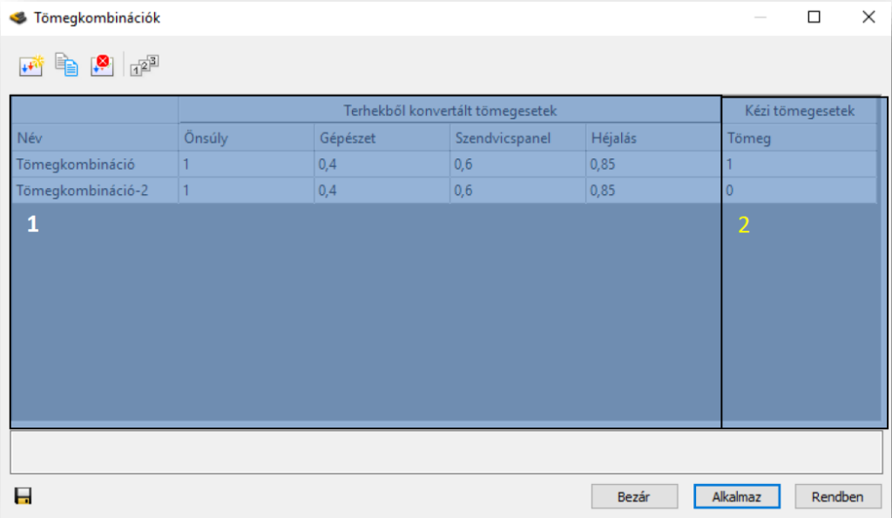

# Tömegkombinációk megadása

<!-- wp:paragraph -->

Tömegkombinációk megadása funkció () teljesen analóg módon működik a **_[Teherkombinációk](../6_0_structural-loads/6_2_load-combinations.md)_** megadásánál leírtakkal, annyi különbséggel, hogy tömegkombinációk megadásánál nincs lehetőség automatikusan generált kombinációk létrehozására, így minden egyes kombinációt kézzel kell definiálni. A **Tömegkombinációk** panel 2 nagyobb egységből tevődik össze:

<!-- /wp:paragraph -->

<!-- wp:paragraph -->

\#1 – Terhekből konvertált tömegesetek táblázata

<!-- /wp:paragraph -->

<!-- wp:paragraph -->

\#2 –.Kézzel definiált tömegesetek táblázata

<!-- /wp:paragraph -->

<!-- wp:image {"align":"center","id":36402,"width":768,"height":446,"sizeSlug":"large","linkDestination":"media","className":"is-style-editorskit-rounded"} -->

<!-- /wp:image -->
