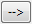
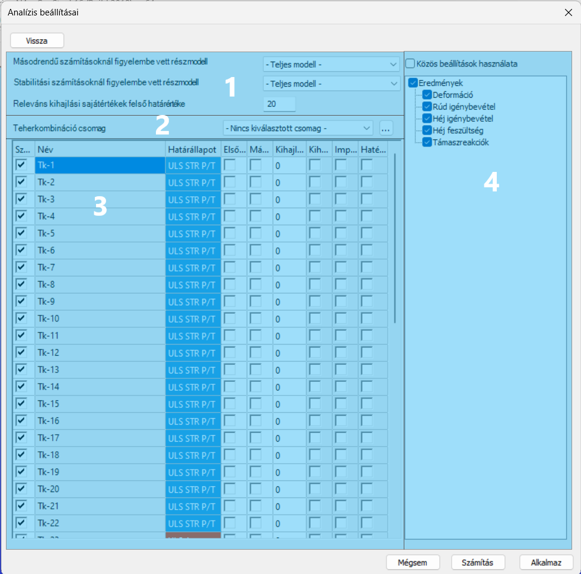

# Analízis beállítások
<!-- wp:paragraph -->

A végrehajtandó analízis típusok az Analízis beállításai  dialógon állíthatóak be. A beállítási lehetőségek könnyebb átláthatósága érdekében a dialóg [**összegző oldala**](#összegző-oldal) három fő csoportra került szétosztásra, melyekről összesen további négy, részletes beállításokat tartalmazó aloldal nyitható meg. Ezek az aloldalak a következők:

- Globális beállítások _(_**[_Globális beállítások részletezése aloldal_](#globális-analízis-beállításainak-részletezése-aloldal)**_)_

- Statikai számítások _(_**[_Teheresetek beállításainak részletezése_](#teheresetek-analízis-beállításainak-részletezése-aloldal)**, és _[_**Teherkombinációk beállításainak részletezése**_](#teherkombinációk-analízis-beállításainak-részletezése-aloldal)_

- Dinamikai számítások _(_**[_Dinamikai számítások beállításainak részletezése aloldal_](#dinamikai-számítások-analízis-beállításainak-részletezése-aloldal)**_)_

<!-- /wp:image -->

<!-- wp:heading {"level":3,"editorskit":{"devices":false,"desktop":true,"tablet":true,"mobile":true,"loggedin":true,"loggedout":true,"acf_visibility":"","acf_field":"","acf_condition":"","acf_value":"","migrated":false,"unit_test":false}} -->

### Összegző oldal

A Beállítások összegzése fülön beállított analízis típusok az összes teherkombinációra le fognak futni. A jobb áttekinthetőség kedvéért a beállítások különböző csoportokba kerültek elhelyezésre.

A **Globális beállítások** csoportban (#1) lévő beállítások az egész modellre érvényesek:

- A **_Globális imperfekció_** legördülő menü segítségével előzőleg létrehozott [_**Globális imperfekció**_](../6_0_structural-loads/6_4_global-imperfections.md) helyezhető el a modellen. Egyszerre csak egy globális imperfekció csoport használható.

- A **_Kapcsolati merevség figyelembevétele_** jelölőnégyzet segítségével előzőleg létrehozott és elhelyezett szerkezeti csomópontok merevsége is figyelembe vehetők a számítás során. A jelölőnégyzet bekapcsolásával a kapcsolati merevségek alapértelmezés szerint a modellben lévő összes terhelési kombinációra alkalmazásra kerülnek. A kombinációk kézi kiválasztását a  gombbal megnyitható [**oldalon** ](#globális-analízis-beállításainak-részletezése-aloldal)lehet elvégezni.

- **_Szelemen tervezés_** funkció bekapcsolásával figyelembe vehető minden olyan paraméter az analízis során, melyek korábban **[_szelemen tervező funkciók_](../5_0_structural-modeling/5_13_purlins.md#szelemensor)** segítségével definiálásra kerültek, mint például burkolat nyújtotta oldalirányú megtámasztás, átlapolásos toldás esetén a toldási szakasz merevsége. Ebben az üzemmódban a stabilitás vizsgálat és a szabványos méretezés csak a [_**Szelemensor objektumokat**_](../5_0_structural-modeling/5_13_purlins.md#szelemensor) tartalmazó elemekből álló részmodellre lesz elvégezve. Ha a modellben vannak Szelemensorhoz kapcsolódó objektumok, de a Szelemen tervezés mód nem aktív, akkor azok a szerkezeti elemek, amelyekhez Szelemensor objektumok tartoznak, nem kerülnek be a másodrendű merevségi mátrixba, és így hatásuk nem kerül figyelembevételre a kihajlásvizsgálat vagy a másodrendű analízis során.

A **Statikai számítások** (#2) csoport beállításai:

- Teheresetek csoport

  - **_Teheresetek számítása rugalmas elven_**: alapértelmezés szerint a Consteel csak a teherkombinációkra ad eredményeket. Ha ez a jelölőnégyzet be van jelölve, az analízis eredményei (csak a rugalmas számítások esetében) terhelési esetek szerint is megtekinthetők. Alapértelmezés szerint az összes tehereset eredményei kiszámításra kerülnek, de a [**Teheresetek** ](#teheresetek-analízis-beállításainak-részletezése-aloldal)aloldalának a  gombbal történő megnyitásával a terhelési esetek manuálisan is kiválaszthatók.

  - **_Stabilitási alakon alapuló imperfekciós teheresetek másodrendű számítása_** opció választása esetén a kiválasztott imperfekció csoport egyes elemeinek elkülönített, másodrendű eredményeinek a megjelenítésére is lehetőség van. Alapértelmezés szerint az összes imperfekciós tehereset ki lesz választva, de a **[Teheresetek](#teheresetek-analízis-beállításainak-részletezése-aloldal)** aloldal  megnyitásával a kiválasztás megváltoztatható.
  
  - **_Reakcióerők alapértékeinek meghatározása…_** jelölőnégyzet szükséges egyes alapozás számításokhoz a csJoint programban.
  
  - A további beállítások a gombbal megnyíló Teheresetek beállításainak részletezése az Analízis típusok aloldalon  érhetők el.
  

- A teherkombinációk csoport

  - alatt két különböző számítási típus választható a legördülő menüből:

    - **rugalmas**: az összes szerkezeti elem lineárisan rugalmas anyagtulajdonsággal rendelkezik (Hook törvény),
    - **képlékeny**: a képlékeny csukló analízis figyelembe veszi a speciális keresztmetszetek hajlító nyomaték okozta koncentrált képlékenyedését, részleteket lásd a Analízis eredmények fejezetben.

  - A jelölőnégyzetekkel a szükséges analízis (**első-, illetve másodrendű**) típusok kapcsolhatóak be, külön-külön a teherbírási és használhatósági határállapotokhoz tartozó teherkombinációk esetén.

  - **Stabilitási számítás**. A stabilitás számítások bekapcsolásakor alapesetben 10 sajátalak kerül leszámolásra minden egyes teherkombinációban. (A sajátalakok száma a csoporthoz tartozó [aloldalon](#teherkombinációk-analízis-beállításainak-részletezése-aloldal) módosítható) A jelölőnégyzeteket be-, illetve kikapcsolva az adott számítási típus az összes teherkombinációra alkalmazásra kerül.

  - **Stabilitási érzékenység vizsgálat**ra az acélszelvények szabványos méretezéséhez használt sajátalakok automatikus kiválasztásához van szükség.

  - Az **imperfekciós érzékenység vizsgálat** bekapcsolása szükséges, ha a _[6.4.3.2 pontban](../6_0_structural-loads/6_4_global-imperfections.md#automatikus-sajátalak-amplitúdó-meghatározás)_ leírt, egyenértékű tökéletlenség módszerével (OIM) skálázott, sajátalak alapú imperfekciós terhet szeretnénk alkalmazni a szerkezeten.

  - Az egyes vizsgálatokhoz tartozó további beállítások, teherkombinációk egyedi kiválasztása a  gombbal megnyíló **[Teherkombinációk beállításainak részletezése aloldalon](#teherkombinációk-analízis-beállításainak-részletezése-aloldal)** érhetők el..

- **Hatásábra** számítása, az előzőleg kiválasztott hatásvonalon a jelölőnégyzet bekapcsolásával elvégezhető.

A Dinamikai számítások csoport (#3) beállításai:

A dinamikai számítások csoport alatti két jelölőnégyzet segítségével számítható a szabadrezgés, és válaszspektrum analízis

A további beállítások a gombbal megnyíló _**[Dinamikai számítások beállításainak részletezése aloldalon](#dinamikai-számítások-analízis-beállításainak-részletezése-aloldal)**_ érhetők el.

### Globális analízis beállításainak részletezése aloldal

Az aloldalon a második oszlopban található jelölőnégyzetek segítségével előzőleg létrehozott és elhelyezett szerkezeti csomópontok merevsége vehető figyelembe a számítás során. A harmadik oszlopban lévő jelölőnégyzetek használatával a szekáns merevség választható a kezdeti merevség helyett.

### Teheresetek analízis beállításainak részletezése aloldal

Az aloldal három fő része:

Teheresetek táblázat (#1)

A táblázatban a modellben létrehozott teheresetek kerülnek listázásra. A jelölőnégyzetek segítségével eldönthető, hogy mely tehereseteket szeretnénk leszámolni az analízis során. Az eredmények a jobb oldalon lévő eredménytípusok fa (#2) beállításainak megfelelően kerülnek leszámolásra.

Eredménytípusok fa (#2)

A fában a jelölőnégyzetek segítségével teheresetenként beállítható, hogy mely típusú eredményeket szeretnénk leszámítani az analízis során. A közös beállítások használata jelölőnégyzettel a fa beállításai az összes teheresetre alkalmazásra kerülnek. Ha ez nincs bejelölve, a számított eredmények az egyes tehereseteknél különbözőképpen állíthatók be. Ehhez a teheresetek nevére kattintva egyenként kell a megfelelő eredménytípusokat kiválasztani.

Imperfekciós teheresetek tábla (#3)

Imperfekciós teheresetek kiválasztása másodrendű számításokhoz. Eredmények csak az itt kiválasztott esetekre lesznek elérhetők.

### Teherkombinációk analízis beállításainak részletezése aloldal

**Consteel 16**

Az aloldal négy részből áll:

Figyelembe vett részletmodellek, és kihajlási alakok felső határértéke (#1)

Mind a másodrendű, mind pedig a stabilitási számítások elvégezhetők külön részletmodellekre.

Másodrendű számításnál figyelembe vett részletmodell segítségével olyan instabil modellrészletek hagyhatók ki a másodrendű számításokból, amelyek megakadályoznák a számítások futását.

<!-- /wp:paragraph -->

<!-- wp:paragraph -->

Stabilitás számítást részletmodellre futtatva a részletmodellben nem szereplő elemekre stabilitási számítások nem lesznek elvégezve. Ezek az elemek merevségükkel, mint megtámasztó hatás lesznek figyelembe véve a számítás során.

<!-- /wp:paragraph -->

<!-- wp:paragraph -->

Itt lehet megadni a releváns kihajlási sajátérték felső határát is. Az összes olyan sajátalak, amelynek a sajátértéke nagyobb, mint a megadott érték, ki lesz hagyva. Emiatt a leszámolt sajátalakok száma lehet kevesebb, mint a beállított.

<!-- /wp:paragraph -->

<!-- wp:paragraph -->

Teherkombináció csomag megadása (#2)

<!-- /wp:paragraph -->

<!-- wp:paragraph -->

Az analízishez a legördülő menüből kiválasztható egy korábban definiált teherkombinációs csomag. A „Nincs kiválasztott csomag” opció esetén az összes kombináció látható, amely az aktuális modellben létezik.

<!-- /wp:paragraph -->

<!-- wp:paragraph -->

A teherkombinációs csomagok létrehozásának módját lásd a [**Teherkombinációs csomagok**](../6_0_structural-loads/6_2_load-combinations.md#teherkombináció-csomagok) oldalon.

<!-- /wp:paragraph -->

<!-- wp:paragraph -->

Teherkombinációk táblázat (#3)

<!-- /wp:paragraph -->

<!-- wp:paragraph -->

Ebben a táblázatban megtalálható a modellben létrehozott összes teherkombináció. Az oszlopokban lévő jelölőnégyzetekkel az egyes kombinációkhoz külön-külön beállíthatók az analízis típusai és a kihajlási alakok kívánt száma is. Az oszlopok a következők:

- Számítandó: eldönthető, hogy mely teherkombinációkat kell figyelembe venni az analízis során.

- A teherkombináció neve

- A teherkombináció határállapota

- Elsőrendű és

- másodrendű analízis be- vagy kikapcsolható.

- Minden egyes kombinációhoz külön-külön megadható a kihajlási sajátalakok száma.

- Kihajlás érzékenység vizsgálat és

- Imperfekció érzékenység vizsgálat be- vagy kikapcsolható.

- Hatékony keresztmetszeti jellemzők: a kiválasztott SLS-kombinációkhoz a csökkentett effektív keresztmetszeti jellemzők használata.

A táblázatok szerkesztését ld. az **_[1.4. A táblázatok általános funkciói című fejezetben](../1_0_general-description/1_4_general-functions-for-tables.md)_** olvashatja.

Eredménytípusok fa (#4)

A fában a jelölőnégyzetek segítségével teheresetenként beállítható, hogy mely típusú eredményeket szeretnénk leszámítani az analízis során. A közös beállítások használata gombbal a fa beállításai az összes teherkombinációra alkalmazásra kerülnek. Ha ez nincs bejelölve, a számított eredmények az egyes kombinációknál különbözőképpen állíthatók be. Ehhez a kombinációk nevére kattintva egyenként kell a megfelelő eredménytípusokat kiválasztani.

**Consteel 15**

Az aloldal három fő része:

Figyelembe vett részletmodellek, és kihajlási alakok felső határértéke (#1)

Mind a másodrendű, mind pedig a stabilitási számítások elvégezhetők külön részletmodellekre.

Másodrendű számításnál figyelembe vett részletmodell segítségével olyan instabil modellrészletek hagyhatók ki a másodrendű számításokból, amelyek megakadályoznák a számítások futását.

Stabilitás számítást részletmodellre futtatva a részletmodellben nem szereplő elemekre stabilitási számítások nem lesznek elvégezve. Ezek az elemek merevségükkel, mint megtámasztó hatás lesznek figyelembe véve a számítás során.

Itt lehet megadni a releváns kihajlási sajátérték felső határát is. Az összes olyan sajátalak, amelynek a sajátértéke nagyobb, mint a megadott érték, ki lesz hagyva. Emiatt a leszámolt sajátalakok száma lehet kevesebb, mint a beállított.

Teherkombinációk táblázat (#2)

Ebben a táblázatban megtalálható a modellben létrehozott összes teherkombináció. Az oszlopokban lévő jelölőnégyzetekkel az egyes kombinációkhoz külön-külön beállíthatók az analízis típusai és a kihajlási alakok kívánt száma is. Az oszlopok a következők:

- Számítandó: eldönthető, hogy mely teherkombinációkat kell figyelembe venni az analízis során.

- A teherkombináció neve.

- Elsőrendű és

- másodrendű analízis be- vagy kikapcsolható.

- Minden egyes kombinációhoz külön-külön megadható a kihajlási sajátalakok száma.

- Kihajlás érzékenység vizsgálat és

- Imperfekció érzékenység vizsgálat be- vagy kikapcsolható.

- Hatékony keresztmetszeti jellemzők: a kiválasztott SLS-kombinációkhoz a csökkentett effektív keresztmetszeti jellemzők használata.

A táblázatok szerkesztését ld. az **[A táblázatok általános funkciói című fejezetben](../1_0_general-description/1_4_general-functions-for-tables.md)** olvasható.

Eredménytípusok fa (#3)

<!-- /wp:paragraph -->

<!-- wp:paragraph -->

A fában a jelölőnégyzetek segítségével teheresetenként beállítható, hogy mely típusú eredményeket szeretnénk leszámítani az analízis során. A közös beállítások használata gombbal a fa beállításai az összes teherkombinációra alkalmazásra kerülnek. Ha ez nincs bejelölve, a számított eredmények az egyes kombinációknál különbözőképpen állíthatók be. Ehhez a kombinációk nevére kattintva egyenként kell a megfelelő eredménytípusokat kiválasztani.

### Dinamikai számítások analízis beállításainak részletezése aloldal

<!-- /wp:image -->

<!-- wp:paragraph -->

Az aloldal három fő része:

<!-- /wp:paragraph -->

<!-- wp:paragraph -->

A dinamikai számítások beállításainak táblázata (#1)

<!-- /wp:paragraph -->

<!-- wp:paragraph {"align":"justify"} -->

A táblázat felett kiválasztható, hogy a dinamikai számításokhoz az első vagy másodrendű merevségi mátrix kerüljön figyelembevételre. Másodrendű merevséget választva a táblázatban megjelenik egy Teherkombináció oszlop, ahol a dinamikai számításhoz használt tömegkombinációkhoz külön definiálandó, hogy azokhoz mely teherkombináció másodrendű mátrixai legyenek figyelembe véve.

<!-- /wp:paragraph -->

<!-- wp:paragraph {"align":"justify"} -->

A táblázatban előzőleg az definiált földrengés hatás mellett az összes tömegkombináció listázásra kerül. A dinamikai számításokhoz alapesetben 10 sajátalak kerül leszámolásra minden egyes tömegkombinációra, ami tetszés szerint módosítható.

<!-- /wp:paragraph -->

<!-- wp:paragraph -->

A táblázat sorai két csoportra oszthatók:

- **A,** Első sor: modális válaszspektrum analízis beállításai

A táblázat első sora (amennyiben van definiált földrengés hatás) minden esetben a modális válaszspektrum analízisnek van fenntartva.

- **B,** Szabadrezgés, és válaszspektrum analízis

A modális válaszspektrum analízis sora után a modellben definiált tömegesetek felsorolása követi. Minden tömegesetre elvégezhető a szabad rezgés analízis, ami kiegészíthető válaszspektrum analízissel.

<!-- /wp:paragraph -->

<!-- wp:paragraph -->

Abban az esetben, ha a „Számítandó” oszlopban egy adott tömegkombináció bekapcsolt, a „Válaszspektrum analízis” pedig kikapcsolt állapotban van, a számítás gombra kattintva a szabad rezgés analízis fog lefutni. Ha a „válaszspektrum analízis” is bekapcsolt állapotban van (és a modellben van definiált válaszspektrum), a szabadrezgés számítás válaszspektrum analízissel is kiegészül.

<!-- /wp:paragraph -->

<!-- wp:paragraph -->

Válaszspektrum analízis beállítások (#2)

<!-- /wp:paragraph -->

<!-- wp:paragraph -->

A relatív modális csillapítási tényezőnek és a rezgésalakok különböző irányokba való figyelembevételének beállítási lehetőségét takarja.

<!-- /wp:paragraph -->

<!-- wp:paragraph -->

Itt két paramétert lehet meghatározni:

- Relatív modális csillapítási tényező

- A rezgésalakok különböző irányokba való figyelembevételének beállításai. Alapértelmezés szerint az összes modális alakot figyelembe veszi. Ez megváltoztatható a legördülő menü segítségével, megadva az egyes irányok minimális effektív modális tömegeinek az értékét. Ebben az esetben azok az alakok, amelyek nem tartalmazzák a beállított minimális modális tömeget, nem lesznek figyelembe véve a számításban.

Ebben a mezőben lehet meghatározni a hiányzó tömegek figyelembevételének módját is. Itt kétféle beállítás közül lehet választani:

- Alapértelmezésben csak a meghatározott rezgésalakokban szereplő tömegek lesznek figyelembe véve,

- de választható a hiányzó tömegek hozzáadása is meghatározott gyorsulási értékkel.

Eredménytípusok fa (#3)

A fában a jelölőnégyzetek segítségével teheresetenként beállítható, hogy mely típusú eredményeket szeretnénk leszámítani az analízis során. A közös beállítások használata gombbal a fa beállításai az összes teherkombinációra alkalmazásra kerülnek. Ha ez nincs bejelölve, a számított eredmények az egyes tömeg kombinációknál különbözőképpen állíthatók be. Ehhez a kombinációk nevére kattintva egyenként kell a megfelelő eredménytípusokat kiválasztani.